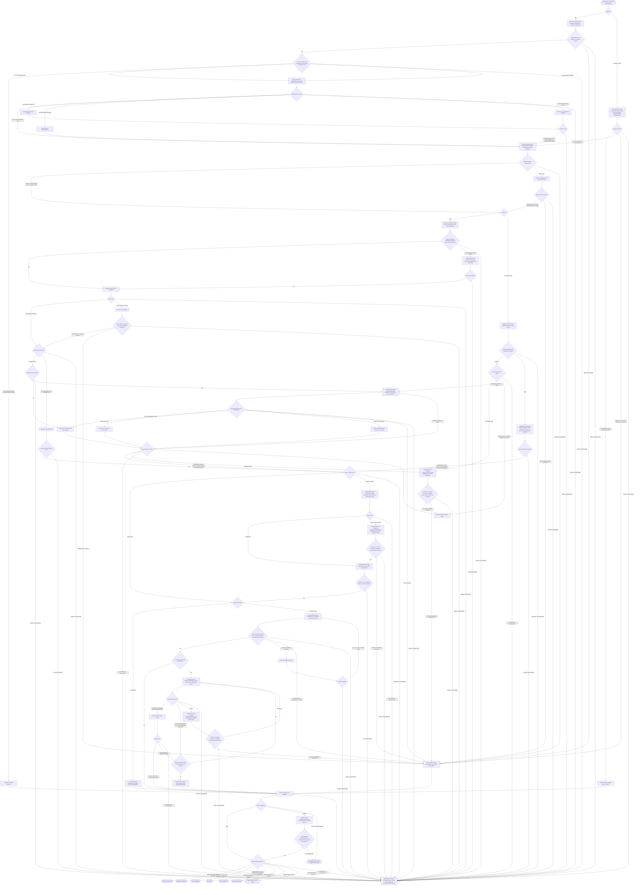

**Keywords**: rebase, git rebase, history replay, rebase conflict, continue rebase, abort rebase, git worktree, rewritten history, authorized force-with-lease publication

```mermaid
flowchart TD
    Start([Explicit start, continue, or abort request]) --> Kind{Request?}
    Kind -->|Start| Bind[Bind exact refs/OIDs, goal predicate, destinations, authority, worker facts]; Kind -->|Continue or abort| Active["`Read [active recovery](./references/active-rebase-recovery.md); bind metadata-owning worktree/Git dir`"]
    Bind --> BindResult{All dependent facts observed or explicitly bound?}
    BindResult -->|Yes| Satisfied{No active rebase; S/T unchanged; ancestry-only; T ancestor of S?}; BindResult -->|Missing or ambiguous| Decision; BindResult -->|Failure or unobservable| Recover
    Satisfied -->|Yes; destinations equal required result; read-only| NoChange[Record no-change evidence]; Satisfied -->|No or transformation goal| Locate
    Satisfied -->|Yes; only publication differs| Locate; Satisfied -->|Failure or unobservable| Recover
    Active --> ActiveResult{Inspection result?}; ActiveResult -->|No metadata in bound worktree and Git dir| NoActive[Record absent metadata and no mutation]; ActiveResult -->|Owner and required contract rebound| Safe
    ActiveResult -->|Required contract fact missing or inconsistent| Decision; ActiveResult -->|Failure or unobservable| Recover
    Locate[Find exact source attachment and record worktree/Git-dir ownership] --> Location{Bound source location?}
    Location -->|Source branch attached here| Safe; Location -->|Source branch unattached| BranchWT[Create start-only branch worktree]
    Location -->|Source attached elsewhere| BindWT[Bind that exact worktree/Git dir]; Location -->|Non-branch OID; result bound| DetachedWT[Create start-only detached worktree]
    Location -->|Failure or unobservable| Recover; BindWT --> Safe
    BranchWT --> WTResult{Creation result?}; DetachedWT --> WTResult
    WTResult -->|HEAD OID equals source; branch attachment matches when required| Safe; WTResult -->|Failure or unobservable| Recover
    Safe[Observe commands that can write bound worktree; request pause when supported] --> Owner{Worker checkpoint observation?}
    Owner -->|No writer, acknowledged pause, or worker ended| Operation{Operation?}; Owner -->|Writer active| Wait[Wait once for pause, end, or command result]
    Owner -->|Unknown or unreachable| Decision
    Wait --> WaitResult{Observed wait outcome?}; WaitResult -->|Checkpoint met or worker ended/failed without writer| Operation; WaitResult -->|Still running and cannot pause/end| Decision
    WaitResult -->|Failure or unobservable| Recover
    Operation -->|Start| Prepare[Observe tracked/untracked status; checkpoint all work when permitted]; Operation -->|Continue or abort| ActiveGuard[Reobserve same owner metadata and saved-entry identity]
    ActiveGuard --> ActiveGuardResult{Owning worktree/Git-dir metadata unchanged?}
    ActiveGuardResult -->|Continue| Stop{Current active-rebase state?}; ActiveGuardResult -->|Abort| Abort["`Read [active recovery](./references/active-rebase-recovery.md); abort in bound owner and restore pre-state`"]
    ActiveGuardResult -->|No, failure, or unobservable| Recover
    Prepare --> PrepResult{Status empty after checkpoint containing every observed change?}
    PrepResult -->|Yes| Refs; PrepResult -->|No; checkpoint commit blocked| Save["`Read [named stash](./references/named-stash.md); save and bind exact entry`"]
    PrepResult -->|Failure or unobservable| Recover
    Save --> SaveResult{Exact entry verified?}; SaveResult -->|Yes| Refs; SaveResult -->|No or unobservable| Recover
    Refs[Reobserve exact source and target] --> RefResult{Ref result?}
    RefResult -->|Bound OIDs unchanged| Next; RefResult -->|Same named refs moved| Account[Account for movement]
    RefResult -->|Failure or unobservable| Recover
    Account --> AccountResult{Every moved commit has one evidence-backed disposition?}
    AccountResult -->|All classified; no supported conflict| Next; AccountResult -->|Unclassified or conflicting| Decision
    AccountResult -->|Failure or unobservable| Recover
    Next{Reobserved start path?} -->|Replay required| Shape; Next -->|No-replay publication; predicate true| Current[Bind current result OID R]
    Next -->|Failure or unobservable| Recover
    Current --> CurrentResult{Named result ref resolves to R?}; CurrentResult -->|Yes| Saved; CurrentResult -->|No or unobservable| Recover
    Shape{Merge in fresh replay set?} -->|Yes| History["`Read [history shape](./references/history-shape.md); choose state-specific disposition`"]
    Shape -->|No| StartReplay[Start fresh replay in bound start worktree]; Shape -->|Failure or unobservable| Recover
    History --> HistoryResult{Supported state-specific disposition?}
    HistoryResult -->|Fresh start topology chosen| StartReplay; HistoryResult -->|Active commit: skip| Skip[Skip only the classified active commit]
    HistoryResult -->|Active commit: preserve| Preserve[Preserve classified active commit, then continue]; HistoryResult -->|No or conflicting| Decision
    HistoryResult -->|Failure or unobservable| Recover
    Stop -->|Unmerged entries| ReplayConflict; Stop -->|Topology, equivalent, or empty| History
    Stop -->|Metadata active; resolution staged or no conflict| ContinueReplay[Continue the bound active replay]
    Stop -->|Other failure or unobservable| Recover
    StartReplay --> ReplayResult{Replay operation result?}; ContinueReplay --> ReplayResult; Skip --> ReplayResult; Preserve --> ReplayResult
    ReplayResult -->|Metadata/unmerged absent; R bound; result ref and predicate match| Saved{Lifecycle saved entry?}
    ReplayResult -->|Unmerged entries| ReplayConflict["`Read [conflict and ambiguity](./references/conflict-and-ambiguity.md); resolve replay intent`"]
    ReplayResult -->|Topology, equivalent, or empty| History; ReplayResult -->|Other failure or unobservable| Recover
    ReplayConflict --> ReplayIntent{Exactly one outcome preserves compatible intent, passes checks, and is staged?}
    ReplayIntent -->|Yes; active metadata unchanged| ContinueReplay; ReplayIntent -->|None or incompatible alternatives| Decision
    ReplayIntent -->|Failure or unobservable| Recover
    Abort --> AbortResult{Abort restoration predicate?}
    AbortResult -->|Metadata/unmerged absent; source or HEAD equals pre-replay OID| Saved; AbortResult -->|Failure or unobservable| Recover
    Saved -->|Verified none| FinishMode{Lifecycle outcome?}; Saved -->|Exact entry bound| Restore["`Read [named stash](./references/named-stash.md); apply exact OID and preserve entry`"]
    Saved -->|Ambiguous or unobservable| Recover
    Restore --> RestoreResult{Apply result?}
    RestoreResult -->|Conflict-free| RestoreFinish[Verify tree/checks; relist unique entry; drop selector; confirm absent]
    RestoreResult -->|Conflict; entry preserved| RestoreConflict["`Read [conflict and ambiguity](./references/conflict-and-ambiguity.md); resolve restoration intent`"]
    RestoreResult -->|Other failure or unobservable| Recover
    RestoreConflict --> RestoreIntent{Exactly one outcome preserves compatible intent and passes checks?}
    RestoreIntent -->|Yes| RestoreFinish; RestoreIntent -->|None or incompatible alternatives| Decision
    RestoreIntent -->|Failure or unobservable| Recover
    RestoreFinish --> RestoreFinishResult{Checks zero, no unmerged entries, exact entry absent?}; RestoreFinishResult -->|Yes| FinishMode; RestoreFinishResult -->|No or unobservable| Recover
    FinishMode -->|Explicit abort| OrientAbort[Inventory changed interactions and verify restored assumptions]
    FinishMode -->|Start or continue| Orient[Inventory direct/indirect interactions; run required and covering checks]
    Orient --> VerifyResult{Every selected command zero; no unmerged entries; intersections recorded?}
    VerifyResult -->|Yes| Publish{Publication bound and authorized?}
    VerifyResult -->|One goal-consistent correction| Correct[Correct changed interaction]; VerifyResult -->|Missing intent or incompatible corrections| Decision
    VerifyResult -->|Failure or unobservable| Recover
    Correct --> CorrectResult{Correction applied?}
    CorrectResult -->|Yes; rerun every selected check| Orient; CorrectResult -->|Failure or unobservable| Recover
    Publish -->|No| Handoff; Publish -->|Yes| Remote["`Read [publication](./references/publication.md); reconcile one authorized attempt`"]
    Remote --> RemoteResult{Remote stage result?}
    RemoteResult -->|Final fetch unchanged; exact lease OID current| Push[Authorized exact-lease push]
    RemoteResult -->|Destination moved after one reconciliation/final observation| Retry
    RemoteResult -->|Conflict| RemoteConflict["`Read [conflict and ambiguity](./references/conflict-and-ambiguity.md); resolve remote intent`"]
    RemoteResult -->|Failure or unobservable| Recover
    RemoteConflict --> RemoteIntent{Exactly one outcome preserves compatible intent and passes checks?}
    RemoteIntent -->|Exactly one| Remote; RemoteIntent -->|None or incompatible alternatives| Decision
    RemoteIntent -->|Failure or unobservable| Recover
    Push --> PushResult{Push result?}
    PushResult -->|Exit zero; post-fetch destination equals R| Handoff; PushResult -->|Lease rejected or destination moved| Retry{Explicit renewed decision and authority for one attempt?}
    Retry -->|Yes| Remote; Retry -->|No| LeaseStop[Stop external mutation; report rejection and observed destination]
    PushResult -->|Other failure or unobservable| Recover
    NoChange --> Handoff; NoActive --> Handoff; Decision[Stop mutation; report missing fact or alternatives and evidence] --> Handoff
    Recover["`Read [active recovery](./references/active-rebase-recovery.md); stop mutation and collect report`"] --> Handoff
    OrientAbort --> Handoff; LeaseStop --> Handoff
    Handoff[Check acquired worker obligation] --> Worker{Worker obligation?}
    Worker -->|None| Terminal{Observed path predicate?}; Worker -->|Acquired| Deliver[Deliver world-change/stopped-state summary and resume/stop decision]
    Worker -->|Unknown or unobservable| Pending([No terminal claim; worker obligation unresolved])
    Deliver --> HandoffResult{Acknowledged summary/resume, or worker observed stopped with handoff?}
    HandoffResult -->|Yes| Terminal; HandoffResult -->|No or unobservable| Pending
    Terminal -->|Abort request and restored pre-state| Aborted([Aborted and restored])
    Terminal -->|Start/continue; post-push destination resolves to R| Published([Published completion])
    Terminal -->|Start/continue; result ref resolves to R; predicate true; no publication| Local([Local completion])
    Terminal -->|No-change evidence complete| NoChangeDone([No change]); Terminal -->|Metadata absent; no mutation| NoActiveDone([No active rebase])
    Terminal -->|Decision report complete| Paused([Paused for decision]); Terminal -->|Stopped-state report complete| Stopped([Stopped with observed state])
    Terminal -->|Inconsistent or unobservable| Recover
```
