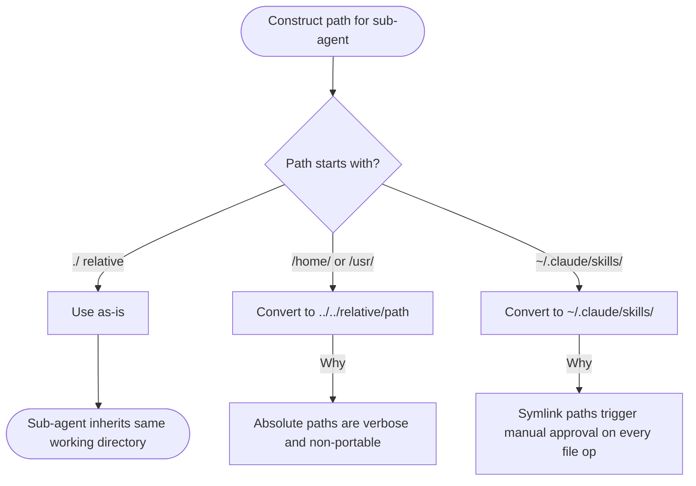
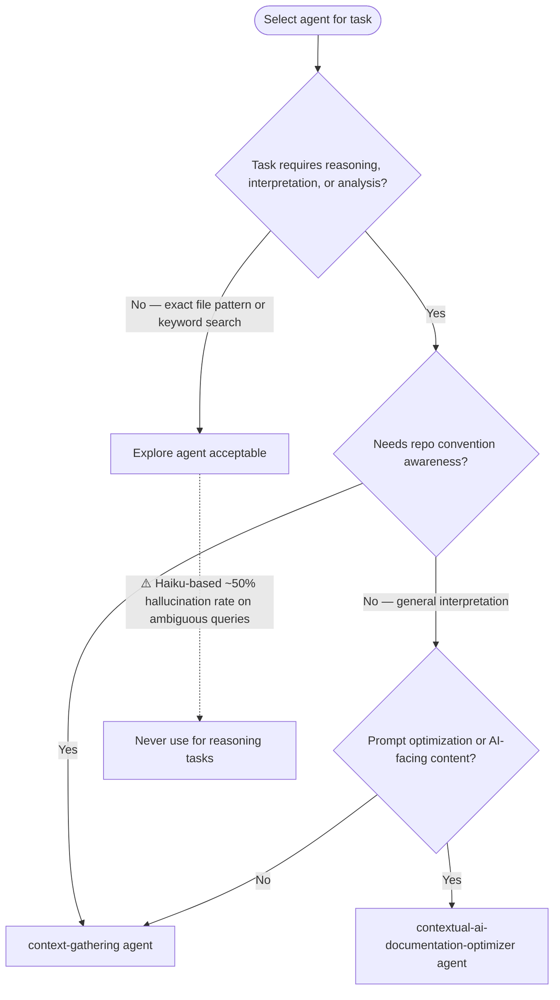

# Agent Delegation — Path Conventions and Agent Selection

## Path Conventions

Use paths relative to current working directory when delegating to sub-agents.

## Agent Selection

**Explore Failure Modes** (validated 2026-02-02, 2/4 accuracy):
- Semantic ambiguity: matched pre-commit hooks instead of Claude Code hooks
- Premature termination: declared "not found" instead of deeper search
- Fabricated implementations: suggested bash when repo uses Python/JavaScript

SOURCE: Experimental validation (2026-02-02). Context-gathering: 4/4 correct. Explore: 2/4 correct.
