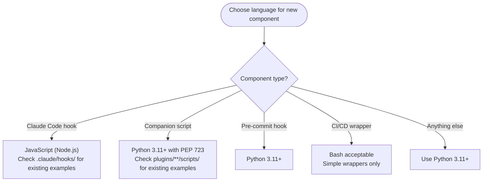

---
paths:
- '**/scripts/**'
- .claude/hooks/**
- '**/*.py'
---

# Language Conventions

Choose the correct language when creating new repository components.



## Python File and Directory Naming

Use `snake_case` for Python file names and directories that contain Python scripts. **Reason**: A directory named with `snake_case` can be converted to a Python module (add `__init__.py`) without renaming. Hyphens in directory names break `import` statements and cause tooling issues when resolving module names from paths.

**Rules:**

- Python files: `task_format.py`, not `task-format.py`
- Script subdirectories: `snake_case` when they may become Python modules
- Skill directories: `kebab-case` (`implementation-manager/`) — enforced by agentskills.io spec and the skilllint `NameFormatValidator`

**SCOPE**: Applies to all Python files under `plugins/**/scripts/`, `plugins/**/skills/*/scripts/`, and `.claude/hooks/`. Skill directories themselves follow the agentskills.io naming convention (lowercase, hyphens only).

---

## PEP 723 Bundled Dependencies

TRIGGER: About to write or review a `dependencies = [...]` block in a PEP 723 script that declares `typer`.

FACT: `typer>=0.12.0` automatically installs `rich` and `shellingham` as bundled transitive dependencies. Do not declare them explicitly — they arrive whether listed or not, and declaring them is an error.

WRONG — exact erroneous output this rule blocks:

```python
# dependencies = [
#   "typer",
#   "rich",
#   "shellingham",
# ]
```

CORRECT — declare typer only; rich and shellingham arrive transitively:

```python
# dependencies = [
#   "typer",
# ]
```

SCOPE: Applies to every PEP 723 script declaring `typer`. Remove `rich` and `shellingham` if already present. Do not add them when creating new scripts.
