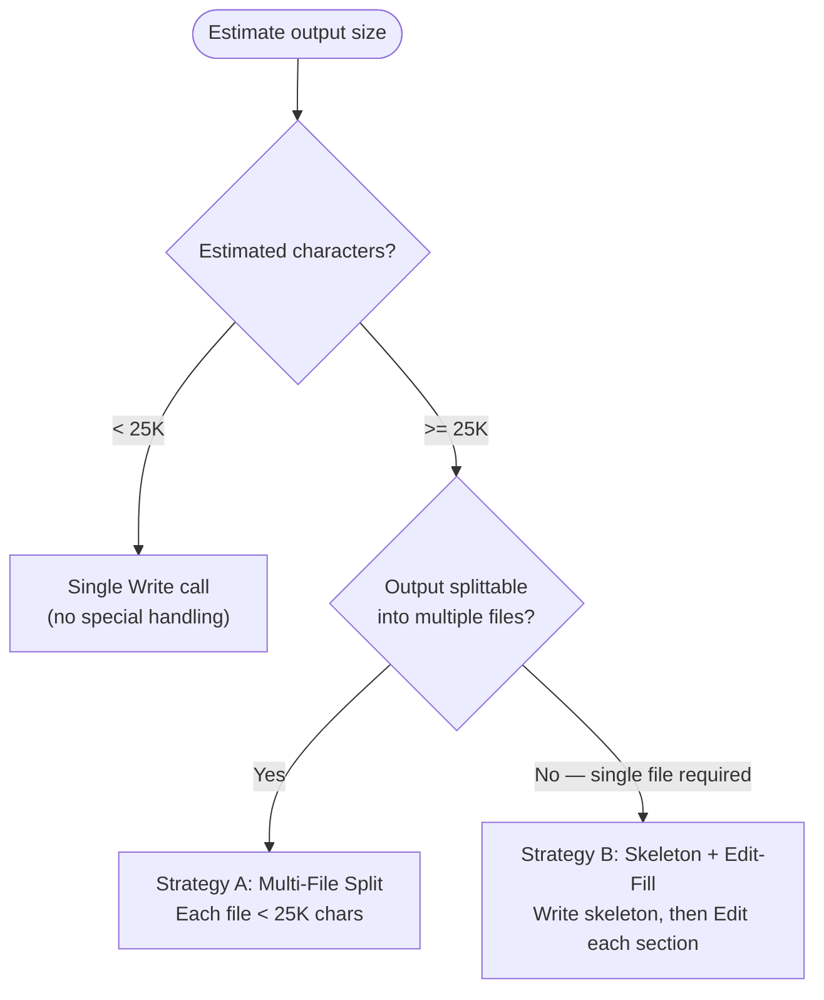

# Large File Write Strategy

## Scope

This policy applies to any agent that writes a document to the filesystem with a single `Write` call and may exceed **25,000 characters**. The 25K threshold reflects the practical reliability limit of one `Write` call; beyond it, writes risk truncation, timeout, or silent data loss.

It does not apply to output stored through an MCP operation. An agent that returns its result through a plan, task, or artifact operation writes no file, so no `Write` limit applies to it. Size limits on that path belong to the configured provider, are not 25K, and are not addressed here — check the provider before assuming one exists.

Determine which case applies by reading what the agent's dispatcher instructs it to call, not by the size of what it produces.

## Decision Flowchart



## Strategy A: Multi-File Split

Do not use Strategy A when a skill, agent, or dispatcher names the exact output path. That path is
a single-file contract — splitting it leaves its consumer without the artifact it was promised. Use
Strategy B for it.

Otherwise split when the output has natural boundaries (sections, priorities, task groups, modules)
and consumers load the parts independently. Write an index file that references each part, and
write each part with its own `Write` call, each part under 25K characters.

## Strategy B: Skeleton + Edit-Fill

Use when the output must be a single file and exceeds 25K characters.

### Step 1: Plan document structure

List all sections, headers, and approximate content size per section. Confirm total exceeds 25K and no individual section exceeds 20K characters (leave margin for Edit overhead).

### Step 2: Write skeleton

Issue a single `Write` call containing:

- YAML frontmatter (if applicable)
- All section headers in final order
- Placeholder stubs marking pending content

Target the skeleton at under 5K characters. Each placeholder uses the format:

```markdown
<!-- PENDING: Brief description of section content -->
```

### Step 3: Fill each section

Issue individual `Edit` calls, each replacing one placeholder stub with the full section content. Keep each Edit call under 20K characters. If a section exceeds 20K, split it into subsections with separate placeholders in Step 2.

### Step 4: Final verification

Read the completed file. Confirm:

- Zero `<!-- PENDING:` markers remain
- All planned sections contain content
- Document structure matches the Step 1 plan

## Wrong / Right Examples

**Wrong** -- assembling a 40K+ string and issuing a single `Write` call risks truncation or timeout.

**Right** -- `git-history-recon` names `walkthrough/recon-report.md` as its output, so that path is a single-file contract and Strategy B applies. Write the skeleton (~2K chars), then Edit each section in (3-5K chars each):

```python
# Step 2: Write skeleton under 5K chars
Write(
    file_path="walkthrough/recon-report.md",
    content="""# Git History Recon Report

## Code Hotspots

<!-- PENDING: Files most frequently changed in the analysis window -->

## Bug Magnets

<!-- PENDING: Files most associated with fix, bug, revert commits -->

## High-Risk Files

<!-- PENDING: Intersection of hotspots and bug magnets -->

## Bus Factor

<!-- PENDING: Contributor ranking and 80% cumulative cutoff -->

## Recommendations

<!-- PENDING: Prioritized actions derived from the sections above -->
""",
)

# Step 3: Fill each section individually — one Edit per section
Edit(
    file_path="walkthrough/recon-report.md",
    old_string="<!-- PENDING: Files most frequently changed in the analysis window -->",
    new_string="| File | Changes |\n|---|---|\n| src/api/router.py | 84 |",
)

# ... one Edit per section ...

# Step 4: Read and verify no PENDING markers remain
Read(file_path="walkthrough/recon-report.md")
```

## Relationship to No Invented Limits

This strategy does **not** truncate content. The full document is written incrementally instead of atomically. No information is removed, shortened, or summarized to fit the threshold.

The 25K threshold governs **write mechanics** (how content reaches disk), not **content completeness** (what the document contains). Every section, every detail, every line planned in Step 1 appears in the final file after Step 4.

Consumers retain full access to the complete document. The threshold exists to prevent tool-level failures, not to limit what agents produce.
