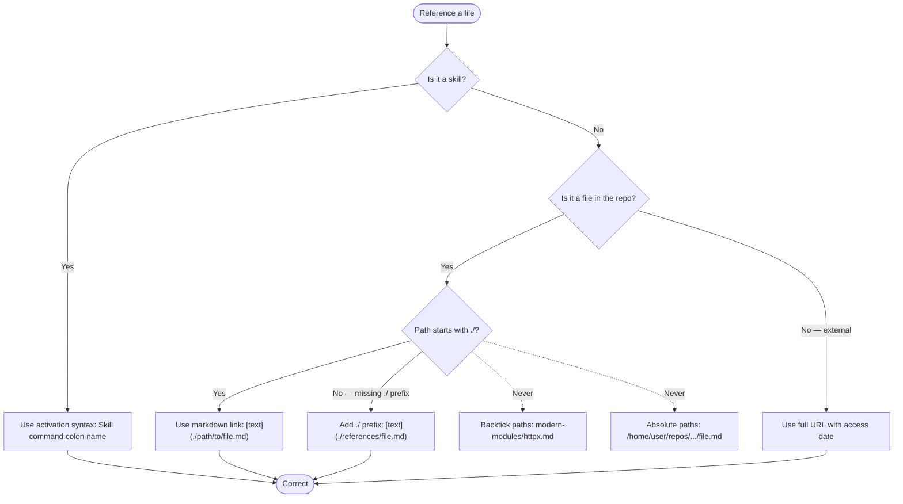

---
paths:
- '**/*.md'
---

# Markdown & File Reference Standards

## Code Fence Standards

Add a language specifier to every code fence, and surround every fenced code block with blank lines (MD031). Nested fences use 4 backticks on the outer fence and 3 on inner fences.

````markdown
# Section Title

This is a paragraph.

```python
def example():
    return True
```

This is another paragraph.
````

## Markdown Links

Use markdown links with relative paths starting with `./`. **Reason**: Enables Claude Code click-through, works regardless of installation location, and supports on-demand file loading.

**Syntax**: `[descriptive text](./path/to/file.md)`

**Directory Context:**
- From SKILL.md → references: `[text](./references/filename.md)`
- From references/file.md → same dir: `[text](./filename.md)`
- From references/file.md → subdir: `[text](./subdir/filename.md)`

**File Reference Decision:**



## Skill Activation References

Reference other skills using activation syntax:

✅ `For comprehensive Astral uv documentation, use the /uv skill.`
❌ `See /uv/SKILL.md for uv documentation`

## Subdirectory Namespaces — Skills Do NOT Support This

Skills in subdirectories under `skills/` silently fail to register. Subdirectory namespacing (`plugin:group:skill-name`) was a `commands/` feature only.

- `skills/testing/analyze-test-failures/SKILL.md` → **DEAD — not registered**
- `skills/analyze-test-failures/SKILL.md` → `/plugin:analyze-test-failures` — correct

All skill directories must sit directly under `skills/` — one level deep only. Do not create grouping subdirectories.
