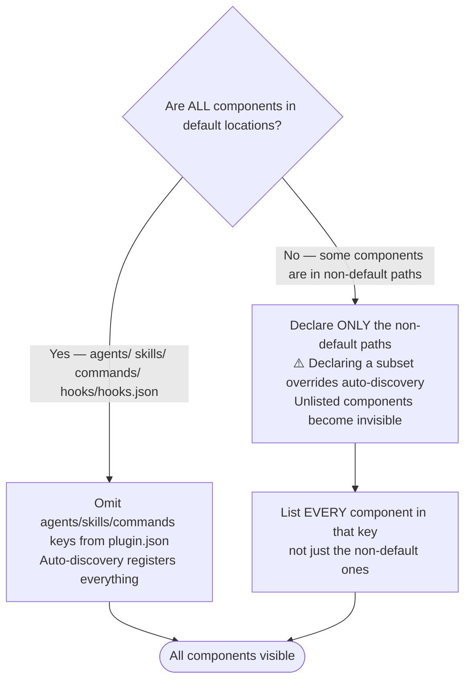

---
paths:
- plugins/**/*
- .claude-plugin/**/*
---

# Plugin Development Workflows

## Local Testing

**Session-based (no installation):**

```bash
claude --plugin-dir ./plugins/plugin-name
```

**Via local marketplace** (persists across sessions; `--scope local` keeps it gitignored):

```bash
/plugin marketplace add ./.claude-plugin/marketplace.json
/plugin install plugin-name@jamie-bitflight-skills --scope local
```

For full add/remove/update procedures, see [CONTRIBUTING.md](./CONTRIBUTING.md).

## Prerequisite Skills for Plugin Work

Before modifying any plugin file (`plugin.json`, agents, skills, hooks), load these two reference skills:

- `plugin-creator:claude-plugins-reference-2026` — current Claude Code plugin schema, frontmatter fields, and component auto-discovery rules
- `plugin-creator:claude-skills-overview-2026` — current Claude Code skills schema and conventions

**Reason**: Editing plugin files without loading these skills risks schema violations and auto-discovery breakage. Session 2026-03-17 demonstrated this — adding an `agents` key to `plugin.json` without understanding auto-discovery semantics silently dropped 17 of 19 agents.

## plugin.json Auto-Discovery Rules

Claude Code auto-discovers components from default locations within a plugin directory. The `agents`, `skills`, and `commands` keys in `plugin.json` exist ONLY for declaring components in non-default locations.

**Default auto-discovered locations:**

- `agents/` — all `.md` files
- `skills/` — all skill directories containing `SKILL.md`
- `commands/` — all `.md` files
- `hooks/hooks.json` — hooks manifest



**Incident record (2026-03-17):** `python3-development` plugin had:

```json
"agents": ["./agents/t0-baseline-capture.md", "./agents/tn-verification-gate.md"]
```

Result: only 2 of 19 agents were registered. The other 17 were invisible to Claude Code because declaring a subset in `agents` overrides auto-discovery — the declared list becomes the complete list.

**Fix**: Remove the `agents` key entirely when all agents are in `agents/`. Auto-discovery registers all of them.

## Skill Validation vs Packaging

**Validation: YES** — Validate skills to ensure quality:

- YAML frontmatter properly formatted
- Required fields present (name, description, tools, model)
- File references correct and target files exist
- Directory structure valid

**Packaging: NO** — Skills in this repository are for local use. They are already in their final location. Do not package skills into .zip files — it creates unnecessary files and serves no purpose for local development.

## Plugin Runtime Files, Reload Lifecycle, and Versioning

**Plugin runtime files vs dev-context files**: A `CLAUDE.md` file inside a plugin directory is project-instruction context loaded only when Claude Code is run with that directory as cwd during plugin development. It is not a runtime plugin file, has no relation to plugin version, and is invisible to agents when the plugin is installed. Plugin runtime files are limited to `.claude-plugin/plugin.json`, `commands/`, `agents/`, `skills/`, `hooks/hooks.json`, `.mcp.json`, `.lsp.json`, and supporting `scripts/`. Do not treat `CLAUDE.md`, `README.md`, or `CHANGELOG.md` inside a plugin directory as authoritative for runtime behavior or version — the manifest at `.claude-plugin/plugin.json` is the source of truth.

**Skill and plugin reload lifecycle**: Skills added or changed in the user or project `.claude/skills/` directory are immediately available after a change. Plugin changes to agents, skills, MCP servers, hooks, language servers, and other components require the plugin version to be bumped (this happens automatically after any commit that changes files in a plugin) and then `/reload-plugins` to pick up the new version from the cache — a full session restart is not required for this. A session restart is only sometimes needed for MCP service updates. To verify the cache is current, check that the plugin cache path includes the same version as the plugin.json: `~/.claude/plugins/cache/<marketplace>/<plugin-name>/<version>/`.

**Automatic version bumping**: `plugin.json` and `marketplace.json` are automatically bumped and staged by the pre-commit hook when any plugin file is modified. Do not manually edit version fields — the hook handles this. After a successful commit, the updated versions are already included.

**Gap — GitHub-side merges skip the version bump**: the `auto-sync-manifests` pre-commit hook only fires on a local `git commit`; a PR squash-merged via the GitHub UI/API never runs it, so a plugin file can change on `main` with no version bump at all. Confirmed 2026-08-19: commit `ba58d56d` (PR #3005, GitHub-merged) changed `plugins/development-harness/skills/work-backlog-item/SKILL.md` but left `plugin.json`'s version untouched — the marketplace cache is keyed on version number, saw no delta, and `/reload-plugins` correctly found nothing new to fetch even though the content had changed. The sync script also has no retroactive repair mode (`uv run plugins/plugin-creator/scripts/auto_sync_manifests.py` reports "No manifest updates needed" against already-committed content, regardless of whether a prior merge should have bumped the version) — so a missed bump stays missed until an unrelated local commit happens to touch the same plugin. If a plugin change lands via GitHub merge and its effects aren't showing up after `/reload-plugins`, check whether the merge commit actually bumped `plugin.json`'s version (`git show <merge-sha> -- <plugin>/.claude-plugin/plugin.json`); if not, bump it manually as a follow-up local commit.
