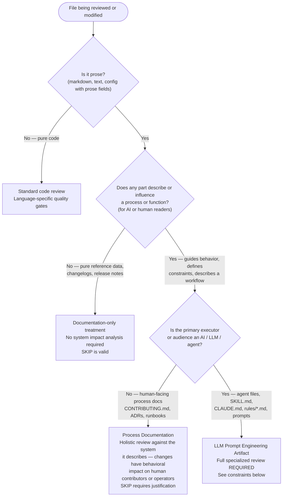

---
paths:
- '**/*.md'
---

# Prose File Classification — Review Treatment Decision Tree

Not all markdown is documentation. Any file whose prose describes or influences a process or function has **functional behavior** — modifying it changes how people or systems act. Use this decision tree to assign review treatment before classifying any prose file as "docs-only" or assigning it a SKIP verdict.

## Process Documentation (human-facing)

Files like `CONTRIBUTING.md`, architecture decision records, runbooks, and `README.md` sections that define workflows are **behavioral contracts for human contributors**. Reviewers must:

- Assess the change against the system it describes — does the updated instruction still match how the system actually works?
- Flag contradictions between sections — humans reading two conflicting rules will make arbitrary choices
- SKIP requires an explicit justification stating why the change has no process impact

## LLM Prompt Engineering Artifacts (AI-facing)

Plugin agent files (`agents/*.md`), skill files (`skills/*/SKILL.md`, `skills/*/references/*.md`), `CLAUDE.md`, `.claude/rules/*.md`, and any file whose prose is read and executed by an LLM are **prompt engineering code**. The markdown content IS the executable: it controls how AI agents reason, what constraints they enforce, and what outputs they produce.

**Consequences for review and quality gates:**

- Do NOT classify these files as "documentation-only" to justify SKIP verdicts or reduced scrutiny
- Ambiguity, omissions, and internal inconsistencies in phrasing are **prompt engineering bugs** — they produce incorrect agent behavior, the same way a logic error in Python produces incorrect program behavior
- The correctness standard is **behavioral**: will an LLM following this prompt produce the desired output across all specified inputs and edge cases?
- Security reviewers must assess **prompt injection surfaces** — places where user-supplied or agent-generated content is interpolated into instructions that another LLM will execute
- Quality reviewers must check for **contradictions between sections** — an agent reading two conflicting rules will choose one arbitrarily
- Performance reviewers must check for **instruction bloat** — overly long or redundant instructions degrade attention and increase the probability of the agent ignoring rules
- Impact analysis must treat the file as part of its **system** — a change to one agent's instruction set may invalidate assumptions in orchestrators, callers, or downstream agents

**SKIP is appropriate only when** the changed content has zero effect on any LLM instruction path (e.g., a pure metadata field change with no reasoning impact). When in doubt, review.
