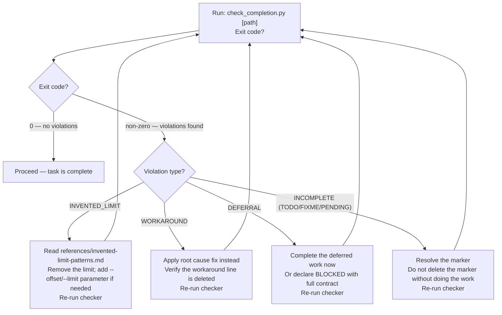

# Standard of Excellence — Boil the Ocean

Full source extracts: [./references/standard-of-excellence.md](./references/standard-of-excellence.md)
Invented limit patterns: [./references/invented-limit-patterns.md](./references/invented-limit-patterns.md)
BLOCKED declaration contract: [./references/blocked-declaration-contract.md](./references/blocked-declaration-contract.md)

## Preparation

Before applying any task, inspect the input:

1. Read the `[task-description]` argument if provided.
2. Identify whether prior partial work exists — check for TODO, FIXME, or PENDING markers in affected files.
3. Confirm the task scope is understood: what files, what behavior, what "complete" looks like.
4. If scope is unclear, state the assumption explicitly before proceeding.

This inspection takes under 60 seconds and prevents the most common failure mode: starting
in the middle of something already broken.

## The Standard

The marginal cost of completeness is near zero. Complete the whole thing.

- **Search before building.** Check whether the solution already exists before implementing.
- **Test before shipping.** Verify observable behavior, not just syntax correctness.
- **Ship the complete thing.** The answer is the finished product, not a plan to build it.

Time, fatigue, and complexity are not valid reasons to stop short.

## Prohibited Exits

NEVER use the following exits when the permanent solve is reachable:

| Prohibited form | Why it fails | Required action |
|---|---|---|
| "We could table this for later" | Defers solvable work | If reachable now, solve it now |
| "As a workaround you could..." | Leaves root cause intact | Find and apply the real fix |
| "Here's a partial implementation" | Delivers incomplete value | Complete it, or declare BLOCKED (see below) |
| `content[:500]`, `MAX_LEN = 1024` | Silent data loss | Output full content; let caller control the window |
| "I'll leave the rest as an exercise" | Delegates responsibility back | Do it |

## The One Legitimate Exit — BLOCKED Declaration

When the permanent solve is genuinely unreachable due to an external constraint, use this form.
Template: [./assets/blocked-declaration-template.md](./assets/blocked-declaration-template.md)
Full contract: [./references/blocked-declaration-contract.md](./references/blocked-declaration-contract.md)
Generator: `uv run .claude/skills/boil/scripts/generate_blocked.py`

```text
BLOCKED: [specific reason the permanent solve cannot be completed now]
- What was completed: [list]
- What remains: [list with specific file paths or commands]
- Unblocking condition: [observable, testable change]
```

```text
# WRONG — workaround instead of BLOCKED
The build fails because the dependency is missing. As a workaround,
comment out the import for now.

# RIGHT — specific constraint with actionable path
BLOCKED: fastmcp[tasks] is not in pyproject.toml and the file is read-only in CI.
- What was completed: identified failing import at src/runner.py:14
- What remains: add fastmcp[tasks] to pyproject.toml; run uv lock; re-run pytest tests/ -x
- Unblocking condition: pyproject.toml is writable and fastmcp[tasks] is in dependencies
```

## No Invented Limits

NEVER introduce hard-coded truncation or length limits. Full taxonomy: [./references/invented-limit-patterns.md](./references/invented-limit-patterns.md)

Rules:
- Output full content by default.
- When pagination is genuinely needed, provide `--offset` / `--limit` parameters.
- If content is shortened: (1) state it is truncated, (2) report chars/lines remaining, (3) provide access to the rest.

## Dangling Thread Protocol

Template: [./assets/dangling-thread-checklist.md](./assets/dangling-thread-checklist.md)

Before marking any task complete, answer each question:

1. Is there a thread that can be tied off in under 5 minutes?
2. Is the current solution a workaround when the real fix exists?
3. Was search performed before building anything new?
4. Were tests run — or is there an explicit reason they cannot be?
5. Does any output contain a hard-coded truncation or length limit?

Run the automated checker against files:

```bash
.claude/skills/boil/scripts/check_completion.py [file_or_dir]
```

Check agent response text (pipe stdout or paste):

```bash
echo "response text" | .claude/skills/boil/scripts/check_completion.py --stdin
```

The `--stdin` mode uses additional response-level patterns (workaround phrasing, deferral
language, simplicity-excuses) that only appear in prose, not code. Both modes return exit 0
for clean output, exit 1 for violations.

Note: running the checker against `scripts/check_completion.py` itself produces false positives
because the pattern definition strings trigger their own rules. This is expected. Exclude the
`scripts/` directory when scanning the skill itself.

**When the checker exits non-zero:**



## Pre-Existing Issue Rule

When a pre-existing issue is found during a task, "pre-existing issue not related to my changes" is a trigger to act, not a dismissal.

Required response:

> I found [N] pre-existing [issue type]. Want to address them now? If not, I will add them to the backlog.

"Plan" means concrete steps — files, fixes, scope estimate — not a vague intention.
"Backlog" means a trackable record that prevents loss.

## Anti-Patterns

```text
# WRONG — workaround presented as solution
The issue is that the config file is malformed. As a workaround, you can set
the ENV variable directly to bypass the config loader.

# RIGHT — root cause fixed
The config loader fails on empty string values (config.py:47).
Fixed: added a guard that converts empty strings to None before validation.
Tests pass. No ENV variable workaround needed.
```

```text
# WRONG — invented limit silently truncates
return content[:500]  # keep it brief

# RIGHT — full content, caller controls window
return content  # caller applies display limit if needed
```

```text
# WRONG — deferred completion
I've implemented the core logic. The edge cases and tests can be added later.

# RIGHT — complete delivery
Core logic implemented. Edge cases handled: [list]. Tests written and passing.
```

## Scripts

- `scripts/check_completion.py` — scan files for prohibited patterns; exit 0 = clean
- `scripts/generate_blocked.py` — scaffold a BLOCKED declaration interactively or from args

## Sources

SOURCE: [./references/standard-of-excellence.md](./references/standard-of-excellence.md) — verbatim extracts from `.claude/CLAUDE.md` §Standard of Excellence, §No Invented Limits, §Pre-Existing Issue Accountability. Extracted 2026-05-22.
