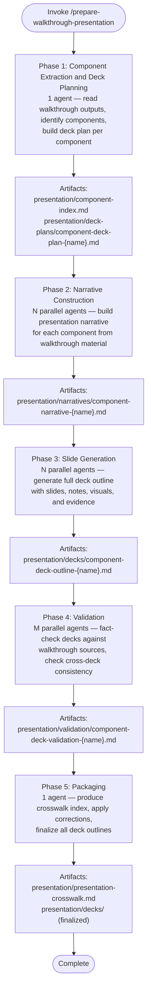

# Prepare Walkthrough Presentation

Transform validated `/linear-walkthrough` output into one presentation-ready deck outline per major codebase component. Each deck explains what the component is, how it works, how it connects to the system, how it is developed and operated, and what risks remain.

Walkthrough directory: `prepare-walkthrough-presentation` (default: `walkthrough/` in current directory).

Output directory: `presentation/` inside the walkthrough directory.

## Workflow

## Inputs

Read these artifacts from the walkthrough directory:

| Artifact | Path | Required |
|----------|------|----------|
| Unified walkthrough | `unified-walkthrough.md` or `unified/index.md` | Yes |
| Walkthrough sections | `sections/walkthrough-section-*.md` | Yes |
| Validation reports | `validation/validation-report-*.md` | Yes |
| Coverage plan | `coverage-plan.md` | Yes |
| Entry points | `entry-points.md` | Yes |
| Open questions | `open-questions.md` | Yes |

## Phase 1: Component Extraction and Deck Planning

Spawn one `general-purpose` agent to read walkthrough outputs and produce a component index and per-component deck plans.

### Agent prompt context

- Walkthrough directory path
- Read [agent-instructions.md](./references/agent-instructions.md) section "Planning Agent Instructions"
- Read [output-format.md](./references/output-format.md) section "Component Index Format" and "Deck Plan Format"

### Agent deliverables

| Artifact | Path |
|----------|------|
| Component index | `presentation/component-index.md` |
| Deck plans | `presentation/deck-plans/component-deck-plan-{name}.md` (one per component) |

### Orchestrator actions after Phase 1

1. Read `presentation/component-index.md` to get the component list.
2. Read each deck plan to understand scope and narrative direction.
3. Proceed to Phase 2 with one agent per component.

## Phase 2: Narrative Construction

Spawn N parallel `general-purpose` agents — one per component from the deck plan.

### Agent prompt context (per agent)

- Component deck plan file path
- Walkthrough directory path (for reading source sections)
- Read [agent-instructions.md](./references/agent-instructions.md) section "Narrative Agent Instructions"
- Read [output-format.md](./references/output-format.md) section "Component Narrative Format"

### Agent deliverables (per agent)

| Artifact | Path |
|----------|------|
| Component narrative | `presentation/narratives/component-narrative-{name}.md` |

### Orchestrator actions after Phase 2

1. Verify all expected narrative files exist.
2. Proceed to Phase 3.

## Phase 3: Slide Generation

Spawn N parallel `general-purpose` agents — one per component.

### Agent prompt context (per agent)

- Component narrative file path
- Component deck plan file path
- Walkthrough directory path (for evidence references)
- Read [agent-instructions.md](./references/agent-instructions.md) section "Slide Generation Agent Instructions"
- Read [output-format.md](./references/output-format.md) section "Deck Outline Format" and "Slide Format"

### Agent deliverables (per agent)

| Artifact | Path |
|----------|------|
| Deck outline | `presentation/decks/component-deck-outline-{name}.md` |

### Orchestrator actions after Phase 3

1. Verify all expected deck outline files exist.
2. Proceed to Phase 4.

## Phase 4: Validation

Spawn M parallel `general-purpose` agents. Each validator checks one or more deck outlines against the source walkthrough. Cross-assign validators so they do not validate decks produced by the same agent that generated them.

### Agent prompt context (per validator)

- Assigned deck outline file paths
- Walkthrough directory path
- Other deck outline file paths (for cross-deck consistency checks)
- Read [agent-instructions.md](./references/agent-instructions.md) section "Deck Validation Agent Instructions"
- Read [output-format.md](./references/output-format.md) section "Deck Validation Report Format"

### Agent deliverables (per validator)

| Artifact | Path |
|----------|------|
| Validation report | `presentation/validation/component-deck-validation-{name}.md` |

### Orchestrator actions after Phase 4

1. Read all validation reports.
2. If critical corrections exist, instruct agents to apply them to deck outlines before packaging.
3. Proceed to Phase 5.

## Phase 5: Packaging

Spawn one `general-purpose` agent to finalize all deck outlines and produce the crosswalk index.

### Agent prompt context

- All deck outline files from `presentation/decks/`
- All validation reports from `presentation/validation/`
- Component index from `presentation/component-index.md`
- Read [agent-instructions.md](./references/agent-instructions.md) section "Packaging Agent Instructions"
- Read [output-format.md](./references/output-format.md) section "Presentation Crosswalk Format"

### Agent deliverables

| Artifact | Path |
|----------|------|
| Presentation crosswalk | `presentation/presentation-crosswalk.md` |
| Finalized deck outlines | `presentation/decks/` (corrections applied) |

### Large output handling

If the crosswalk or any deck outline exceeds 25k characters, apply the [large file write strategy](../../rules/large-file-write-strategy.md) using Strategy A (multi-file split).

## Deck Planning Heuristics

- One deck per major component by default.
- Merge when two components are too small or too tightly coupled to explain separately.
- Split when one component is too broad to explain coherently in one deck.
- A component may be an app, service, package, library, worker, pipeline, platform layer, or other meaningful architectural unit.

## Default Audience

Technical audience: engineers, tech leads, platform owners, SRE/DevOps engineers, and engineering managers.

## Presentation Style

- Optimize for technical clarity, not executive fluff.
- Use concise, high-signal slide text — avoid dense paragraphs.
- Put detailed explanation in speaker notes.
- Make each deck readable standalone but consistent with other decks.
- Use consistent naming, terms, and structural patterns across all decks.

## Evidence Handling

- Every substantive slide references the walkthrough sections, validation reports, or source artifacts that support it.
- Distinguish verified facts from inferred connections.
- Preserve unresolved uncertainty from the walkthrough — do not smooth it away.

## Resources

- [Agent instructions](./references/agent-instructions.md) — detailed prompts for each agent type (planning, narrative, slide generation, validation, packaging)
- [Output format](./references/output-format.md) — required structure and templates for all artifacts
