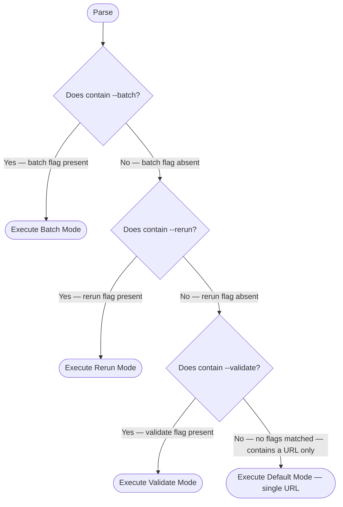
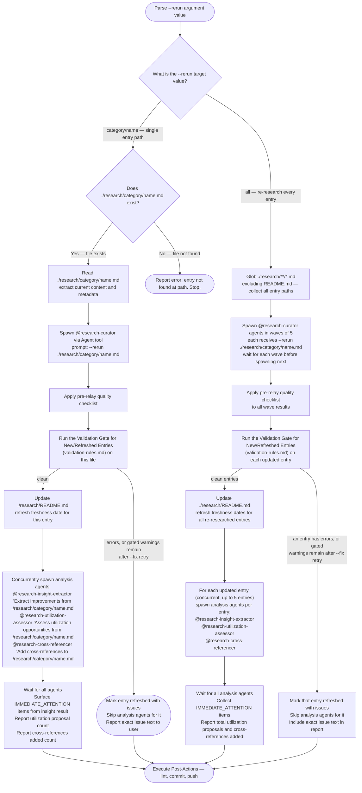
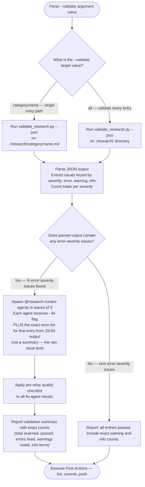

<mode_args>$ARGUMENTS</mode_args>

> [!IMPORTANT]
> When provided a process map or Mermaid diagram, treat it as the authoritative procedure. Execute steps in the exact order shown, including branches, decision points, and stop conditions.
> A Mermaid process diagram is an executable instruction set. Follow it exactly as written: respect sequence, conditions, loops, parallel paths, and terminal states. Do not improvise, reorder, or skip steps. If any node is ambiguous or missing required detail, pause and ask a clarifying question before continuing.
> When interacting with a user, report before acting the interpreted path you will follow from the diagram, then execute.

# Research Curator -- Multi-Mode Orchestrator

Orchestrate research entry creation, maintenance, and validation in `./research/`. Spawns `@research-curator` agents for content work; handles coordination, README updates, and post-actions.

---

## Mode Routing

Parse `<mode_args/>` to select operating mode. Before executing any mode below, capture a
`git status --porcelain --untracked-files=all -- ./research/` baseline -- this is the
invocation's pre-write state, taken before this run's own README update, curator agent, or
analysis agent writes anything. `--untracked-files=all` is required: the default mode collapses
an untracked directory to one line (`?? research/new-category/`) instead of listing the files
inside it, while step 3 below always lists individual files via `git ls-files --others` -- without
this flag, a pre-existing untracked file inside a new untracked directory would never match
anything in the baseline and would be misclassified as this run's own work. Post-Actions' steps
compare against this baseline, not a fresh snapshot, to tell this run's own writes apart from
another contributor's pre-existing uncommitted work.

The following diagram is the authoritative procedure for mode routing. Execute steps in the exact order shown, including branches, decision points, and stop conditions.



---

## Research Directory

Single source of truth: `./research/` (repo-root relative).

Structure:

```text
./research/
  README.md              # Category tables with all entries
  {category}/            # One directory per category
    {resource-name}.md   # Individual research entries
```

Category selection follows the flowchart in [Entry Template](./references/entry-template.md). Create directories as needed.

---

## Agent Result Relay Rules

These rules apply whenever this orchestrator receives results from any `@research-curator` agent. Violating them corrupts information before it reaches the user.

**Rule 1 — Preserve exact counts.** When an agent reports numbers, relay those exact numbers.

| Agent says | Relay as | Never relay as |
|---|---|---|
| "7 of 10 found" | "7 of 10 found" | "most found" |
| "3 errors, 2 warnings" | "3 errors, 2 warnings" | "several issues" |
| "0 results" | "0 results" | "nothing relevant" |

**Rule 2 — Preserve failure reasons.** Relay the specific reason; do not generalize.

| Agent says | Relay as | Never relay as |
|---|---|---|
| "HTTP 403 Forbidden" | "access denied (HTTP 403)" | "not available" |
| "Connection timeout" | "connection timed out" | "doesn't exist" |
| "File not found at path X" | "file not found at X" | "no such file" |
| "Rate limited" | "rate limited" | "unavailable" |

**Rule 3 — Reference files instead of re-summarizing.** When an agent wrote a file, include its path in the relay.

**Rule 4 — Relay structure, not interpretation.** When an agent returns a STATUS/ARTIFACTS/WARNINGS block, preserve that structure. Do not flatten it into a single sentence.

**Rule 5 — Distinguish observations from conclusions.** "Config has no timeout field" (observation) is different from "timeout defaults to 30s" (agent's conclusion). Keep them distinct.

### Pre-Relay Quality Checklist

Before reporting results to the user after any mode completes, verify:

- [ ] All numbers from agent output are preserved in relay
- [ ] All failure reasons are preserved verbatim (not generalized)
- [ ] File paths are included if agent wrote output files
- [ ] "Not found" has not been upgraded to "doesn't exist"
- [ ] "Inaccessible" has not been upgraded to "unavailable" or "nonexistent"
- [ ] Structured sections (STATUS, ARTIFACTS, WARNINGS) are preserved
- [ ] Agent observations are distinguished from agent conclusions

---

<default_mode>

## Default Mode -- Single URL

Trigger: `<mode_args/>` contains a URL with no flags.

### Duplicate Detection

Load [Duplicate Detection](./references/duplicate-detection.md) (shared with Batch Mode) before spawning.

### Workflow

1. **Parse** -- extract the URL from `<mode_args/>`
2. **Duplicate Detection** -- apply the [Duplicate Detection](./references/duplicate-detection.md) check before spawning
3. **Spawn agent** -- invoke `@research-curator` via Agent tool:

   ```text
   Agent tool parameters (new entry -- no existing entry found in step 2):
     agent: .claude/agents/research-curator.md
     prompt: "Research and create an entry for: {URL}"

   Agent tool parameters (existing entry found in step 2):
     agent: .claude/agents/research-curator.md
     prompt: "--rerun ./research/{category}/{name}.md"
   ```

4. **Wait** for structured result (status, file path, category, key findings)
5. **Validate** -- if research status is not `failed`, run the [Validation Gate for New/Refreshed Entries](./references/validation-rules.md#validation-gate-for-newrefreshed-entries) on the created or refreshed file. On its "mark issues" outcome: mark entry as "created with issues" (or "refreshed with issues" when step 2 routed to `--rerun`), skip steps 6–7, and report to user with the exact error or warning text from validator JSON. On its "proceed" outcome, continue to step 6.

6. **Spawn four tasks concurrently** -- if research status is not `failed`:

   ```text
   a. Agent tool parameters:
        agent: .claude/agents/research-insight-extractor.md
        prompt: "Extract improvements from {file-path-from-agent-result}"

   b. Agent tool parameters:
        agent: .claude/agents/research-utilization-assessor.md
        prompt: "Assess utilization opportunities from {file-path-from-agent-result}"

   c. Agent tool parameters:
        agent: .claude/agents/research-cross-referencer.md
        prompt: "Add cross-references to {file-path-from-agent-result}"

   d. Update ./research/README.md -- add new entry to category table, or refresh the freshness date for an existing entry when step 2 routed to `--rerun`
   ```

7. **Wait for all tasks above and surface results** -- collect structured return blocks from each agent and confirm README updated:

   - **Insight**: if the result contains `IMMEDIATE_ATTENTION:`, report each item with `#{issue} {title}` and the one-sentence reason. If no `IMMEDIATE_ATTENTION` section: report "N improvements added to backlog from {resource-name}."
   - **Utilization**: relay `PROPOSALS_WRITTEN` count and `FILE` path. If `STATUS: no_utilization_surface`, report "No direct utilization surface found."
   - **Cross-references**: relay `CROSS_REFERENCES_ADDED` count.

8. **Post-actions** -- lint, commit, push (see [Post-Actions](#post-actions))

### Error Handling

- If agent returns `status: failed`, relay the exact failure reason to user and stop
- Do not create partial entries or update README on failure

</default_mode>

---

<batch_mode>

## Batch Mode

Trigger: `<mode_args/>` contains `--batch`.

Full workflow defined in [Batch Mode reference](./references/batch-mode.md). Summary below.

### URL Parsing

Extract all tokens after `--batch` matching `https?://` as target URLs. Non-URL tokens ignored with warning.

### Wave Spawning

Spawn up to 5 `@research-curator` agents per wave via Agent tool. Wait for all agents in the current wave before spawning the next. After all waves complete, for each successful entry, run the [Validation Gate for New/Refreshed Entries](./references/validation-rules.md#validation-gate-for-newrefreshed-entries). On its "mark issues" outcome: mark entry as "created with issues", skip analysis agents for that entry, and include the exact error or warning text in the output report. On its "proceed" outcome: spawn concurrent analysis agents — `@research-insight-extractor`, `@research-utilization-assessor`, and `@research-cross-referencer` (up to 5 entries processed concurrently, each with its own set of analysis agents).

See [Batch Mode reference](./references/batch-mode.md) for the complete wave spawning diagram.

### Duplicate Detection

Load [Duplicate Detection](./references/duplicate-detection.md) (shared with Default Mode) before spawning.

### Progress Reporting

After each wave, relay exact counts and exact failure reasons from agent output:

```text
Wave N complete: M/N succeeded
  created    -- category/resource-name.md
  refreshed  -- category/resource-name.md (was N days old)
  failed     -- https://url.com -- {exact reason from agent}
```

After all waves:

```text
Batch complete: X/Y total succeeded
Files created: [list]
README updated: Yes
```

</batch_mode>

---

<rerun_mode>

## Rerun Mode

Trigger: `<mode_args/>` contains `--rerun`.

Re-research existing entries to refresh stale data.

### Target Parsing

The following diagram is the authoritative procedure for rerun mode. Execute steps in the exact order shown, including branches, decision points, and stop conditions.



### Single Entry Rerun

1. Verify `./research/{category}/{name}.md` exists
2. Spawn `@research-curator` via Agent tool:

   ```text
   prompt: "--rerun ./research/{category}/{name}.md"
   ```

3. Agent reads existing entry, re-gathers fresh data, updates content and freshness tracking
4. Apply pre-relay quality checklist to agent result
5. **Validate** -- run the [Validation Gate for New/Refreshed Entries](./references/validation-rules.md#validation-gate-for-newrefreshed-entries) on the updated file. On its "mark issues" outcome: mark entry as "refreshed with issues", skip step 7, and report to user with the exact error or warning text from validator JSON. On its "proceed" outcome, continue to step 6.

6. Update README with refreshed date (only reached on the "proceed" outcome of step 5 -- an entry marked "refreshed with issues" by step 5's "mark issues" outcome never gets a refreshed date)
7. Concurrently spawn three analysis agents:

   ```text
   - @research-insight-extractor — "Extract improvements from ./research/{category}/{name}.md"
   - @research-utilization-assessor — "Assess utilization opportunities from ./research/{category}/{name}.md"
   - @research-cross-referencer — "Add cross-references to ./research/{category}/{name}.md"
   ```

8. Wait for all three; surface `IMMEDIATE_ATTENTION` items from insight result; report utilization proposal count; report cross-references added count

### All Entries Rerun

1. Glob `./research/**/*.md` excluding `README.md`
2. Spawn agents in waves of 5 (same pattern as Batch Mode)
3. Each agent receives `--rerun ./research/{category}/{name}.md`
4. Apply pre-relay quality checklist after each wave
5. **Validate** -- for each successfully updated entry, run the [Validation Gate for New/Refreshed Entries](./references/validation-rules.md#validation-gate-for-newrefreshed-entries) before spawning analysis agents. On its "mark issues" outcome: mark that entry as "refreshed with issues" and skip analysis agents for it. On its "proceed" outcome: include the entry in analysis agent dispatch (step 7).

6. Update README once after all waves complete, refreshing freshness dates only for entries that passed validation in step 5 -- an entry marked "refreshed with issues" by step 5's "mark issues" outcome does not get a refreshed date
7. For each entry that passed validation: spawn concurrent analysis agents per entry (up to 5 entries concurrently) — `@research-insight-extractor`, `@research-utilization-assessor`, `@research-cross-referencer`

</rerun_mode>

---

<validate_mode>

## Validate Mode

Trigger: `<mode_args/>` contains `--validate`.

Run structural validation and fix error-severity issues.

### What Gets Checked

The validator script (`validate_research.py`) checks each entry file against the rules in [Validation Rules](./references/validation-rules.md). It emits JSON with three severity levels:

- **error** -- structural violations that make entries unusable (missing required fields, broken links, malformed frontmatter). Auto-fixed by spawning `@research-curator` with `--fix` and the specific issue list.
- **warning** -- quality issues that don't break entries (stale dates, thin summaries). For the entries Validate Mode scans here -- pre-existing entries this invocation did not itself create or refresh -- reported to user; not auto-fixed. This is the intentionally lighter touch appropriate for legacy content some other agent wrote before the skill enforced these fields strictly. It does not apply to entries Default Mode, Batch Mode, or Rerun Mode just created or refreshed in the current invocation -- those follow the stricter [Validation Gate for New/Refreshed Entries](./references/validation-rules.md#validation-gate-for-newrefreshed-entries), which must-fixes four of these warning checks before the entry is reported complete.
- **info** -- informational observations (entry age, word count). Reported to user; no action.

### Validation Workflow

The following diagram is the authoritative procedure for validate mode. Execute steps in the exact order shown, including branches, decision points, and stop conditions.



### Script Invocation

```bash
uv run .claude/skills/research-curator/scripts/validate_research.py main --json ./research/{target}
```

### Fix Agent Delegation

When spawning a fix agent, pass the exact error text from the JSON output — not a paraphrase. The agent receives:

```text
prompt: "--fix ./research/{category}/{name}.md
Issues to fix (from validator JSON):
  - {exact issue text from JSON}
  - {exact issue text from JSON}"
```

### Issue Handling

Severity handling per [Validation Rules](./references/validation-rules.md):

- **error** -- spawn `@research-curator` with `--fix` flag and the exact issue list extracted from JSON
- **warning** -- include exact warning text in report to user; do not auto-fix. This applies to entries Validate Mode scans here -- entries this invocation did not itself create or refresh. Validate Mode never re-researches (that is `--rerun`'s job), so it does not have fresh facts in hand the way a researching agent does; the lighter report-only touch is the correct behavior for this legacy content, unlike the must-fix rule Default/Batch/Rerun Mode apply to the same four checks on entries they just wrote (see [Validation Gate for New/Refreshed Entries](./references/validation-rules.md#validation-gate-for-newrefreshed-entries)).
- **info** -- include exact info text in report; no action needed

For error-severity fixes, spawn agents in waves of 5 (same pattern as Batch Mode).

### Summary Report

Report exact counts from the validator JSON output — do not paraphrase:

```text
Validation complete:
  Total scanned: N
  Passed: N
  Errors found: N (M auto-fixed)
  Warnings noted: N
  Info items: N
```

</validate_mode>

---

<post_actions>

## Post-Actions

Shared by all modes. Execute after any mode completes successfully. Step 3 derives exactly
which files this run touched by diffing the current working tree against the pre-mode baseline
captured in [Mode Routing](#mode-routing) -- no file path needs manual tracking through the steps
below.

1. **README Update** -- if `./research/README.md` was already dirty in the pre-mode baseline
   (see [Mode Routing](#mode-routing)), report to the user: `./research/README.md -- pre-existing
   uncommitted changes present; this run's README update will not be committed` before proceeding
   -- the update below still needs to happen so the mode's own entry is recorded, but step 3 will
   exclude README.md from this run's commit, so the edit lands mixed into someone else's
   uncommitted file rather than silently being treated as if nothing was wrong. Otherwise, add or
   update entries in `./research/README.md` category tables as usual. This is a shared restatement
   of the mode-specific README step each mode's own flow already gates (Default/Batch step 6d,
   Rerun step 6/`UpdateDate(s)`) -- it does not run as a fresh, ungated pass. Do not add a row, or
   refresh the Last Updated date on an existing row, for any entry marked "created with issues" or
   "refreshed with issues" earlier in this run; that entry's README state stays exactly as it was
   before this run started

2. **Backlink Repair** -- deterministically repair the bidirectional cross-reference graph across
   the whole vault, not just entries this run touched (asymmetric edges can persist from any
   prior run that predates this check):

   ```bash
   uv run .claude/skills/research-curator/scripts/validate_research.py check-backlinks ./research --fix
   ```

   If this command's stderr contains any `warning: could not repair ...` line: that is an
   operational I/O failure (permissions, disk space, an invalid path) reading or writing a target,
   not a structural limitation. Halt Post-Actions and report the exact warning text to the user.

   Otherwise, a non-zero exit here reports asymmetric edges the script cannot structurally repair
   (a dangling link to a missing target, or a manually authored row with a different description
   it refuses to overwrite) -- continue to step 3 regardless of this exit code. Which files, if
   any, this command actually modified is determined by step 3's diff, not by this step -- do not
   parse the printed `{source} -> {target}` lines to guess at modified files, since they list every
   asymmetric edge found *before* repair is attempted, not which repairs succeeded.

   **Known limitation**: this command has no per-file exclude option, so it can write into a
   backlink-target file that was already dirty in the pre-mode baseline before step 3 ever
   excludes that file from this run's commit -- the exclusion happens after the write, not before
   it (tracked in backlog #3516; fixing it requires a change to `check-backlinks` itself, outside
   this skill). Running research-curator from an isolated worktree when another contributor may be
   editing `./research/` concurrently avoids the collision entirely -- see
   `rules/commit-cadence-and-worktrees.md`.

3. **Compute the filtered file list** -- diff the current working tree against the pre-mode
   baseline (see [Mode Routing](#mode-routing)) to get every file under `./research/` this run
   touched:

   ```bash
   git diff --name-only -- ./research/
   git ls-files --others --exclude-standard -- ./research/
   ```

   Exclude any path that was **already** dirty in the baseline -- that is another contributor's
   pre-existing uncommitted work, not something this run produced -- and report it to the user as
   `{path} -- pre-existing uncommitted changes, not touched this run`. Call what remains **the
   filtered list**; steps 4-6 below use it and nothing else, so a pre-existing dirty file is never
   linted, staged, or committed by this run.

   If the filtered list is empty (nothing was created, refreshed, or repaired this run -- e.g. a
   clean Validate Mode pass where the backlink repair also found nothing writable to fix), skip
   steps 4-6 entirely: there is nothing to lint, commit, or push, and this is not a failure. Do not
   invoke `prek run --files` with an empty list -- with no paths given, it falls back to its normal
   staged-file selection instead of processing nothing, which could run auto-fixing hooks against
   whatever another contributor already has staged.

4. **Lint** -- run formatting checks on exactly the filtered list:

   ```bash
   uv run prek run --files [the filtered list]
   ```

5. **Commit** -- stage and commit **exactly** the filtered list, immune to whatever else might
   already be staged in the working tree -- never a blanket `git add -A`, a directory-wide
   `git add ./research/`, or a pathless `git commit -m` (which commits the entire index, not just
   these paths):

   ```bash
   git add [the filtered list]
   git commit [the filtered list] -m "docs(research): [action] [resource names]"
   ```

6. **Push** -- push to current branch:

   ```bash
   git push -u origin HEAD
   ```

Commit message actions by mode:

- Default -- `add {resource-name} research entry`
- Batch -- `add {N} research entries`
- Rerun -- `refresh {resource-name|N entries}`
- Validate -- `fix validation issues in {resource-name|N entries}`

</post_actions>

---

<output_format>

## Output Format

Report to user after any mode completes. All counts and failure reasons MUST be relayed exactly as received from agents — apply the pre-relay quality checklist before writing this output.

### Default Mode Output

```text
## Research Entry Created

**Resource**: {name}
**Category**: {category}
**File**: ./research/{category}/{filename}.md
**README Updated**: Yes
**Cross-References Added**: N
**Utilization Proposals**: N (file: ./research/insights/YYYY-MM-DD-{name}-utilization.md)

### Key Findings
- Finding 1
- Finding 2
- Finding 3

### Next Review
YYYY-MM-DD
```

### Batch Mode Output

```text
## Batch Research Complete

**Total**: X URLs processed
**Created**: Y new entries
**Refreshed**: Z existing entries
**Failed**: W

### Entries Created
- ./research/{category}/{name}.md

### Entries Refreshed
- ./research/{category}/{name}.md (was N days old, last: YYYY-MM-DD, vX.Y.Z)

### Failures
- {URL} -- {exact reason from agent output}
```

### Rerun Mode Output

```text
## Research Entries Refreshed

**Refreshed**: N entries
**Changes Detected**: M entries had updated data

### Updated Entries
- ./research/{category}/{name}.md -- {what changed}
```

### Validate Mode Output

```text
## Validation Results

**Scanned**: N entries
**Passed**: N
**Errors Fixed**: N
**Warnings**: N
**Info**: N

### Fixes Applied
- ./research/{category}/{name}.md -- {exact issue fixed, from validator JSON}

### Warnings (manual review recommended)
- ./research/{category}/{name}.md -- {exact warning text}
```

</output_format>

---

## Reference Links

- [Entry Template](./references/entry-template.md) -- standard format for all research entries
- [Validation Rules](./references/validation-rules.md) -- checks and severity mapping for `--validate` mode
- [Batch Mode](./references/batch-mode.md) -- wave spawning workflow for `--batch` mode
- [Duplicate Detection](./references/duplicate-detection.md) -- shared pre-spawn check for Default Mode and Batch Mode
- [Repo Access Procedure](./references/repo-access-procedure.md) -- tested shallow-clone procedure for repository research
- Agent: `@research-curator` at `.claude/agents/research-curator.md` -- single-entry research executor
- Agent: `@research-insight-extractor` at `.claude/agents/research-insight-extractor.md` -- extracts backlog improvements from research entries
- Agent: `@research-utilization-assessor` at `.claude/agents/research-utilization-assessor.md` -- assesses direct API/service utilization opportunities
- Agent: `@research-cross-referencer` at `.claude/agents/research-cross-referencer.md` -- appends Cross-References section to research entries
- Agent: `@research-backlink-detector` at `.claude/agents/research-backlink-detector.md` -- manual/ad-hoc backlink repair for a single entry; the deterministic `check-backlinks --fix` invocation in [Post-Actions](#post-actions) now covers all four modes and superseded this agent's former sequential pass in Batch Mode

SOURCE: Agent result relay rules and pre-relay checklist adapted from `plugins/summarizer/skills/agent-result-relay/SKILL.md` (accessed 2026-03-06).
