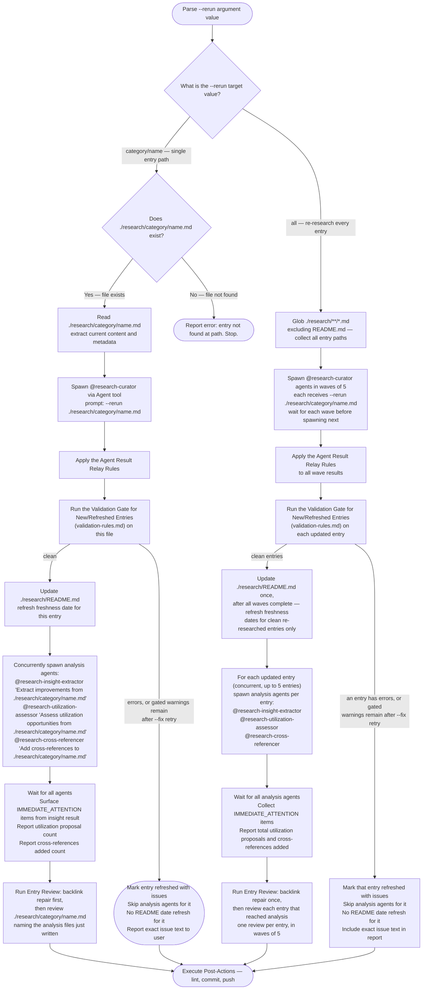
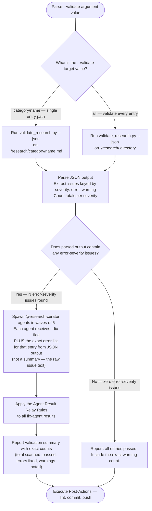

<mode_args>$ARGUMENTS</mode_args>

> [!IMPORTANT]
> Every Mermaid diagram in this file is an authoritative, executable procedure. Follow it exactly: respect sequence, conditions, branches, parallel paths, and terminal states. Do not improvise, reorder, or skip steps. If a node is ambiguous or missing required detail, pause and ask before continuing.
> Report the path you will follow through the diagram before executing it.

# Research Curator -- Multi-Mode Orchestrator

Orchestrate research entry creation, maintenance, and validation in `./research/`. Spawns `@research-curator` agents for content work; handles coordination, README updates, and post-actions.

---

## Mode Routing

Parse `<mode_args/>` to select operating mode. Before executing any mode below, capture a
`git status --porcelain --untracked-files=all -- ./research/` baseline -- the invocation's
pre-write state, taken before this run's own README update, curator agent, or analysis agent
writes anything. Post-Actions compares against this baseline, not a fresh snapshot, to tell this
run's own writes apart from another contributor's pre-existing uncommitted work.
`--untracked-files=all` is required: the default collapses an untracked directory to a single
line, so a pre-existing untracked file inside a new untracked directory would never match the
baseline and would be misclassified as this run's own work.


---

## Agent Result Relay Rules

These rules apply whenever this orchestrator receives results from any `@research-curator` agent. Apply them before reporting anything to the user.

**Rule 1 — Preserve exact counts.** When an agent reports numbers, relay those exact numbers.

| Agent says | Relay as | Never relay as |
|---|---|---|
| "7 of 10 found" | "7 of 10 found" | "most found" |
| "3 errors, 2 warnings" | "3 errors, 2 warnings" | "several issues" |
| "0 results" | "0 results" | "nothing relevant" |

**Rule 2 — Preserve failure reasons.** Relay the specific reason; do not generalize.

| Agent says | Relay as | Never relay as |
|---|---|---|
| "HTTP 403 Forbidden" | "access denied (HTTP 403)" | "not available" |
| "Connection timeout" | "connection timed out" | "doesn't exist" |
| "File not found at path X" | "file not found at X" | "no such file" |
| "Rate limited" | "rate limited" | "unavailable" |
| "Inaccessible" | "inaccessible" | "unavailable" / "nonexistent" |

**Rule 3 — Reference files instead of re-summarizing.** When an agent wrote a file, include its path in the relay.

**Rule 4 — Relay structure, not interpretation.** When an agent returns a STATUS/ARTIFACTS/WARNINGS block, preserve that structure. Do not flatten it into a single sentence.

**Rule 5 — Distinguish observations from conclusions.** "Config has no timeout field" (observation) is different from "timeout defaults to 30s" (agent's conclusion). Keep them distinct.

---

<default_mode>

## Default Mode -- Single URL

Trigger: `<mode_args/>` contains a URL with no flags.

### Workflow

1. **Parse** -- extract the URL from `<mode_args/>`
2. **Duplicate Detection** -- apply the [Duplicate Detection](./references/duplicate-detection.md) check before spawning
3. **Spawn agent** -- invoke `@research-curator` via Agent tool:

   ```text
   Agent tool parameters (new entry -- no existing entry found in step 2):
     agent: .claude/agents/research-curator.md
     prompt: "Research and create an entry for: {URL}"

   Agent tool parameters (existing entry found in step 2):
     agent: .claude/agents/research-curator.md
     prompt: "--rerun ./research/{category}/{name}.md"
   ```

4. **Wait** for structured result (status, file path, category, key findings)
5. **Validate** -- if research status is not `failed`, run the [Validation Gate for New/Refreshed Entries](./references/validation-rules.md#validation-gate-for-newrefreshed-entries) on the created or refreshed file. On its "mark issues" outcome: mark entry as "created with issues" (or "refreshed with issues" when step 2 routed to `--rerun`), skip steps 6–8, and report to user with the exact error or warning text from validator JSON. On its "proceed" outcome, continue to step 6.

6. **Spawn four tasks concurrently** -- if research status is not `failed`:

   ```text
   a. Agent tool parameters:
        agent: .claude/agents/research-insight-extractor.md
        prompt: "Extract improvements from {file-path-from-agent-result}"

   b. Agent tool parameters:
        agent: .claude/agents/research-utilization-assessor.md
        prompt: "Assess utilization opportunities from {file-path-from-agent-result}"

   c. Agent tool parameters:
        agent: .claude/agents/research-cross-referencer.md
        prompt: "Add cross-references to {file-path-from-agent-result}"

   d. Update ./research/README.md -- add new entry to category table, or refresh the freshness date for an existing entry when step 2 routed to `--rerun`
   ```

7. **Wait for all tasks above and surface results** -- collect structured return blocks from each agent and confirm README updated:

   - **Insight**: if the result contains `IMMEDIATE_ATTENTION:`, report each item with `#{issue} {title}` and the one-sentence reason. If no `IMMEDIATE_ATTENTION` section: report "N improvements added to backlog from {resource-name}."
   - **Utilization**: relay `PROPOSALS_WRITTEN` count and `FILE` path. If `STATUS: no_utilization_surface`, report "No direct utilization surface found."
   - **Cross-references**: relay `CROSS_REFERENCES_ADDED` count.

8. **Review** -- run [Entry Review](#entry-review) on the entry, auditing it together with whatever step 6 wrote

9. **Post-actions** -- lint, commit, push (see [Post-Actions](#post-actions))

### Error Handling

- If agent returns `status: failed`, relay the exact failure reason to user and stop
- Do not create partial entries or update README on failure

</default_mode>

---

<batch_mode>

## Batch Mode

Trigger: `<mode_args/>` contains `--batch`.

Spine below; complete wave diagram and error handling in the [Batch Mode reference](./references/batch-mode.md).

### URL Parsing

Extract all tokens after `--batch` matching `https?://` as target URLs. Non-URL tokens ignored with warning.

### Duplicate Detection

Apply the [Duplicate Detection](./references/duplicate-detection.md) check per URL before spawning.

### Wave Spawning

Spawn up to 5 `@research-curator` agents per wave via Agent tool. Wait for all agents in the current wave before spawning the next. After all waves complete, for each successful entry, run the [Validation Gate for New/Refreshed Entries](./references/validation-rules.md#validation-gate-for-newrefreshed-entries). On its "mark issues" outcome: mark entry as "created with issues" (or "refreshed with issues" when the URL matched an existing entry), skip analysis agents for that entry, and include the exact error or warning text in the output report. On its "proceed" outcome: spawn concurrent analysis agents — `@research-insight-extractor`, `@research-utilization-assessor`, and `@research-cross-referencer` (up to 5 entries processed concurrently, each with its own set of analysis agents). After every analysis agent has returned and the wave counts are reported, run [Entry Review](#entry-review) on each entry that reached the analysis agents.

### Progress Reporting

After each wave, relay exact counts and exact failure reasons from agent output:

```text
Wave N complete: M/N succeeded
  created    -- category/resource-name.md
  refreshed  -- category/resource-name.md (was N days old)
  failed     -- https://url.com -- {exact reason from agent}
```

</batch_mode>

---

<rerun_mode>

## Rerun Mode

Trigger: `<mode_args/>` contains `--rerun`.



</rerun_mode>

---

<validate_mode>

## Validate Mode

Trigger: `<mode_args/>` contains `--validate`.

`validate_research.py` checks each entry against [Validation Rules](./references/validation-rules.md) and emits JSON keyed by the severities that reference defines.



### Script Invocation

```bash
uv run .claude/skills/research-curator/scripts/validate_research.py main --json ./research/{target}
```

### Issue Handling

- **error** -- spawn `@research-curator` with `--fix` and the exact issue list extracted from JSON
- **warning** -- include the exact warning text in the report to the user; do not auto-fix

This report-only handling of warnings applies to the pre-existing entries Validate Mode scans. An entry that Default, Batch, or Rerun Mode created or refreshed **this invocation** instead follows the stricter [Validation Gate for New/Refreshed Entries](./references/validation-rules.md#validation-gate-for-newrefreshed-entries).

### Fix Agent Delegation

```text
prompt: "--fix ./research/{category}/{name}.md
Issues to fix (from validator JSON):
  - {exact issue text from JSON}
  - {exact issue text from JSON}"
```

</validate_mode>

---

<entry_review>

## Entry Review

Runs in Default, Batch, and Rerun Mode, once that mode's analysis agents have all returned and
before Post-Actions. Audits each entry this run created or refreshed, with the analysis files
written for it, against [Entry Review Rubric](./references/entry-review-rubric.md), which the agent loads.

**Repair reciprocity first.** `@research-cross-referencer` writes forward links only, so the vault is
asymmetric the moment it returns, and the rubric's Gate 1 scores an asymmetric pair as a defect
against the citing entry -- reviewing now fails every entry on a defect this run is about to repair.
Run the [Post-Actions](#post-actions) step 2 backlink repair, handling its four result cases exactly
as step 2 specifies, before spawning any review. Step 2 still runs in its own place afterwards: the
repair is idempotent, and Validate Mode reaches it without passing through here.

Then spawn one `@research-curator` per entry, in waves of 5, matching the analysis fan-out. One
review per entry, never one across a batch: the verdict block is per-entry, and the repo-claims gate
opens the local file behind every proposal.

```text
Agent tool parameters:
  agent: .claude/agents/research-curator.md
  model: sonnet
  prompt: "--review ./research/{category}/{name}.md
Analysis files written this run:
  improvements: {path from the insight agent result, or none}
  utilization:  {FILE path from the utilization agent result, or none}"
```

Answer both lines, `none` included: the paths carry a date the agent cannot derive from the entry
name and the rubric scopes gates 4, 5 and 6 to them, so a blank line costs three gates, while a bare
`none` stops the agent globbing up a stale proposal an earlier run wrote for this same resource.

An entry the validation gate already marked "created with issues" or "refreshed with issues" is not
reviewed this run -- it never reached the analysis agents, so most of the rubric's scope does not
exist for it. It is reviewed by whichever later `--rerun` clears its validation issues.

Relay each verdict block verbatim under the [Agent Result Relay Rules](#agent-result-relay-rules) --
every gate line, every defect, and every repair, quoted as the agent wrote them, under an
`### Entry Review Verdicts` heading in the mode's [Output Format](#output-format) report. Then:

- **APPROVE** -- continue to Post-Actions unchanged.
- **REQUEST CHANGES** -- mark the entry "created with issues" (or "refreshed with issues") and
  continue to Post-Actions, which then withholds this entry's README row and date (step 1), keeping
  it out of the index until a later run reviews it clean. Correction belongs to a later `--rerun`
  rather than to `--fix`: `--fix` takes validator issues, and a gate 4 or 5 defect needs re-research.

</entry_review>

---

<post_actions>

## Post-Actions

Shared by all modes. Execute after any mode completes successfully. Step 3 derives exactly which
files this run touched by diffing the current working tree against the pre-mode baseline captured
in [Mode Routing](#mode-routing).

1. **README Update** -- if `./research/README.md` was already dirty in the pre-mode baseline,
   report to the user: `./research/README.md -- pre-existing uncommitted changes present; this
   run's README update will not be committed` before proceeding -- the update below still needs to
   happen so the mode's own entry is recorded, but step 3 will exclude README.md from this run's
   commit. Otherwise, add or update entries in `./research/README.md` category tables as usual.
   This restates the README step each mode's own flow already gates (Default step 6d, Batch
   `UpdateAll`/`Partial`, Rerun `UpdateDate(s)`) -- do not run it as a fresh, ungated pass. Do not
   add a row, or refresh the Last Updated date on an existing row, for any entry marked "created
   with issues" or "refreshed with issues" earlier in this run; that entry's README state stays
   exactly as it was before this run started. [Entry Review](#entry-review) sets that mark after
   this run already wrote the row, so for an entry it marks, restore that entry's row to the
   version in `git show HEAD:./research/README.md` -- deleting the row outright when that version
   has none. That command is the pre-run state only when README.md was clean in the baseline; when
   it was already dirty, this run's README changes are excluded from the commit by this step
   anyway, so report the mark and leave the file alone

2. **Backlink Repair** -- deterministically repair the bidirectional cross-reference graph across
   the whole vault, not just entries this run touched:

   Pass `--exclude {path}` once per path that was **already** dirty in the pre-mode baseline
   (see [Mode Routing](#mode-routing)). The repair writes its reciprocal row into the *cited*
   entry, so without this it can write into another contributor's uncommitted work. An excluded
   file is still scanned and its asymmetric pairs are still reported -- only the write is withheld,
   counted in stdout JSON as `backlinks_excluded`. Step 3 below still filters those paths out of the
   commit; `--exclude` is what keeps them unmodified on disk in the first place.

   ```bash
   uv run scripts/run_bounded.py --timeout-seconds 180 -- \
     uv run .claude/skills/research-curator/scripts/validate_research.py check-backlinks ./research --fix \
       --exclude {baseline-dirty-path} ...
   ```

   Check the result in this order:

   1. **Exit code 124** (`run_bounded.py`'s timeout signal): halt Post-Actions and report a
      timeout unconditionally. A terminated run's partial state is not trustworthy to commit.
   2. **Stdout is not one compact JSON object containing integer
      `asymmetric_cross_references`**: the command crashed before completing its scan rather than
      reporting a structural result. Halt Post-Actions and report the failure to the user.
   3. **Stderr contains a `warning: io-error, could not repair ...` line**: a genuine I/O failure
      reading or writing a target. Halt Post-Actions and report the exact warning text.
   4. **Otherwise**: continue to step 3 regardless of this exit code. This covers a
      `warning: structural, could not repair ...` line (a malformed entry the script cannot parse,
      e.g. a Cross-References row with no markdown link). A non-zero `scan_skipped_files` field
      belongs here too: those files were dropped from the graph before they could be compared, so
      `asymmetric_cross_references` undercounts by whatever they hold, and a positive skip count is
      on its own enough to make this command exit non-zero. Read each object in `skips` and report
      its `path`, `reason`, and `detail` verbatim -- the files are repairable and nothing else in
      the repo will name them -- then continue. Pass
      `--allow-partial-scan` only when a run must exit 0 despite that hole in its coverage; this
      step never needs it, because it already continues past a non-zero exit. Do not use the
      `edges` array to guess which files were modified -- it lists every asymmetric edge found
      *before* repair was attempted, not which repairs succeeded. Step 3's diff
      determines what this command actually changed.

3. **Compute the filtered file list** -- diff the current working tree against the pre-mode
   baseline (see [Mode Routing](#mode-routing)) to get every file under `./research/` this run
   touched:

   ```bash
   git diff --name-only -- ./research/
   git ls-files --others --exclude-standard -- ./research/
   ```

   Exclude any path that was **already** dirty in the baseline -- that is another contributor's
   pre-existing uncommitted work, not something this run produced -- and report it to the user as
   `{path} -- pre-existing uncommitted changes, not touched this run`. Call what remains **the
   filtered list**; steps 4-6 below use it and nothing else, so a pre-existing dirty file is never
   linted, staged, or committed by this run.

   The baseline only detects files that were already dirty when it was captured; a concurrent edit
   starting afterwards is indistinguishable from this run's own write. When another contributor may
   be editing `./research/` at the same time, run this skill from an isolated worktree -- see
   `rules/commit-cadence-and-worktrees.md`.

   If the filtered list is empty (nothing was created, refreshed, or repaired this run -- e.g. a
   clean Validate Mode pass where the backlink repair also found nothing writable to fix), skip
   steps 4-6 entirely: there is nothing to lint, commit, or push, and this is not a failure.

4. **Lint** -- run formatting checks on exactly the filtered list:

   ```bash
   uv run prek run --files [the filtered list]
   ```

5. **Commit** -- stage and commit **exactly** the filtered list, immune to whatever else might
   already be staged in the working tree. Pass the paths to `git commit` itself -- a pathless
   `git commit -m` commits the entire index, not just these paths:

   ```bash
   git add [the filtered list]
   git commit [the filtered list] -m "docs(research): [action] [resource names]"
   ```

6. **Push** -- push to current branch:

   ```bash
   git push -u origin HEAD
   ```

Commit message actions by mode:

- Default -- `add {resource-name} research entry`
- Batch -- `add {N} research entries`
- Rerun -- `refresh {resource-name|N entries}`
- Validate -- `fix validation issues in {resource-name|N entries}`

</post_actions>

---

<output_format>

## Output Format

Report to user after any mode completes. Apply the [Agent Result Relay Rules](#agent-result-relay-rules) before writing this output.

### Default Mode Output

```text
## Research Entry Created

**Resource**: {name}
**Category**: {category}
**File**: ./research/{category}/{filename}.md
**README Updated**: Yes | No -- entry marked with issues, row withheld
**Entry Review**: APPROVE | REQUEST CHANGES -- N defects
**Cross-References Added**: N
**Utilization Proposals**: N (file: ./research/insights/YYYY-MM-DD-{name}-utilization.md)

### Key Findings
- Finding 1
- Finding 2
- Finding 3

### Next Review
YYYY-MM-DD
```

### Batch Mode Output

```text
## Batch Research Complete

**Total**: X URLs processed
**Created**: Y new entries
**Refreshed**: Z existing entries
**Failed**: W
**README Updated**: Yes -- rows withheld for R entries marked with issues
**Entry Review**: A APPROVE, R REQUEST CHANGES

### Entries Created
- ./research/{category}/{name}.md

### Entries Refreshed
- ./research/{category}/{name}.md (was N days old, last: YYYY-MM-DD, vX.Y.Z)

### Failures
- {URL} -- {exact reason from agent output}
```

### Rerun Mode Output

```text
## Research Entries Refreshed

**Refreshed**: N entries
**Changes Detected**: M entries had updated data
**Entry Review**: A APPROVE, R REQUEST CHANGES

### Updated Entries
- ./research/{category}/{name}.md -- {what changed}
```

### Validate Mode Output

```text
## Validation Results

**Scanned**: N entries
**Passed**: N
**Errors**: N found (M auto-fixed)
**Warnings**: N
**Info**: N

### Fixes Applied
- ./research/{category}/{name}.md -- {exact issue fixed, from validator JSON}

### Warnings (manual review recommended)
- ./research/{category}/{name}.md -- {exact warning text}
```

</output_format>

## Preserved, Not Wired

No mode below runs an integration-opportunity search; `/process-research-integration` and the
`research-context-agent` that served it were deleted in PR #3529. The part of that agent's search
procedure that was carried forward, and an inventory of the part that was not, is in
[Integration Opportunity Search](./references/integration-opportunity-search.md). Load it only when
redesigning that search or regenerating an existing `## Integration Opportunities` section — no
step in this skill reads it.

---

SOURCE: Agent result relay rules adapted from `plugins/summarizer/skills/agent-result-relay/SKILL.md` (accessed 2026-03-06).
