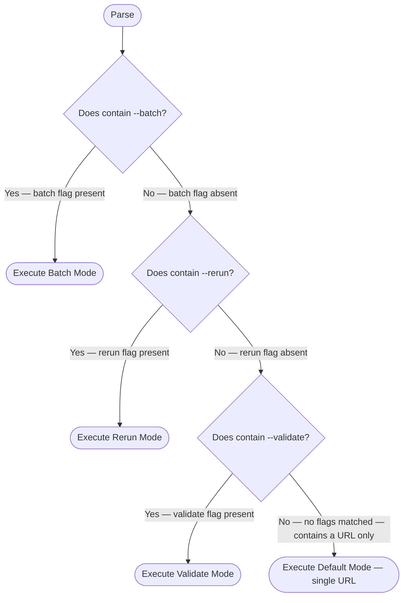
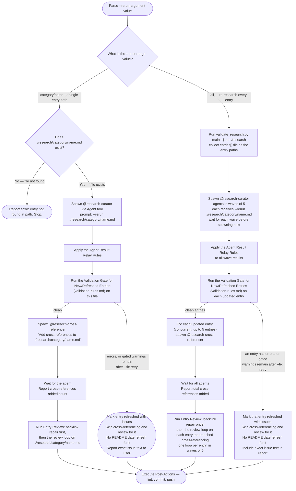
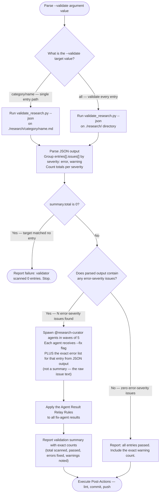
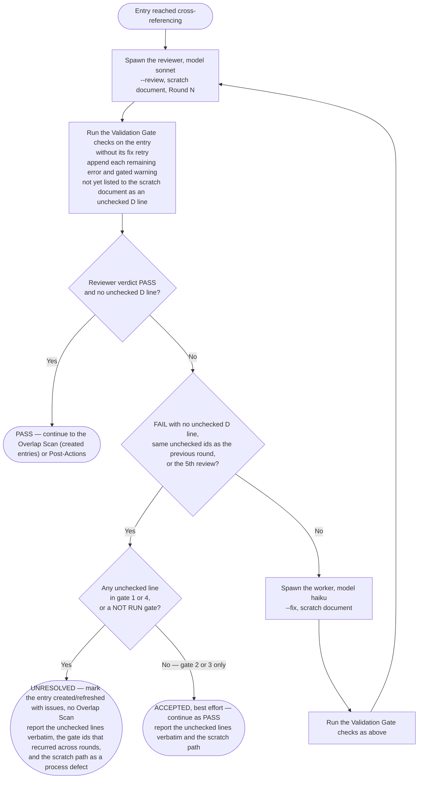

<mode_args>$ARGUMENTS</mode_args>

> [!IMPORTANT]
> Every Mermaid diagram in this file is an authoritative, executable procedure. Follow it exactly: respect sequence, conditions, branches, parallel paths, and terminal states. Do not improvise, reorder, or skip steps. If a node is ambiguous or missing required detail, pause and ask before continuing.
> Report the path you will follow through the diagram before executing it.

# Research Curator -- Multi-Mode Orchestrator

Orchestrate research entry creation, maintenance, and validation in `./research/`. Spawns `@research-curator` agents for content work; handles coordination, README updates, and post-actions.

---

## Mode Routing

Parse `<mode_args/>` to select operating mode. Before executing any mode below, capture a
`git status --porcelain --untracked-files=all -- ./research/` baseline -- the invocation's
pre-write state, taken before this run's own README update or curator agent
writes anything. For each `--rerun` target, also record `git hash-object {path}` with the baseline.
Post-Actions compares against this baseline, not a fresh snapshot, to tell this
run's own writes apart from another contributor's pre-existing uncommitted work.
`--untracked-files=all` is required: the default collapses an untracked directory to a single
line, so a pre-existing untracked file inside a new untracked directory would never match the
baseline and would be misclassified as this run's own work.


```mermaid
flowchart TD
    Start(["Parse <mode_args/>"]) --> Q1{"Does <mode_args/> contain --batch?"}
    Q1 -->|"Yes — batch flag present"| Batch(["Execute Batch Mode"])
    Q1 -->|"No — batch flag absent"| Q2{"Does <mode_args/> contain --rerun?"}
    Q2 -->|"Yes — rerun flag present"| Rerun(["Execute Rerun Mode"])
    Q2 -->|"No — rerun flag absent"| Q3{"Does <mode_args/> contain --validate?"}
    Q3 -->|"Yes — validate flag present"| Validate(["Execute Validate Mode"])
    Q3 -->|"No — no flags matched — <mode_args/> contains a URL only"| Default(["Execute Default Mode — single URL"])
```

---

## Agent Result Relay Rules

These rules apply whenever this orchestrator receives results from any `@research-curator` agent. Apply them before reporting anything to the user.

**Rule 1 — Preserve exact counts.** When an agent reports numbers, relay those exact numbers.

| Agent says | Relay as | Never relay as |
|---|---|---|
| "7 of 10 found" | "7 of 10 found" | "most found" |
| "3 errors, 2 warnings" | "3 errors, 2 warnings" | "several issues" |
| "0 results" | "0 results" | "nothing relevant" |

**Rule 2 — Preserve failure reasons.** Relay the specific reason; do not generalize.

| Agent says | Relay as | Never relay as |
|---|---|---|
| "HTTP 403 Forbidden" | "access denied (HTTP 403)" | "not available" |
| "Connection timeout" | "connection timed out" | "doesn't exist" |
| "File not found at path X" | "file not found at X" | "no such file" |
| "Rate limited" | "rate limited" | "unavailable" |
| "Inaccessible" | "inaccessible" | "unavailable" / "nonexistent" |

**Rule 3 — Reference artifacts instead of re-summarizing.** When an agent wrote a file or filed an issue, include its path or its issue number and URL in the relay.

**Rule 4 — Relay structure, not interpretation.** When an agent returns a STATUS/ARTIFACTS/WARNINGS block, preserve that structure. Do not flatten it into a single sentence.

**Rule 5 — Distinguish observations from conclusions.** "Config has no timeout field" (observation) is different from "timeout defaults to 30s" (agent's conclusion). Keep them distinct.

---

<default_mode>

## Default Mode -- Single URL

Trigger: `<mode_args/>` contains a URL with no flags.

### Workflow

1. **Parse** -- extract the URL from `<mode_args/>`
2. **Duplicate Detection** -- apply the [Duplicate Detection](./references/duplicate-detection.md) check before spawning
3. **Spawn agent** -- invoke `@research-curator` via Agent tool:

   ```text
   Agent tool parameters (new entry -- no existing entry found in step 2):
     agent: .claude/agents/research-curator.md
     prompt: "Research and create an entry for: {URL}"

   Agent tool parameters (existing entry found in step 2):
     agent: .claude/agents/research-curator.md
     prompt: "--rerun ./research/{category}/{name}.md"
   ```

4. **Wait** for structured result (status, file path, category, key findings)
5. **Validate** -- the curator self-checks and corrects its own entry before returning, so this gate confirms that check rather than driving the fix loop. If research status is not `failed`, run the [Validation Gate for New/Refreshed Entries](./references/validation-rules.md#validation-gate-for-newrefreshed-entries) on the created or refreshed file. On its "mark issues" outcome: mark entry as "created with issues" (or "refreshed with issues" when step 2 routed to `--rerun`), skip steps 6–8, and report to user with the exact error or warning text from validator JSON. On its "proceed" outcome, continue to step 6.

6. **Cross-reference** -- if research status is not `failed`, spawn the linker and relay its `CROSS_REFERENCES_ADDED` count:

   ```text
   Agent tool parameters:
     agent: .claude/agents/research-cross-referencer.md
     prompt: "Add cross-references to {file-path-from-agent-result}"
   ```

7. **Review** -- run [Entry Review](#entry-review) on the entry

8. **Overlap Scan** -- when step 2 found no existing entry and Entry Review returned PASS or ACCEPTED, run the [Overlap Scan](#overlap-scan)

9. **Post-actions** -- lint, commit, push (see [Post-Actions](#post-actions))

### Error Handling

- If agent returns `status: failed`, or times out without returning, follow [Failure Recovery](./references/batch-mode.md#failure-recovery) before reporting; a failed agent that wrote nothing: relay the exact failure reason to user and stop
- Do not create partial entries or update README on failure

</default_mode>

---

<batch_mode>

## Batch Mode

Trigger: `<mode_args/>` contains `--batch`.

Spine below; complete wave diagram and error handling in the [Batch Mode reference](./references/batch-mode.md).

### URL Parsing

Extract all tokens after `--batch` matching `https?://` as target URLs. Non-URL tokens ignored with warning.

### Duplicate Detection

Apply the [Duplicate Detection](./references/duplicate-detection.md) check per URL before spawning.

### Wave Spawning

Spawn up to 5 `@research-curator` agents per wave via Agent tool. Wait for all agents in the current wave before spawning the next. After all waves complete, for each successful entry, run the [Validation Gate for New/Refreshed Entries](./references/validation-rules.md#validation-gate-for-newrefreshed-entries). On its "mark issues" outcome: mark entry as "created with issues" (or "refreshed with issues" when the URL matched an existing entry), skip cross-referencing, review, and scan for that entry, and include the exact error or warning text in the output report. On its "proceed" outcome: spawn `@research-cross-referencer` (up to 5 entries concurrently). After every cross-referencer has returned, run [Entry Review](#entry-review) on each entry that reached it, then the [Overlap Scan](#overlap-scan) on each created entry whose review returned PASS.

### Progress Reporting

After each wave, relay exact counts and exact failure reasons from agent output:

```text
Wave W complete: M/K succeeded
  created    -- category/resource-name.md
  refreshed  -- category/resource-name.md (was N days old)
  failed     -- https://url.com -- {exact reason from agent}
```

</batch_mode>

---

<rerun_mode>

## Rerun Mode

Trigger: `<mode_args/>` contains `--rerun`.


```mermaid
flowchart TD
    Start(["Parse --rerun argument value"]) --> Q{"What is the --rerun target value?"}
    Q -->|"category/name — single entry path"| VerifyFile{"Does ./research/category/name.md exist?"}
    Q -->|"all — re-research every entry"| FindAll["Run validate_research.py main --json ./research<br>collect entries[].file as the entry paths"]
    VerifyFile -->|"No — file not found"| Missing(["Report error: entry not found at path. Stop."])
    VerifyFile -->|"Yes — file exists"| Spawn1["Spawn @research-curator via Agent tool<br>prompt: --rerun ./research/category/name.md"]
    Spawn1 --> RelayCheck1["Apply the Agent Result Relay Rules"]
    RelayCheck1 --> Validate1["Run the Validation Gate for New/Refreshed Entries<br>(validation-rules.md) on this file"]
    Validate1 -->|"errors, or gated warnings remain<br>after --fix retry"| Issues1(["Mark entry refreshed with issues<br>Skip cross-referencing and review for it<br>No README date refresh for it<br>Report exact issue text to user"])
    Validate1 -->|"clean"| SpawnXref1["Spawn @research-cross-referencer<br>'Add cross-references to ./research/category/name.md'"]
    FindAll --> WaveSpawn["Spawn @research-curator agents in waves of 5<br>each receives --rerun ./research/category/name.md<br>wait for each wave before spawning next"]
    WaveSpawn --> RelayCheck2["Apply the Agent Result Relay Rules<br>to all wave results"]
    RelayCheck2 --> ValidateN["Run the Validation Gate for New/Refreshed Entries<br>(validation-rules.md) on each updated entry"]
    ValidateN -->|"an entry has errors, or gated<br>warnings remain after --fix retry"| IssuesN["Mark that entry refreshed with issues<br>Skip cross-referencing and review for it<br>No README date refresh for it<br>Include exact issue text in report"]
    ValidateN -->|"clean entries"| SpawnXrefN["For each updated entry (concurrent, up to 5 entries)<br>spawn @research-cross-referencer"]
    SpawnXref1 --> WaitXref1["Wait for the agent<br>Report cross-references added count"]
    WaitXref1 --> Review1["Run Entry Review: backlink repair first,<br>then the review loop on ./research/category/name.md"]
    Review1 --> PostActions(["Execute Post-Actions — lint, commit, push"])
    Issues1 --> PostActions
    SpawnXrefN --> WaitXrefN["Wait for all agents<br>Report total cross-references added"]
    WaitXrefN --> ReviewN["Run Entry Review: backlink repair once,<br>then the review loop on each entry that reached cross-referencing<br>one loop per entry, in waves of 5"]
    ReviewN --> PostActions
    IssuesN --> PostActions
```

A curator that fails or times out follows [Failure Recovery](./references/batch-mode.md#failure-recovery)
before its result enters the diagram above: a `--rerun` target the agent left unchanged is a failed
refresh, never a clean one.

</rerun_mode>

---

<validate_mode>

## Validate Mode

Trigger: `<mode_args/>` contains `--validate`.

`validate_research.py` checks each entry against [Validation Rules](./references/validation-rules.md) and emits JSON keyed by entry (`entries[].issues[]`, each with the severity that reference defines).


```mermaid
flowchart TD
    Start(["Parse --validate argument value"]) --> Q{"What is the --validate target value?"}
    Q -->|"category/name — single entry path"| RunScript["Run validate_research.py --json<br>on ./research/category/name.md"]
    Q -->|"all — validate every entry"| RunScriptAll["Run validate_research.py --json<br>on ./research/ directory"]
    RunScript --> ParseJSON["Parse JSON output<br>Group entries[].issues[] by severity: error, warning<br>Count totals per severity"]
    RunScriptAll --> ParseJSON
    ParseJSON --> Zero{"summary.total is 0?"}
    Zero -->|"Yes — target matched no entry"| ZeroFail(["Report failure: validator scanned 0 entries. Stop."])
    Zero -->|"No"| HasErrors{"Does parsed output contain<br>any error-severity issues?"}
    HasErrors -->|"Yes — N error-severity issues found"| SpawnFix["Spawn @research-curator agents in waves of 5<br>Each agent receives --fix flag<br>PLUS the exact error list for that entry from JSON output<br>(not a summary — the raw issue text)"]
    HasErrors -->|"No — zero error-severity issues"| ReportClean["Report: all entries passed. Include the exact warning count."]
    SpawnFix --> RelayCheck["Apply the Agent Result Relay Rules<br>to all fix-agent results"]
    RelayCheck --> ReportSummary["Report validation summary with exact counts<br>(total scanned, passed, errors fixed, warnings noted)"]
    ReportSummary --> PostActions(["Execute Post-Actions — lint, commit, push"])
    ReportClean --> PostActions
```

### Script Invocation

```bash
uv run .claude/skills/research-curator/scripts/validate_research.py main --json ./research/{target}.md   # single entry
uv run .claude/skills/research-curator/scripts/validate_research.py main --json ./research/                  # all
```

### Issue Handling

- **error** -- spawn `@research-curator` with `--fix` and the exact issue list extracted from JSON
- **warning** -- include the exact warning text in the report to the user; do not auto-fix

This report-only handling of warnings applies to the pre-existing entries Validate Mode scans. An entry that Default, Batch, or Rerun Mode created or refreshed **this invocation** instead follows the stricter [Validation Gate for New/Refreshed Entries](./references/validation-rules.md#validation-gate-for-newrefreshed-entries).

### Fix Agent Delegation

```text
prompt: "--fix ./research/{category}/{name}.md
Issues to fix (from validator JSON):
  - {exact issue text from JSON}
  - {exact issue text from JSON}"
```

A fix agent that fails or times out leaves its entry's errors in place: list them as unfixed in the
report. [Failure Recovery](./references/batch-mode.md#failure-recovery) does not apply.

</validate_mode>

---

<entry_review>

## Entry Review

Runs in Default, Batch, and Rerun Mode, once that mode's cross-referencer has returned and
before the Overlap Scan and Post-Actions. Loops each entry this run created or refreshed through review and correction against [Entry Review Rubric](./references/entry-review-rubric.md), which the agents load.

**Repair reciprocity first.** `@research-cross-referencer` writes forward links only, so the vault is
asymmetric the moment it returns, and the rubric's Gate 1 scores an asymmetric pair as a defect
against the citing entry -- reviewing now fails every entry on a defect this run is about to repair.
Run the [Post-Actions](#post-actions) step 2 backlink repair, handling its four result cases exactly
as step 2 specifies, before spawning any review. The loop below writes entries afterwards, so
Post-Actions step 2 always runs its own scan too.

Then run the loop per entry, entries in waves of 5. One loop per
entry, never one across a batch: the verdict block is per-entry. The scratch document `.tmp/scratch/reports/{category}-{name}-review.md`
([Findings Document](./references/entry-review-rubric.md#findings-document)) carries the entry's
findings through every round.

The loop runs reviewer, worker, reviewer, worker until the reviewer passes. It stops when
a round ends with the same unchecked line ids as the previous round (no progress), or after 5 review
rounds; the owner can change that number. A FAIL with no unchecked lines (a `NOT RUN` gate) has
nothing to hand the worker: it is a stop that names that gate.

An entry is a bookmark with a summary, so the stop outcome depends on the gate of each unchecked line:

- **Mechanical gates (1 and 4: formatting, validator, banned wording).** An unchecked line here after the stop is UNRESOLVED. A mechanical fix needs no research, so the failure is a process defect: the instructions that tell the curator what to create and the reviewer what to check disagree.
- **Semantic gates (2 and 3: fidelity and depth).** Unchecked lines here after the stop are best effort. The entry is ACCEPTED and continues as PASS would. The source is the truth: a reviewer finding the source does not support is dropped, not argued again. The unchecked lines go in the report, never in the entry.


```mermaid
flowchart TD
    Start(["Entry reached cross-referencing"]) --> Review["Spawn the reviewer, model sonnet<br>--review, scratch document, Round N"]
    Review --> Gate["Run the Validation Gate checks on the entry<br>without its fix retry<br>append each remaining error and gated warning<br>not yet listed to the scratch document as an unchecked D line"]
    Gate --> Q{"Reviewer verdict PASS<br>and no unchecked D line?"}
    Q -->|"Yes"| Pass(["PASS — continue to the Overlap Scan (created entries) or Post-Actions"])
    Q -->|"No"| Stop{"FAIL with no unchecked D line,<br>same unchecked ids as the previous round,<br>or the 5th review?"}
    Stop -->|"Yes"| Kind{"Any unchecked line<br>in gate 1 or 4,<br>or a NOT RUN gate?"}
    Kind -->|"Yes"| Unresolved(["UNRESOLVED — mark the entry created/refreshed with issues, no Overlap Scan<br>report the unchecked lines verbatim, the gate ids that recurred across rounds,<br>and the scratch path as a process defect"])
    Kind -->|"No — gate 2 or 3 only"| Accepted(["ACCEPTED, best effort — continue as PASS<br>report the unchecked lines verbatim and the scratch path"])
    Stop -->|"No"| Fix["Spawn the worker, model haiku<br>--fix, scratch document"]
    Fix --> Gate2["Run the Validation Gate checks as above"]
    Gate2 --> Review
```

```text
Reviewer — Agent tool parameters:
  agent: .claude/agents/research-curator.md
  model: sonnet
  prompt: "--review ./research/{category}/{name}.md
Round: {N}
Scratch document: .tmp/scratch/reports/{category}-{name}-review.md"

Worker — Agent tool parameters:
  agent: .claude/agents/research-curator.md
  model: haiku
  prompt: "--fix ./research/{category}/{name}.md
Scratch document: .tmp/scratch/reports/{category}-{name}-review.md
Address every unchecked D line and record a did: note on each."
```

A reviewer without a verdict, or with `VERDICT: NOT RUN`, makes the entry UNRESOLVED: report its exact
reason and any unchecked lines already in the document. A worker that fails or times out has checked
nothing; the next review runs anyway.

An entry the validation gate already marked "created with issues" or "refreshed with issues" is not
reviewed this run -- it never reached cross-referencing. It is reviewed by whichever later `--rerun`
clears its validation issues.

Relay the final round's verdict block verbatim under the [Agent Result Relay Rules](#agent-result-relay-rules)
under an `### Entry Review Verdicts` heading in the mode's [Output Format](#output-format) report,
with the scratch document path. An UNRESOLVED entry lists its unchecked lines there, exactly as
written, names the gate ids whose findings recurred across rounds, and relays the stop to the user as
a process defect so the misalignment can be traced. An ACCEPTED entry lists its unchecked lines there as best-effort notes.

</entry_review>

---

<overlap_scan>

## Overlap Scan

A one-off per [Overlap Scan](./references/overlap-scan.md), run once when an entry is first created: Default Mode when step 2 found no existing entry, Batch Mode for created entries. It runs after [Entry Review](#entry-review) returns PASS or ACCEPTED, so issues cite reviewed text. Refreshed, UNRESOLVED, and marked-with-issues entries get no scan.

Spawn both concurrently, then relay:

```text
Agent tool parameters:
  agent: .claude/agents/research-insight-extractor.md
  prompt: "Run the Overlap Scan (insight lens) on {file-path}"

Agent tool parameters:
  agent: .claude/agents/research-utilization-assessor.md
  prompt: "Run the Overlap Scan (utilization lens) on {file-path}"
```

Relay rule for every mode, under the [Agent Result Relay Rules](#agent-result-relay-rules):

- Relay each `ISSUES` entry as `#{number} {url}`, and `EXISTING`, `UNFILED`, `ROUTE_FAILURES`, `SURFACES_FOUND`, and `REASON` verbatim.
- `STATUS: no_findings` -- report "No overlap findings." `STATUS: no_utilization_surface` -- report "No direct utilization surface found."
- `STATUS: failed`, or a timeout with no return -- relay the exact reason and report the scan as failed. Do not re-spawn it: an agent may already have filed issues, and a retry would duplicate them.

</overlap_scan>

---

<post_actions>

## Post-Actions

Shared by all modes. Execute after any mode completes successfully. Step 3 derives exactly which
files this run touched by diffing the current working tree against the pre-mode baseline captured
in [Mode Routing](#mode-routing).

1. **README Update** -- add or update `./research/README.md` category-table rows (and the Last
   Updated date of an existing row) only for entries whose [Entry Review](#entry-review) returned
   PASS or ACCEPTED; an entry marked "created with issues" or "refreshed with issues" gets none, so its README
   state stays as it was before this run. If `./research/README.md` was already dirty in the
   pre-mode baseline, report to the user: `./research/README.md -- pre-existing uncommitted changes
   present; this run's README update will not be committed` before proceeding -- the update still
   needs to happen so the mode's own entry is recorded, but step 3 will exclude README.md from this
   run's commit

2. **Backlink Repair** -- deterministically repair the bidirectional cross-reference graph across
   the whole vault, not just entries this run touched. Runs even after [Entry Review](#entry-review)'s
   pre-review repair: the review loop's reviewer and worker passes write entries after it:

   Pass `--exclude {path}` once per path that was **already** dirty in the pre-mode baseline
   (see [Mode Routing](#mode-routing)). The repair writes its reciprocal row into the *cited*
   entry, so without this it can write into another contributor's uncommitted work. An excluded
   file is still scanned and its asymmetric pairs are still reported -- only the write is withheld,
   counted in stdout JSON as `backlinks_excluded`. Step 3 below still filters those paths out of the
   commit; `--exclude` is what keeps them unmodified on disk in the first place.

   ```bash
   uv run scripts/run_bounded.py --timeout-seconds 180 -- \
     uv run .claude/skills/research-curator/scripts/validate_research.py check-backlinks ./research --fix \
       --exclude {baseline-dirty-path} ...
   ```

   Check the result in this order:

   1. **Exit code 124** (`run_bounded.py`'s timeout signal): halt Post-Actions and report a
      timeout unconditionally. A terminated run's partial state is not trustworthy to commit.
   2. **Stdout is not one compact JSON object containing integer
      `asymmetric_cross_references`**: the command crashed before completing its scan rather than
      reporting a structural result. Halt Post-Actions and report the failure to the user.
   3. **Stderr contains a `warning: io-error, could not repair ...` line**: a genuine I/O failure
      reading or writing a target. Halt Post-Actions and report the exact warning text.
   4. **Otherwise**: continue to step 3 regardless of this exit code. This covers a
      `warning: structural, could not repair ...` line (a malformed entry the script cannot parse,
      e.g. a Cross-References row with no markdown link). A non-zero `scan_skipped_files` field
      belongs here too: those files were dropped from the graph before they could be compared, so
      `asymmetric_cross_references` undercounts by whatever they hold, and a positive skip count is
      on its own enough to make this command exit non-zero. Read each object in `skips` and report
      its `path`, `reason`, and `detail` verbatim -- the files are repairable and nothing else in
      the repo will name them -- then continue. Pass
      `--allow-partial-scan` only when a run must exit 0 despite that hole in its coverage; this
      step never needs it, because it already continues past a non-zero exit. Do not use the
      `edges` array to guess which files were modified -- it lists every asymmetric edge found
      *before* repair was attempted, not which repairs succeeded. Step 3's diff
      determines what this command actually changed.

3. **Compute the filtered file list** -- diff the current working tree against the pre-mode
   baseline (see [Mode Routing](#mode-routing)) to get every file under `./research/` this run
   touched:

   ```bash
   git diff --name-only -- ./research/
   git ls-files --others --exclude-standard -- ./research/
   ```

   Exclude any path that was **already** dirty in the baseline -- that is another contributor's
   pre-existing uncommitted work, not something this run produced -- and report it to the user as
   `{path} -- pre-existing uncommitted changes, not touched this run`. Call what remains **the
   filtered list**; steps 4-6 below use it and nothing else, so a pre-existing dirty file is never
   linted, staged, or committed by this run.

   The baseline only detects files that were already dirty when it was captured; a concurrent edit
   starting afterwards is indistinguishable from this run's own write. When another contributor may
   be editing `./research/` at the same time, run this skill from an isolated worktree -- see
   `rules/commit-cadence-and-worktrees.md`.

   If the filtered list is empty (nothing was created, refreshed, or repaired this run -- e.g. a
   clean Validate Mode pass where the backlink repair also found nothing writable to fix), skip
   steps 4-6 entirely: there is nothing to lint, commit, or push, and this is not a failure.

4. **Lint** -- run formatting checks on exactly the filtered list:

   ```bash
   uv run prek run --files [the filtered list]
   ```

5. **Commit** -- stage and commit **exactly** the filtered list, immune to whatever else might
   already be staged in the working tree. Pass the paths to `git commit` itself -- a pathless
   `git commit -m` commits the entire index, not just these paths:

   ```bash
   git add [the filtered list]
   git commit [the filtered list] -m "docs(research): [action] [resource names]"
   ```

6. **Push** -- push to current branch:

   ```bash
   git push -u origin HEAD
   ```

Commit message actions by mode:

- Default -- `add {resource-name} research entry`
- Batch -- `add {N} research entries`
- Rerun -- `refresh {resource-name|N entries}`
- Validate -- `fix validation issues in {resource-name|N entries}`

An entry marked "created with issues" or "refreshed with issues" (validation gate or UNRESOLVED) is
committed and pushed with the filtered list; only its README row is withheld. Append ` (with issues)`
to the action, or ` ({R} with issues)` when it names a count.

</post_actions>

---

<output_format>

## Output Format

Report to user after any mode completes. Apply the [Agent Result Relay Rules](#agent-result-relay-rules) before writing this output.

### Default Mode Output

```text
## Research Entry Created

**Resource**: {name}
**Category**: {category}
**File**: ./research/{category}/{filename}.md
**README Updated**: Yes | No -- entry marked with issues, row withheld
**Entry Review**: PASS -- N findings fixed | ACCEPTED -- N semantic lines unchecked (best effort) | UNRESOLVED -- N unchecked, marked with issues (scratch: {path})
**Cross-References Added**: N
**Overlap Issues**: #N {url}, ... | none | not run -- {reason}
**Overlap EXISTING**: {issue numbers} | none
**Overlap UNFILED**: {findings} | none

### Entry Review Verdicts
{final verdict block, verbatim}

### Key Findings
- Finding 1
- Finding 2
- Finding 3

### Next Review
YYYY-MM-DD
```

### Batch Mode Output

```text
## Batch Research Complete

**Total**: X URLs processed
**Created**: Y new entries
**Refreshed**: Z existing entries
**Failed**: W
**README Updated**: Yes -- rows withheld for V + R entries marked with issues
**With issues (validation gate)**: V
**Entry Review**: A PASS, B ACCEPTED, R UNRESOLVED (marked with issues)
**Cross-References Added**: N
**Overlap Issues**: #N {url}, ... | none
**Overlap EXISTING**: {issue numbers} | none
**Overlap UNFILED**: {findings} | none

### Entry Review Verdicts
{final verdict block per entry, verbatim}

### Entries Created
- ./research/{category}/{name}.md

### Entries Refreshed
- ./research/{category}/{name}.md (was N days old, last: YYYY-MM-DD, vX.Y.Z)

### Failures
- {URL} -- {exact reason from agent output}
```

### Rerun Mode Output

```text
## Research Entries Refreshed

**Refreshed**: N entries
**Changes Detected**: M entries had updated data
**With issues (validation gate)**: V
**Entry Review**: A PASS, B ACCEPTED, R UNRESOLVED (marked with issues)
**Cross-References Added**: N

### Entry Review Verdicts
{final verdict block per entry, verbatim}

### Updated Entries
- ./research/{category}/{name}.md -- {what changed}
```

### Validate Mode Output

```text
## Validation Results

**Scanned**: N entries
**Passed**: N
**Errors**: N found (M auto-fixed)
**Warnings**: N

### Fixes Applied
- ./research/{category}/{name}.md -- {exact issue fixed, from validator JSON}

### Warnings (manual review recommended)
- ./research/{category}/{name}.md -- {exact warning text}
```

</output_format>

SOURCE: Agent result relay rules adapted from `plugins/summarizer/skills/agent-result-relay/SKILL.md` (accessed 2026-03-06).
