# Batch Mode Workflow

Processing multiple URLs in parallel via `--batch`. URL parsing and the wave spine are in `SKILL.md`'s Batch Mode section.

---

## Wave Spawning

The following diagram is the authoritative procedure for batch wave spawning. Execute steps in the exact order shown, including branches, decision points, and stop conditions.

```mermaid
flowchart TD
    Start(["Parse deduplicated URLs from --batch"]) --> Count{"How many URLs remain after duplicate check?"}
    Count -->|"1 to 5 — fits in one wave"| Wave1["Spawn all URLs as Wave 1<br>up to 5 parallel @research-curator agents via Agent tool"]
    Count -->|"6 to 10 — fits in two waves"| W1a["Spawn Wave 1 — first 5 URLs<br>up to 5 parallel @research-curator agents"]
    Count -->|"11 or more — requires three or more waves"| WNa["Spawn Wave 1 — URLs 1 through 5<br>up to 5 parallel @research-curator agents"]
    Wave1 --> Collect["Collect structured results from all agents<br>(status, file path, category, key findings)"]
    W1a --> W1aDone["Wait for all Wave 1 agents to complete"]
    W1aDone --> W2a["Spawn Wave 2 — remaining URLs<br>up to 5 parallel @research-curator agents"]
    W2a --> Collect
    WNa --> WNaDone["Wait for current wave to complete"]
    WNaDone --> QMore{"More URLs remaining?"}
    QMore -->|"Yes — advance to next batch of 5"| WNa
    QMore -->|"No — all URLs processed"| Collect
    Collect --> RelayCheck["Apply the Agent Result Relay Rules (SKILL.md)<br>to all collected agent results"]
    RelayCheck --> Gate["For each entry with status: succeeded<br>run the Validation Gate for New/Refreshed Entries<br>(validation-rules.md): fix_research_formatting.py<br>+ validate_research.py --json; on a gated warning<br>(header_fields/access_dates/freshness_tracking/url_format)<br>spawn @research-curator --fix and retry once"]
    Gate --> Results{"Per entry: did the curator agent fail,<br>or do errors / gated warnings remain<br>after the validation gate retry?"}
    Results -->|"No for an entry — clean"| SpawnAnalysis["For each clean entry (up to 5 entries concurrently —<br>separate from the 5-agent curator wave cap)<br>spawn analysis agents per entry:<br>- @research-insight-extractor 'Extract improvements from {file-path}'<br>- @research-utilization-assessor 'Assess utilization opportunities from {file-path}'<br>- @research-cross-referencer 'Add cross-references to {file-path}'"]
    Results -->|"Yes for an entry — curator failure, or validation issues remain"| SpawnAnalysisPartial["Mark that entry failed or created with issues<br>Skip analysis agents for it<br>Relay the exact failure or issue text to user"]
    SpawnAnalysis --> UpdateAll["Update ./research/README.md<br>add all clean new entries to category tables<br>(concurrent with analysis agents)"]
    SpawnAnalysisPartial --> Partial["Update ./research/README.md<br>with clean entries only<br>(concurrent with analysis agents)"]
    UpdateAll --> WaitAnalysis["Wait for all analysis agents to complete<br>Collect IMMEDIATE_ATTENTION items from insight results<br>Collect PROPOSALS_WRITTEN counts from utilization results<br>Collect CROSS_REFERENCES_ADDED counts from cross-referencer results"]
    Partial --> WaitAnalysis
    WaitAnalysis --> NotifyUser["If any IMMEDIATE_ATTENTION items exist:<br>report each to user with issue number and reason<br>Otherwise: report total backlog items created count<br>Report total utilization proposals written<br>Report total cross-references added<br>Relay non-empty SKIPPED lists verbatim"]
    NotifyUser --> Review["Run Entry Review (SKILL.md) on each clean entry<br>one review per entry, in waves of 5<br>entries marked failed or created with issues are not reviewed"]
    Review --> PostActions(["Execute Post-Actions — vault-wide backlink repair, then lint, commit, push (see SKILL.md for the authoritative step order)"])
```

---

## Error Handling

- **Individual failure**: Log the error, continue with remaining URLs. Do not abort the batch.
- **Agent timeout**: If an agent does not return within reasonable time, mark as failed and continue.
- **Duplicate detection**: see [Duplicate Detection](./duplicate-detection.md) — applied before spawning, per URL.
