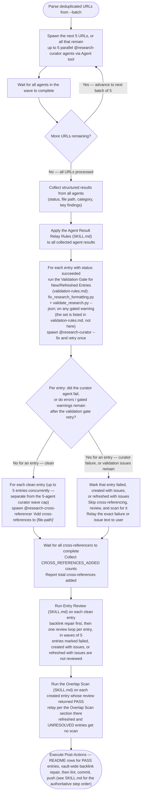

# Batch Mode Workflow

Processing multiple URLs in parallel via `--batch`. URL parsing and the wave spine are in `SKILL.md`'s Batch Mode section.

---

## Wave Spawning

The following diagram is the authoritative procedure for batch wave spawning. Execute steps in the exact order shown, including branches, decision points, and stop conditions.

```mermaid
flowchart TD
    Start(["Parse deduplicated URLs from --batch"]) --> Wave["Spawn the next 5 URLs, or all that remain<br>up to 5 parallel @research-curator agents via Agent tool"]
    Wave --> WaveDone["Wait for all agents in the wave to complete"]
    WaveDone --> QMore{"More URLs remaining?"}
    QMore -->|"Yes — advance to next batch of 5"| Wave
    QMore -->|"No — all URLs processed"| Collect["Collect structured results from all agents<br>(status, file path, category, key findings)"]
    Collect --> RelayCheck["Apply the Agent Result Relay Rules (SKILL.md)<br>to all collected agent results"]
    RelayCheck --> Gate["For each entry with status: succeeded<br>run the Validation Gate for New/Refreshed Entries<br>(validation-rules.md): fix_research_formatting.py<br>+ validate_research.py --json; on any gated warning<br>(the set is listed in validation-rules.md, not here)<br>spawn @research-curator --fix and retry once"]
    Gate --> Results{"Per entry: did the curator agent fail,<br>or do errors / gated warnings remain<br>after the validation gate retry?"}
    Results -->|"No for an entry — clean"| SpawnXref["For each clean entry (up to 5 entries concurrently —<br>separate from the 5-agent curator wave cap)<br>spawn @research-cross-referencer 'Add cross-references to {file-path}'"]
    Results -->|"Yes for an entry — curator failure, or validation issues remain"| SkipPartial["Mark that entry failed, created with issues,<br>or refreshed with issues<br>Skip cross-referencing, review, and scan for it<br>Relay the exact failure or issue text to user"]
    SpawnXref --> WaitXref["Wait for all cross-referencers to complete<br>Collect CROSS_REFERENCES_ADDED counts<br>Report total cross-references added"]
    SkipPartial --> WaitXref
    WaitXref --> Review["Run Entry Review (SKILL.md) on each clean entry<br>backlink repair first, then one review loop per entry, in waves of 5<br>entries marked failed, created with issues, or refreshed with issues are not reviewed"]
    Review --> Scan["Run the Overlap Scan (SKILL.md) on each created entry whose review returned PASS<br>relay per the Overlap Scan section there<br>refreshed and UNRESOLVED entries get no scan"]
    Scan --> PostActions(["Execute Post-Actions — README rows for PASS entries, vault-wide backlink repair, then lint, commit, push (see SKILL.md for the authoritative step order)"])
```

---

## Error Handling

- **Individual failure**: Log the error, continue with remaining URLs. Do not abort the batch.
- **Agent timeout or failure**: follow [Failure Recovery](#failure-recovery) before marking the URL failed.
- **Duplicate detection**: see [Duplicate Detection](./duplicate-detection.md) — applied before spawning, per URL.

---

## Failure Recovery

Applies to Default, Batch and Rerun modes, which spawn `@research-curator` for an entry; each links
here. Validate Mode's `--fix` agents are not covered: a failed fix agent leaves its entry's validator
errors in place, and the report lists them as unfixed. A failed or timed-out agent may have written a
usable entry, and a wave whose agents all hit one cause wastes every later wave on that cause.

1. **Check for partial output first.** Compare `git status --porcelain --untracked-files=all -- ./research/`
   against the pre-mode baseline, and attribute a file to the failed agent only when its `source_url`
   frontmatter field matches that agent's URL (or it is the `--rerun` target). Concurrent agents in a wave write
   concurrently, so an unmatched new file belongs to no failed agent. For an attributed file, run the
   Validation Gate on it instead of discarding it. A `--rerun` target whose `git hash-object` equals the baseline hash still
   holds the old content (status alone cannot show this for a path already dirty): treat that as a failed refresh, and skip validation,
   cross-referencing, and review for it. A clean recovered file continues exactly as a successful agent's result would, with
   the recovery supplying the missing status (created or refreshed): Default mode at step 6, Batch and
   Rerun at cross-referencing. Cross-referencing and Entry Review still run, so a structurally valid
   but incomplete entry is reviewed. A file with issues is marked "created with
   issues" or "refreshed with issues".
2. **Re-run once, only when no attributed file exists.** Re-spawn that URL's agent a single time with the
   same prompt. If the failure reported unreachable sources, name them in the prompt; after a result-less
   timeout nothing was reported, so re-run unchanged. A second failure is final: relay the exact reason.
3. **Stop the waves on a shared cause.** When every agent in a wave returned the same access failure
   (the same HTTP status, rate limit, or missing MCP tool), do not spawn the next wave. Report the
   shared reason and the URLs not attempted, so the user can fix the cause once.
4. **MCP tool outage.** The agent file's source-access fallback chain applies inside each agent; the
   orchestrator does not retry a fallback the agent already reported as exhausted.
5. **Incomplete upstream documentation** is not a failure. The entry records the gap as "Not mentioned
   in documentation" per [Entry Quality Standards](./entry-quality-standards.md), and the validation
   gate decides whether it passes.
