# Research Entry Template

Standard format for all research entries in `./research/`.

---

## Category Selection

```mermaid
flowchart TD
    Start([Classify resource]) --> Q1{Primary function?}
    Q1 -->|Multi-agent orchestration| RAP[research-agent-patterns/]
    Q1 -->|Creates AI skills/prompts| SGT[skill-generation-tools/]
    Q1 -->|Prompt optimization/testing| PE[prompt-engineering/]
    Q1 -->|Memory, RAG, context window| CM[context-management/]
    Q1 -->|MCP server or integration| MCP[mcp-ecosystem/]
    Q1 -->|Agent SDK or framework| AF[agent-frameworks/]
    Q1 -->|Agent evaluation/benchmarking| ET[evaluation-testing/]
    Q1 -->|Developer productivity tool| DT[developer-tools/]
    Q1 -->|Async/concurrency library| AL[async-libraries/]
    Q1 -->|Infrastructure for agents at scale| AI[agent-infrastructure/]
    Q1 -->|API/web framework| APF[api-frameworks/]
    Q1 -->|LLM observability/debugging| AO[ai-observability/]
    Q1 -->|Code security/auditing| CA[code-auditing/]
    Q1 -->|Autonomous coding agent| COD[coding-agents/]
    Q1 -->|Real-time data platform| DI[data-infrastructure/]
    Q1 -->|ML compute/model serving| ML[ml-infrastructure/]
    Q1 -->|Alternative Python runtime| PR[python-runtimes/]
    Q1 -->|Rust-Python bindings| RPB[rust-python-bindings/]
    Q1 -->|Task management for dev| TM[task-management/]
    Q1 -->|Documentation tooling| DOC[documentation-tools/]
    Q1 -->|LLM infra/serving| LLM[llm-infrastructure/]
    Q1 -->|Low-code/no-code platform| LC[low-code-platforms/]
    Q1 -->|AI design tools| ADT[ai-design-tools/]
    Q1 -->|AI research tools| ART[ai-research-tools/]
    Q1 -->|AI writing tools| AWT[ai-writing-tools/]
    Q1 -->|None fit| NEW[Create new category directory]
```



Create the category directory if it does not exist.

---

## Entry File Template

File location: `./research/{category}/{resource-name}.md`

````markdown
---
name: {resource-name-slug}
title: {Official resource name}
subtitle: {What a reader finds inside — the key capability, finding, or differentiator, in 5-10 words}
research_date: YYYY-MM-DD
source_url: https://...
github_repository: https://github.com/... # if applicable
version_at_research: vX.Y.Z
license: {License type}
freshness_tracking:
  last_verified: YYYY-MM-DD
  version_at_verification: vX.Y.Z
  next_review: YYYY-MM-DD
  confidence_map: "section: level (qualifier)"
---

# {Resource Name}

## Overview

2-3 sentence description of the resource, its purpose, and primary value proposition.

---

## Problem Addressed

| Problem | Solution |
|---------|----------|
| {Problem 1} | {How this resource solves it} |
| {Problem 2} | {How this resource solves it} |

---

## Key Features

### {Feature Category 1}

- Feature detail with technical specifics
- Feature detail with technical specifics

### {Feature Category 2}

- Feature detail with technical specifics

---

## Technical Architecture

How the resource works internally. Include diagrams if helpful.

---

## Installation & Usage

```bash
# Installation command
```

```python
# Usage example
```

---

## Relevance to Claude Code Development

### Applications

- How this applies to our work

### Patterns Worth Adopting

- Patterns from this resource we could use

### Integration Opportunities

- How we could integrate this with Claude Code

---

## References

- [{Source Name}]({URL}) (accessed YYYY-MM-DD)
- [{Source Name}]({URL}) (accessed YYYY-MM-DD)

---

## Cross-References

| Entry | Category | Relationship |
|-------|----------|--------------|
| [Resource Name](../category/filename.md) | category-name | {one-phrase relationship} |
````

> **Confidence qualifiers**: When a section's claims derive from code analysis rather than
> documentation, append `(code-read)` to the confidence level — e.g., `Architecture: medium
> (code-read)`. This distinguishes entries where architectural claims come from source code
> inspection (verifiable but potentially incomplete) versus official documentation (authoritative
> but potentially outdated). Sections with mixed sources use the lower confidence level and
> note both qualifiers: `Architecture: medium (doc + code-read)`.

> **Architecture section citations**: When Technical Architecture or Key Features items derive
> from code analysis, cite the source inline using the format:
> `Source: {relative-path} — {exported-name}`
>
> Examples:
>
> - `Source: src/core/engine.py — class TaskEngine`
> - `Source: src/api/routes.py — register_routes()`
> - `Source: proto/schema.proto — message EventPayload`
>
> When multiple code files corroborate a single architectural claim, list sources comma-separated:
> `Source: src/core/engine.py — class TaskEngine, src/core/graph.py — class DependencyGraph`

> **Note**: `## Cross-References` is populated by `@research-cross-referencer` (forward rows) and
> `@research-backlink-detector` (reciprocal rows); add it by hand for a manually created entry.
> Row shape, placement anchor, relative-path rules and the relationship-phrase bar:
> [Cross-Reference Format](./cross-reference-format.md).

> **Note**: `freshness_tracking.next_review` informs scheduling; it never gates anything. An
> explicit re-research request — `--rerun`, `--batch` URL resubmission, or `--all` — proceeds
> regardless of this date.

---

## Setting Next Review

Default to 3 months from the research date — a conservative baseline for stable or slow-moving
projects. Calibrate to the resource's observed release cadence: a repository with frequent
major/minor releases or active breaking API changes warrants 4–6 weeks instead.
