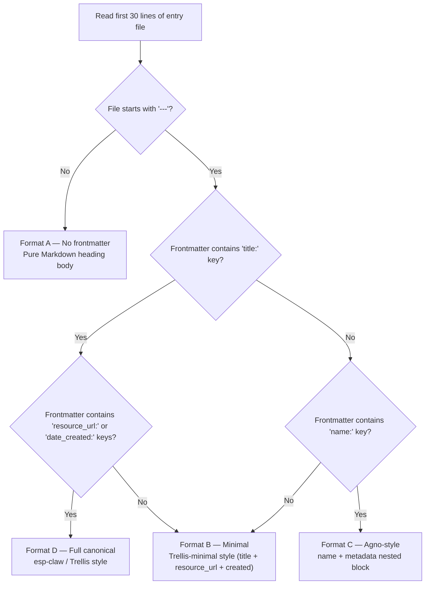
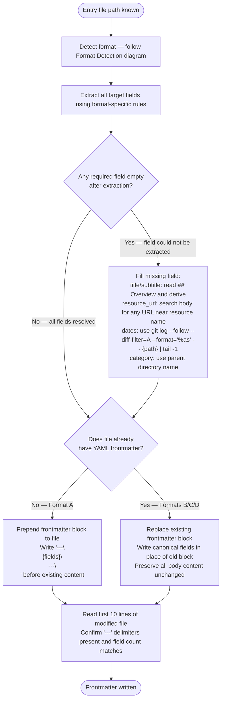
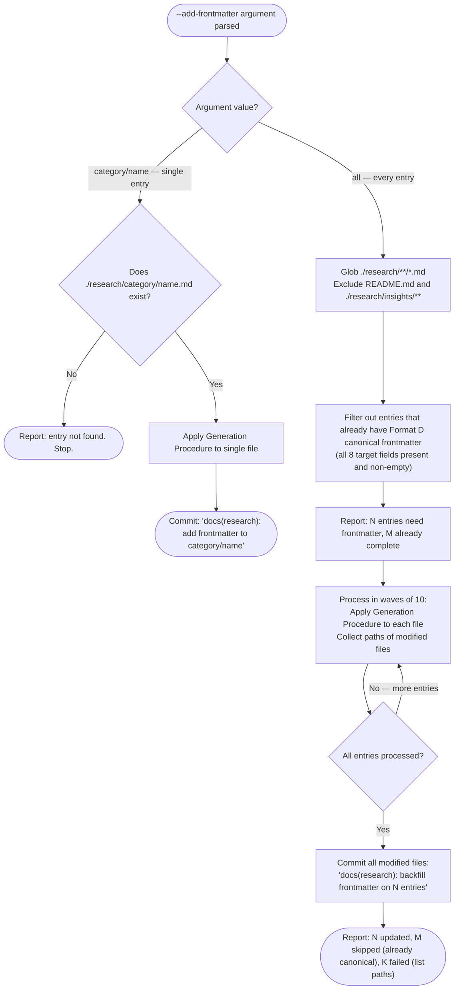

# Frontmatter Generation

Canonical YAML frontmatter schema for all research entries, extraction rules from every observed existing format, and the procedure for generating or backfilling frontmatter on any entry.

---

## Canonical Schema

Every research entry file must begin with this YAML frontmatter block:

```yaml
---
title: "{Resource Name}"
subtitle: "{One-phrase description of what it is}"
category: "{directory-name}"
resource_url: "{primary homepage or source URL}"
github_url: "{GitHub repository URL}"
date_created: "YYYY-MM-DD"
date_last_reviewed: "YYYY-MM-DD"
status: "published"
---
```

Field rules:

- `title`: Official name of the resource, no version suffix
- `subtitle`: One short phrase — what the resource *is*, not what it *does*. 5–10 words max.
- `category`: The parent directory name as-is (e.g., `agent-frameworks`, `mcp-ecosystem`)
- `resource_url`: The primary URL listed in the entry — homepage preferred, GitHub if no homepage
- `github_url`: GitHub repository URL. Omit field entirely when absent from the entry.
- `date_created`: Date the research entry was first written
- `date_last_reviewed`: Date of the most recent content verification
- `status`: Always `published` for completed entries

---

## Format Detection

Before extracting fields, detect which of the four formats the entry uses:



---

## Field Extraction by Format

### Format A — No frontmatter (Markdown heading body)

| Target field | Extraction source |
|---|---|
| `title` | Content of first `# {Title}` heading — strip leading `# ` |
| `subtitle` | First sentence of `## Overview` section body (up to first period) |
| `category` | Parent directory name from file path |
| `resource_url` | `**Source URL**: <url>` body pattern — extract URL from angle brackets or bare value |
| `github_url` | `**GitHub Repository**: <url>` pattern — extract URL; omit if absent |
| `date_created` | `**Research Date**: YYYY-MM-DD` pattern in header block; fallback: git log first-commit date |
| `date_last_reviewed` | `Last Verified \| YYYY-MM-DD` row in Freshness Tracking table; fallback: same as `date_created` |
| `status` | Always `published` |

### Format B — Minimal frontmatter (Trellis style)

| Target field | Source key(s) |
|---|---|
| `title` | `title:` |
| `subtitle` | `title:` value after em-dash if present; otherwise first sentence of `## Overview` |
| `category` | `category:` key; fallback: parent directory name |
| `resource_url` | `resource_url:` |
| `github_url` | Infer from `resource_url:` if it is a `github.com` URL; otherwise look for `**Repository**: <url>` in body; omit if absent |
| `date_created` | `created:` |
| `date_last_reviewed` | `last_reviewed:` |
| `status` | `status:` key if present; default `published` |

### Format C — Agno nested metadata

| Target field | Source key path |
|---|---|
| `title` | `name:` top-level key |
| `subtitle` | `description:` — truncate at first period or 80 chars, whichever is shorter |
| `category` | `metadata.category:` key; fallback: parent directory name |
| `resource_url` | `metadata.source_url:` |
| `github_url` | `metadata.github:` — prefix with `https://github.com/` if value has no scheme |
| `date_created` | `metadata.verified:` (earliest available proxy) |
| `date_last_reviewed` | `metadata.verified:` |
| `status` | Always `published` |

### Format D — Full canonical (already has matching fields)

Reuse existing values. Normalize field names if needed (e.g., `created:` → `date_created:`). Do not regenerate fields that are already correct.

---

## Generation Procedure

Apply to a single entry file — use this whether creating frontmatter for a new entry or updating an existing one.



### Writing the frontmatter block

Write only fields that have non-empty values. Always include `title`, `category`, `resource_url`, `date_created`, `date_last_reviewed`, `status`. Include `subtitle` when extractable. Omit `github_url` when absent — do not write `github_url: ""`.

---

## Standalone Backfill Procedure (`--add-frontmatter`)

Use when the SKILL.md `--add-frontmatter` mode is invoked. Targets one entry or all entries in the vault.



### Skipping logic

Skip an entry during `--all` backfill if its frontmatter already contains all of these fields with non-empty values: `title`, `category`, `resource_url`, `date_created`, `date_last_reviewed`, `status`. Partial frontmatter (missing any field) is not skipped — it is upgraded to canonical.

---

## Integration Points

- **Default mode**: After `@research-curator` agent returns the new entry path, apply the Generation Procedure to that file before spawning the four concurrent post-creation tasks.
- **Rerun mode**: After `@research-curator` agent updates an existing entry, apply the Generation Procedure to refresh `date_last_reviewed` and ensure canonical format.
- **Standalone**: `--add-frontmatter category/name` or `--add-frontmatter all` follows the Standalone Backfill Procedure above.
