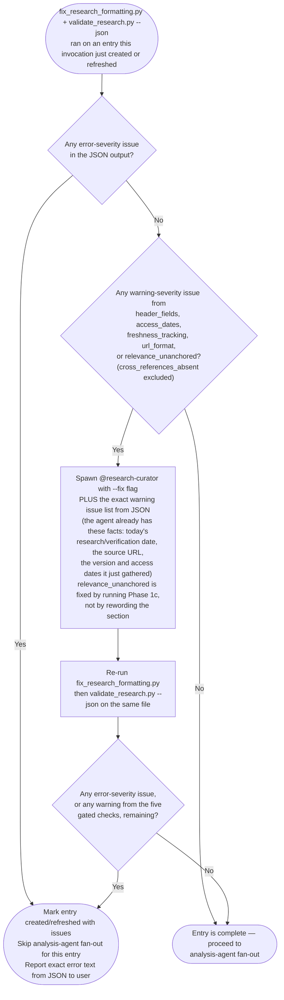

# Validation Rules

Checks performed by `./scripts/validate_research.py` and severity mapping for the `/research-curator` skill. Severity in the JSON output is fixed and mode-independent; *handling* differs by mode — [Validation Gate for New/Refreshed Entries](#validation-gate-for-newrefreshed-entries) below for an entry a `@research-curator` agent just created or rewrote this invocation, Validate Mode's Issue Handling in `SKILL.md` for pre-existing entries.

---

## Check Definitions

### Error Severity (must fix)

- **section_completeness**: All required `##`-level sections must exist. The authoritative list is `REQUIRED_BODY_SECTIONS` (plus `_REQUIRED_SECTIONS_TEXT_HEADER_ONLY` for legacy text-header entries) in `validate_research.py`; the same sections appear in `entry-template.md`'s Entry File Template. Header fields (Research Date, Source URL, etc.) are checked separately via **header_fields**.
- **empty_sections**: Section heading exists but contains no content below it before the next heading

### Warning Severity (should fix)

- **header_fields**: Header block must contain Research Date, Source URL, Version at Research, License
- **access_dates**: Every URL in the References section must have an access date in format `(accessed YYYY-MM-DD)` or `(YYYY-MM-DD)`
- **freshness_tracking**: Freshness Tracking section must contain Last Verified, Version at Verification, Next Review Recommended fields
- **url_format**: All URLs must be valid `http://` or `https://` format
- **cross_references_absent**: Entry does not contain a `## Cross-References` section. Expected for entries created or last verified on or after 2026-03-12. Entries with Research Date or Last Verified before this date are exempt. Gated on the Research Date or Last Verified field value in `validate_research.py`'s `_check_cross_references`.
- **relevance_unanchored**: The `Relevance to Claude Code Development` section cites no backticked repo-relative path under `plugins/`, `.claude/`, `rules/`, `docs/`, or `AGENTS.md`, and no `git grep` command. Every item in that section comes from a Phase 1c anchor ([Extraction Methodology](./extraction-methodology.md)), which is a path plus a quoted line or a search plus its result, so a section with neither did not run the pass. Detects the skip only; whether the anchors are sound is Gate 4 and Gate 5 of [Entry Review Rubric](./entry-review-rubric.md). Gated on the Research Date or Last Verified value against `RELEVANCE_ANCHOR_EXEMPT_BEFORE` in `validate_research.py`, by the same mechanism as `cross_references_absent`: entries dated before the cutoff predate Phase 1c and are exempt.
- **relevance_anchor_path_missing**: A backticked repo path in the `Relevance to Claude Code Development` section does not resolve in the checkout. `relevance_unanchored` tests shape only, and shape alone is satisfied by a plausible-looking path nobody opened — which makes naming an invented file the cheapest way to clear that gate, the fabrication Phase 1c exists to remove. Every path in a real anchor record came from a `git grep` hit, so it resolves. **No date exemption**: predating Phase 1c excuses an entry from carrying anchors, not from citing a file that is not here. Globs and template placeholders (`*`, `?`, `[`, `{`) are shapes rather than files and are skipped.
- **relevance_anchor_paths_unchecked**: The section cites repo paths but no `.git` was found above the entry, so `relevance_anchor_path_missing` could not run. Reported rather than passed silently — a check that did not run is not a check that came back clean ([Silent Failure Prevention](rules/silent-failure-prevention.md)). Run the validator inside the checkout.

> **Handling differs by mode, not by severity.** `header_fields`, `access_dates`, `freshness_tracking`, `url_format`, `relevance_unanchored`, and `relevance_anchor_path_missing` stay warning-severity in the JSON output no matter who calls the script. For an entry that Default Mode, Batch Mode, or Rerun Mode created or refreshed *this invocation*, these are must-fix before the entry is reported complete — see [Validation Gate for New/Refreshed Entries](#validation-gate-for-newrefreshed-entries) below. An entry this invocation wrote has no excuse for an unanchored Relevance section: Phase 1c is unconditional. `cross_references_absent` is excluded from this must-fix rule; its own date-based exemption above is unaffected. For pre-existing entries that Validate Mode scans, all remain report-only, per Validate Mode's Issue Handling in `SKILL.md`.
>
> **Rerun Mode is included deliberately, and this is what it costs.** A refresh updates Last Verified, which puts the entry on the gated side of `RELEVANCE_ANCHOR_EXEMPT_BEFORE`, so refreshing a corpus entry that has never carried anchors makes `relevance_unanchored` a must-fix for that refresh. That is not an accident of the cutoff: Rerun Mode's own graph runs ReAnchor on every pass, so an entry that comes out of a refresh still unanchored is a skipped ReAnchor, not a legacy artifact. The consequence to expect: the first refresh of an unanchored entry does Phase 1c work it has never done, and if that work is skipped the orchestrator marks the entry refreshed with issues and skips the analysis fan-out for it.

### Info Severity (optional)

- **formatting_suggestions**: Minor markdown formatting issues (missing blank lines around fences, inconsistent heading levels)

---

## Validation Gate for New/Refreshed Entries

Applies only when Default Mode, Batch Mode, or Rerun Mode is the reason an entry file exists in its current form this invocation — a `@research-curator` agent just created or rewrote it. Does not apply to Validate Mode scanning entries this invocation did not itself write; those follow the lighter report-only handling in Validate Mode's Issue Handling (`SKILL.md`).

This is the authoritative procedure for what the orchestrator does with the `fix_research_formatting.py` + `validate_research.py --json` output on such a file:

Reaching `MarkIssues` after the retry means a genuinely un-fillable field — report it as an issue on the entry rather than accepting it as a warning to leave open.
