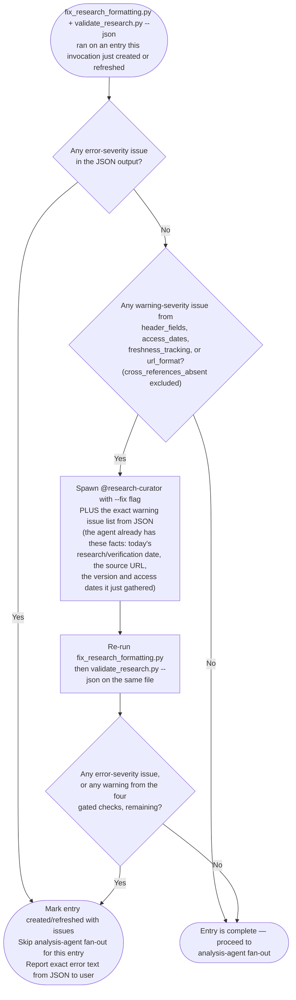
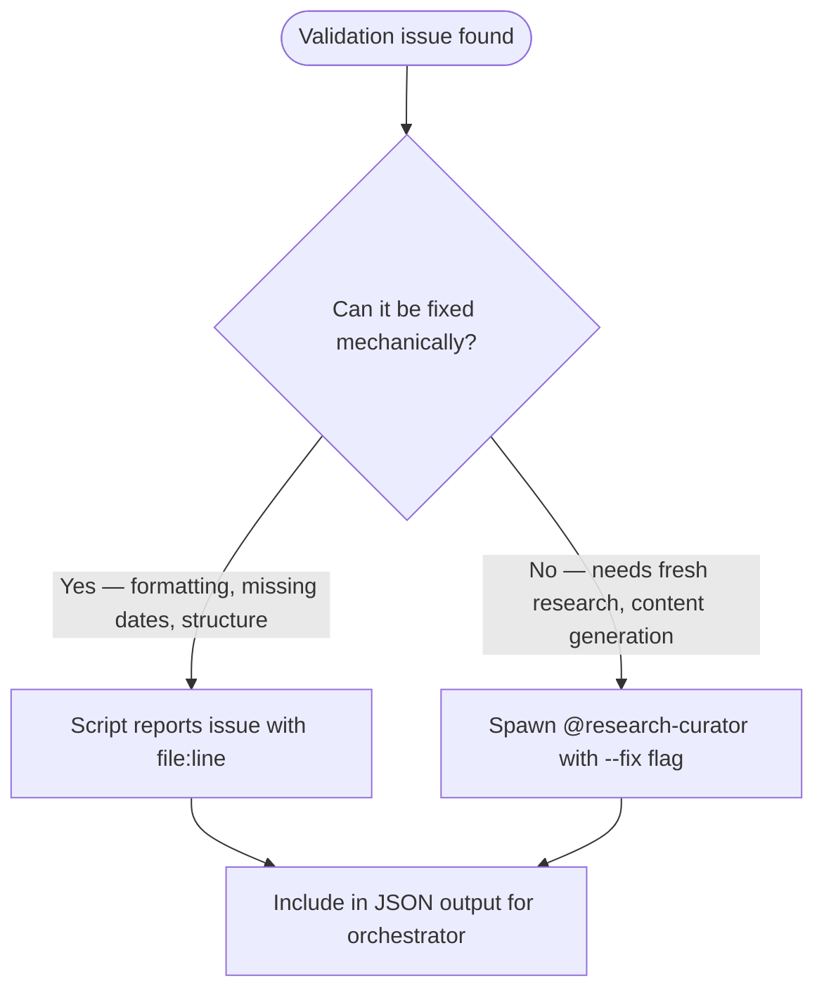

# Validation Rules

Checks performed by `./scripts/validate_research.py` and severity mapping for the `/research-curator` skill. The severity levels (error/warning/info) are a fixed reporting schema in the script's JSON output — the script itself does not know or care which mode is calling it. What differs by mode is *handling* of that JSON output: see [Validation Gate for New/Refreshed Entries](#validation-gate-for-newrefreshed-entries) below for Default Mode, Batch Mode, and Rerun Mode (the entry file was just created or rewritten by a `@research-curator` agent this invocation); see Validate Mode's Issue Handling section in `SKILL.md` for pre-existing entries an invocation did not itself touch.

---

## Check Definitions

### Error Severity (must fix)

- **section_completeness**: All required `##`-level sections (defined in `entry-template.md`'s Entry File Template) must exist — Overview, Problem Addressed, Key Features, Technical Architecture, Installation & Usage, Relevance to Claude Code Development, References, Freshness Tracking. Header fields (Research Date, Source URL, etc.) are checked separately via **header_fields**.
- **empty_sections**: Section heading exists but contains no content below it before the next heading

### Warning Severity (should fix)

- **header_fields**: Header block must contain Research Date, Source URL, Version at Research, License
- **access_dates**: Every URL in the References section must have an access date in format `(accessed YYYY-MM-DD)` or `(YYYY-MM-DD)`
- **freshness_tracking**: Freshness Tracking section must contain Last Verified, Version at Verification, Next Review Recommended fields
- **url_format**: All URLs must be valid `http://` or `https://` format
- **cross_references_absent**: Entry does not contain a `## Cross-References` section. Expected for entries created or last verified on or after 2026-03-12. Entries with Research Date or Last Verified before this date are exempt. Gated on the Research Date or Last Verified field value in `validate_research.py`'s `_check_cross_references`.

> **Handling differs by mode, not by severity.** `header_fields`, `access_dates`, `freshness_tracking`, and `url_format` stay warning-severity in the JSON output no matter who calls the script. But for an entry that Default Mode, Batch Mode, or Rerun Mode just created or refreshed *this invocation*, these four are must-fix before the entry is reported complete — the researching agent already holds every fact they need (today's research/verification date, the source URL it was given, the version and access dates it just gathered), so there is no legitimate reason to leave them open on output the agent itself just produced. See [Validation Gate for New/Refreshed Entries](#validation-gate-for-newrefreshed-entries) below. `cross_references_absent` is explicitly excluded from this must-fix rule — its own date-based exemption above is unrelated and unaffected. For pre-existing entries that Validate Mode scans without this invocation having written them, all four checks remain report-only, per Validate Mode's Issue Handling in `SKILL.md`.

### Info Severity (optional)

- **formatting_suggestions**: Minor markdown formatting issues (missing blank lines around fences, inconsistent heading levels)

---

## Validation Gate for New/Refreshed Entries

Applies only when Default Mode, Batch Mode, or Rerun Mode is the reason an entry file exists in its current form this invocation — a `@research-curator` agent just created or rewrote it. Does not apply to Validate Mode scanning entries this invocation did not itself write; those follow the lighter report-only handling in Validate Mode's Issue Handling (`SKILL.md`).

This is the authoritative procedure for what the orchestrator does with the `fix_research_formatting.py` + `validate_research.py --json` output on such a file:



The retry is expected to always resolve these four checks, since the researching agent already gathered every fact needed to satisfy them. Reaching `MarkIssues` after the retry means a genuinely un-fillable field — report it as an issue on the entry rather than silently accepting it as an acceptable warning to leave open.

---

## Script vs Agent Responsibility



**Script handles detection only** — it identifies issues and reports them with file path, line number, severity, and message.

**Agent handles fixes** that require:

- Writing missing section content
- Updating stale references with current URLs
- Refreshing version numbers from upstream

**Orchestrator decides** which issues to auto-fix vs report to user based on severity.

---

## JSON Output Schema

This schema (`check`, `severity`, `message`, `line`) is identical regardless of which mode invoked the script — `validate_research.py` has no mode awareness. Only the orchestrator's handling of warning-severity issues differs by mode, per [Validation Gate for New/Refreshed Entries](#validation-gate-for-newrefreshed-entries) above.

```json
{
  "summary": {
    "total": "number of entries scanned",
    "passed": "entries with zero errors",
    "errors": "total error-severity issues",
    "warnings": "total warning-severity issues",
    "info": "total info-severity observations"
  },
  "entries": [
    {
      "file": "category/filename.md (relative to research/)",
      "status": "pass | fail",
      "issues": [
        {
          "check": "check name from definitions above",
          "severity": "error | warning | info",
          "message": "human-readable description",
          "line": "line number or null"
        }
      ]
    }
  ]
}
```
