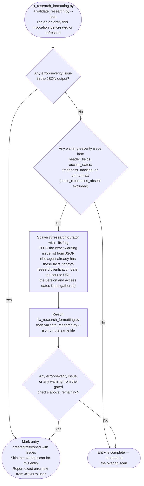

# Validation Rules

Checks performed by `./scripts/validate_research.py` and severity mapping for the `/research-curator` skill. The JSON is `{summary, entries[{file, format, status, issues[{check, severity, message, line}]}]}`, keyed by entry; severity is `error` or `warning` only. Severity is fixed and mode-independent; *handling* differs by mode — [Validation Gate for New/Refreshed Entries](#validation-gate-for-newrefreshed-entries) below for an entry a `@research-curator` agent just created or rewrote this invocation, Validate Mode's Issue Handling in `SKILL.md` for pre-existing entries.

---

## Check Definitions

### Error Severity (must fix)

- **section_completeness**: All required `##`-level sections must exist. The authoritative list is `REQUIRED_BODY_SECTIONS` (plus `_REQUIRED_SECTIONS_TEXT_HEADER_ONLY` for legacy text-header entries) in `validate_research.py`; the sections match `entry-template.md`'s Entry File Template except Limitations and Caveats and Cross-References, which the template carries and the validator does not require. Header fields (Research Date, Source URL, etc.) are checked separately via **header_fields**. The validator does not check `confidence_map` or Limitations and Caveats; the review rubric does (Gate 2 Rule 4, Gate 3).
- **empty_sections**: Section heading exists but contains no content below it before the next heading. A validator issue against a pre-existing `## Relevance to Claude Code Development` section is reported and not fixed, and does not fail the entry; that section is inert (see `entry-quality-standards.md` `## Scope`).

Not entries, excluded by the validator: `README.md`, `CLAUDE.md`, `AGENTS.md`, and any file under an `insights`, `utilization`, or `design-notes` directory.

### Warning Severity (should fix)

- **header_fields**: Header block must contain Research Date, Source URL, Version at Research, License
- **access_dates**: Every URL in the References section must have an access date in format `accessed YYYY-MM-DD` or `(YYYY-MM-DD)`
- **freshness_tracking**: Freshness Tracking section must contain Last Verified, Version at Verification, Next Review Recommended fields
- **url_format**: Flags a bare `www.` URL that lacks an `http://` or `https://` scheme; other schemes are not checked
- **cross_references_absent**: Entry does not contain a `## Cross-References` section. Expected for entries created or last verified on or after 2026-03-12. Entries with Research Date or Last Verified before this date are exempt. Gated on the Research Date or Last Verified field value in `validate_research.py`'s `check_cross_references`.

> **Handling differs by mode, not by severity.** `header_fields`, `access_dates`, `freshness_tracking`, and `url_format` stay warning-severity in the JSON output no matter who calls the script. For an entry that Default Mode, Batch Mode, or Rerun Mode created or refreshed *this invocation*, these are must-fix before the entry is reported complete — see [Validation Gate for New/Refreshed Entries](#validation-gate-for-newrefreshed-entries) below. `cross_references_absent` is excluded from this must-fix rule; its own date-based exemption above is unaffected. For pre-existing entries that Validate Mode scans, all remain report-only, per Validate Mode's Issue Handling in `SKILL.md`.
>
> Rerun Mode is gated like Default and Batch Mode: the four warning checks above are must-fix for a refreshed entry.

---

## Validation Gate for New/Refreshed Entries

Applies only when Default Mode, Batch Mode, or Rerun Mode is the reason an entry file exists in its current form this invocation — a `@research-curator` agent just created or rewrote it. Does not apply to Validate Mode scanning entries this invocation did not itself write; those follow the lighter report-only handling in Validate Mode's Issue Handling (`SKILL.md`).

This is the authoritative procedure for what the orchestrator does with the `fix_research_formatting.py` + `validate_research.py --json` output on such a file:

```mermaid
flowchart TD
    Start(["fix_research_formatting.py + validate_research.py --json<br>ran on an entry this invocation just created or refreshed"]) --> HasErr{"Any error-severity issue<br>in the JSON output?"}
    HasErr -->|"Yes"| MarkIssues(["Mark entry created/refreshed with issues<br>Skip the overlap scan for this entry<br>Report exact error text from JSON to user"])
    HasErr -->|"No"| HasGatedWarn{"Any warning-severity issue from<br>header_fields, access_dates,<br>freshness_tracking, or url_format?<br>(cross_references_absent excluded)"}
    HasGatedWarn -->|"No"| Proceed(["Entry is complete — proceed to<br>the overlap scan"])
    HasGatedWarn -->|"Yes"| SpawnFix["Spawn @research-curator with --fix flag<br>PLUS the exact warning issue list from JSON<br>(the agent already has these facts: today's<br>research/verification date, the source URL,<br>the version and access dates it just gathered)"]
    SpawnFix --> Rerun["Re-run fix_research_formatting.py<br>then validate_research.py --json on the same file"]
    Rerun --> HasErr2{"Any error-severity issue,<br>or any warning from the gated<br>checks above, remaining?"}
    HasErr2 -->|"Yes"| MarkIssues
    HasErr2 -->|"No"| Proceed
```

Reaching `MarkIssues` after the retry means a genuinely un-fillable field — report it as an issue on the entry rather than accepting it as a warning to leave open.
