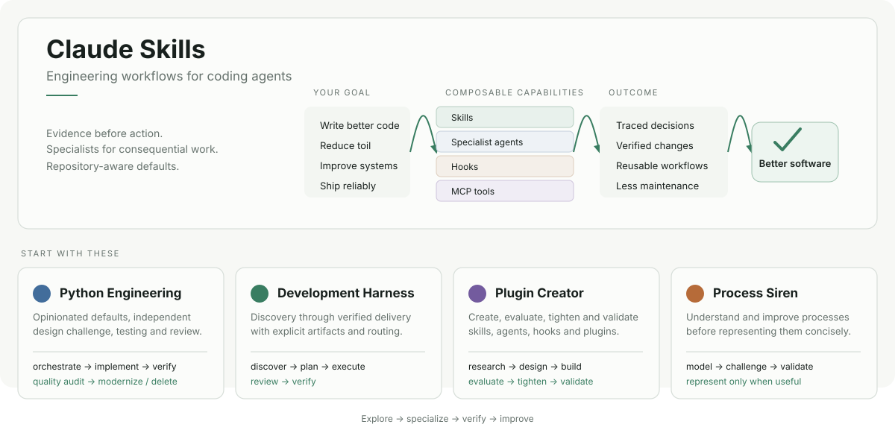

<p align="center">
  
</p>

# Claude Skills

A marketplace of opinionated Agent Skills, specialist agents, hooks, and engineering workflows for Claude Code.

The collection is built around a simple idea: **agents should follow the engineering process of the repository they are working in, gather evidence before acting, and use specialists when the problem deserves them.**

## Quick start

```bash
/plugin marketplace add Jamie-BitFlight/claude_skills

# Python engineering
/plugin install python-engineering@jamie-bitflight-skills

# Language-agnostic development workflow
/plugin install dh@jamie-bitflight-skills
```

Browse the [marketplace manifest](./.claude-plugin/marketplace.json) or install one of the systems below.

## Start with these

### Python Engineering

[python-engineering](./plugins/python-engineering) is an opinionated Python engineering system for coding agents.

It provides strong defaults for typing, testing, CLI design, architecture, linting and packaging while preserving coherent existing project conventions. Its implementation workflow independently challenges shallow plans before code is written.

```text
/python-engineering:orchestrate "Add a CLI command that processes CSV files"
```

It also includes a read-only quality/modernization audit that fans out independent investigators:

```text
/python-engineering:python-quality-audit PR
/python-engineering:python-quality-audit staged
/python-engineering:python-quality-audit src/
```

The audit asks what smells, what can be deleted, what modern Python can simplify, what maintained libraries can replace local machinery, and how substantial Python projects solve the same demonstrated problems.

[Read the Python Engineering guide →](./plugins/python-engineering/README.md)

### Development Harness

[development-harness](./plugins/development-harness) provides the language-independent development lifecycle: discovery, planning, decomposition, execution, review and verification. Language plugins such as Python Engineering supply the specialist implementation rules.

Install name: `dh`.

### Plugin Creator

[plugin-creator](./plugins/plugin-creator) contains the repository's tooling and methodology for creating, evaluating, tightening and validating Agent Skills, agents and plugins.

### Process Siren

[process-siren](./plugins/process-siren) improves processes before representing them. It includes evidence-driven process improvement, adaptive resolution and Mermaid process modelling.

## Plugin catalogue

### Engineering systems

| Plugin | Install name | Purpose |
| --- | --- | --- |
| [Python Engineering](./plugins/python-engineering) | `python-engineering` | Opinionated Python implementation, testing, review, modernization and quality audit |
| [Development Harness](./plugins/development-harness) | `dh` | Language-independent feature/development lifecycle and orchestration |
| [Bash Development](./plugins/bash-development) | `bash-development` | Robust Bash development and auditing |
| [Perl Development](./plugins/perl-development) | `perl-development` | Modern Perl development, testing and CPAN integration |
| [Plugin Creator](./plugins/plugin-creator) | `plugin-creator` | Create, evaluate, refactor and validate Agent Skills/plugins |
| [FastMCP Creator](./plugins/fastmcp-creator) | `fastmcp-creator` | Build and test FastMCP servers |
| [Holistic Linting](./plugins/holistic-linting) | `holistic-linting` | Resolve lint/type failures at their root cause |
| [Process Siren](./plugins/process-siren) | `process-siren` | Process improvement and precise process modelling |
| [The Rewrite Room](./plugins/the-rewrite-room) | `rwr` | Documentation audit, synchronization and authoring |
| [GitLab](./plugins/gitlab-skill) | `gitlab-skill` | GitLab CI/CD semantics and workflows |

### Agent reliability and orchestration

| Plugin | Install name | Purpose |
| --- | --- | --- |
| [Agent Orchestration](./plugins/agent-orchestration) | `agent-orchestration` | Fan-out, maker/checker, delegation and parallel-work patterns |
| [Verification Gate](./plugins/verification-gate) | `verification-gate` | Verify hypotheses against targets before writes |
| [Scientific Method](./plugins/scientific-method) | `scientific-method` | Hypothesis-driven investigation and debugging |
| [Orchestrator Discipline](./plugins/orchestrator-discipline) | `orchestrator-discipline` | Keep orchestration contexts from turning into implementation contexts |
| [AgentSkill Kaizen](./plugins/agentskill-kaizen) | `agentskill-kaizen` | Mine session transcripts for repeated agent/process failures |
| [Summarizer](./plugins/summarizer) | `summarizer` | Evidence-conscious summarization workflows |

### Focused tools and knowledge

| Plugin | Install name | Purpose |
| --- | --- | --- |
| [Conventional Commits](./plugins/conventional-commits) | `conventional-commits` | Consistent semantic commit messages |
| [Commitlint](./plugins/commitlint) | `commitlint` | Commit-message validation |
| [clang-format](./plugins/clang-format) | `clang-format-configuration` | Infer and preserve an existing C/C++ formatting style |
| [dasel](./plugins/dasel) | `dasel` | Structured-data query/transformation workflows |
| [xdg-base-directory](./plugins/xdg-base-directory) | `xdg-base-directory` | Cross-platform application config/data locations |
| [LiteLLM](./plugins/litellm) | `litellm` | LiteLLM integration guidance |
| [llamafile](./plugins/llamafile) | `llamafile` | Local model/llamafile workflows |
| [Twelve-Factor App](./plugins/twelve-factor-app) | `twelve-factor-app` | Twelve-factor architecture guidance |
| [Brainstorming](./plugins/brainstorming-skill) | `brainstorming-skill` | Structured brainstorming techniques |

### Session tooling and external/upstream plugins

| Plugin | Install name | Purpose |
| --- | --- | --- |
| [dot-dash](./plugins/dot-dash) | `dot-dash` | Browser dashboard for live Claude Code sessions, transcript streaming and prompt injection |
| [Frustration Analyzer](./plugins/frustration-analyzer) | `frustration-analyzer` | Find instruction-following failures across Claude/Codex sessions and render a shareable receipt |
| [RTFP](./plugins/rtfp) | `rtfp` | Find and render the strongest instruction-following failure from a Claude Code session |
| [Hallucination Detector](https://github.com/bitflight-devops/hallucination-detector) | `hallucination-detector` | External plugin for evidence-first handling of ungrounded claims |
| Astral upstream | `astral` | Pinned upstream Astral Claude Code plugin bundle from `astral-sh/claude-code-plugins` |

The [marketplace manifest](./.claude-plugin/marketplace.json) is the authoritative inventory, including externally sourced plugins. Individual plugin READMEs are the authoritative usage guides.

## How the collection works

A plugin can contain:

- **skills** — reusable knowledge, policies and workflows;
- **agents** — isolated specialists for bounded responsibilities;
- **hooks** — lifecycle enforcement;
- **MCP servers** — structured tools and external capabilities;
- **scripts/references/assets** — deterministic helpers and progressively disclosed detail.

Skills are designed to route rather than preload everything. Shared policy lives at the appropriate authority and specialists add domain-specific behavior.

## Local development

Load plugins directly from a checkout:

```bash
claude \
  --plugin-dir ./plugins/python-engineering \
  --plugin-dir ./plugins/holistic-linting
```

Or use the local marketplace:

```bash
/plugin marketplace add ./.claude-plugin/marketplace.json
/plugin install python-engineering@jamie-bitflight-skills --scope local
```

Validate repository changes using the checks defined by the repository itself. Plugin and skill work uses [skilllint](https://github.com/bitflight-devops/skilllint) as part of that validation.

## Contributing

Read [CONTRIBUTING.md](./CONTRIBUTING.md) and [AGENTS.md](./AGENTS.md) before changing plugins.

The short version:

1. preserve the repository's existing contracts and governance;
2. make the smallest coherent change;
3. validate the behavior you changed;
4. update affected documentation and generated artifacts;
5. submit a focused pull request.

## License

MIT. See [LICENSE](./LICENSE).
