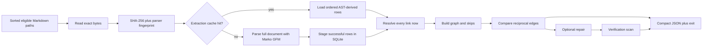

# Research Backlink Validation Redesign

**Date:** 2026-09-20
**Status:** First performance slice implemented; correctness-hardening stages specified below
**Scope:** Research backlink extraction, graph validation, repair, tests, hooks, and CI

## Outcome

The validator was slow because the default test suite repeatedly parsed the whole research vault,
and every invocation reparsed every document. The correction has two independent parts:

1. Prove parser, graph, exclusion, CLI, repair, and exit-code contracts with small temporary vaults.
   Keep exactly one read-only production-vault test, exclude it from default pytest, and run it once
   in the advisory research-validation job.
2. Retain Marko GFM as the structural authority, but persist successful extraction results in an
   exact-content SQLite cache. Every scan still reads and hashes current bytes and re-resolves every
   link against the current filesystem. Unchanged documents avoid Marko; changed documents do not.

This pull request implements those two parts. It does not claim to solve the pre-existing broken-link,
symlink-containment, directory-walk, or concurrent-repair gaps catalogued in
[Deferred correctness stages](#deferred-correctness-stages). Those changes need their own red tests
and review boundary.

## Implemented Slice

An implementation agent can verify the delivered boundary in this order:

1. Run the default `tests/research_backlinks` suite. It must select only fixture-based tests and
   must not read `research/`.
2. Run `-m "integration and not research_vault"` for bounded synthetic-vault subprocess coverage.
3. Run `-m research_vault` explicitly. It must select exactly one read-only graph smoke test.
4. Run `check-backlinks` once with an empty explicit cache and again with the same cache. The first
   result must report all eligible files in `files_parsed`; the second must report zero parses and
   the same semantic graph result.
5. Compare `--no-cache` and cached JSON after removing only operational fields
   (`files_parsed`, `cache_hits`). Findings, paths, skips, and exit status must match.

The changed runtime is intentionally small:

- [`backlink_models.py`](./../../.claude/skills/research-curator/scripts/backlink_models.py) owns
  the versioned Pydantic contracts shared by extraction, cache, graph, and CLI output.
- [`backlink_lib.py`](./../../.claude/skills/research-curator/scripts/backlink_lib.py) still owns
  Marko extraction, current link resolution, graph construction, and asymmetry comparison.
- [`backlink_cache.py`](./../../.claude/skills/research-curator/scripts/backlink_cache.py) owns only
  exact-content extraction persistence.
- [`validate_research.py`](./../../.claude/skills/research-curator/scripts/validate_research.py)
  selects the cache, emits one compact JSON result, and preserves existing exit semantics.
- Test selection is defined by [`pyproject.toml`](./../../pyproject.toml), documented in
  [`docs/testing.md`](./../testing.md), and routed by
  [`.github/workflows/code-quality.yml`](./../../.github/workflows/code-quality.yml).

## Evidence

### Causal profile

At the starting revision, `research/` contained 525 Markdown files and approximately 7 MB of
Markdown. The backlink walker excluded `README.md` and sent 523 documents to Marko.

The initiating diagnosis measured one unprofiled scan at 28.97 seconds wall and 27.86 seconds user
CPU. A separate bounded cProfile run reproduced the cause:

- 74,524,999 Python calls;
- 73.92 seconds profiled wall and 70.00 seconds user CPU;
- 72.903 seconds in `build_cross_reference_graph`;
- 72.035 seconds across 523 `parse_cross_references_table` calls; and
- 71.833 seconds in Marko parsing, versus 0.017 seconds constructing parser objects.

The graph comparison was not material. Reusing one Marko instance is valid for this serial scanner,
but it is not the optimization. Marko documents that a `Markdown` instance is not thread-safe, so
future parallel code would need one instance per thread
([Marko API](https://marko-py.readthedocs.io/en/latest/api.html), accessed 2026-09-20).

The profile command was:

```bash
/usr/bin/time -p uv run --frozen python -m cProfile \
  -o /tmp/research-backlinks-design.prof \
  .claude/skills/research-curator/scripts/validate_research.py \
  check-backlinks research
```

### Validator benchmark

These are single-machine observations, not portable service-level objectives. Commands were bounded
with `scripts/run_bounded.py`; `/usr/bin/time -lp` supplied wall time, user CPU, and resident memory.
The old and new cold runs occurred while other repository agents were active, so cold wall-time
comparisons are directional. Parse and hit counts are deterministic.

| Revision and state | Wall | User CPU | Marko parses | Cache hits |
|---|---:|---:|---:|---:|
| old code, no cache exists | 60.77 s | 42.71 s | 523 | 0 |
| new code, `--no-cache` | 28.41 s | 27.51 s | 522 | 0 |
| new code, empty cache | 29.96 s | 28.16 s | 522 | 0 |
| new code, unchanged warm cache, median of 3 | 0.81 s | 0.63 s | 0 | 522 |

The eligible count fell by one because the graph now applies the same top-level non-entry basename
rule to `CLAUDE.md` that the entry validator already applied. Final warm observations were 0.81,
0.84, and 0.81 seconds wall. The paired old-to-warm observation reduced wall time by approximately
98.7% and user CPU by approximately 98.5%. The initiating 28.97-second baseline is the better expectation
for an unloaded cold run; the cache is designed to remove repeated work, not to promise a faster
first parse.

The old command was:

```bash
uv run --script scripts/run_bounded.py --timeout-seconds 120 -- \
  /usr/bin/time -lp uv run --script \
  .claude/skills/research-curator/scripts/validate_research.py \
  check-backlinks research
```

The new cold and warm command was the same command with:

```text
--cache-path /tmp/research-backlink-postrebase.ov6V1h/backlinks.sqlite3
```

The no-cache control used `--no-cache` instead.

### Default pytest benchmark

The old default research-backlink collection performed four complete production-corpus passes:

- normal entry validation to prove `CLAUDE.md` exclusion;
- a CLI backlink smoke assertion;
- a direct graph smoke assertion; and
- a second direct graph build to prove `README.md` exclusion.

Those tests are visible in the starting versions of
[`test_non_entry_exclusion.py`](./../../tests/research_backlinks/test_non_entry_exclusion.py),
[`test_validator_cli.py`](./../../tests/research_backlinks/test_validator_cli.py), and
[`test_graph_asymmetry.py`](./../../tests/research_backlinks/test_graph_asymmetry.py).

| Default `pytest -q tests/research_backlinks` | Wall | User CPU | Max RSS | Selected tests |
|---|---:|---:|---:|---:|
| old code and routing | 101.45 s | 153.35 s | 315,736,064 B | 148 |
| new fixture-only default | 7.15 s | 9.41 s | 91,979,776 B | 96 |

This observation reduced wall time by approximately 93.0%, user CPU by approximately 93.9%, and
maximum resident set size by approximately 70.9%. Test counts are intentionally not equal: 62
synthetic subprocess tests moved to the required integration lane, and the sole production-vault
test moved to the explicit advisory lane. The behavior was reallocated, not deleted.

The benchmark command was:

```bash
uv run --script scripts/run_bounded.py --timeout-seconds 600 -- \
  /usr/bin/time -lp uv run --frozen pytest -q \
  --basetemp=/tmp/research-backlink-final-default-workflow tests/research_backlinks
```

The original run completed `148 passed in 90.06s`; the final new run completed `96 passed in 5.00s`.
The difference between pytest's duration and `/usr/bin/time` includes interpreter, xdist, and
coverage startup/teardown. The final run used a fresh explicit pytest base temporary directory and
reported no test warning summary.

Final collection evidence was `96/159 tests collected (63 deselected) in 1.15s`. The 63 are the 62
synthetic integration tests plus the one `research_vault` test. Explicit
`-m research_vault --collect-only` selected only
`TestRealVaultScan::test_real_vault_scan_no_exception`. Therefore the default lane performs zero
production-vault parses; its Marko activity is confined to temporary fixture documents.

After rebasing onto `2776c8d654de81fcb89578919701b40966c4001c`, a bounded repository default suite
completed with `6581 passed, 54 skipped, 10 xfailed` in 276.00 seconds. The later PR-review fix added
two fixture-only regressions for retained warnings and advisory workflow routing, then reran every
affected test rather than the whole repository.
The final required research integration lane completed 62 tests in 27.34 seconds, and the sole
advisory corpus test completed once in 25.58 seconds.

## Runtime Requirements and Invariants

### Structural authority

1. Marko GFM decides whether content is a heading, table, link, code span, fenced block, or HTML
   block. Regex or raw line splitting must not decide Markdown structure. This is repository policy
   in [`AGENTS.md`](./../../AGENTS.md) and is needed for GFM escaped pipes and CommonMark block
   precedence ([GFM tables](https://github.github.com/gfm/#tables-extension),
   [CommonMark blocks](https://spec.commonmark.org/0.30/#blocks-and-inlines), accessed 2026-09-20).
2. `## Cross-References` inside a fence or HTML comment is not a section. Inline markup in a real
   heading is interpreted through rendered AST text.
3. The current extractor reads the first GFM table in the first matching H2 section. Multiple
   matching sections are a deferred structural defect; repair must not guess which one is canonical.
4. Marko 2.2.2 pads short GFM rows and discards extra cells before exposing its AST. Exact source
   cell arity therefore cannot be enforced from the current AST. This design does not promise an
   impossible `exactly three source cells` diagnostic. Such a rule requires an upstream/source-span
   facility approved under the AST-only policy, not a second line parser.
5. The Entry cell's semantic link must be a Marko `Link`. Missing links remain parse defects.
   Escaped pipes, code spans, emphasis, and entities are read from AST children.

### Scan coverage and graph semantics

1. Discovery order, edge order, skip order, and JSON array order are deterministic.
2. `README.md`, `CLAUDE.md`, and `AGENTS.md` are navigation/instruction files, not graph entries.
3. Every eligible readable document produces either a successful extraction or one `ScanSkip`.
   Read, decode, parse, and resolution skips preserve partial-scan semantics.
4. `--allow-partial-scan` may waive only coverage loss. It must never hide a known broken,
   absolute, outside-vault, or excluded target once those findings are implemented.
5. Cache state never determines whether a target currently exists. Every link is resolved and
   checked on every scan.
6. The semantic result is the projection containing graph edges, findings/skips, repair counts,
   and exit status. Cache metrics and durations are operational data and are excluded from semantic
   equality comparisons.

### Cache behavior

1. The cache key is SHA-256 of exact file bytes plus a parser fingerprint containing the installed
   Marko version and extractor schema version. The database path is already scoped to the resolved
   vault, so identical bytes may safely share one pure extraction result within that vault.
2. Only successful extraction rows are cached in this slice. Read/decode and parse failures are
   retried on every invocation so the cache cannot conceal a coverage hole.
3. Resolution, target existence, graph comparison, exclusions, and repair eligibility are never
   cached.
4. SQLite stores an extraction manifest and ordered rows in one transaction. A stored row count
   detects incomplete logical state. Schema mismatch rebuilds disposable cache tables.
5. Corrupt, contract-invalid, incompatible, locked, or unwritable cache state warns once. A late
   read failure discards the partial pass and returns one complete uncached scan; an open failure
   starts uncached immediately. Cache failure cannot turn a red semantic result green.
6. Scan-skip diagnostics are emitted only after a pass is retained, so a discarded cached pass and
   its uncached replacement cannot report the same skip twice.
7. Concurrent readers are allowed. Concurrent cold writers use WAL and insert-if-absent semantics;
   lock timeout falls back uncached. Marko remains serial within each process.
8. `--no-cache` is the semantic control. `--cache-path` provides deterministic tests and benchmarks.
   Supplying both is an argument error.

### Output and exit behavior

`check-backlinks` emits one compact JSON object, following
[`docs/cli-output-conventions.md`](./../cli-output-conventions.md). It does not add a second text
mode. Version 1 is an intentional replacement for the unversioned line-oriented output; no
compatibility mode is retained. A repository-wide consumer audit found only this skill, its review
rubric, and the backlink tests, and all three consume the JSON contract in this change. External
callers must migrate atomically by parsing `schema_version == 1`. Version 1 contains:

```json
{"asymmetric_cross_references":0,"cache_hits":522,"edges":[],"files_parsed":0,"scan_skipped_files":0,"schema_version":1,"skips":[]}
```

Fix runs add `backlinks_repaired`, `backlinks_excluded`, `verification_files_parsed`,
`verification_cache_hits`, and `remaining_asymmetric_cross_references`. Each `edges` item has
`source` and `target` relative POSIX paths. Each `skips` item has `path`, `reason`, and `detail`.
Warnings remain on stderr.

Exit behavior remains:

- non-zero asymmetry is red;
- a scan skip is red unless `--allow-partial-scan` is explicit;
- `--exclude` withholds writes without hiding the original edge;
- `--fix` performs a real verification scan and remains red if asymmetry remains; and
- cache availability never changes the exit code.

## Architecture and Data Flow



### Cache schema

The implemented database is deliberately an extraction cache, not a second graph database:

```text
extractions(
  content_sha256,
  parser_fingerprint,
  row_count,
  PRIMARY KEY(content_sha256, parser_fingerprint)
)

extraction_rows(
  content_sha256,
  parser_fingerprint,
  ordinal,
  entry_name,
  link_path,
  category,
  relationship,
  PRIMARY KEY(content_sha256, parser_fingerprint, ordinal),
  FOREIGN KEY(content_sha256, parser_fingerprint) REFERENCES extractions(...)
)
```

No target path, existence bit, resolved inode, asymmetry, or repair decision is persisted. That
boundary is what makes target deletion observable without reparsing an unchanged source.

### Cache invalidation and failure recovery

| Event | Required result |
|---|---|
| bytes unchanged, metadata changed | hit |
| bytes changed, size and mtime restored | miss |
| Marko or extractor fingerprint changed | miss |
| target created, deleted, renamed, or retargeted | unchanged source may hit; resolution changes now |
| successful extraction with zero rows | hit with an empty row set |
| parse defect | reparse and return a skip on every run |
| missing database | create and cold-parse |
| old schema | transactionally rebuild disposable tables |
| corrupt file, contract-invalid row, or inconsistent row count | warn once; discard any partial pass; complete one uncached scan |
| lock not acquired within the bounded SQLite timeout | warn once, parse uncached |
| process dies before commit | SQLite rolls back the staged transaction |

The cache is disposable and outside the repository. Rollback is `--no-cache` or removal of the
cache file; neither changes research documents.

## Test Architecture

A professional test design assigns each contract to the cheapest layer that can falsify it:

| Tier | Data | Purpose | PR routing |
|---|---|---|---|
| unit/default | tiny in-process temporary vaults | AST, graph, cache, exclusion, idempotent helpers | required default pytest |
| CLI integration | tiny temporary vaults through the real script | arguments, JSON, exit codes, warnings, `--fix` | required integration job; every subprocess bounded |
| corpus integration | production `research/`, read-only | shape/compatibility smoke, not edge-case correctness | exactly one `research_vault` test; advisory job |
| scheduled mutation | one temporary copy of production `research/` | full-corpus repair/idempotency and cold/warm benchmark | deferred nightly/manual lane |

The production corpus is mutable test data and is unsuitable for exclusions, parser corner cases,
or exact finding counts. A three-file fixture proves an exclusion. A two-file fixture proves one
asymmetric edge. A corrupt temporary SQLite file proves fallback. The corpus test answers only:
“Can the current production shape be scanned?”

Pytest markers are selection labels, not scheduling by themselves. The default marker expression
must explicitly contain `not research_vault`; official pytest documentation describes marker
registration and `-m` selection
([pytest markers](https://docs.pytest.org/en/stable/how-to/mark.html), accessed 2026-09-20).
A session-scoped fixture is not a cross-worker cache under xdist because each worker owns a session
([pytest-xdist guidance](https://pytest-xdist.readthedocs.io/en/latest/how-to.html#making-session-scoped-fixtures-execute-only-once),
accessed 2026-09-20).

### Exact scenario matrix

Status meanings: **PR** is implemented and required in this pull request; **next** is a red-first
contract for a later correctness stage; **nightly** belongs only in a copied-corpus scheduled lane.

| ID | Scenario | Expected invariant | Layer | Status |
|---|---|---|---|---|
| E01 | no target H2 | zero rows | unit | PR |
| E02 | real target H2 plus GFM table | AST-derived ordered rows | unit | PR |
| E03 | target-looking heading in a fence | ignored by Marko structure | unit | PR |
| E04 | target-looking heading in HTML comment | ignored by Marko structure | unit | PR |
| E05 | inline markup in heading/cells | compare rendered AST text | unit | PR |
| E06 | escaped pipe in a cell | one cell, pipe retained semantically | unit | PR |
| E07 | Entry cell lacks a Marko link | parse skip, never cached | unit | PR |
| E08 | duplicate target rows | one edge plus structural finding | unit | next |
| E09 | multiple target H2 sections | structural finding; repair disabled | unit | next |
| E10 | short/extra source cells | no claim beyond Marko AST; investigate source-span support | design probe | next |
| E11 | LF, CRLF, terminal/no terminal newline | equal extraction projection | unit | next |
| D01 | README/CLAUDE/AGENTS at vault root | excluded from graph | unit | PR |
| D02 | nested entry with no references | graph node with empty adjacency | unit | PR |
| D03 | unreadable file | read skip, non-zero unless partial allowed | unit/CLI | PR |
| D04 | invalid UTF-8 | read skip; scan continues | unit/CLI | PR |
| D05 | unreadable directory | explicit discovery skip | integration | next |
| D06 | symlinked source inside vault | explicit `source_symlink` finding; do not parse or write | integration | next |
| D07 | symlinked source or target outside vault | deterministic outside-vault finding, no crash/write | integration | next |
| R01 | valid relative target | current target resolved and included | unit | PR |
| R02 | target deleted after source cached | edge disappears without source reparse | unit | PR |
| R03 | target created after source cached | edge appears without source reparse | unit | next |
| R04 | missing target | explicit broken-link finding | unit/CLI | next |
| R05 | absolute path, URI, query, or fragment | reject as `unsupported_target`; do not resolve or write | unit | next |
| R06 | lexical dot-segment variants to same non-symlink entry | resolved vault-relative POSIX identity; one edge | unit | next |
| G01 | reciprocal pair | no asymmetry | unit | PR |
| G02 | one-way pair | one deterministic edge finding | unit | PR |
| G03 | three-node cycle | correct directed comparison | unit | PR |
| G04 | duplicate outgoing references | one asymmetric pair | unit | PR |
| C01 | empty cache | all eligible files parsed and stored | unit/CLI | PR |
| C02 | unchanged second scan | zero parses; all eligible files hit | unit/CLI | PR |
| C03 | same size/mtime, changed bytes | changed file reparsed | unit | PR |
| C04 | cached target deleted | current filesystem wins | unit | PR |
| C05 | parse failure repeated | failure is not cached | unit | PR |
| C06 | corrupt SQLite file | warn and complete uncached | unit | PR |
| C07 | manifest row count disagrees | warn and complete uncached | unit | PR |
| C08 | late stored row violates its Pydantic contract after earlier hits | discard partial graph; complete uncached with zero hits/skips | unit | PR |
| C09 | retained skip precedes a late cache failure | final skip is returned and warned exactly once | unit | PR |
| C10 | schema/parser fingerprint changes | miss or disposable rebuild | unit | PR |
| C11 | two cold processes share one cache | both semantic results correct; no partial rows | bounded integration | next |
| C12 | database locked/unwritable | bounded wait then uncached equivalence | bounded integration | next |
| F01 | one missing reciprocal | one repair then clean verification | CLI integration | PR |
| F02 | excluded target | no write, edge remains, non-zero | CLI integration | PR |
| F03 | second unchanged fix | byte-idempotent, zero repairs | CLI integration | PR |
| F04 | two sources repair one target | group rows into one target replacement | unit/integration | next |
| F05 | source changes after scan | no stale reciprocal; concurrent-modification finding | bounded integration | next |
| F06 | target changes after scan | no overwrite; concurrent-modification finding | bounded integration | next |
| F07 | two fixers | one lock owner; loser fails closed | bounded integration | next |
| F08 | CRLF, final newline, file mode | replacement preserves all three | unit/integration | next |
| F09 | corrupt/unwritable fix-lock database | fail closed before mutation | integration | next |
| P01 | scan skip without waiver | non-zero | CLI integration | PR |
| P02 | scan skip with explicit waiver | coverage waiver only | CLI integration | PR |
| P03 | compact JSON schema | one parseable object; no dual text mode | CLI integration | PR |
| T01 | default collection | no direct production-vault reader selected | collect-only/default | PR |
| T02 | integration collection | synthetic CLI contracts selected and bounded | required CI | PR |
| T03 | corpus collection | exactly one read-only test selected | advisory CI | PR |
| T04 | advisory corpus scan fails | subsequent entry validation still runs through `always()` | workflow fixture | PR |
| T05 | copied corpus fix twice | second run byte-identical | scheduled | nightly |

### Performance gates

Correctness gates use counts; timing gates are deliberately broad:

| Gate | Budget on reference machine | Route |
|---|---:|---|
| unchanged warm production scan | `files_parsed == 0`, `cache_hits == eligible files` | advisory corpus |
| warm wall/user CPU | at most 2.0 s wall and 1.5 s user CPU | advisory benchmark |
| one exact-byte change | exactly one parse | fixture plus scheduled copied corpus |
| default backlink tests | zero selected `research_vault` tests; at most 20 s wall | required PR |
| cold production scan | bounded at 120 s; record, do not hard-fail on runner noise | advisory |

Hard timing promotion should use a distribution from repeated CI runs. Parse counts are the primary
regression signal because they identify the causal work directly.

## Design Alternatives

| Option | Semantic safety | CPU effect | Decision |
|---|---|---|---|
| only delete duplicate corpus tests | unchanged semantics | removes test repetition, not repeated CLI work | necessary but insufficient |
| reuse one serial Marko object | safe in one thread | profile says milliseconds | implemented, not credited as main gain |
| regex/line-slice the target section | headings in fences/comments can be misclassified | lower cold CPU | rejected by AST policy |
| hand-written fence/comment state machine | duplicates part of CommonMark | lower cold CPU | rejected as a second grammar |
| process pool | one parser per process can be safe | similar total CPU, more core saturation | rejected as incident fix |
| mtime/size cache | stale when metadata is preserved | low | rejected |
| Git-diff incremental scan | misses dirty/untracked/arbitrary-vault state | low | rejected |
| exact-byte extraction cache | Marko remains authority; target state stays live | zero warm parses | implemented |
| SQLite path/graph index | can support discovery and diagnostics later | potentially lower warm I/O | deferred until measured need |
| upstream Marko early-stop/source spans | potentially preserves AST authority | could lower cold CPU | research only after warm design proves insufficient |

## CI and Hook Routing

The lanes are intentionally different:

- Default pytest is required and fixture-only.
- The existing required integration job now collects bounded research CLI tests in addition to
  development-harness integration tests.
- The existing `research-validation` job remains advisory and runs the sole `research_vault` test
  once. Promotion, if ever desired, requires splitting backlink scanning into its own required job;
  making the whole current advisory job required would also promote unrelated corpus-format debt.
- Entry validation in that job uses `if: ${{ always() }}` so a corpus-scan failure does not suppress
  the independent entry-format report.
- Pre-commit remains changed-file entry validation. A whole-vault backlink scan does not belong in
  the commit hook.
- A copied-corpus mutation/benchmark job is deferred to scheduled or manual CI. It must use one
  temporary corpus copy for cold, warm, invalidation, and idempotency observations.

## Deferred Correctness Stages

The following stages are executable separately. This pull request completes Stage 1 only.

### Stage 1 — repeated-work correction

- Replace production data in default tests with fixtures.
- Route bounded subprocess tests to integration.
- Keep one explicitly deselected corpus smoke test.
- Reuse one serial Marko parser and add exact-content SQLite extraction caching.
- Emit compact JSON metrics and prove cache invalidation/fallback.

**Complete when:** `C01`-`C10`, `T01`-`T04`, and existing graph/CLI contracts pass; then
`uv run --frozen pytest -q` passes with the repository's default marker expression, and the
benchmark evidence above has been regenerated from a fresh temporary cache.

### Stage 2 — discovery and link findings

- Replace opaque `Path.rglob` discovery with a deterministic walker that reports directory errors.
- Reject every discovered source symlink as `source_symlink`, even when it resolves inside the
  vault; only regular discovered Markdown files are writable identities.
- Reject targets containing a URI scheme, absolute path, query, or fragment as
  `unsupported_target`. Resolve relative dot segments, reject any symlinked path component, reject
  resolved paths outside the vault as `outside_vault`, and use the resolved vault-relative POSIX
  path as the graph identity.
- Represent missing and excluded targets as known findings distinct from unknown coverage skips.
- Keep relative POSIX ordering and update JSON schema in one versioned change.

**Complete when:** `D05`-`D07` and `R03`-`R06` are red first, then green; cached and uncached
semantic projections match.

Python documents that `Path.rglob` results require explicit sorting and that modern versions may
suppress traversal errors
([Python `pathlib`](https://docs.python.org/3.13/library/pathlib.html#pathlib.Path.rglob), accessed
2026-09-20). That is why discovery hardening is a correctness stage, not part of the cache.

### Stage 3 — structural strictness

- Detect multiple target sections and duplicate semantic targets from Marko nodes.
- Decide whether exact source cell arity is needed. If it is, prototype an upstream/source-position
  Marko extension; do not parse table lines independently.
- Preserve a single semantic projection across LF/CRLF variants.

**Complete when:** `E08`-`E11` are green and a corpus audit reports every newly strict finding
without weakening the parser to fit existing data.

### Stage 4 — repair transaction

Use a fix lock separate from the optional cache. Cache failure remains open; fix-lock failure is
closed because mutation without ownership is unsafe.

The repair algorithm must:

1. acquire the per-vault writer lock before taking the repair snapshot;
2. group all missing reciprocal rows by target;
3. under the lock, re-read and reparse every source and target and verify their scan hashes;
4. verify each source still contains the forward edge;
5. apply all rows for one target to one in-memory document;
6. preserve newline convention, terminal newline, and file mode;
7. write a same-directory temporary file, fsync where supported, recheck the target hash, and
   replace atomically; and
8. run a fresh verification scan.

Grouping closes the stale-hash defect where `A -> T` and `B -> T` would otherwise write `T` twice.
Revalidating sources closes the stale-forward-edge defect. A deterministic subprocess barrier, not
timing sleeps, must drive `F05`-`F07`.

**Complete when:** `F04`-`F09` are green, the second unchanged fix is byte-identical, and forced
process death leaves either the original or complete replacement.

### Stage 5 — scheduled corpus mutation and promotion decision

- Copy the corpus once.
- Inject a known asymmetry into the copy.
- Run fix, verify, second fix, cold cache, warm cache, and one-file invalidation on that copy.
- Publish compact JSON and `/usr/bin/time` artifacts.
- Observe at least 20 advisory runs before setting a timing gate or considering a required corpus
  job.

This stage is operational rollout, not a condition for merging the fixture/cache slice.

## Observability, Rollback, and Failure Policy

| Failure | Current slice | Hardened target |
|---|---|---|
| cache missing | cold parse and create | same |
| cache corrupt/unwritable/locked | warn, parse uncached | same |
| cache schema changes | disposable rebuild | same plus bounded garbage collection |
| process dies during cache commit | SQLite rollback | same |
| read/decode/parse failure | skip, non-zero unless partial waiver | structured versioned finding |
| target missing | currently omitted from graph | explicit broken-link finding; never repair |
| target outside vault | may reach legacy path behavior | explicit finding; never write |
| second fixer | no lock in current slice | fail closed before mutation |
| source/target changes during fix | legacy race remains | concurrent-modification finding, no write |

Rollback boundaries are small:

- `--no-cache` disables the optimization without changing semantics.
- Bumping the extractor/schema version invalidates old cache state.
- `research_vault` can remain advisory without changing required fixture coverage.
- The cache is disposable and never committed.
- No rollback may introduce regex Markdown parsing or restore production-corpus scans to default
  pytest.

## File-by-File Plan

| File | This pull request | Later stage |
|---|---|---|
| `.claude/skills/research-curator/scripts/backlink_models.py` | shared typed extraction, scan, edge, and versioned report contracts | add future finding variants here before consumers |
| `.claude/skills/research-curator/scripts/backlink_cache.py` | SQLite schema, exact-byte identity, transactional rows, default cache path | pruning or expanded index only after measurement |
| `.claude/skills/research-curator/scripts/backlink_lib.py` | serial parser reuse, cache seam, counters, non-entry basenames | discovery/link findings, strict duplicate semantics |
| `.claude/skills/research-curator/scripts/validate_research.py` | cache flags, compact JSON, warm verification scan | versioned finding schema, repair lock/atomic writes |
| `.claude/skills/research-curator/SKILL.md` | consume compact JSON | consume future finding codes |
| `references/entry-review-rubric.md` | consume `edges`/`skips` arrays | consume future link findings |
| `tests/research_backlinks/` | fixtures, cache cases, bounded integration, one corpus test | scenario rows marked `next`/`nightly` |
| `pyproject.toml` | register and deselect `research_vault` | none |
| `docs/testing.md` | document all three test lanes | scheduled lane when added |
| `.github/workflows/code-quality.yml` | required research integration; one advisory corpus scan; independent entry validation | separate required backlink job only after promotion decision |
| `.pre-commit-config.yaml` | no change | no whole-vault hook planned |

The implementation uses only standard-library SQLite and cache-path selection; it adds no package
or lockfile dependency.

## Decisions and Residual Risks

No user decision blocks this pull request. The recommended future defaults are:

- reject outside-vault aliases and require one canonical writable entry identity;
- treat multiple target sections as structural defects;
- keep cold parsing serial because the incident is excessive work, not insufficient parallelism;
- keep the corpus scan advisory until observed evidence supports promotion; and
- fail closed when the future mutation lock is unavailable.

Residual risks in the implemented slice:

- first and deliberately uncached scans still pay full Marko CPU;
- the content cache grows with distinct historical byte sequences and has no pruning policy yet;
- the legacy repair writer still has concurrency and line-ending gaps;
- `Path.rglob` cannot report every directory traversal error;
- platform-specific cache and SQLite behavior still needs CI evidence on Windows and Linux; and
- timing results vary with concurrent local agents, so parse counts are the stronger evidence.

## Delivery Checklist

- [x] Cache unit tests cover hit, exact-byte invalidation, current target state, parse failures,
  corrupt databases, incomplete row state, Pydantic-invalid stored rows, and retained warnings.
- [x] Default research tests pass from a fresh `--basetemp` and select no `research_vault` test.
- [x] Required research integration tests pass and every validator subprocess is bounded.
- [x] `pytest -m research_vault --collect-only` selects exactly one test; the test passes once.
- [x] Cached and uncached semantic projections and exit codes match on fixtures and the current
  corpus.
- [x] Final cold/warm and old/new pytest measurements include exact commands and caveats.
- [x] Ruff, format, type checks, Markdown checks, and `git diff --check` are green; the exact
  proportional full-test gate `uv run --frozen pytest -q` passes.
- [ ] Writing-for-agents, design, code, and final gate reviews have no blocking findings.
- [ ] The PR body separates observed measurements, implemented behavior, deferred work, and
  unverified assumptions.

## Sources

### Repository source, policy, and history

- [`AGENTS.md`](./../../AGENTS.md) — Markdown AST, Python, test, bounded-subprocess, and evidence
  rules.
- [`docs/cli-output-conventions.md`](./../cli-output-conventions.md) — single compact JSON output
  for agent-facing structured results.
- [`docs/testing.md`](./../testing.md) and [`pyproject.toml`](./../../pyproject.toml) — pytest lanes,
  xdist, markers, and default selection.
- [`.github/workflows/code-quality.yml`](./../../.github/workflows/code-quality.yml) — advisory
  research validation and required default/integration jobs.
- [`.pre-commit-config.yaml`](./../../.pre-commit-config.yaml) — changed-entry hooks.
- [`backlink_lib.py`](./../../.claude/skills/research-curator/scripts/backlink_lib.py) and
  [`validate_research.py`](./../../.claude/skills/research-curator/scripts/validate_research.py) —
  extraction, graph, repair, output, and exit behavior.
- [`cross-reference-format.md`](./../../.claude/skills/research-curator/references/cross-reference-format.md) —
  row, path, placement, and reciprocal-link contracts.
- [`92bcffa5bf`](https://github.com/Jamie-BitFlight/claude_skills/commit/92bcffa5bfdf0eb318a4baeb84ab276c776a1c5d)
  (accessed 2026-09-20) — initial Marko backlink implementation.
- [`b5e8d938df`](https://github.com/Jamie-BitFlight/claude_skills/commit/b5e8d938df02d0e024e1117735a33a4e36b3bda4)
  (accessed 2026-09-20) — relationship transform correction from corpus evidence.
- [`3736de2afa`](https://github.com/Jamie-BitFlight/claude_skills/commit/3736de2afa88237fa399b9b7355ba4bc863a02a5)
  (accessed 2026-09-20) — non-entry exclusions and real-corpus regression.
- [`26ba338591`](https://github.com/Jamie-BitFlight/claude_skills/commit/26ba33859157051828f21a4c2f74b4d5308bac22)
  (accessed 2026-09-20) — explicit scan coverage and write-only exclusions.

### Official specifications and documentation

- [Marko API](https://marko-py.readthedocs.io/en/latest/api.html) and
  [built-in extensions](https://marko-py.readthedocs.io/en/latest/extensions.html) (accessed
  2026-09-20) — parser lifecycle, AST API, thread-safety, and GFM extension.
- [GitHub Flavored Markdown](https://github.github.com/gfm/) and
  [CommonMark 0.30](https://spec.commonmark.org/0.30/) (accessed 2026-09-20) — table, escaping,
  fence, HTML, and block-precedence semantics.
- [Python 3.13 `pathlib`](https://docs.python.org/3.13/library/pathlib.html) and
  [`sqlite3`](https://docs.python.org/3.13/library/sqlite3.html) (accessed 2026-09-20) — discovery,
  path resolution, transactions, and connection behavior.
- [pytest markers](https://docs.pytest.org/en/stable/how-to/mark.html) and
  [pytest-xdist guidance](https://pytest-xdist.readthedocs.io/en/latest/how-to.html#making-session-scoped-fixtures-execute-only-once)
  (accessed 2026-09-20) — explicit test selection and per-worker session fixtures.
