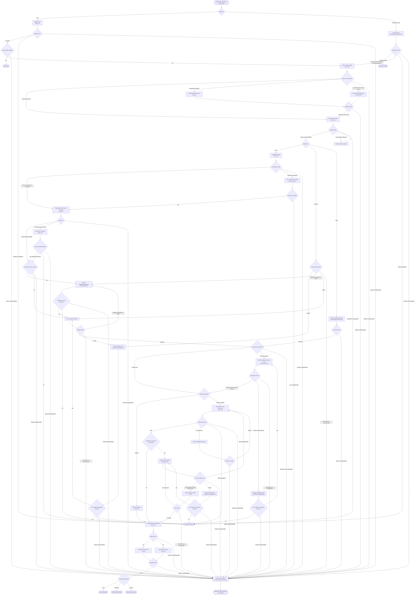

# Rebase Prose Playbook Design

## Purpose

Replace the rebase workflow engine with a forge-neutral decision playbook that uses Git as the
runtime. The skill exists to prevent outcome-changing mistakes that intrinsic Git knowledge does
not reliably prevent: rebasing the wrong named ref, mutating an active worker's branch, losing
unfinished work, discarding compatible intent, resuming work against changed assumptions, and
publishing rewritten history without authority or over a moved remote ref.

Success is observable when an agent can safely replay a named source ref onto the exact named
target, preserve compatible intent and unfinished work, verify the changed system, and publish
rewritten history only under front-loaded authority without overwriting remote movement.

This is a design for an agent process. It is not a Git tutorial, command wrapper, state machine,
or replacement runtime.

## Design principles

- Git owns repository state and history replay; the agent owns semantic decisions.
- The routine route stays in `SKILL.md` and assumes ordinary Git knowledge.
- Guidance earns context only when omitting it can change the outcome.
- Conditions, not document order, decide which detailed reference is loaded.
- Exact commands appear only when their syntax enforces a safety property.
- Every terminal state has an observable Git, verification, or publication signal.
- Shared prose uses skill-relative paths and no harness-specific invocation syntax.

## Package boundary

The canonical package is `.agents/skills/rebase`. Claude Code reaches the same package through the
existing relative symlink at `.claude/skills/rebase`.

```text
.agents/skills/rebase/
├── SKILL.md
└── references/
    ├── step-by-step.md
    ├── named-stash.md
    ├── history-shape.md
    ├── conflict-and-ambiguity.md
    ├── active-rebase-recovery.md
    └── publication.md

.claude/skills/rebase -> ../../.agents/skills/rebase
```

`SKILL.md` is the complete routine playbook. `references/step-by-step.md` is an optional decision
router for a run that reaches an exceptional branch or needs the complete control flow. Each other
reference owns conditional detail that exceeds its inline budget. The router points to a reference
only when its condition occurs; it does not repeat that file's guidance.

No scripts, schemas, plans, receipts, generated evidence, runtime state names, or maintained eval
artifacts belong in the package.

## Information hierarchy

Content placement follows these thresholds:

1. Necessary ordinary behavior becomes a single bullet of at most 120 characters.
2. A rationalization-prone safety process stays inline when it is under 1,024 characters.
3. A longer safety process becomes a sparse routed reference with only the commands whose syntax
   carries the safety property.
4. If `references/step-by-step.md` would exceed 100 lines, it remains a Mermaid decision router and
   routes each stage or condition to its own file.
5. Guidance whose value is uncertain is tested in isolation before it enters routine context.

The numeric thresholds govern placement, not truncation. Required content moves to a routed file;
it is never shortened until information is lost.

The routine bullets cover exact ref fidelity, front-loaded authority, source-location selection,
active-rebase inspection, commit-first dirty-work handling, intent-preserving conflict resolution,
semantic verification, proportional reorientation, and applicable worker handoff.

The short inline processes cover:

- binding the exact source and target, completion and result destinations, publication decision,
  authority when required, and observed object IDs before mutation;
- reaching a safe worker checkpoint before mutating the branch;
- preserving compatible intent without treating recency, style, `ours`, or `theirs` as authority;
- reorienting interrupted work when the new base changes relevant inputs, outputs, or assumptions.

Binding, source location, worker checkpointing, preparation, ref reobservation, reorientation,
verification, and handoff remain solely in `SKILL.md`. Router nodes may name these stages and their
observable result guards, but cannot restate how to perform them.

The routed files contain only conditional detail below.

| Reference | Load condition | Owned design concern |
|---|---|---|
| `named-stash.md` | Preparation requires a save or a lifecycle entry must be restored | Git-observable stash identity, exact-entry restoration/removal, and preservation through conflict recovery. |
| `history-shape.md` | Replay includes merges, equivalent changes, or empty commits | Preserve-or-flatten intent, equivalence versus discard, and empty-commit intent. |
| `conflict-and-ambiguity.md` | Replay, restoration, or remote integration conflicts | Combined-intent analysis, dependency recheck, and the genuine-ambiguity stop. |
| `active-rebase-recovery.md` | Continue, abort, or any stage fails or becomes unobservable | Lifecycle rediscovery, recovery choice, stabilization, and reporting of confirmed facts and unknowns. |
| `publication.md` | Publication was authorized before replay | Remote comparison, changed-intent integration, final fetch, exact lease, and rejection loop. |

The router's routine stage labels are control-flow addresses into `SKILL.md`, not a second copy of
the rules. Reference labels appear only on the conditional edges that load them.

## Process model

### Actors

- The process owner names the source and target, chooses the completion goal, grants publication
  authority, and resolves genuine intent ambiguity.
- The coordinating agent binds refs and object IDs, coordinates the owning worktree, interprets
  intent, operates Git, verifies behavior, reconciles remote movement, and reports the terminal.
- An active worker reaches a safe checkpoint, protects completed work, pauses when supported,
  receives the relevant world-change summary, and resumes.
- Git exposes repository state, performs replay and restoration, and enforces the exact lease.
- The remote destination is mutable external state observed before replay and again immediately
  before publication.

### Entry conditions

The process starts only from an explicit request to start a rebase of a named source onto a named
target, or to continue or abort an active rebase. The repository and named refs must be observable
before mutation. Publication is optional; when it may be required, authority and the exact remote
destination are bound before replay begins.

The exact source may be an owned local branch, an unowned local branch, or another ref. An unowned
branch gets a dedicated branch worktree. A non-branch ref gets a dedicated detached worktree at its
bound OID, and its completion goal must bind the result destination before mutation. No related ref
is substituted to make worktree creation convenient.

### Lifecycle identity

Git-observable facts identify the lifecycle: exact source ref and bound pre-replay OID, exact target
ref and OID, completion goal and result destination, and, when used, the exact stash commit OID and
a distinguishing message containing the source ref and pre-replay source OID. Continue and abort
rediscover these facts from Git before mutation and before abort can remove active-rebase metadata.
No custom file, plan, receipt, schema, or runtime state records the lifecycle.

A continue or abort inspection matches zero or one lifecycle stash. One exact match binds it; a
verified absence binds none; multiple candidates or an unprovable match pauses for a decision; an
observation failure enters recovery. Saved work belongs to the lifecycle, not the current
invocation.

### Invariants

- A related ref is never silently substituted for the named source, target, or destination.
- Mutation starts only after exact source and target bindings and source worktree mode are observable.
- An OID changes only after movement on the same named ref is accounted for.
- Publication authority is independent of force-with-lease safety.
- No branch mutation races an active worker in its owning worktree.
- Dirty work has a known restoration route before replay starts.
- An expected named saved entry remains identifiable and preserved until its restoration succeeds.
- Every stage failure or unobservable result enters recovery; no blind retry crosses the gate.
- Worker delivery/resumption is required only when a worker exists; reorientation is always required.
- Compatible intentions survive conflict resolution; side labels and apparent recency do not
  select the outcome.
- A changed base triggers reorientation proportional to the task's observed interaction.
- Git success is not reported as semantic success without relevant verification.
- Remote movement is integrated and reverified before an authorized rewritten-history push.

### Terminal states

| Terminal | Observable signal |
|---|---|
| No change | The bound target already satisfies the bound completion goal and no mutation occurred. |
| Local completion | Replay, saved-work restoration, semantic verification, and applicable reorientation/handoff passed without publication. |
| Published completion | Local completion passed and the exact destination accepted the authorized exact-lease push. |
| Aborted and restored | Active metadata is absent; pre-state and saved work are restored; applicable reorientation/handoff passed. |
| Paused for decision | Goal, intent, target, ownership, or authority remains genuinely ambiguous. |
| Blocked safely | Exact current state, or last-confirmed facts plus observation unknowns, is reported without blind retry. |
| No active rebase | A continue or abort request found no active rebase and performed no mutation. |

## Decision router

`references/step-by-step.md` contains this router and one sentence defining its labels. `SKILL.md`
labels route to that file's named routine stage; reference labels load only the named conditional
procedure. The router carries stage names, observable guards, references, and terminals, never the
routine rules or ordinary Git syntax.



Every stage has an observable result gate. Expected semantic branches select their conditional
reference; a failure or unobservable result selects recovery. The worker/no-worker branch makes
handoff proportional without weakening the terminal, and the lifecycle stash guard applies across
start, continue, and abort invocations.

## Cross-harness boundary

The process is portable across harnesses that can load `SKILL.md`, resolve skill-relative
references, and run ordinary Git. Shared content uses prose actions and literal relative paths such
as `references/publication.md`. It does not name harness tool calls, plugin-root variables, hooks,
MCP servers, worker identifiers, or installation paths.

Worker coordination is capability-aware. When the harness supports messaging and pause/resume, the
coordinator asks the active worker to stop at a safe checkpoint and pauses it. Otherwise it waits
for the current non-interruptible action to finish. A foreground-only harness performs the same
checkpoint, rebase, and reorientation flow directly. Background waiting is a responsiveness
optimization where available, not part of rebase correctness.

No harness is assumed to create a worktree for a worker. Owning-worktree discovery and selection
remain ordinary Git responsibilities inside the process.

## Removal scope

The prose playbook replaces rather than wraps the existing runtime. The following are removed:

- `.agents/skills/rebase/scripts/` in full, including its runtime, models, custom states, evidence
  machinery, and runtime-coupled tests;
- `.agents/skills/rebase/evals/evals.json` and
  `.agents/skills/rebase/evals/activation-results.json`;
- `references/start-rebase.md`, `references/active-rebase.md`,
  `references/active-rebase-operation.md`, and `references/rebase-edge-cases.md` after their valid
  safety content is represented by the new hierarchy;
- `references/example-plan.json` and `references/runtime-evidence.json`;
- every instruction that requires capture/finalize/execute calls, JSON plans, receipts, hashes,
  custom terminal codes, recovery branches created by default, or Python-owned replay arguments.

`SKILL.md` and `references/step-by-step.md` are rewritten. The existing `.claude/skills/rebase`
symlink remains unchanged.

The eval files are removed rather than translated. Repository evidence found no consumer outside
the runtime-coupled tests being deleted, and their schema describes the rejected runtime rather
than a generic skill evaluation contract.

## Validation strategy

Validation is claim-specific and uses the cheapest evidence that can change the design.

| Claim | Failure excluded | Validation |
|---|---|---|
| Named refs are not silently substituted | Replay or publication targets a related but different ref | Isolated control/treatment prompts plus a temporary Git fixture. |
| Publication requires separate authority | An agent treats a lease as permission to push | Isolated control/treatment prompts. |
| Final remote comparison and exact lease preserve new work | A rewritten-history push overwrites remote movement | Disposable local-remotes scenario. |
| Worker checkpoint prevents concurrent mutation | Rebase races edits or commits in the owning worktree | Disposable multi-worktree scenario. |
| Every exact source kind has a worktree route | A non-branch ref is silently replaced or an unowned branch has no execution path | Owned, unowned, and detached-source fixtures. |
| Lifecycle stash identity survives invocations | Continue or abort loses or misidentifies repository-wide saved work | Start-save then fresh-invocation continue/abort fixtures. |
| Every stage failure reaches recovery | A failed or unobservable operation falls through as success | Manual route audit plus injected disposable failures. |
| No-worker execution can terminate | A foreground-only run waits for an impossible delivery/resume | Trace and execute both handoff branches. |
| Compact intent guidance preserves compatible changes | Conflict resolution clobbers one valid intention | Non-leading control/treatment conflict scenarios. |
| Reorientation catches changed assumptions | Work resumes against obsolete inputs or outputs | Dependency-interaction control/treatment scenario. |

Each behavioral experiment runs in an isolated temporary directory without access to this
repository's instructions. A control receives only the scenario; a treatment receives the
candidate skill content. The same model and scenario are used for both arms. The adjudication
measures outcome-changing behavior, turns, and tokens; syntactic variants such as `switch` versus
`checkout` are ignored.

The runner and fixtures are disposable after the experiment. They are not committed to the skill,
and no production rebase runtime is created to test a prose process.

Existing no-skill sampling established that detailed ordinary conflict and API-migration guidance
did not change the tested outcome, while explicit publication-authority and named-target binding
did. It did not include a treatment arm, so it supports those two compact constraints but supports
no claim of saved turns or tokens. Untested edge branches remain justified by their approved
destructive or semantic failure modes until a focused control/treatment test shows the guidance is
a no-op.

## Completion criteria

The design is implemented when:

- the package matches the stated boundary and contains no Python or runtime artifacts;
- `SKILL.md` carries the complete lean routine route without teaching ordinary Git;
- `step-by-step.md` stays under 100 lines and contains only stage labels, guards, references, and terminals;
- each rule has one authoritative home and each reference loads only under its stated condition;
- exact source-location modes and cross-invocation lifecycle identity are recoverable from Git;
- the Mermaid router parses successfully;
- cross-harness prose contains no harness-specific syntax or root-path assumptions;
- representative isolated Git scenarios establish the safety-sensitive branches; and
- no turn- or token-saving claim is made without a matched treatment arm.
