# Rebase Prose Playbook Design

## Purpose

Replace the rebase workflow engine with a forge-neutral decision playbook that uses Git as the
runtime. The skill exists to prevent outcome-changing mistakes that intrinsic Git knowledge does
not reliably prevent: rebasing the wrong named ref, mutating an active worker's branch, losing
unfinished work, discarding compatible intent, resuming work against changed assumptions, and
publishing rewritten history without authority or over a moved remote ref.

Success is observable when an agent can safely replay a named source ref onto the exact named
target, preserve compatible intent and unfinished work, verify the changed system, and publish
rewritten history only under front-loaded authority without overwriting remote movement.

This is a design for an agent process. It is not a Git tutorial, command wrapper, state machine,
or replacement runtime.

## Invocation contract

The rewritten model-invoked skill begins with this exact discovery metadata:

```markdown
---
name: rebase
description: "Start a Git rebase when the user explicitly requests replay of a named source ref onto a named target, or continue or abort an active rebase. When a start or continue request explicitly grants force-push authority, also publish that same rebase lifecycle's rewritten result. Do not use for merge-based branch updates, forge merge-method settings, pull-request or merge-request merging, or standalone pushes after or outside an active rebase lifecycle."
---

**Keywords**: rebase, git rebase, history replay, rebase conflict, continue rebase, abort rebase, git worktree, rewritten history, authorized force-with-lease publication
```

Keep the description on one line because Claude Code displays multiline YAML descriptions
incorrectly in menus and skill catalogues. Multiline descriptions still load and activate.

The required frontmatter and local keyword entry are discovery material outside the Mermaid process-line
budget. `**Keywords**:` is a local Markdown grep/search convention, not Agent Skills metadata or a
universal skill requirement; automatic activation still depends on `description`. The body contains
the router immediately after the keyword entry and no other routine prose.

Activation is validated in isolated harness runs. Every row requires a recorded `PASS`; an
`UNRUN`, `FAIL`, or `INCONCLUSIVE` row blocks completion.

| Branch | Prompt intent | Expected | Required record |
|---|---|---|---|
| Start | Rebase named `feature/a` onto named `main` | Activate | `PASS` |
| Continue | Continue an observed active rebase after conflict resolution | Activate | `PASS` |
| Abort | Abort an observed active rebase and restore its pre-state | Activate | `PASS` |
| Start + publication | Rebase named `feature/a` onto `main`, with explicit authority to force-push the rewritten result to an exact destination | Activate | `PASS` |
| Continue + publication | Continue an active rebase, then force-push its result to an exact destination under explicit authority | Activate | `PASS` |
| Merge update | Update the branch from `main` using a merge commit | Do not activate | `PASS` |
| Forge setting | Enable rebase-and-merge for a repository | Do not activate | `PASS` |
| PR/MR merge | Merge a pull request or merge request | Do not activate | `PASS` |
| Standalone push | Force-push a branch with no rebase lifecycle named | Do not activate | `PASS` |
| Post-completion publication | Force-push the result after the rebase lifecycle has already completed | Do not activate | `PASS` |

Activation does not grant publication authority. Positive start/continue publication cases bind the
exact remote, destination ref, initial destination OID, and explicit authority before the dependent
mutation. Active rebase state and earlier pushes never imply authority. Publication is not a new invocation after a
rebase completes; it is a stage of the same start/continue lifecycle.

## Design principles

- Git owns repository state and history replay; the agent owns semantic decisions.
- The routine route stays in `SKILL.md` and assumes ordinary Git knowledge.
- Guidance earns context only when omitting it can change the outcome.
- Conditions, not document order, decide which detailed reference is loaded.
- Exact commands appear only when their syntax enforces a safety property.
- Every terminal state has an observable Git, verification, or publication signal.
- Shared prose uses skill-relative paths and no harness-specific invocation syntax.

## Package boundary

The canonical package is `.agents/skills/rebase`. Claude Code reaches the same package through the
existing relative symlink at `.claude/skills/rebase`.

```text
.agents/skills/rebase/
├── SKILL.md
└── references/
    ├── named-stash.md
    ├── history-shape.md
    ├── conflict-and-ambiguity.md
    ├── active-rebase-recovery.md
    └── publication.md

.claude/skills/rebase -> ../../.agents/skills/rebase
```

`SKILL.md` contains discovery metadata followed immediately by the authoritative whole-process
Mermaid router. The router is therefore visible on every activation. Its nodes directly point to
one-level-deep conditional references, and only the reference on the reached node loads. No second
routine route or router file exists.

No scripts, schemas, plans, receipts, generated evidence, runtime state names, or maintained eval
artifacts belong in the package.

## Information hierarchy

Classify content by meaning before applying its hard budget:

1. The Mermaid control plane contains every stage, guard, reference route, and terminal in at most
   100 process lines. Discovery metadata is outside this budget.
2. A necessary ordinary note in a conditional reference is one bullet of at most 120 characters.
3. A fixed safety process in a conditional reference is at most 1,024 characters.
4. Required signal that exceeds its budget is split into coherent node-owned sections; it is never
   truncated or moved into always-loaded prose.
5. Guidance whose value is uncertain is tested in isolation before entering a reference.

The `SKILL.md` body has no routine prose outside the router. Routine stages and observable guards
exist once in the Mermaid control plane. Detailed guidance exists only in the conditional reference
selected by the reached node.

| Reference | Load condition | Owned design concern |
|---|---|---|
| `named-stash.md` | Preparation requires a save or a lifecycle entry must be restored | Git-observable stash identity, exact-entry restoration/removal, and preservation through conflict recovery. |
| `history-shape.md` | Replay includes merges, equivalent changes, or empty commits | Preserve-or-flatten intent, equivalence versus discard, and empty-commit intent. |
| `conflict-and-ambiguity.md` | Replay, restoration, or remote integration conflicts | Combined-intent analysis, dependency recheck, and missing/incompatible outcome reporting. |
| `active-rebase-recovery.md` | Continue, abort, or any stage fails or becomes unobservable | Lifecycle rediscovery, recovery choice, stabilization, and reporting of confirmed facts and unknowns. |
| `publication.md` | Destination, authority, and initial remote OID were bound on start/continue before the first dependent mutation | Comparison with the bound OID, final observation, changed-intent integration, exact lease, and rejection loop. |

Router labels are the single source of process order. Reference labels appear only on conditional
nodes and load only the named file when reached.

## Process model

### Actors

- The process owner names the source and target, chooses the completion goal, grants publication
  authority, and resolves genuine intent ambiguity.
- The coordinating agent binds refs and object IDs, coordinates the owning worktree, interprets
  intent, operates Git, verifies behavior, reconciles remote movement, and reports the terminal.
- An active worker satisfies the checkpoint predicate, protects completed work, pauses when supported,
  receives the relevant world-change summary, and resumes.
- Git exposes repository state, performs replay and restoration, and enforces the exact lease.
- The routine binding stage first observes the mutable remote destination when destination and
  authority are bound on start/continue; publication observes it again immediately before push.

### Entry conditions

The process starts only from an explicit request to start a rebase of a named source onto a named
target, or to continue or abort an active rebase. The repository and named refs must be observable
before mutation. Publication is optional; when required, authority, exact remote destination, and
its observed OID are bound before replay on start or before the next dependent mutation on continue.

The exact source may be an owned local branch, an unowned local branch, or another ref. An unowned
branch gets a dedicated branch worktree. A non-branch ref gets a dedicated detached worktree at its
bound OID, and its completion goal must bind the result destination before mutation. No related ref
is substituted to make worktree creation convenient.

### Git operation state and bound user contract

Git operation state and the user contract are distinct. Active rebase metadata can prove the
source name for a normal branch rebase, pre-replay source OID, onto OID, stopped commit, conflicts,
and replay progress. It does not prove the target ref name, completion goal, detached result
destination, publication destination or authority, or worker obligation. `ORIG_HEAD` is supporting
evidence only; later commands may replace it.

- **Start:** bind exact source and target names/OIDs, requested history shape, an observable
  completion predicate for the goal, result destination when distinct, and any publication
  destination and authority.
- **Continue:** inspect active Git state first. Explicitly rebind every target name, goal,
  observable completion predicate, destination, authority, stash association, or worker obligation
  needed by the remaining path and compare rebound names with recorded OIDs where possible.
- **Abort:** inspect active identity, lifecycle stash, and worker obligations before abort removes
  metadata. Rebind only facts needed to restore unfinished work and coordinate the worker; target,
  goal, and publication authority are not prerequisites for abort.
- **After completion or abort:** removed metadata cannot reconstruct the contract. Publication is
  no longer part of this skill's lifecycle; a later push is a standalone operation.

Every absent or inconsistent fact pauses before the mutation that depends on it. The process uses
active Git state and current request/task context; it adds no durable lifecycle file, schema,
receipt, or runtime. A context-free fresh invocation is not promised unattended recovery.

When named saved work exists, Git identifies it by immutable stash commit OID and a distinguishing
message containing the exact source ref and pre-replay source OID. Inspection matches zero or one
entry before continue or abort mutates: one exact match binds it, verified absence binds none,
multiple/unprovable matches pause, and observation failure enters recovery.

### Invariants

- A related ref is never silently substituted for the named source, target, or destination.
- A mutation starts only after every identity, intent, and authority fact it depends on is proven
  from Git or explicitly rebound.
- Every supported goal binds a Git-observable completion predicate before mutation.
- An OID changes only after every moved commit on the same named ref has an evidence-backed disposition.
- Publication authority is independent of force-with-lease safety.
- No mutation begins while an observed worker command can write the selected worktree.
- Dirty work has a known restoration route before replay starts.
- An expected named saved entry remains identifiable and preserved until its restoration succeeds.
- Every stage failure or unobservable result enters recovery; no blind retry crosses the gate.
- Worker delivery/resumption is required only when a worker exists; reorientation is always required.
- Compatible intentions survive conflict resolution; side labels and apparent recency do not
  select the outcome.
- Every observed intersection between base movement and task dependencies is inspected and checked.
- Git success is not reported as semantic success without relevant verification.
- Remote movement is integrated and reverified before an authorized rewritten-history push.

### Observable predicates

- **Completion predicate:** binding states the Git observations that prove the requested goal. The
  ordinary goal uses target ancestry in the result; every transformation goal binds its own
  observable history/ref relation before mutation. Replay completion or a proven no-replay
  publication path binds observed result OID `R` (normally `S0`), requires the named result ref to
  resolve to `R`, and requires this predicate to hold.
- **Worker checkpoint:** no worker command that can write the selected worktree is running, and the
  worker acknowledged pause after its command or its task ended. A foreground coordinator has no
  outstanding command. Unobservable worker state pauses.
- **Preparation complete:** the index/worktree, including untracked files, is empty; or the
  checkpoint commit contains every observed change and the index/worktree is then empty. Otherwise,
  a named save is required only when the changes cannot be committed at the checkpoint.
- **Intent disposition complete:** every affected commit/hunk/intent is preserved, already
  equivalent, superseded by the bound goal, or incompatible, with support from task text, patch or
  commit evidence, affected contracts, or passing validation. Unclassified or conflicting
  supported dispositions pause and name the alternatives.
- **Reorientation and validation complete:** every direct file overlap and known producer,
  consumer, interface, prompt, or documentation intersection is recorded and inspected; every
  repository-required and intersection-covering check exits successfully; the index has no
  unmerged entries. An empty intersection is recorded explicitly.
- **Stopped-state report complete:** coordinator-issued mutations stopped; preserve active rebase,
  conflicts, and bound stash; report the failed command, resolvable `HEAD`/ref OIDs, active metadata,
  unmerged entries, bound stash presence, worktree status, and each failed observation.

### Ordinary no-change predicate

Let `S0` and `T0` be the bound OIDs of exact source `S` and target `T`; let `D` be any distinct
result destination. `No change` requires all of: no active rebase; the goal is ancestry-only with no
reword, reorder, squash, edit, force replay, root/`--onto`, or topology transformation; reobservation
proves `S == S0` and `T == T0`; `git merge-base --is-ancestor T0 S0` exits `0`; required `D`
resolves to `S0`; every requested publication destination already resolves to the required result;
and only read-only observations ran. Exit `1` or a transformation goal continues the process. Any other exit
or failed observation enters recovery. When only publication differs, route to publication rather
than replay or `No change`.

### Terminal states

| Terminal | Observable signal |
|---|---|
| No change | For the ordinary ancestry-only goal, no rebase is active; source and target still equal their bound OIDs; target is an ancestor of source; every result/publication destination resolves to the required result; and no mutation ran. |
| Local completion | A start/continue lifecycle completed; active metadata and unmerged entries are absent; the named result ref resolves to observed result OID `R` and the bound completion predicate holds; lifecycle stash is absent or restored/removed; every selected validation and reorientation intersection passed; worker delivery evidence exists only when a worker exists. |
| Published completion | Local completion holds; the authorized exact-lease push exited zero; a post-push fetch shows the exact destination OID equals result OID `R`. |
| Aborted and restored | Active metadata and unmerged entries are absent; source/`HEAD` equals the bound pre-replay OID; lifecycle saved work is restored/removed; reorientation completed; worker delivery evidence exists only when a worker exists. |
| Paused for decision | The report names the exact missing fact or incompatible semantic outcome classes and their evidence; no further mutation runs. |
| Stopped with observed state | Coordinator-issued mutations stopped and the stopped-state report predicate is complete. |
| No active rebase | Worktree and Git-dir active-rebase metadata checks are absent and no mutation ran. |

## Decision router

`SKILL.md` contains this router immediately after its discovery metadata. Stage nodes execute the
named routine stage; reference nodes load only the named conditional procedure when reached. The
router carries stage names, observable guards, direct reference paths, and terminals without
ordinary Git syntax.

```mermaid
flowchart TD
    Start([Explicit start, continue, or abort request]) --> Kind{Request?}
    Kind -->|Start| Bind[Binding stage]; Kind -->|Continue or abort| Active["Inspect lifecycle<br/>references/active-rebase-recovery.md"]
    Bind --> BindResult{Binding result?}
    BindResult -->|Dependent facts and completion predicate bound| Satisfied{Ordinary local relation observation?}; BindResult -->|Missing or ambiguous| Decision([Paused for decision]); BindResult -->|Failure or unobservable| Recover
    Satisfied -->|True; all result and publication destinations match| NoChange([No change]); Satisfied -->|False, transformation goal, or local result differs| Locate
    Satisfied -->|True; only publication destination differs| Locate; Satisfied -->|Failure or unobservable| Recover
    Active --> ActiveResult{Inspection result?}
    ActiveResult -->|No active metadata in worktree and Git dir| NoActive([No active rebase]); ActiveResult -->|Git state proven; dependent contract and predicate rebound| Locate
    ActiveResult -->|Required contract fact missing or inconsistent| Decision; ActiveResult -->|Failure or unobservable| Recover
    Locate[Source-location stage] --> Location{Exact source location?}
    Location -->|Owned local branch| Safe; Location -->|Unowned local branch| BranchWT[Create dedicated branch worktree]
    Location -->|Non-branch ref; result bound| DetachedWT[Create detached worktree at bound OID]; Location -->|Failure or unobservable| Recover
    BranchWT --> WTResult{Creation result?}; DetachedWT --> WTResult
    WTResult -->|HEAD OID equals source; branch attachment also matches when required| Safe; WTResult -->|Failure or unobservable| Recover
    Safe[Worker-safety stage] --> Owner{Worktree-writing command state?}
    Owner -->|None, or pause/end observed| Operation{Operation?}; Owner -->|Observed active| Wait[Wait for checkpoint predicate]; Wait --> Owner
    Owner -->|Unknown or unreachable| Decision
    Operation -->|Start| Prepare[Preparation stage]; Operation -->|Continue| Stop{Current rebase state?}
    Operation -->|Abort| Abort["Abort and restore pre-state<br/>references/active-rebase-recovery.md"]
    Prepare --> PrepResult{Preparation result?}
    PrepResult -->|Status empty, or checkpoint contains all changes and status is empty| Refs; PrepResult -->|Dirty and checkpoint commit blocked| Save["Save and bind exact entry<br/>references/named-stash.md"]
    PrepResult -->|Failure or unobservable| Recover
    Save --> SaveResult{Exact entry verified?}
    SaveResult -->|Yes| Refs
    SaveResult -->|No or unobservable| Recover
    Refs[Reobserve exact source and target] --> RefResult{Ref result?}
    RefResult -->|Bound OIDs unchanged| Next; RefResult -->|Same named refs moved| Account[Account for movement]
    RefResult -->|Failure or unobservable| Recover
    Account --> AccountResult{Moved-commit dispositions complete?}
    AccountResult -->|All classified; no supported conflict| Next; AccountResult -->|Unclassified or conflicting| Decision
    AccountResult -->|Failure or unobservable| Recover
    Next{Reobserved local path?} -->|Replay required| Shape; Next -->|No-replay publication; predicate true| Current[Bind proven current result OID R]
    Next -->|Failure or unobservable| Recover
    Current --> CurrentResult{Named result ref resolves to R?}
    CurrentResult -->|Yes| Saved; CurrentResult -->|No or unobservable| Recover
    Shape{Merge in replay set or Git reports empty/equivalent?} -->|Yes| History["Resolve topology/equivalence<br/>references/history-shape.md"]; Shape -->|No| Replay[Run ordinary Git replay]
    Shape -->|Failure or unobservable| Recover
    History --> HistoryResult{Every special commit has a supported disposition?}
    HistoryResult -->|Yes; no supported conflict| Replay; HistoryResult -->|No or conflicting| Decision
    HistoryResult -->|Failure or unobservable| Recover
    Stop -->|Unmerged index entries| ReplayConflict
    Stop -->|Git reports topology, equivalent, or empty| History
    Stop -->|Metadata active; no unmerged entries; required resolution staged| Replay
    Stop -->|Other failure or unobservable| Recover
    Replay --> ReplayResult{Replay result?}
    ReplayResult -->|Metadata/unmerged absent; observed R bound; result ref resolves to R; predicate true| Saved{Lifecycle saved entry?}
    ReplayResult -->|Unmerged index entries| ReplayConflict["Resolve replay intent<br/>references/conflict-and-ambiguity.md"]
    ReplayResult -->|Topology, equivalent, or empty| History
    ReplayResult -->|Other failure or unobservable| Recover
    ReplayConflict --> ReplayIntent{One semantic outcome class preserves compatible intent and checks?}
    ReplayIntent -->|Exactly one| Replay; ReplayIntent -->|None or incompatible alternatives| Decision
    ReplayIntent -->|Failure or unobservable| Recover
    Abort --> AbortResult{Abort restoration predicate?}
    AbortResult -->|Metadata/unmerged absent; source or HEAD equals pre-replay OID| Saved
    AbortResult -->|Failure or unobservable| Recover
    Saved -->|Verified none| FinishMode{Lifecycle outcome?}; Saved -->|Exact entry bound| Restore["Restore and remove exact entry<br/>references/named-stash.md"]
    Saved -->|Ambiguous or unobservable| Recover
    Restore --> RestoreResult{Restoration result?}
    RestoreResult -->|Command zero; no unmerged entries; exact entry absent| FinishMode
    RestoreResult -->|Conflict; entry preserved| RestoreConflict["Resolve restoration intent<br/>references/conflict-and-ambiguity.md"]
    RestoreResult -->|Other failure or unobservable| Recover
    RestoreConflict --> RestoreIntent{One semantic outcome class preserves compatible intent and checks?}
    RestoreIntent -->|Exactly one| Restore; RestoreIntent -->|None or incompatible alternatives| Decision
    RestoreIntent -->|Failure or unobservable| Recover
    FinishMode -->|Explicit abort request| OrientAbort[Abort reorientation]; FinishMode -->|Completed start or continue| Orient[Reorientation and verification]
    Orient --> VerifyResult{Selected validation set result?}
    VerifyResult -->|All checks zero; no unmerged entries; intersections accounted| Publish{Publication bound and authorized?}
    VerifyResult -->|Failing check identifies one goal-consistent correction| Correct[Correct changed interaction]
    Correct --> CorrectResult{Correction applied?}
    CorrectResult -->|Yes; rerun full selected set| Orient; CorrectResult -->|Failure or unobservable| Recover
    VerifyResult -->|Missing intent or incompatible corrections| Decision
    VerifyResult -->|Failure or unobservable| Recover
    Publish -->|No| Handoff
    Publish -->|Yes| Remote["Reconcile destination<br/>references/publication.md"]
    Remote --> RemoteResult{Remote stage result?}
    RemoteResult -->|Final fetch unchanged; exact lease OID current| Push[Authorized exact-lease push]
    RemoteResult -->|Every moved commit disposed; interactions validated| Orient
    RemoteResult -->|Conflict| RemoteConflict["Resolve remote intent<br/>references/conflict-and-ambiguity.md"]
    RemoteResult -->|Failure or unobservable| Recover
    RemoteConflict --> RemoteIntent{One semantic outcome class preserves compatible intent and checks?}
    RemoteIntent -->|Exactly one| Remote; RemoteIntent -->|None or incompatible alternatives| Decision
    RemoteIntent -->|Failure or unobservable| Recover
    Push --> PushResult{Push result?}
    PushResult -->|Exit zero and post-fetch destination equals result| Handoff; PushResult -->|Lease rejected or destination mismatch| Remote
    PushResult -->|Other failure or unobservable| Recover
    OrientAbort --> Handoff[Worker-handoff stage]
    Handoff --> Worker{Worker exists?}
    Worker -->|Yes| Deliver[Deliver summary and resume]; Worker -->|No| Terminal{Bound path predicate?}
    Worker -->|Unknown or unobservable| Recover
    Deliver --> HandoffResult{Delivery acknowledged or worker resumed with summary?}
    HandoffResult -->|Yes| Terminal; HandoffResult -->|No or unobservable| Recover
    Terminal -->|Abort request and restored pre-state| Aborted([Aborted and restored])
    Terminal -->|Completed start/continue; post-push destination resolves to R| Published([Published completion])
    Terminal -->|Completed start/continue; result ref resolves to R; predicate true; no publication| Local([Local completion])
    Terminal -->|Inconsistent or unobservable| Recover
    Recover["Stop mutations and collect report fields<br/>references/active-rebase-recovery.md"] --> Stopped([Stopped with observed state])
```



Every stage has an observable result gate. Expected semantic branches select their conditional
reference; a failure or unobservable result selects recovery. The worker/no-worker branch requires
delivery only when a worker exists, and the lifecycle stash guard applies across
start, continue, and abort invocations.

## Cross-harness boundary

The process is portable across harnesses that can load `SKILL.md`, resolve skill-relative
references, and run ordinary Git. Shared content uses prose actions and literal relative paths such
as `references/publication.md`. It does not name harness tool calls, plugin-root variables, hooks,
MCP servers, worker identifiers, or installation paths.

Worker coordination is capability-aware. When messaging and pause/resume exist, the coordinator
requests a pause and proceeds only when the worker checkpoint predicate holds. Otherwise it waits
for the observed worktree-writing command to finish. A foreground-only harness proceeds when it
has no outstanding worktree-writing command. Background waiting affects responsiveness, not gates.

No harness is assumed to create a worktree for a worker. Owning-worktree discovery and selection
remain ordinary Git responsibilities inside the process.

## Removal scope

The prose playbook replaces rather than wraps the existing runtime. The following are removed:

- `.agents/skills/rebase/scripts/` in full, including its runtime, models, custom states, evidence
  machinery, and runtime-coupled tests;
- `.agents/skills/rebase/evals/evals.json` and
  `.agents/skills/rebase/evals/activation-results.json`;
- `references/step-by-step.md`, because its router moves directly into `SKILL.md`;
- `references/start-rebase.md`, `references/active-rebase.md`,
  `references/active-rebase-operation.md`, and `references/rebase-edge-cases.md` after their valid
  safety content is represented by the new hierarchy;
- `references/example-plan.json` and `references/runtime-evidence.json`;
- every instruction that requires capture/finalize/execute calls, JSON plans, receipts, hashes,
  custom terminal codes, recovery branches created by default, or Python-owned replay arguments.

`SKILL.md` is rewritten and the existing `references/step-by-step.md` is deleted. The existing
`.claude/skills/rebase` symlink remains unchanged.

The runtime-coupled eval definitions and historical activation results are removed rather than
translated. Repository evidence found no consumer outside the deleted runtime tests. The rewritten
description is instead checked against the invocation matrix through disposable isolated runs; the
matrix record is validation evidence, not skill runtime or routine context.

## Validation strategy

Validation is claim-specific. Implementation completes only when every row and every case named by
that row has a recorded `PASS`; `UNRUN`, `FAIL`, or `INCONCLUSIVE` blocks completion.

| Validation row | Cases and `PASS` predicate | Required record |
|---|---|---|
| Skill discovery and package shape | `skilllint` accepts required `name`/`description`; the exact local keyword entry precedes the router; `step-by-step.md` is absent; every router reference is direct, one level deep, and loads only on its node. | `PASS` |
| Named refs are not silently substituted | Start, continue, replay, correction, and no-replay publication cases use literal named refs while tempting related refs remain unselected; each correction/publication case reobserves exact source/target before mutation. | `PASS` |
| Publication requires separate authority and active lifecycle | Start/continue treatment does not push without authority; with authority and destination bound, it enters remote reconciliation. Post-completion publication does not activate. | `PASS` |
| Final comparison and exact lease preserve new work | Remote advances after initial observation; stale lease cannot overwrite it; integration/revalidation preserves compatible remote intent; final remote equals local result. | `PASS` |
| Worker checkpoint prevents concurrent mutation | No replay, local correction, or publication push occurs while a worktree-writing command runs. Include replay and no-replay publication cases, plus messaging/pause and non-interruptible-wait routes where claimed. | `PASS` |
| Every exact source kind has a worktree route | Owned branch, unowned branch, and detached non-branch cases execute at the bound ref/OID and place the result at the bound destination. | `PASS` |
| Fresh-invocation contract facts are rebound | Continue proves only Git-recorded state; target name, goal, completion predicate, destinations, authority, stash, and worker facts are rebound or pause. Abort requires only restoration/worker facts. Continue publication never infers destination or authority from onto OID. | `PASS` |
| Lifecycle stash identity survives invocations | With unrelated stashes present, fresh continue and abort select only the exact lifecycle stash, preserve it through conflict, and remove it only after conflict-free restoration. | `PASS` |
| Every stage failure reaches observed-state recovery | Enumerate every final-router gate; inject a failure and observation failure at each; all traces reach the stopped-state report and none reaches completion. | `PASS` |
| No-worker execution can terminate | Foreground-only Local, Published, and Aborted cases reach their terminal without delivery, acknowledgement, resume, or summary-record nodes. | `PASS` |
| Compact intent guidance preserves compatible changes | Each non-leading conflict case preserves every compatible stated intent and passes affected checks; incompatible/multiple semantic classes pause and name evidence and alternatives. | `PASS` |
| Reorientation catches changed assumptions | Direct overlap and indirect producer/consumer cases inventory every observed interaction, rerun its covering check, and adjust or pause before worker resumption. | `PASS` |

Each behavioral experiment runs in an isolated temporary directory without access to this
repository's instructions. Control/treatment claims require the same model, prompt, repository
fixture, and adjudication criteria. Fixture evidence records commands, exit statuses, and final Git
observations. Syntactic variants such as `switch` versus `checkout` are ignored.

The runner and fixtures are disposable after the experiment. They are not committed to the skill,
and no production rebase runtime is created to test a prose process.

Existing no-skill sampling established that detailed ordinary conflict and API-migration guidance
did not change the tested outcome, while explicit publication-authority and named-target binding
did. It did not include a treatment arm, so it supports those two compact constraints but supports
no claim of saved turns or tokens. Untested edge branches remain justified by their approved
destructive or semantic failure modes until a focused control/treatment test shows the guidance is
a no-op.

## Completion criteria

The design is implemented when:

- the package matches the stated boundary and contains no Python or runtime artifacts;
- `SKILL.md` contains only required `name`/`description` frontmatter, the exact local keyword entry,
  and the authoritative Mermaid router;
- the Mermaid process body stays at most 100 lines, with discovery metadata outside that budget;
- `references/step-by-step.md` is absent and direct one-level node references load only when reached;
- reference notes and fixed processes respect the hard 120/1,024-character budgets without losing
  required signal;
- each rule has one authoritative home and each reference loads only under its stated condition;
- every fact required by a mutation is proven from Git or explicitly rebound; missing or
  inconsistent facts pause before that mutation;
- the Mermaid router parses successfully;
- cross-harness prose contains no harness-specific syntax or root-path assumptions;
- every invocation-matrix and validation-table row and every case within it records `PASS`; and
- no turn- or token-saving claim is made without a matched treatment arm.
