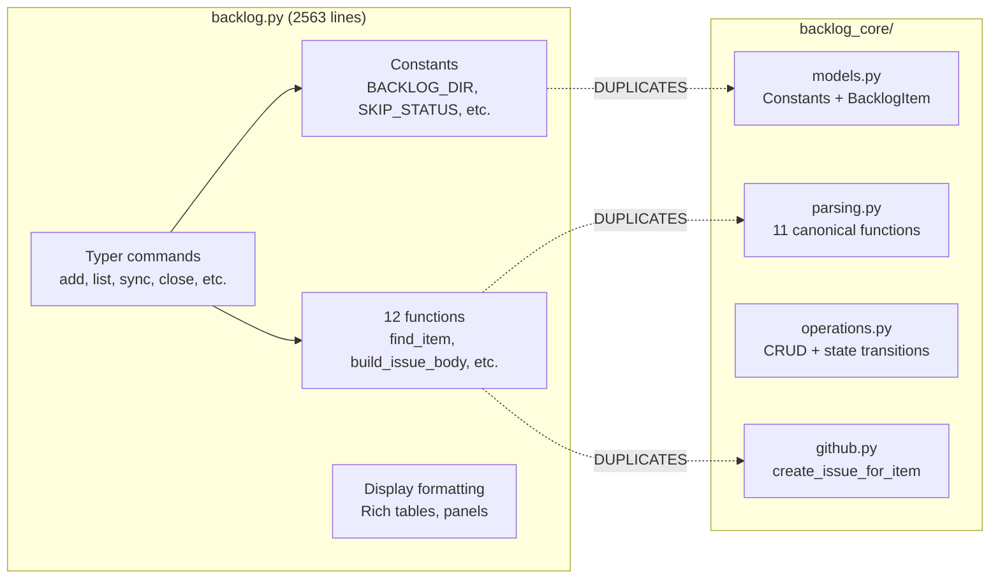
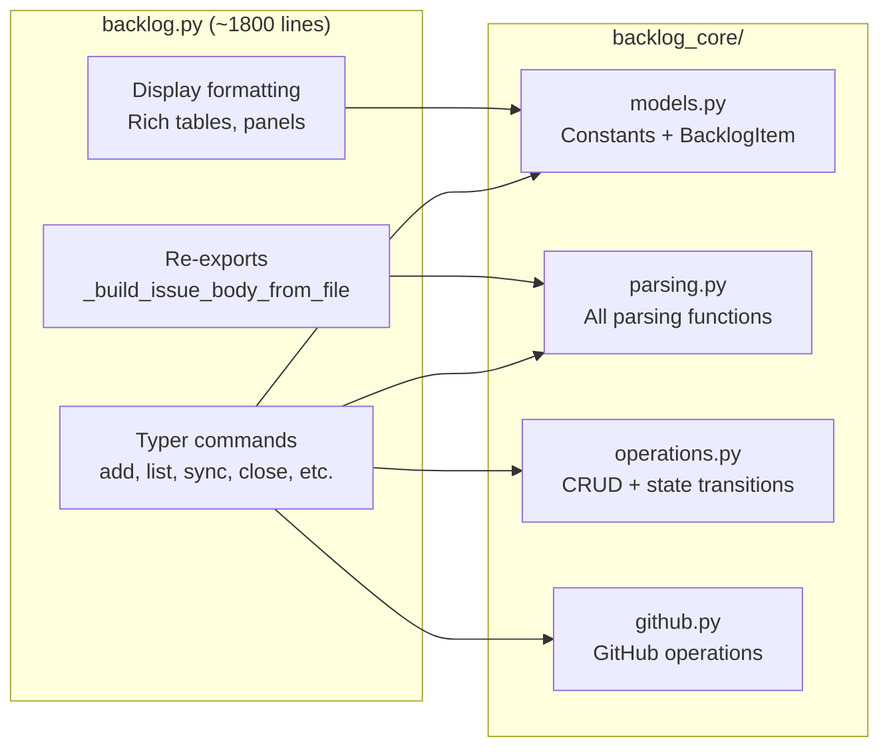
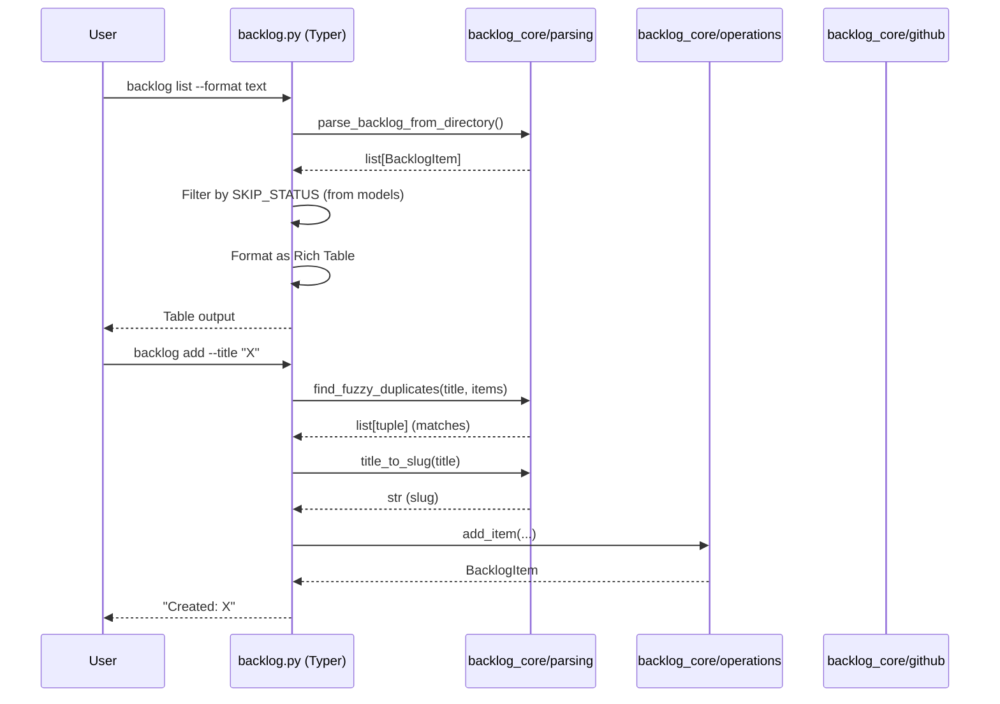

# Architecture Spec: Backlog CLI Deduplication

**Issue**: Fixes #611
**Scope**: Replace duplicated functions/constants in `backlog.py` with imports from `backlog_core/`
**Constraint**: No new dependencies, no behavioral changes (except SKIP_STATUS bug fix), all 12 test files pass

---

## 1. Executive Summary

Replace 12 duplicated functions and 7 duplicated constants in `backlog.py` (2563 lines) with imports from `backlog_core/`. The CLI becomes a thin Typer wrapper: argument parsing, output formatting (Rich), and exit code translation. All business logic delegates to `backlog_core/`.

The key architectural decision is **adapter placement at the CLI command boundary** (ADR-004). Each Typer command that currently works with `dict` items will call `backlog_core` functions that return `BacklogItem`, then convert to display format at the output boundary. No new adapter module is introduced -- conversion is a one-liner (`item.model_dump()`) at each call site.

The SKIP_STATUS bug (CLI missing `"CLOSED"`) is fixed as a natural consequence of importing the canonical constant from `backlog_core/models.py`.

**Design decisions resolved:**

| Question | Decision |
|----------|----------|
| Q1: Adapter placement | CLI boundary -- commands call core directly, convert BacklogItem to dict/display at output |
| Q2: Bug fix bundling | Step 1 is a standalone commit (constants only), SKIP_STATUS fix is verifiable in isolation |
| Q3: Core internal cleanup | Bundled -- core's `parse_item_file` will use `SKIP_STATUS` from models (FIND-14/15 fix) |
| Q4: CLI-only function migration | All 12 have confirmed core equivalents -- replace all with imports |
| Q5: Test adaptation | CLI re-exports `_build_issue_body_from_file` as thin wrapper so existing importlib tests pass |

## 2. Architecture Overview

### Current State (duplication)

### Target State (thin wrapper)

### Call Flow: CLI Command Execution (After Dedup)

## 3. Technology Stack

No new technology. This refactoring operates within the existing stack:

- **CLI**: Typer 0.21+ with Rich console output
- **Models**: Pydantic 2.x (`BacklogItem` in `backlog_core/models.py`)
- **Testing**: pytest 8+ (12 existing test files)
- **Distribution**: PEP 723 standalone script (`backlog.py`)

## 4. Component Design — Module Boundaries and Migration Categorization

<!-- PENDING: Component design with migration table -->

## 5. Data Architecture — Adapter Pattern

<!-- PENDING: Data architecture with adapter interfaces -->

## 6. Security Architecture

No changes. Credential management (GITHUB_TOKEN via environment variable) is unaffected. The refactoring does not alter any security surface.

## 7. Testing Architecture

<!-- PENDING: Testing architecture with coupling fix -->

## 8. Distribution Architecture

No changes. `backlog.py` remains a PEP 723 standalone script with the same shebang and dependency block. The `backlog_core/` package remains an unpackaged sibling directory imported via `sys.path`.

## 9. Architectural Decisions (ADRs)

<!-- PENDING: ADRs -->

## 10. Incremental Rollout Sequence

<!-- PENDING: Rollout sequence with steps -->
