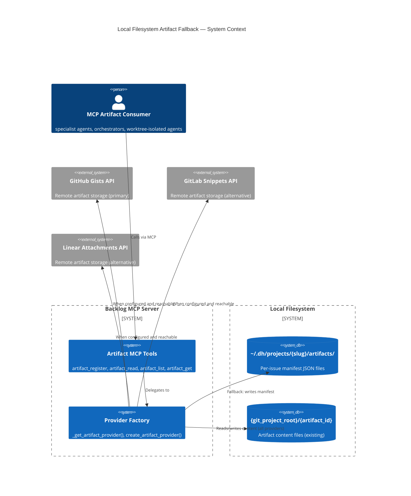
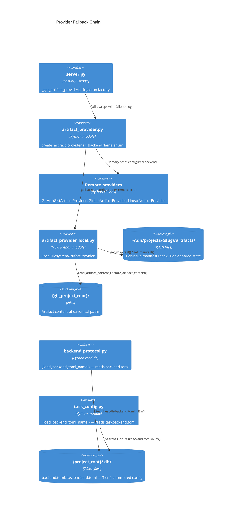
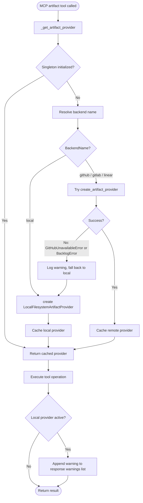

> **SUPERSEDED — DO NOT IMPLEMENT THIS DESIGN.** Current authority: [`backlog_core/ARCHITECTURE.md`](../plugins/development-harness/backlog_core/ARCHITECTURE.md) and [`architect-backlog-snapshot-reconciliation.md`](./architect-backlog-snapshot-reconciliation.md). Invalid assumption: a **local fallback** may substitute for provider-owned storage.

# Architecture Spec: Local Filesystem Artifact Fallback

**Issue:** #2273
**Agent:** python-cli-design-spec
**Date:** 2026-05-14
**Plan:** P134d7738-architect-local-filesystem-artifact-fallback

---

## Table of Contents

1. [Executive Summary](#1-executive-summary)
2. [Architecture Overview](#2-architecture-overview)
3. [Technology Stack](#3-technology-stack)
4. [Component Design](#4-component-design)
5. [Data Architecture](#5-data-architecture)
6. [Type System Design](#6-type-system-design)
7. [Security Architecture](#7-security-architecture)
8. [Testing Architecture](#8-testing-architecture)
9. [Distribution Architecture](#9-distribution-architecture)
10. [Architectural Decisions (ADRs)](#10-architectural-decisions-adrs)
11. [Scalability Strategy](#11-scalability-strategy)

---

## 1. Executive Summary

This spec defines the interfaces, contracts, data models, and call flows required to add a
`LocalFilesystemArtifactProvider` to `plugins/development-harness/backlog_core/`. The provider
implements the existing `ArtifactBackend` protocol and serves as a fallback when no remote
backend (GitHub, GitLab, Linear) is reachable or configured.

### Problem Being Solved

`_get_artifact_provider()` in `server.py` raises `GitHubUnavailableError` immediately when
`DEFAULT_REPO` is unset. `create_artifact_provider()` rejects `sqlite` and `memory` backend
names for artifact storage. The result: every call to `artifact_register`, `artifact_read`,
`artifact_list`, and `artifact_get` fails in any environment without remote backend credentials,
causing agents to invent fallback filesystem paths (`plan/*.md`, `.claude/reports/*.md`,
`.dh/plans/*.yaml`) that are inconsistent, non-canonical, and invisible from worktree-isolated
agents.

### Approach

Four changes to two existing files plus one new module:

1. **New module** — `backlog_core/artifact_provider_local.py`: implements
   `LocalFilesystemArtifactProvider` satisfying the `ArtifactBackend` protocol. Manifest stored
   as per-issue files at `~/.dh/projects/{slug}/artifacts/{issue_number}.json` (Tier 2, outside
   the repo, accessible identically from all worktrees). Artifact content files remain at
   `{git_project_root}/{artifact_id}` (unchanged convention). Atomic writes via `os.replace()`
   over a tempfile in the same directory.

2. **`BackendName` enum extension** — add `local = "local"` to the existing `StrEnum` in
   `artifact_provider.py`.

3. **`create_artifact_provider()` routing** — add one branch handling `BackendName.local`.

4. **`_get_artifact_provider()` fallback chain** — try the configured remote provider first;
   catch `GitHubUnavailableError` and `BacklogError` and fall back to the local provider,
   appending a warning to the response context.

5. **Backend TOML search path** — insert `project_root / ".dh" / _BACKEND_TOML_FILENAME` into
   the `search_paths` list in both `_load_backend_toml_name()` locations
   (`backlog_core/backend_protocol.py` and `sam_schema/core/task_config.py`).

### Resolved Design Questions

The following open questions from `feature-context-local-filesystem-artifact-fallback.md` are
resolved here and incorporated into the design:

| Q# | Question | Resolution |
|----|----------|------------|
| Q1 | Fallback semantics | Fallback activates on (a) no backend configured, (b) configured remote raises at runtime. Explicit `BACKLOG_BACKEND=local` also activates it. |
| Q2 | Surface signal | Append a warning string to the `warnings` list on every response while local provider is active. |
| Q3 | Manifest structure | Single JSON file per-issue at `~/.dh/projects/{slug}/artifacts/{issue_number}.json`. NOT the single global file described in the original issue — see ADR-001. |
| Q4 | `sync_to_remote()` stub | Returns `{"status": "deferred", "reason": "local provider has no configured remote"}` so callers can pattern-match without crashing. |
| Q5 | `BACKLOG_BACKEND=local` | Yes — `local` is a first-class `BackendName` entry, explicitly selectable. |
| Q6 | sqlite + artifact coupling | `BACKLOG_BACKEND=sqlite` (issue CRUD) and `local` artifact provider are independent. sqlite backend auto-pairs with local artifact fallback when no artifact-capable backend is configured. |
| Q7 | `content=` on register | Write to disk at `{git_project_root}/{artifact_id}` if the file does not exist; leave it unchanged if it does. Always update the manifest entry regardless. |
| Q8 | Documentation | Out of scope for this arch spec; tracked as a documentation follow-up task. |
| Q9 | Gitignore | The manifest files at `~/.dh/` are outside the repo — no gitignore decision needed. Content files at canonical paths (`plan/*.md`) follow the repo's existing gitignore. |
| Q10 | SAM search path symmetry | Yes — both `backend_protocol.py` and `task_config.py` receive the same search-path addition. |

### Note on Manifest Location

The original issue body and the `feature-context` artifact describe the manifest at
`{project_root}/.dh/artifacts.json`. The project owner subsequently moved this to Tier 2:
`~/.dh/projects/{slug}/artifacts/{issue_number}.json`. This spec implements the Tier 2 location.
The feature-context artifact is stale on this point. The Tier 2 location resolves the worktree
isolation concern: `~/.dh/` is the same absolute path from every worktree of the same project.

## 2. Architecture Overview

### C4 Context Diagram



### C4 Container Diagram — Fallback Chain



### Fallback Decision Flow



### Per-Call vs Once-Per-Session Fallback

The `_artifact_provider` global singleton is initialized once per server session (lazy init on
first call). Fallback is **once-per-session**: if the remote is unavailable at the time of the
first artifact call, all subsequent calls in that session use the local provider. This avoids
per-call overhead and is consistent with the existing singleton pattern. The session must restart
to re-attempt the remote backend.

**Rationale**: Per-call fallback would allow transparent recovery from transient errors but would
also cause inconsistent behavior within a session — some calls routed to remote, others to local,
with no guarantee the same artifact is accessible from both. Session-scoped fallback is simpler
and ensures all artifacts in a session use one storage tier.

## 3. Technology Stack

This feature adds to an existing plugin module. No new top-level dependencies are introduced.
All components listed below already exist in `plugins/development-harness/`.

### Existing Dependencies Used

| Component | Library | Version | Justification |
|-----------|---------|---------|---------------|
| JSON serialization | `json` (stdlib) | 3.11+ | Manifest files are JSON; no schema evolution requiring a third-party library |
| Atomic writes | `os`, `tempfile` (stdlib) | 3.11+ | `os.replace()` + `NamedTemporaryFile` in same directory provides atomic rename |
| Path resolution | `pathlib.Path` (stdlib) | 3.11+ | Existing pattern across all providers |
| TOML reading | `tomllib` (stdlib) | 3.11+ | `_load_backend_toml_name()` already uses `tomllib` for read-only TOML parsing |
| File locking | `fcntl` (stdlib, POSIX) | 3.11+ | Advisory locks for concurrent manifest writers; see Scalability section |
| Data models | Pydantic (existing) | 2.x | `ArtifactManifest` and `ArtifactEntry` models already defined in `models.py` |
| State paths | `dh_paths` (existing) | internal | `state_root()`, `git_project_root()`, `compute_slug()` — no changes required |

### Tools (existing, no change)

| Tool | Purpose |
|------|---------|
| `ruff` | Linting and formatting |
| `ty` | Type checking (Astral) |
| `pytest` | Test execution |
| `uv` | Dependency management |

### No New Dependencies

The local provider does not require:

- `filelock` or `portalocker` — stdlib `fcntl.flock()` is sufficient for POSIX; Windows is not
  a target environment for this plugin (all agents run on Linux/macOS)
- `pydantic-settings` — backend selection already uses env vars read directly; no new config layer
- Any new third-party library

### Python Version

Python 3.11+ (matches existing `backlog_core` requirement). Uses:

- `str | None` pipe union syntax throughout
- `from __future__ import annotations` at file top
- `StrEnum` for `BackendName`
- Builtin generics: `list[str]`, `dict[str, ...]`

## 4. Component Design

This is a backend protocol implementation, not a Typer CLI. The standard cli/core/services/utils
layer structure does not apply. Components are described by their module and role within the
existing `backlog_core` architecture.

### 4.1 New Module: `backlog_core/artifact_provider_local.py`

**Purpose:** Implements `ArtifactBackend` protocol using the local filesystem. Manifest stored
in `~/.dh/projects/{slug}/artifacts/{issue_number}.json`. Content files at
`{git_project_root}/{artifact_id}` (reads existing files; writes only when `content=` is
supplied and the file does not already exist).

**Dependencies:**

- `backlog_core.models.ArtifactManifest`, `ArtifactEntry` — data models (no change)
- `backlog_core.artifact_provider.ArtifactBackend` — protocol (no change)
- `dh_paths.state_root`, `dh_paths.git_project_root` — path resolution (no change)
- `json`, `os`, `tempfile`, `fcntl`, `pathlib`, `datetime` — stdlib only

**Class Interface:**

```python
from __future__ import annotations

import os
import json
import fcntl
import tempfile
from datetime import datetime, timezone
from pathlib import Path
from typing import Literal

from backlog_core.models import ArtifactManifest, ArtifactEntry


class LocalFilesystemArtifactProvider:
    """ArtifactBackend implementation using the local filesystem.

    Manifest stored at: ~/.dh/projects/{slug}/artifacts/{issue_number}.json
    Content stored at:  {git_project_root}/{artifact_id}

    All writes are atomic (tempfile + os.replace). Concurrent writers
    are serialized via fcntl.LOCK_EX advisory locking on a per-issue
    .lock file in the same directory.

    Args:
        root_worktree: The git project root. Used for content file paths.
        manifest_dir: Directory for per-issue manifest JSON files.
            Defaults to state_root() / "artifacts".
    """

    def __init__(
        self,
        root_worktree: Path,
        manifest_dir: Path | None = None,
    ) -> None: ...

    # ------------------------------------------------------------------
    # ArtifactBackend protocol — required methods
    # ------------------------------------------------------------------

    def get_manifest(self, issue_number: int) -> ArtifactManifest:
        """Return the artifact manifest for issue_number.

        Returns an empty ArtifactManifest (not an error) when no manifest
        file exists yet.

        Args:
            issue_number: GitHub issue number identifying the artifact set.

        Returns:
            Populated or empty ArtifactManifest for this issue.

        Raises:
            ValueError: If the manifest file exists but is not valid JSON
                or does not conform to the ArtifactManifest schema.
        """
        ...

    def set_manifest(self, issue_number: int, manifest: ArtifactManifest) -> None:
        """Persist the manifest for issue_number.

        Writes are atomic: content is written to a tempfile in the same
        directory as the manifest, then renamed via os.replace(). The
        rename is serialized under an fcntl.LOCK_EX advisory lock on a
        per-issue .lock file to prevent concurrent writers from
        interleaving partial reads and writes.

        Args:
            issue_number: GitHub issue number.
            manifest: Updated manifest to persist.

        Raises:
            OSError: If the manifest directory cannot be created or the
                file cannot be written.
        """
        ...

    def read_artifact_content(self, path: str) -> str:
        """Read artifact file content from the root worktree.

        Args:
            path: Repo-relative path (e.g., "plan/architect-foo.md").

        Returns:
            File content as a UTF-8 string.

        Raises:
            ValueError: If path escapes the root worktree (traversal attack).
            FileNotFoundError: If the file does not exist.
        """
        ...

    def store_artifact_content(
        self,
        issue_number: int,
        artifact_type: str,
        path: str,
        content: str,
    ) -> None:
        """Store artifact content on the local filesystem.

        Writes content to {root_worktree}/{path} only if the file does
        not already exist. If the file exists, this method is a no-op for
        the file write (the manifest entry is always updated via
        set_manifest, which the caller handles separately).

        Args:
            issue_number: GitHub issue number (for future sync metadata).
            artifact_type: Artifact type string (for future sync metadata).
            path: Repo-relative destination path.
            content: UTF-8 content to write.

        Raises:
            ValueError: If path escapes the root worktree.
            OSError: If the parent directory cannot be created.
        """
        ...

    def read_artifact_content_from_remote(
        self,
        issue_number: int,
        artifact_type: str,
        path: str,
    ) -> str | None:
        """Attempt to read artifact content from the local filesystem.

        For the local provider, "remote" is the local disk. This method
        reads from {root_worktree}/{path} if the file exists.

        Args:
            issue_number: GitHub issue number (unused for local provider).
            artifact_type: Artifact type string (unused for local provider).
            path: Repo-relative path to read.

        Returns:
            File content as a UTF-8 string, or None if the file does not exist.
        """
        ...

    def read_local_artifact_content(self, path: str) -> str | None:
        """Read artifact file content without raising on missing file.

        Args:
            path: Repo-relative path.

        Returns:
            File content, or None if missing or path is unsafe.
        """
        ...

    # ------------------------------------------------------------------
    # Sync stub (future capability)
    # ------------------------------------------------------------------

    def sync_to_remote(
        self,
        backend: ArtifactBackend | None = None,
    ) -> dict[str, str]:
        """Sync locally-stored artifacts to a remote backend.

        Not implemented. Returns a deferred-status dict so callers can
        pattern-match without raising an exception.

        Args:
            backend: Optional remote ArtifactBackend to sync to.
                When None, returns deferred status immediately.

        Returns:
            Dict with keys "status" ("deferred") and "reason" (str).
        """
        ...

    # ------------------------------------------------------------------
    # Internal helpers (not part of ArtifactBackend protocol)
    # ------------------------------------------------------------------

    def _manifest_path(self, issue_number: int) -> Path:
        """Return the path to the manifest JSON file for issue_number."""
        ...

    def _lock_path(self, issue_number: int) -> Path:
        """Return the path to the advisory lock file for issue_number."""
        ...

    def _validate_artifact_path(self, path: str) -> Path:
        """Resolve and validate a repo-relative path.

        Raises ValueError if the resolved path escapes root_worktree.
        Returns the resolved absolute Path.
        """
        ...
```

### 4.2 Modified: `backlog_core/artifact_provider.py`

**Change 1 — `BackendName` enum (line ~76):**

Add `local = "local"` to the existing `StrEnum`. No other changes to the enum.

```python
class BackendName(StrEnum):
    """Canonical identifiers for pluggable artifact storage backends."""
    github = "github"
    linear = "linear"
    gitlab = "gitlab"
    sqlite = "sqlite"
    memory = "memory"
    local = "local"   # NEW
```

**Change 2 — `create_artifact_provider()` (line ~1264):**

Add one routing branch before the `sqlite`/`memory` rejection block:

```python
# Interface addition — not implementation
def create_artifact_provider(
    backend_name: str | None = None,
    repo: str | None = None,
    root_worktree: Path | None = None,
) -> ArtifactBackend:
    resolved = backend_name or os.environ.get("BACKLOG_BACKEND") or "github"
    # ... existing github / linear / gitlab branches ...
    if resolved in {BackendName.local, "local"}:
        # root_worktree resolved via dh_paths when not provided
        return LocalFilesystemArtifactProvider(
            root_worktree=root_worktree or dh_paths.git_project_root(),
            manifest_dir=None,  # defaults to state_root() / "artifacts"
        )
    # ... existing sqlite/memory rejection and unknown fallback ...
```

**Module placement decision:** The new class lives in a new sibling module
`artifact_provider_local.py` and is imported into `artifact_provider.py` via a top-level
import. This avoids further growing the already ~1300-line `artifact_provider.py`. The
existing three remote providers are candidates for the same split in a future refactoring;
this spec does not prescribe that work.

### 4.3 Modified: `backlog_core/server.py`

**Change — `_get_artifact_provider()` fallback chain (line ~2361):**

```python
# Interface contract — not implementation
def _get_artifact_provider() -> ArtifactBackend:
    """Return (or lazily create) the ArtifactBackend singleton.

    Resolution order:
    1. Return cached singleton if already initialized.
    2. Try to create the configured remote provider.
    3. On GitHubUnavailableError or BacklogError, fall back to
       LocalFilesystemArtifactProvider and record a session warning.

    Returns:
        Initialized ArtifactBackend instance (remote or local).

    Raises:
        OSError: If the local fallback provider cannot initialize its manifest directory
            (e.g., filesystem permission denied). All other errors are caught internally
            and trigger fallback activation; this is the last-resort path.
    """
    ...
```

The function must set `_artifact_provider_warning: str | None` module-level alongside the
existing `_artifact_provider` global. All artifact MCP tool responses must append this warning
to their `warnings` list when it is not `None`.

**Signature of warning string (informational):**

```text
"Artifacts stored in local filesystem provider. Remote sync unavailable."
```

### 4.4 Modified: `backlog_core/backend_protocol.py`

**Change — `_load_backend_toml_name()` search path (line ~984):**

Insert `project_root / ".dh" / _BACKEND_TOML_FILENAME` into the `search_paths` list between
the existing project root entry and the `~/.dh/` user-home entry.

```python
# Before (two entries):
search_paths.append(project_root / _BACKEND_TOML_FILENAME)          # {project_root}/backend.toml
search_paths.append(Path.home() / ".dh" / _BACKEND_TOML_FILENAME)   # ~/.dh/backend.toml

# After (three entries):
search_paths.append(project_root / _BACKEND_TOML_FILENAME)           # {project_root}/backend.toml
search_paths.append(project_root / ".dh" / _BACKEND_TOML_FILENAME)   # {project_root}/.dh/backend.toml  NEW
search_paths.append(Path.home() / ".dh" / _BACKEND_TOML_FILENAME)    # ~/.dh/backend.toml
```

### 4.5 Modified: `sam_schema/core/task_config.py`

**Change — `_load_backend_toml_name()` search path (line ~109):**

Identical structure to 4.4, using `_TASK_BACKEND_TOML_FILENAME` (or whatever the constant is
named in that file). Insert `project_root / ".dh" / filename` between project-root and
user-home entries.

## 5. Data Architecture

### 5.1 Manifest JSON Schema

Each issue has its own manifest file. This avoids write contention between agents working on
different issues concurrently (a common pattern under parallel dispatch).

**File location:** `~/.dh/projects/{slug}/artifacts/{issue_number}.json`

**JSON structure:**

```json
{
  "issue_number": 2273,
  "artifacts": [
    {
      "artifact_type": "feature-context",
      "artifact_id": "plan/feature-context-local-filesystem-artifact-fallback.md",
      "status": "current",
      "created_at": "2026-05-14T10:30:00Z",
      "agent": "feature-researcher",
      "storage_tier": "local",
      "content_path": "plan/feature-context-local-filesystem-artifact-fallback.md"
    }
  ],
  "last_updated": "2026-05-14T10:30:00Z",
  "schema_version": "1"
}
```

**Field definitions:**

| Field | Type | Required | Description |
|-------|------|----------|-------------|
| `issue_number` | `int` | Yes | GitHub issue number; must match filename |
| `artifacts` | `list[ArtifactEntry]` | Yes | Ordered list of registered artifact entries |
| `last_updated` | `str` (ISO 8601) | Yes | Timestamp of most recent `set_manifest()` call |
| `schema_version` | `str` | Yes | Always `"1"` in this implementation; enables future migration |

**`ArtifactEntry` fields (extending the existing Pydantic model):**

| Field | Type | Required | Description |
|-------|------|----------|-------------|
| `artifact_type` | `str` | Yes | Canonical type: `feature-context`, `architect`, etc. |
| `artifact_id` | `str` | Yes | Repo-relative path (primary key within an issue manifest) |
| `status` | `str` | Yes | `draft`, `current`, `superseded`, `archived` |
| `created_at` | `str` (ISO 8601) | Yes | When this entry was first registered |
| `agent` | `str \| None` | No | Name of the producing agent |
| `storage_tier` | `"local" \| "remote"` | No (default: `"remote"`) | Distinguishes local-only from synced entries |
| `content_path` | `str \| None` | No | Repo-relative path of content file (same as `artifact_id` for local provider) |

**Note on `storage_tier`:** The existing `ArtifactManifest` and `ArtifactEntry` models in
`models.py` may not include `storage_tier`. The implementer must either extend the existing
models or add the field as an optional extra. The preferred approach is to add
`storage_tier: Literal["local", "remote"] = "remote"` as a `NotRequired` field via
Pydantic's `model_config = {"extra": "allow"}` or an explicit optional field. This keeps
backward compatibility with GitHub provider manifests that do not include the field.

### 5.2 Manifest Directory Layout

```text
~/.dh/projects/-home-user-repos-myproject/
├── artifacts/
│   ├── 2273.json         ← manifest for issue #2273
│   ├── 2273.lock         ← advisory lock file (created on first write)
│   ├── 2274.json
│   └── 2274.lock
├── backlog/              ← existing (unchanged)
├── plan/                 ← existing (unchanged)
└── context/              ← existing (unchanged)
```

### 5.3 Content File Convention (unchanged)

Artifact content files remain at `{git_project_root}/{artifact_id}`, consistent with the
existing convention documented in `artifact-conventions.md`. Examples:

```text
{git_project_root}/
├── plan/
│   ├── architect-local-filesystem-artifact-fallback.md   ← artifact_id = "plan/architect-..."
│   ├── feature-context-local-filesystem-artifact-fallback.md
│   └── codebase/
│       └── codebase-analysis-local-filesystem-artifact-fallback.md
```

The local provider does NOT duplicate content files. It reads from and writes to these
canonical paths. The GitHub provider stores a second copy in a Gist; the local provider
does not have an equivalent remote store.

### 5.4 Backend TOML Schema (unchanged structure, new search path)

Existing `backend.toml` schema is unchanged. The new search path
`{project_root}/.dh/backend.toml` is added to the discovery order. Contents remain:

```toml
[backend]
name = "local"   # valid: "github", "gitlab", "linear", "sqlite", "memory", "local"
```

Same schema applies to `taskbackend.toml` for the SAM backend.

### 5.5 Configuration Schema

The local provider reads these environment variables (all existing, no new env vars):

| Env var | Purpose | Effect on local provider |
|---------|---------|--------------------------|
| `BACKLOG_BACKEND` | Backend name | `"local"` selects local provider explicitly |
| `DH_STATE_HOME` | Override `~/.dh/` base | Changes manifest directory root |
| `DH_PROJECT_ROOT` / `CLAUDE_PROJECT_DIR` | Override git project root | Changes content file resolution |

## 6. Type System Design

### 6.1 Domain Identifier Inventory

| Identifier | Type | Current state | Spec prescription |
|------------|------|---------------|-------------------|
| Backend name | `BackendName(StrEnum)` | EXISTS — 5 members | Add `local = "local"` member |
| Artifact type | bare `str` (in protocol signatures) | EXISTS — constrained by convention | No change prescribed; enum migration is future work |
| Artifact status | bare `str` (`"draft"`, `"current"`, etc.) | EXISTS — constrained by convention | No change prescribed |
| Storage tier | `Literal["local", "remote"]` | DOES NOT EXIST | Add to `ArtifactEntry` as optional field |
| Issue number | bare `int` | EXISTS throughout | No change; satisfactory for current use |
| Repo-relative path | bare `str` | EXISTS throughout | No change; validated at runtime via `_validate_artifact_path` |

### 6.2 `BackendName` — Type Contract

- **Definition:** `class BackendName(StrEnum)` in `artifact_provider.py`
- **Creation:** Constructed from user-supplied string via `StrEnum` membership check in
  `create_artifact_provider()` routing logic; from env var string via `os.environ.get()`;
  from TOML file via `_load_backend_toml_name()`. All three creation sites use the string
  value — StrEnum coerces from string on equality comparison.
- **Validation:** Membership in the enum's known values. Unknown strings fall through to the
  `raise BacklogError(f"Unknown artifact backend: '{resolved}'")` branch.
- **Consumption:** `create_artifact_provider()` routing (`if resolved in {BackendName.local, "local"}`);
  `_load_backend_toml_name()` return value; MCP error messages.
- **Serialisation:** `StrEnum` members serialise as their string value. JSON-serialisable
  without a custom encoder.
- **Invariant:** Every value accepted by `create_artifact_provider()` must have a corresponding
  `BackendName` member. The `sqlite`/`memory` members are retained for backward compatibility
  with issue CRUD backends even though they do not produce artifact providers.

### 6.3 `StorageTier` — Type Contract

- **Definition:** `Literal["local", "remote"]` field on `ArtifactEntry`
- **Creation:** Set to `"local"` by `LocalFilesystemArtifactProvider.set_manifest()`;
  set to `"remote"` (default) by remote providers that do not explicitly set it.
- **Validation:** Pydantic field validation at model construction. The field is
  `NotRequired` with default `"remote"` so existing Gist manifests deserialize without error.
- **Consumption:** `artifact_read` and `artifact_list` MCP tools may surface this in their
  response dicts to inform callers of storage tier.
- **Serialisation:** Stored as a JSON string in the manifest file. Round-trips without
  transformation.
- **Invariant:** Every `ArtifactEntry` produced by `LocalFilesystemArtifactProvider` has
  `storage_tier == "local"`.

### 6.4 Boundary Validation Map

| Boundary | Input type | Validation mechanism | What is checked |
|----------|------------|---------------------|-----------------|
| `_load_backend_toml_name()` → `create_artifact_provider()` | `str \| None` | `isinstance(name, str) and name` in existing code | Non-empty string |
| `BACKLOG_BACKEND` env var → routing | `str` | `resolved in {BackendName.local, "local"}` | Known enum member |
| `artifact_id` path entering `store_artifact_content()` | `str` | `_validate_artifact_path()` | No path traversal |
| Manifest JSON read from disk → `ArtifactManifest` | `dict[str, ...]` | `ArtifactManifest.model_validate()` | Schema conformance |
| `content` string written to disk | `str` | none (caller-validated) | N/A |

**Key boundary rule:** The manifest JSON file on disk is an external data source and must be
deserialized via `ArtifactManifest.model_validate(json.loads(raw))`, never by direct dict
construction. This prevents schema drift from corrupting the in-memory manifest.

### 6.5 Weak Type Audit

The `ArtifactBackend` protocol uses bare `str` for `artifact_type` and `path` in several
method signatures. These are pre-existing and out of scope for this feature — no weak types
are introduced by the local provider. The implementer must not introduce `Any`, `object`, or
`cast()` calls in `artifact_provider_local.py`.

The one deliberate use of `Any` permitted: if `dh_paths` functions have incomplete type
annotations, the call sites in `LocalFilesystemArtifactProvider.__init__` may require
`# type: ignore[...]` comments. The implementer should prefer fixing the `dh_paths`
annotations over adding ignores.

### 6.6 `from __future__ import annotations`

Required at the top of `artifact_provider_local.py` and in any modified file that introduces
new annotations. This is already the convention in `artifact_provider.py` (verify before
implementing).

## 7. Security Architecture

### Security Checklist

- [x] **Path traversal prevention** — `_validate_artifact_path()` resolves the candidate path
  with `Path.resolve()` and verifies it starts with `root_worktree.resolve()`. This pattern
  is copied verbatim from `GitHubGistArtifactProvider` (lines 499–501 of `artifact_provider.py`).
  The local provider must apply the same check to every path it writes.
- [x] **Manifest directory permissions** — `~/.dh/` is user-owned. The `artifacts/`
  subdirectory should be created with `mkdir(mode=0o700, parents=True, exist_ok=True)` to
  prevent other local users from reading artifact manifests.
- [x] **No shell=True** — all file operations use Python stdlib (`pathlib`, `os`, `json`).
  No subprocess calls in the local provider.
- [x] **No credentials stored** — the local provider holds no tokens, API keys, or passwords.
- [x] **Tempfile safety** — `tempfile.NamedTemporaryFile(dir=parent, delete=False)` creates
  the temp file in the same directory as the target, ensuring `os.replace()` is atomic (same
  filesystem, not a cross-device rename). The temp file inherits the parent directory's
  permissions.
- [x] **Lock file cleanup** — `.lock` files are created once and reused. They are NOT deleted
  after each operation (deletion under lock creates a TOCTOU window). Lock files survive
  process crashes; `fcntl.flock()` is automatically released on process exit.
- [ ] **Rate limiting** — N/A; local filesystem has no rate limiting concerns.
- [ ] **Certificate validation** — N/A; no network calls in local provider.

### Content File Permission

When `store_artifact_content()` creates a new file at `{git_project_root}/{artifact_id}`,
it should use the default umask (not force a specific mode) so the file inherits the
project's standard permissions. This matches the behavior of `git` and editors.

### Warning Signal Security

The session warning string appended to MCP responses must not include the full manifest
path (which could expose `~` home directory structure to log aggregators). Use a
template that omits the absolute path:

```text
"Artifacts stored in local filesystem provider. Remote sync unavailable."
```

Full path is available via the `_manifest_path()` helper when an agent needs it explicitly.

## 8. Testing Architecture

### Strategy

This is a protocol implementation with pure filesystem I/O. No network calls. Tests can run
fully offline with no mocks for the happy path — only concurrent-write scenarios require
threading or multiprocessing.

Coverage target: **90% line and branch** for `artifact_provider_local.py` (critical path:
data integrity, concurrency, path safety). The two modified routing functions
(`create_artifact_provider`, `_get_artifact_provider`) require **95% branch coverage** to
ensure all fallback transitions are covered.

### Test Directory

Tests for the new module live alongside existing artifact provider tests:

```text
plugins/development-harness/tests/
├── conftest.py
├── test_artifact_provider_local.py      ← NEW: unit tests for LocalFilesystemArtifactProvider
├── test_artifact_provider_fallback.py   ← NEW: integration tests for _get_artifact_provider fallback chain
└── test_backend_toml_search.py          ← NEW: parametric tests for .dh/ search path additions
```

### Test Categories

#### Unit Tests — `LocalFilesystemArtifactProvider`

Test each method in isolation using `tmp_path` pytest fixture for all filesystem operations.

**Scenarios required:**

| Scenario | Test name pattern |
|----------|-------------------|
| `get_manifest` on nonexistent file returns empty manifest | `test_get_manifest_nonexistent_returns_empty` |
| `get_manifest` on existing file returns parsed manifest | `test_get_manifest_existing_returns_data` |
| `get_manifest` on corrupt JSON raises `ValueError` | `test_get_manifest_corrupt_json_raises` |
| `set_manifest` creates file when absent | `test_set_manifest_creates_file` |
| `set_manifest` overwrites existing file atomically | `test_set_manifest_atomic_overwrite` |
| `read_artifact_content` reads existing file | `test_read_artifact_content_existing` |
| `read_artifact_content` raises `FileNotFoundError` when missing | `test_read_artifact_content_missing` |
| `read_artifact_content` raises `ValueError` on path traversal | `test_read_artifact_content_traversal` |
| `store_artifact_content` writes new file | `test_store_artifact_content_new_file` |
| `store_artifact_content` is no-op when file exists | `test_store_artifact_content_existing_noop` |
| `read_artifact_content_from_remote` returns content when file exists | `test_read_from_remote_existing` |
| `read_artifact_content_from_remote` returns None when missing | `test_read_from_remote_missing` |
| `read_local_artifact_content` returns None on unsafe path | `test_read_local_unsafe_path` |
| `sync_to_remote` returns deferred dict | `test_sync_to_remote_returns_deferred` |

#### Integration Tests — Fallback Chain

Test the full `_get_artifact_provider()` fallback logic. These tests patch `get_default_repo()`
and `create_artifact_provider()` to control when remote initialization fails.

**Scenarios required:**

| Scenario | Test name pattern |
|----------|-------------------|
| No `DEFAULT_REPO` → returns local provider | `test_fallback_no_default_repo` |
| `GitHubUnavailableError` on remote init → falls back to local | `test_fallback_on_github_unavailable` |
| `BacklogError` on remote init → falls back to local | `test_fallback_on_backlog_error` |
| `BACKLOG_BACKEND=local` → selects local directly | `test_explicit_local_backend` |
| Valid remote config → returns remote provider | `test_remote_provider_when_configured` |
| Warning is set on fallback activation | `test_fallback_sets_session_warning` |
| Singleton is cached after first init | `test_singleton_cached` |

#### Parametric Tests — Backend TOML Search Path

Test that `_load_backend_toml_name()` in both `backend_protocol.py` and `task_config.py`
discovers `backend.toml` / `taskbackend.toml` when placed in `{project_root}/.dh/`.

```python
# pytest parametrize pattern (interface only — not implementation)
@pytest.mark.parametrize("subpath", [
    "backend.toml",           # project root level (existing)
    ".dh/backend.toml",       # new: Tier 1 committed config location
])
def test_load_backend_toml_name_search_order(tmp_path, subpath):
    ...
```

#### Concurrency Tests

Verify that concurrent `set_manifest()` calls from multiple threads do not produce corrupt or
truncated manifest files.

**Scenario:** 10 threads simultaneously call `set_manifest()` with distinct manifest payloads
on the same issue number. After all threads complete, `get_manifest()` must return a valid
manifest (one of the 10 payloads, not a corrupt intermediate state).

```python
# Pattern (interface only)
def test_concurrent_set_manifest_no_corruption(tmp_path):
    """10 concurrent writers — final state is a valid manifest."""
    import threading
    ...
```

This test validates the `fcntl.flock + os.replace` atomicity guarantee.

#### Property-Based Tests

Use `hypothesis` to validate path-safety invariants:

```python
# Pattern (interface only)
@given(path=st.text(min_size=1))
def test_validate_artifact_path_never_escapes_root(tmp_path, path):
    """No generated path bypasses the traversal check without raising."""
    provider = LocalFilesystemArtifactProvider(root_worktree=tmp_path)
    try:
        resolved = provider._validate_artifact_path(path)
        assert str(resolved).startswith(str(tmp_path.resolve()))
    except ValueError:
        pass  # traversal detected correctly
```

### Pytest Configuration

```toml
[tool.pytest.ini_options]
addopts = [
    "--cov=plugins/development-harness/backlog_core",
    "--cov-report=term-missing",
    "-v",
]
testpaths = ["plugins/development-harness/tests"]
markers = [
    "unit: fast isolated tests",
    "integration: tests requiring subprocess or cross-module calls",
    "slow: long-running tests (concurrency, property-based)",
    "critical: paths requiring mutation testing",
]

[tool.coverage.run]
branch = true
source = ["plugins/development-harness/backlog_core"]

[tool.coverage.report]
show_missing = true
fail_under = 80
```

### Mutation Testing

`artifact_provider_local._validate_artifact_path` is a security-critical function. It must
achieve ≥ 90% mutation kill rate:

```bash
uv run mutmut run --paths-to-mutate=plugins/development-harness/backlog_core/artifact_provider_local.py
uv run mutmut results
```

## 9. Distribution Architecture

N/A — this spec describes additions to an existing plugin module
(`plugins/development-harness/`), not a new distributable package or standalone script. The
new file `artifact_provider_local.py` is a regular Python module within the existing
`backlog_core` package. It is versioned and distributed as part of the plugin, which uses
automatic version bumping via the pre-commit hook on every commit that modifies plugin files.

No shebang, no PEP 723 metadata block, no separate packaging required.

## 10. Architectural Decisions (ADRs)

### ADR-001: Per-Issue Manifest Files Instead of Single Global File

**Decision:** Manifest index is stored as one JSON file per issue
(`~/.dh/projects/{slug}/artifacts/{issue_number}.json`) rather than a single global
`artifacts.json` file.

**Rationale:** The original issue text specified `{project_root}/.dh/artifacts.json` (single
global file). This creates a write-contention problem: concurrent agents working on different
issues simultaneously both write to the same file. Under `fcntl.flock()`, they are serialized
rather than parallelized, and any agent processing multiple issues in rapid succession
becomes the bottleneck. Per-issue files isolate writes by issue number — the common case under
parallel dispatch.

**Alternatives considered:**
- Single global file with per-issue sections: same write contention, more complex merge logic.
- SQLite database: avoids file-level locking but adds a new dependency and changes the
  "readable by inspection" property that JSON files have.

**Trade-off:** More files in the directory; directory listing includes one file per issue.
Acceptable for the expected scale (tens of issues per project, not thousands).

**Stale artifact note:** The feature-context artifact and the original issue body describe the
single-file location. This decision supersedes both. The Tier 2 location (`~/.dh/...`) also
supersedes the Tier 1 location (`{project_root}/.dh/...`) in those documents.

---

### ADR-002: Once-Per-Session Fallback (Not Per-Call)

**Decision:** The `_artifact_provider` global is initialized once per server session. If
fallback activates, it applies for the entire session.

**Rationale:** The existing singleton pattern (`global _artifact_provider`) was not designed
for per-call re-evaluation. Changing it to per-call would require removing the singleton,
adding per-call overhead, and risking inconsistent behavior within a session (some artifacts
in remote storage, others local). Session-scoped fallback ensures all artifacts in a session
use one storage tier, which is the correct invariant for the manifest-based design.

**Consequence:** A session started without GitHub credentials uses local storage for its
duration, even if credentials become available mid-session. Session restart is required to
re-attempt the remote backend.

---

### ADR-003: `fcntl.flock()` for Concurrency, Not `filelock`/`portalocker`

**Decision:** Use `fcntl.flock()` (stdlib, POSIX) for advisory locking on manifest writes.

**Rationale:** The development harness runs on Linux/macOS. `fcntl` is stdlib, zero-dependency,
and POSIX-guaranteed. The `filelock` and `portalocker` third-party libraries add dependencies
for cross-platform support (Windows) that is not needed here.

**Consequence:** If the plugin is ever ported to Windows, `fcntl` must be replaced with
`msvcrt.locking()` or a conditional import of a cross-platform library. This is acceptable
technical debt for the current target environment.

---

### ADR-004: New Module `artifact_provider_local.py` (Not In-File Addition)

**Decision:** The `LocalFilesystemArtifactProvider` class lives in a new sibling module
`artifact_provider_local.py`, imported into `artifact_provider.py` at the top.

**Rationale:** `artifact_provider.py` is already ~1300 lines and contains three complete
remote provider implementations. Adding a fourth implementation would push it past 1500 lines,
making it harder to navigate and review. Splitting preserves the single-responsibility
principle at the file level: each provider implementation is in its own module.

**Future implication:** The existing GitHub, GitLab, and Linear providers are candidates for
the same split in a follow-up refactoring. This spec does not prescribe that work but flags
it as desirable technical hygiene.

---

### ADR-005: `sync_to_remote()` Returns a Dict, Not `NotImplementedError`

**Decision:** `sync_to_remote()` returns `{"status": "deferred", "reason": "..."}` rather
than raising `NotImplementedError`.

**Rationale:** `NotImplementedError` forces every caller to wrap `sync_to_remote()` in a
try/except to handle the not-yet-implemented case. A stable dict return type allows callers
to pattern-match on `result["status"]` speculatively, enabling forward-compatible orchestration
code that already handles the "deferred" case without crashing. When a future implementation
fills in `sync_to_remote()`, it replaces the return value with a success result dict — no
caller changes required.

---

### ADR-006: Manifest Stored at Tier 2 (`~/.dh/`), Not Tier 1 (`{project_root}/.dh/`)

**Decision:** Manifest files live at `~/.dh/projects/{slug}/artifacts/{issue_number}.json`
(Tier 2 — shared user-level state, outside the repository).

**Rationale:** Tier 1 (`{project_root}/.dh/`) is committed config. Storing per-session
artifact manifests in a committed directory means every session produces a git-tracked change,
pollutes `git status`, and creates merge conflicts between developers. Tier 2 is the
established convention for mutable per-project state (plans, backlog cache, research) and
is accessible identically from all worktrees of the same project — resolving the worktree
isolation concern that motivated MCP-native storage in the first place.

**Resolves:** Feature context Q9 (gitignore) is made moot — files outside the repo have no
gitignore policy.

## 11. Scalability Strategy

### Concurrency Model

The primary scalability concern is concurrent manifest writes from multiple agents running
in parallel (the standard pattern per `CLAUDE.md` parallel execution rules).

**Write path:**

1. Open or create `{issue_number}.lock` in the manifest directory.
2. Acquire `fcntl.LOCK_EX` (exclusive advisory lock) — blocks until prior writer releases.
3. Write manifest JSON to a `tempfile.NamedTemporaryFile` in the same directory as the target.
4. Call `os.replace(temp_path, manifest_path)` — atomic on POSIX (rename syscall).
5. Release the lock (file descriptor closed or explicit `fcntl.LOCK_UN`).

**Read path:**

- No lock required for reads. `json.loads(path.read_text())` is atomic enough at the OS level
  for read-only access — the kernel's VFS layer ensures a reader sees either the old or new
  content, never a torn write, because `os.replace` is atomic.
- `get_manifest()` does NOT acquire a lock. This is safe because writes are atomic.

**Contention scope:** Per-issue. Agents on different issues write to different files
simultaneously with no contention. Only agents writing to the same issue's manifest block
each other — this is the expected behavior (last writer wins, consistent with `set_manifest`
semantics on remote providers).

### Resource Management

- Lock files are created once per issue number and never deleted (avoiding TOCTOU).
- Tempfiles are written in the target directory and cleaned up by `os.replace` on success.
  On failure (exception mid-write), the tempfile is left on disk. The implementer must
  handle cleanup via a `finally` block or context manager that calls `temp_path.unlink(missing_ok=True)`.
- Manifest directory is created lazily on first write with `mkdir(parents=True, exist_ok=True)`.
  No upfront setup required.

### Memory Efficiency

Manifest files are small (tens of artifact entries per issue). No streaming required.
`json.loads(path.read_text())` is acceptable. If a manifest file grows beyond ~1 MB (thousands
of entries), that is a data model problem, not a streaming problem — the entry model should be
reviewed.

### Async Compatibility

All `LocalFilesystemArtifactProvider` methods are synchronous, matching the `ArtifactBackend`
protocol. The MCP tool layer wraps them in `asyncio.to_thread()` when needed (existing pattern
per codebase analysis). No async changes are required in the new module.

The `fcntl.flock()` call is a blocking syscall. When called from `asyncio.to_thread()`, it
runs in a thread pool and does not block the event loop. This is acceptable.

### Scale Ceiling

The local filesystem provider is designed for single-machine use by one developer or a set of
agents sharing the same `~/.dh/` home directory. It is NOT designed for:

- Multi-machine teams sharing artifact state (use GitHub/GitLab provider for that)
- Hundreds of concurrent writers to the same issue (pathological parallel dispatch)
- Long-term artifact archive (files are per-session; they persist but have no lifecycle management)

These limitations are acceptable because the local provider is a fallback, not a primary
production backend.
