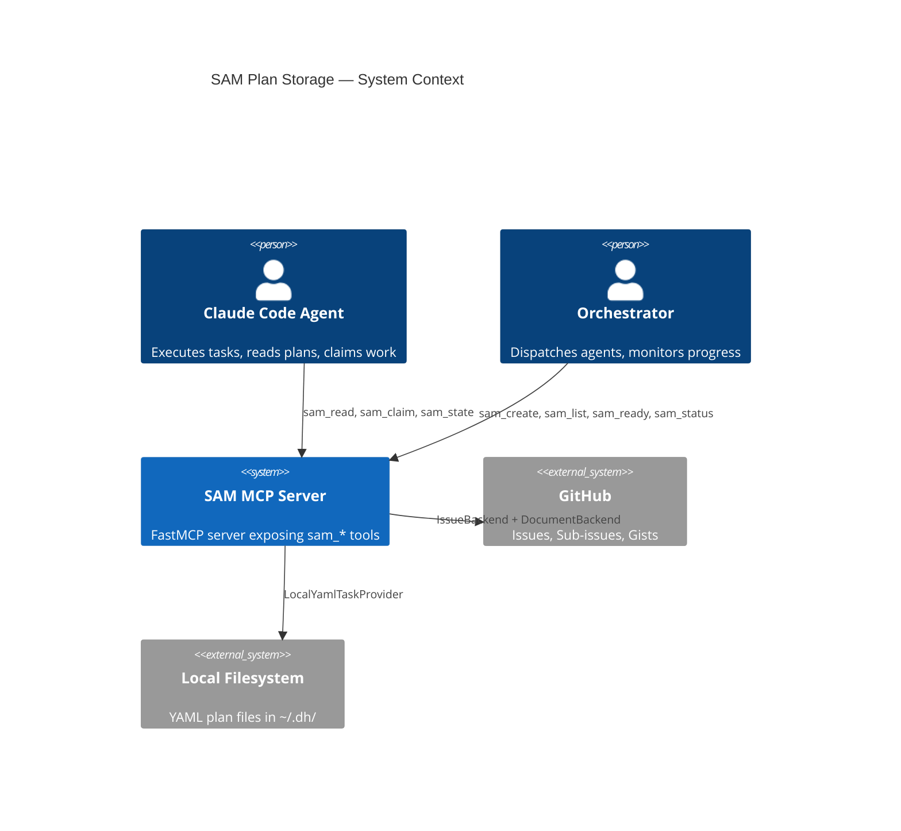
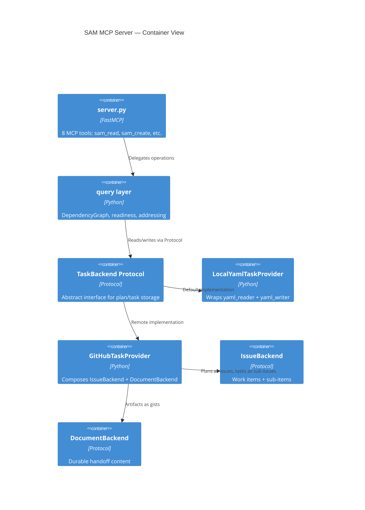

> **SUPERSEDED — DO NOT IMPLEMENT THIS DESIGN.** Current authority: [`backlog_core/ARCHITECTURE.md`](../plugins/development-harness/backlog_core/ARCHITECTURE.md) and [`architect-backlog-snapshot-reconciliation.md`](./architect-backlog-snapshot-reconciliation.md). Invalid assumption: **per-plan routing** selects storage backends.

# Architecture Spec: Migrate SAM Plan Storage to TaskBackend Protocol

**Issue:** #912
**Date:** 2026-04-04
**Status:** Draft

---

## 1. Executive Summary

SAM (Structured Agent-Managed) plan storage currently uses direct filesystem YAML I/O with no backend abstraction. This architecture introduces a `TaskBackend` Protocol that decouples SAM MCP tools from storage, enabling pluggable backends (local YAML, GitHub Issues + Gists, future platforms).

**Key architectural decisions:**

- **TaskBackend is an orchestration Protocol**, not a storage Protocol. It composes over `IssueBackend` (coordination state) and `DocumentBackend` (durable handoff content) per the three-primitive model in `docs/backend-providers.md`.
- **LocalYamlTaskProvider** wraps existing `yaml_reader.py` / `yaml_writer.py` behind the Protocol, preserving current single-machine behavior as the default backend.
- **GitHubTaskProvider** maps plans to GitHub Issues, tasks to sub-issues, and documents to Gists. It delegates storage to `IssueBackend` + `DocumentBackend` and adds SAM semantics (dependency resolution, readiness, atomic claiming).
- **DependencyGraph stays in the query layer**, not in the backend. Backends provide raw task data; the query layer evaluates readiness.
- **Lazy migration** via `backend_ref` field in plan YAML and directory-level `taskbackend.toml` config. Plans without a `backend_ref` continue using local YAML. Plans with one route through the configured backend.
- **sam_read returns `content_ref` references** for document content rather than inlining full artifact bodies. This follows context-fit-complexity Principle 3 (callers request detail on demand) and matches the DocumentBackend model where content is resolved by reference.

**Scope:** Protocol definition, data models, two provider designs (Local YAML, GitHub), server.py refactor pattern, migration mechanism, configuration, exception hierarchy, and test strategy. Implementation code is out of scope.

## 2. Architecture Overview

### C4 Context Diagram



### C4 Container Diagram



### Data Flow (Target)

```text
Agent/Orchestrator calls sam_* MCP tool
    |
    v
server.py tool function
    |
    v
query layer (DependencyGraph, addressing, readiness logic)
    |
    v
TaskBackend Protocol (injected at server startup)
    |
    +---> LocalYamlTaskProvider (yaml_reader / yaml_writer)
    |
    +---> GitHubTaskProvider
              |
              +---> IssueBackend (plans = issues, tasks = sub-issues)
              +---> DocumentBackend (artifacts = gists)
```

## 3. TaskBackend Protocol

**Location:** `sam_schema/core/task_backend.py`

All protocol methods are synchronous. The MCP layer wraps calls in `asyncio.to_thread()` when needed, matching the established pattern from `BacklogBackend` in `backlog_core/backend_protocol.py`.

```python
from __future__ import annotations

from typing import TYPE_CHECKING, runtime_checkable

from typing_extensions import Protocol

if TYPE_CHECKING:
    from sam_schema.core.task_backend_types import (
        DocumentHandle,
        DocumentData,
        PlanData,
        PlanSummary,
        TaskData,
        TaskDefinition,
    )


@runtime_checkable
class TaskBackend(Protocol):
    """SAM orchestration protocol composing over IssueBackend + DocumentBackend.

    TaskBackend does not own its own storage. It adds SAM semantics
    (dependency graph evaluation, readiness queries, atomic claiming)
    on top of two storage Protocols.

    All methods are synchronous. The MCP layer wraps calls in
    asyncio.to_thread() when needed.
    """

    # ------------------------------------------------------------------
    # Plan operations
    # ------------------------------------------------------------------

    def create_plan(
        self,
        slug: str,
        goal: str,
        tasks: list[TaskDefinition],
        *,
        context: str | None = None,
        issue: int | None = None,
        acceptance_criteria: str | None = None,
    ) -> PlanData:
        """Persist a new plan with its task definitions and return it.

        The backend assigns a stable plan_id. The plan must be readable
        by read_plan from any environment immediately after this call.

        When issue is provided, it becomes the plan number (matching
        current sam_create behavior). Raises PlanExistsError if a plan
        with that number already exists.

        Args:
            slug: Short identifier (e.g., "auth-system").
            goal: Human-readable goal statement.
            tasks: Task definitions to include.
            context: Optional plan-level context (markdown prose).
            issue: Optional GitHub issue number to use as plan number.
            acceptance_criteria: Optional plan-level acceptance criteria.

        Returns:
            PlanData with all fields populated including assigned plan_id.

        Raises:
            PlanExistsError: If a plan with the derived plan_id already exists.
            TaskValidationError: If any task definition fails validation.
        """
        ...

    def read_plan(self, plan_id: str) -> PlanData:
        """Return the full plan including all task data.

        plan_id is the backend-assigned stable identifier (e.g., "P001",
        issue number, or slug). Raises PlanNotFoundError if absent.

        Remote backends must serve this from the remote store, not a
        local cache, to ensure consistency across distributed agents.

        Args:
            plan_id: Plan identifier.

        Returns:
            PlanData with all tasks populated.

        Raises:
            PlanNotFoundError: If no plan matches plan_id.
        """
        ...

    def list_plans(
        self,
        *,
        search: str | None = None,
        offset: int = 0,
        limit: int | None = None,
    ) -> list[PlanSummary]:
        """Return summary metadata for plans visible to this backend.

        For remote backends, fetches from the authoritative remote store.
        For local backends, scans the local plan directory.

        Args:
            search: Optional case-insensitive substring filter across
                    feature, description, and goal fields.
            offset: Zero-based start index for pagination.
            limit: Maximum items to return. None means backend default.

        Returns:
            List of PlanSummary (lightweight, no task bodies).
        """
        ...

    # ------------------------------------------------------------------
    # Task operations
    # ------------------------------------------------------------------

    def read_task(self, plan_id: str, task_id: str) -> TaskData:
        """Return a single task from the given plan.

        task_id is the task key within the plan (e.g., "T1", "T03").

        Args:
            plan_id: Plan identifier.
            task_id: Task identifier within the plan.

        Returns:
            TaskData for the requested task.

        Raises:
            PlanNotFoundError: If the plan does not exist.
            TaskNotFoundError: If the plan exists but the task does not.
        """
        ...

    def claim_task(self, plan_id: str, task_id: str) -> bool:
        """Atomically claim a task for execution.

        A task may only be claimed if its current status is "not-started".
        The backend must use its platform's atomic primitive (conditional
        write, compare-and-swap, optimistic locking) to prevent two agents
        claiming the same task concurrently.

        Returns False (not raises) if the task is already claimed or in
        a terminal state. Callers must check the return value.

        Side effects: sets status to "in-progress" and started timestamp.

        Args:
            plan_id: Plan identifier.
            task_id: Task identifier within the plan.

        Returns:
            True if the task was successfully claimed, False otherwise.

        Raises:
            PlanNotFoundError: If the plan does not exist.
            TaskNotFoundError: If the task does not exist in the plan.
        """
        ...

    def update_task_status(
        self, plan_id: str, task_id: str, status: str
    ) -> None:
        """Update the status of a task.

        Valid statuses: not-started, in-progress, complete, blocked,
        deferred, skipped. The backend persists this durably so other
        agents see the update immediately.

        Args:
            plan_id: Plan identifier.
            task_id: Task identifier within the plan.
            status: New status string (must be a valid TaskStatus value).

        Raises:
            PlanNotFoundError: If the plan does not exist.
            TaskNotFoundError: If the task does not exist.
            TaskValidationError: If the status value is invalid.
        """
        ...

    def update_task_fields(
        self,
        plan_id: str,
        task_id: str,
        fields: dict[str, str | int | list[str]],
    ) -> None:
        """Update arbitrary fields on a task.

        Args:
            plan_id: Plan identifier.
            task_id: Task identifier within the plan.
            fields: Mapping of field name to new value.

        Raises:
            PlanNotFoundError: If the plan does not exist.
            TaskNotFoundError: If the task does not exist.
        """
        ...

    def update_plan_fields(
        self,
        plan_id: str,
        *,
        context: str | None = None,
        set_fields: dict[str, str | int | list[str]] | None = None,
    ) -> None:
        """Update plan-level fields.

        Args:
            plan_id: Plan identifier.
            context: If provided, sets the plan-level context field.
            set_fields: Additional field=value pairs to update.

        Raises:
            PlanNotFoundError: If the plan does not exist.
        """
        ...

    def append_task_section(
        self, plan_id: str, task_id: str, section_name: str, content: str
    ) -> None:
        """Append a named markdown section to a task's body.

        Args:
            plan_id: Plan identifier.
            task_id: Task identifier within the plan.
            section_name: Section heading to append.
            content: Section body text.

        Raises:
            PlanNotFoundError: If the plan does not exist.
            TaskNotFoundError: If the task does not exist.
        """
        ...

    # ------------------------------------------------------------------
    # Query operations (readiness computed from backend data)
    # ------------------------------------------------------------------

    def get_ready_tasks(self, plan_id: str) -> list[TaskData]:
        """Return all tasks whose dependencies are satisfied and status is not-started.

        The default implementation fetches all tasks from the backend,
        constructs a DependencyGraph, and returns ready tasks. Backends
        may override with a more efficient query if available.

        Args:
            plan_id: Plan identifier.

        Returns:
            Tasks ready for dispatch, sorted by priority then numeric ID.

        Raises:
            PlanNotFoundError: If the plan does not exist.
        """
        ...

    def get_plan_status(self, plan_id: str) -> dict[str, object]:
        """Return plan-level progress summary.

        Returns a dict with: total_tasks, by_status, ready_tasks,
        blocked_tasks, completion_pct, has_cycles. Matches the current
        PlanStatus model shape.

        Args:
            plan_id: Plan identifier.

        Returns:
            Plan status summary dict.

        Raises:
            PlanNotFoundError: If the plan does not exist.
        """
        ...

    # ------------------------------------------------------------------
    # Document operations (delegates to DocumentBackend)
    # ------------------------------------------------------------------

    def store_document(
        self,
        plan_id: str,
        task_id: str | None,
        stage: str,
        doc_type: str,
        title: str,
        content: str,
        fmt: str = "md",
    ) -> DocumentHandle:
        """Store a document associated with a plan or task.

        Delegates to DocumentBackend.store_document. The plan_id and
        optional task_id determine the document's owner.

        Args:
            plan_id: Plan identifier (becomes owner_id for work_item).
            task_id: Optional task identifier (becomes owner_id for sub_item).
            stage: Pipeline stage (S1-S7).
            doc_type: Document type (discovery, design, context, etc.).
            title: Human-readable document title.
            content: Document body content.
            fmt: Content format (md, yaml, json).

        Returns:
            DocumentHandle with content_ref for later retrieval.
        """
        ...

    def read_document(self, handle: DocumentHandle) -> DocumentData:
        """Retrieve document content by handle.

        Delegates to DocumentBackend.read_document using the
        content_ref from the handle.

        Args:
            handle: DocumentHandle from a prior store_document call.

        Returns:
            DocumentData with full content.

        Raises:
            DocumentNotFoundError: If the content_ref is invalid.
        """
        ...
```

### Method-to-MCP-Tool Mapping

```text
sam_create  -> TaskBackend.create_plan()
sam_read    -> TaskBackend.read_plan() | TaskBackend.read_task()
sam_claim   -> TaskBackend.claim_task()
sam_state   -> TaskBackend.update_task_status()
sam_ready   -> TaskBackend.get_ready_tasks()
sam_status  -> TaskBackend.get_plan_status()
sam_update  -> TaskBackend.update_task_fields() | update_plan_fields() | append_task_section()
sam_list    -> TaskBackend.list_plans()
```

## 4. Data Model Types

**Location:** `sam_schema/core/task_backend_types.py`

These are TypedDicts used at the Protocol boundary, matching the established pattern from `BacklogBackend` where `IssueNode`, `IssueCommentNode`, etc. are TypedDicts defined in `backend_protocol.py`. The existing Pydantic models (`Plan`, `Task` in `sam_schema/core/models.py`) remain the canonical validation layer — TypedDicts here are the wire format between backends and the query layer.

```python
from __future__ import annotations

from typing import NotRequired

from typing_extensions import TypedDict


class TaskDefinition(TypedDict):
    """Input type for creating a task. Matches Task model required fields."""

    id: str                          # Pattern: ^[A-Za-z]?\d+(\.\d+)?$
    title: str                       # min_length=1, max_length=200
    status: str                      # TaskStatus value
    agent: NotRequired[str | None]
    dependencies: NotRequired[list[str]]
    priority: NotRequired[int]       # Priority IntEnum value (1-5)
    complexity: NotRequired[str]     # "low" | "medium" | "high"
    skills: NotRequired[list[str]]
    body: NotRequired[str]
    description: NotRequired[str]
    objective: NotRequired[str]
    requirements: NotRequired[str]
    constraints: NotRequired[str]
    expected_outputs: NotRequired[str]
    acceptance_criteria: NotRequired[str]
    verification_steps: NotRequired[str]
    context_notes: NotRequired[str]
    handoff: NotRequired[str]
    is_bookend: NotRequired[bool]
    bookend_type: NotRequired[str | None]
    github_issue: NotRequired[int | None]


class TaskData(TypedDict):
    """Full task data returned from backend operations."""

    id: str
    title: str
    status: str
    agent: str | None
    dependencies: list[str]
    blocked_by: list[str]
    parallelize_with: list[str]
    priority: int
    complexity: str
    skills: list[str]
    # Timestamps (ISO 8601 strings)
    created: str | None
    started: str | None
    completed: str | None
    last_activity: str | None
    # Analytical metadata
    issue_classification: NotRequired[str | None]
    scenario_target: NotRequired[str | None]
    analysis_method: NotRequired[str]
    divergence_notes: NotRequired[int]
    accuracy_risk: NotRequired[str]
    reason: NotRequired[str]
    # Markdown content
    body: str
    description: str
    objective: NotRequired[str]
    requirements: NotRequired[str]
    constraints: NotRequired[str]
    expected_outputs: NotRequired[str]
    acceptance_criteria: NotRequired[str]
    verification_steps: NotRequired[str]
    context_notes: NotRequired[str]
    handoff: NotRequired[str]
    # Bookend
    is_bookend: NotRequired[bool]
    bookend_type: NotRequired[str | None]
    # GitHub
    github_issue: NotRequired[int | None]


class PlanData(TypedDict):
    """Full plan data returned from backend operations."""

    plan_id: str                     # Backend-assigned identifier (e.g., "P001")
    feature: str
    version: str
    description: str
    goal: str | None
    context: str | None
    acceptance_criteria: str | None
    issue: str | None                # GitHub issue number as string
    architecture: NotRequired[str | None]
    feature_context: NotRequired[str | None]
    codebase_patterns: NotRequired[str | None]
    tasks: list[TaskData]
    source_path: str | None          # Filesystem path (local backend only)
    backend_ref: NotRequired[str | None]  # Backend-native reference


class PlanSummary(TypedDict):
    """Lightweight plan metadata for list operations."""

    plan_id: str
    feature: str
    goal: str | None
    description: str
    task_count: int
    source_path: str | None
    issue: NotRequired[str | None]
    backend_ref: NotRequired[str | None]


class DocumentHandle(TypedDict):
    """Opaque handle for document retrieval."""

    content_ref: str                 # Backend-opaque identifier
    owner_type: str                  # "work_item" | "sub_item"
    owner_id: str                    # Plan ID or task ID
    stage: str                       # S1-S7
    doc_type: str                    # discovery, design, context, etc.
    title: str
    fmt: str                         # md, yaml, json
    version: NotRequired[int]


class DocumentData(TypedDict):
    """Document content retrieved from backend."""

    content_ref: str
    title: str
    content: str                     # Full document body
    fmt: str
    version: int
    owner_type: str
    owner_id: str
    stage: str
    doc_type: str
```

### Compatibility with Existing Pydantic Models

The query layer converts between TypedDicts and Pydantic models:

```text
Backend returns TaskData (TypedDict)
    -> query layer validates via Task.model_validate(task_data)
    -> returns Task (Pydantic model) to server.py
    -> server.py calls task.model_dump() for MCP response

Server receives input
    -> validates via Task.model_validate(input)
    -> converts to TaskDefinition (TypedDict) for backend
    -> backend persists
```

This preserves all existing validation (field patterns, enum coercion, alias handling) while keeping the backend interface free of Pydantic dependencies.

## 5. LocalYamlTaskProvider Design

**Location:** `sam_schema/core/backends/local_yaml.py`

LocalYamlTaskProvider wraps the existing YAML I/O stack behind the TaskBackend Protocol. It is the default backend and preserves all current single-machine behavior.

### Wrapping Strategy

```text
Current module                    LocalYamlTaskProvider method
--------------------------        ----------------------------------
query.py:create_plan()         -> create_plan()
query.py:load_plan()           -> read_plan(), read_task()
query.py:get_ready_tasks()     -> get_ready_tasks() [delegates to DependencyGraph]
query.py:get_plan_status()     -> get_plan_status() [delegates to DependencyGraph]
query.py:update_status()       -> update_task_status()
query.py:update_plan_fields()  -> update_plan_fields(), update_task_fields(), append_task_section()
query.py:claim_task()          -> claim_task()
server.py:sam_list() dir scan  -> list_plans()
```

### Internal Dependencies

```python
# LocalYamlTaskProvider uses these existing modules internally:
from sam_schema.readers.detect import read_plan      # Format detection + YAML parse
from sam_schema.readers.normalize import normalize_plan  # Raw dict -> Pydantic
from sam_schema.writers.yaml_writer import (
    create_plan_file,   # Atomic plan creation
    update_fields,       # Field-level YAML updates
    append_section,      # Body section appending
    _atomic_write,       # Atomic file write primitive
)
from sam_schema.core.dependencies import DependencyGraph  # Readiness queries
```

### Key Design Points

1. **DependencyGraph stays in provider, not Protocol.** `get_ready_tasks()` and `get_plan_status()` load tasks via `read_plan`, construct a `DependencyGraph`, and return results. The Protocol does not expose graph internals.

2. **plan_id mapping.** For local YAML, `plan_id` maps to the plan file stem (e.g., `"P001-auth-system"`). `list_plans()` scans `plan_dir` (from `dh_paths.plan_dir()`) and returns summaries. `read_plan("P1")` uses the existing `resolve_plan_address()` logic.

3. **Atomic operations.** `claim_task()` uses the same read-check-write-with-atomic-rename pattern as the current `query.py:claim_task()`. Single-machine use means filesystem atomicity via `tempfile + os.replace` is sufficient.

4. **No document storage.** LocalYamlTaskProvider's `store_document()` and `read_document()` write to and read from the local filesystem at `plan_dir/{plan_id}/documents/`. The `content_ref` is the relative file path. This is valid for single-machine use only (per `docs/backend-providers.md` Design Principle 6).

### Constructor

```python
class LocalYamlTaskProvider:
    """TaskBackend implementation wrapping local YAML file I/O.

    Args:
        plan_dir: Path to the plan directory. Defaults to dh_paths.plan_dir().
    """

    def __init__(self, plan_dir: Path | None = None) -> None: ...
```

## 6. GitHubTaskProvider Design

**Location:** `sam_schema/core/backends/github_task.py`

GitHubTaskProvider composes `IssueBackend` and `DocumentBackend` to implement TaskBackend for remote, multi-agent use. It maps SAM primitives to GitHub's native structures.

### Primitive Mapping

```text
SAM Concept          GitHub Primitive          Protocol
-----------          ----------------          --------
Plan                 Issue (parent)            IssueBackend.create_issue()
Task                 Sub-issue (child)         IssueBackend.create_sub_issue()
Task status          Label on sub-issue        IssueBackend.sync_status()
Task claim           Conditional label swap    IssueBackend.sync_status() with check
Document             Gist                      DocumentBackend.store_document()
Document manifest    Issue body section        DocumentBackend.get_manifest()
```

### Constructor

```python
class GitHubTaskProvider:
    """TaskBackend composing IssueBackend + DocumentBackend for GitHub.

    Args:
        issue_backend: IssueBackend instance for work item / sub-item CRUD.
        doc_backend: DocumentBackend instance for artifact storage.
    """

    def __init__(
        self,
        issue_backend: IssueBackend,
        doc_backend: DocumentBackend,
    ) -> None: ...
```

### Key Design Points

1. **plan_id mapping.** `plan_id` is the GitHub issue number (as string). `create_plan()` calls `issue_backend.create_issue()` to create the parent issue and `issue_backend.create_sub_issue()` for each task. The issue body stores plan metadata (goal, context, ACs) in a structured format matching the existing backlog body rendering pattern.

2. **Task-to-sub-issue mapping.** Each task becomes a sub-issue under the plan issue. The sub-issue title includes the task ID: `"[T01] Implement auth middleware"`. The sub-issue body contains the task's markdown content fields. Status is tracked via labels (`sam:not-started`, `sam:in-progress`, `sam:complete`, etc.).

3. **Atomic claim via conditional label swap.** `claim_task()` reads the current labels, verifies `sam:not-started` is present, then atomically swaps it for `sam:in-progress`. GitHub's label API is not natively atomic, so the implementation:
   - Fetches current issue state
   - Checks label matches expected state
   - Applies label mutation
   - Re-fetches to confirm (optimistic concurrency)
   - Returns False if the label changed between read and write

4. **Dependency graph from sub-issue metadata.** `get_ready_tasks()` fetches all sub-issues via `issue_backend.list_sub_issues()`, extracts dependency metadata from sub-issue bodies (structured section), builds `DependencyGraph`, and returns ready tasks.

5. **Document storage via DocumentBackend.** `store_document()` delegates to `doc_backend.store_document()` with the plan issue number as `owner_id`. `read_document()` delegates to `doc_backend.read_document()` using `content_ref` from the handle.

6. **Can be coded against Protocol interfaces before #984 lands.** GitHubTaskProvider depends on `IssueBackend` and `DocumentBackend` Protocol interfaces, not their implementations. Development can proceed with mock implementations of those Protocols. When #984 (DocumentBackend) and #389 (IssueBackend) deliver concrete implementations, GitHubTaskProvider composes them without changes.

### Sub-issue Body Schema

```markdown
<!-- sam-task-metadata:begin -->
| Field | Value |
|-------|-------|
| task-id | T01 |
| dependencies | T00 |
| priority | 2 |
| complexity | medium |
| agent | python-cli-architect |
| skills | python-engineering:python3-cli |
<!-- sam-task-metadata:end -->

## Objective

{objective content}

## Requirements

{requirements content}

## Acceptance Criteria

{acceptance_criteria content}
```

## 7. server.py Refactor Design

The refactor introduces a `TaskConfig` dataclass (mirroring `BacklogConfig`) that holds the active `TaskBackend` instance. server.py receives it via module-level accessor, identical to the `get_config()` pattern in `backlog_core/backend_protocol.py`.

### Injection Pattern

```python
# sam_schema/core/task_config.py

from dataclasses import dataclass
from sam_schema.core.task_backend import TaskBackend

@dataclass
class TaskConfig:
    """Container for the active TaskBackend instance."""
    backend: TaskBackend

_active_config: TaskConfig | None = None

def get_task_config() -> TaskConfig: ...
def set_task_config(config: TaskConfig) -> None: ...
def reset_task_config() -> None: ...
def create_task_backend(name: str | None = None) -> TaskBackend: ...
```

### Before/After Example: sam_claim

**Before** (current server.py lines 585-614):

```python
@mcp.tool
def sam_claim(
    plan: Annotated[str, Field(description="Plan address")],
    task: Annotated[str, Field(description="Task ID to claim")],
    plan_dir: Annotated[str, Field(description="Plan directory path")] = "plan",
) -> dict:
    try:
        plan_path = resolve_plan_address(plan, _resolve_plan_dir(plan_dir))
        updated_task = claim_task(plan_path, task)
    except (ValueError, KeyError) as exc:
        return {"claimed": False, "error": str(exc)}
    except (FileNotFoundError, AddressingError, FormatDetectionError, OSError) as exc:
        return {"error": str(exc)}
    else:
        return {"claimed": True, "task_id": updated_task.id, "started": updated_task.started}
```

**After** (routed through TaskBackend):

```python
@mcp.tool
def sam_claim(
    plan: Annotated[str, Field(description="Plan address")],
    task: Annotated[str, Field(description="Task ID to claim")],
) -> dict:
    try:
        backend = get_task_config().backend
        plan_id = _resolve_plan_id(plan)
        claimed = backend.claim_task(plan_id, task)
    except (PlanNotFoundError, TaskNotFoundError) as exc:
        return {"error": str(exc)}
    except TaskClaimError as exc:
        return {"claimed": False, "error": str(exc)}
    else:
        if not claimed:
            return {"claimed": False, "error": f"Task {task} is not in not-started state"}
        task_data = backend.read_task(plan_id, task)
        return {"claimed": True, "task_id": task_data["id"], "started": task_data["started"]}
```

### Refactor Summary for All Tools

```text
sam_read:
  - plan-only: backend.read_plan(plan_id) -> PlanData
  - with task: backend.read_task(plan_id, task_id) -> TaskData
  - Wrap in TaskAssignment for backward compatibility

sam_state:
  - backend.update_task_status(plan_id, task_id, status)
  - Return updated task via backend.read_task()

sam_ready:
  - backend.get_ready_tasks(plan_id) -> list[TaskData]
  - Apply routing manifest formatting (7-field compact or full dump)

sam_status:
  - backend.get_plan_status(plan_id) -> dict

sam_list:
  - backend.list_plans(search=search, offset=offset, limit=limit)
  - Apply pagination wrapper (_paginate_results stays in server.py)

sam_create:
  - Parse tasks_yaml, validate via Task.model_validate
  - Convert to list[TaskDefinition]
  - backend.create_plan(slug, goal, tasks, ...)
  - Artifact registration logic stays in server.py (calls backend after create)

sam_update:
  - Route to backend.update_plan_fields(), update_task_fields(),
    or append_task_section() based on address and parameters

sam_claim:
  - backend.claim_task(plan_id, task_id) -> bool
```

### plan_dir Parameter Removal

The `plan_dir` parameter on MCP tools becomes unnecessary for remote backends (GitHub does not use filesystem paths). For backward compatibility during migration:

- `plan_dir` remains as an optional parameter on all tools
- LocalYamlTaskProvider uses it; GitHubTaskProvider ignores it
- The `_resolve_plan_id()` helper maps plan addresses to backend-appropriate IDs

## 8. Lazy Migration Design

### backend_ref Field

**Location in Plan YAML:** Top-level optional field.

```yaml
feature: auth-system
goal: "Implement authentication middleware"
issue: 912
backend_ref: "github://Jamie-BitFlight/claude_skills#912"
tasks:
  - task: T01
    title: "Design auth protocol"
    ...
```

**Field semantics:**

- `backend_ref: null` or absent -> use LocalYamlTaskProvider (default)
- `backend_ref: "github://owner/repo#issue"` -> use GitHubTaskProvider
- `backend_ref: "sqlite://path/to/db"` -> future SQLiteTaskProvider

### Detection Logic in sam_read

```text
1. Resolve plan address to plan_path (existing logic)
2. Check if active TaskConfig backend is not LocalYaml
   -> If remote backend configured, route all operations through it
3. If LocalYaml backend, check plan YAML for backend_ref field
   -> If present, load appropriate backend for that specific plan
   -> If absent, use LocalYaml (current behavior)
```

### Migration Trigger in sam_state / sam_update

When a plan is updated and the active backend is remote:

1. `update_task_status()` writes to the remote backend
2. If a local YAML copy exists, update it too (write-through cache)
3. On next `read_plan()`, the remote backend is authoritative

### Pydantic Model Change

Add `backend_ref` to the `Plan` model in `sam_schema/core/models.py`:

```python
class Plan(BaseModel):
    # ... existing fields ...
    backend_ref: str | None = Field(
        default=None,
        validation_alias=AliasChoices("backend-ref", "backend_ref"),
        serialization_alias="backend-ref",
    )
```

The YAML writer must include `backend_ref` when present. The YAML reader must parse it.

## 9. Configuration Design

### Format and Location

**Format:** TOML (matching `backend.toml` for BacklogBackend).

**Filename:** `taskbackend.toml`

**Resolution order** (matching BacklogBackend pattern from `backend_protocol.py:_load_backend_toml_name()`):

1. `TASKBACKEND` environment variable (e.g., `TASKBACKEND=github`)
2. `taskbackend.toml` in project root (via `dh_paths.git_project_root()`)
3. `~/.dh/taskbackend.toml`
4. Default: `"local"` (LocalYamlTaskProvider)

### Schema

```toml
[backend]
name = "local"  # "local" | "github" | "memory"

# GitHub-specific settings (only when name = "github")
[backend.github]
repo = "Jamie-BitFlight/claude_skills"  # defaults to GITHUB_REPO env var

# Local-specific settings (only when name = "local")
[backend.local]
plan_dir = ""  # empty = use dh_paths.plan_dir() default
```

### Loader

```python
# sam_schema/core/task_config.py

_VALID_TASK_BACKENDS: tuple[str, ...] = ("local", "github", "memory")
_TASKBACKEND_TOML_FILENAME = "taskbackend.toml"

def create_task_backend(name: str | None = None) -> TaskBackend:
    """Instantiate a TaskBackend by name.

    Resolution: TASKBACKEND env -> taskbackend.toml -> default "local".
    Matches BacklogBackend's create_backend() pattern.
    """
    ...
```

## 10. sam_read Progressive Disclosure Decision

**Decision:** sam_read returns `content_ref` references for document content, not inline content.

**Rationale (context-fit-complexity Principle 3):**

1. **Context budget conservation.** Task bodies can exceed 10K characters. Inlining full document content in every `sam_read` response wastes agent context on content that may not be needed for the current operation (e.g., an orchestrator checking task status does not need the full feature-context document).

2. **Consistency with DocumentBackend model.** Documents are addressed by `content_ref` per `docs/backend-providers.md`. Inlining content would bypass the DocumentBackend abstraction and force all backends to eagerly resolve content.

3. **On-demand retrieval.** Agents that need document content call `read_document(handle)` explicitly. This matches the existing `artifact_read` pattern where consumers request specific artifacts rather than receiving all artifacts in every response.

**What sam_read returns for documents:**

```python
# When task has associated documents, include handles (not content):
{
    "task": { ... },  # TaskData fields
    "documents": [
        {
            "content_ref": "gist://abc123",
            "stage": "S1",
            "doc_type": "feature-context",
            "title": "Feature Context: Auth System",
            "fmt": "md"
        }
    ]
}
```

**What sam_read returns for task body fields:**

Task body fields (`body`, `description`, `objective`, etc.) remain inline in the response. These are part of the task data itself, not separate documents. Only stage artifacts accessed via DocumentBackend use `content_ref`.

## 11. Exception Hierarchy

**Location:** `sam_schema/core/exceptions.py`

```python
class SamError(Exception):
    """Base exception for all SAM operations.

    All SAM-specific exceptions inherit from this class, enabling
    callers to catch SamError for any SAM failure while still
    allowing narrow catches for specific error types.
    """


class PlanNotFoundError(SamError):
    """Raised when a plan_id does not resolve to any plan.

    Attributes:
        plan_id: The plan identifier that was not found.
    """

    def __init__(self, plan_id: str) -> None:
        self.plan_id = plan_id
        super().__init__(f"Plan not found: {plan_id}")


class PlanExistsError(SamError):
    """Raised when attempting to create a plan with a plan_id that already exists.

    Attributes:
        plan_id: The conflicting plan identifier.
    """

    def __init__(self, plan_id: str) -> None:
        self.plan_id = plan_id
        super().__init__(f"Plan already exists: {plan_id}")


class TaskNotFoundError(SamError):
    """Raised when a task_id does not exist within a plan.

    Attributes:
        plan_id: The plan identifier.
        task_id: The task identifier that was not found.
    """

    def __init__(self, plan_id: str, task_id: str) -> None:
        self.plan_id = plan_id
        self.task_id = task_id
        super().__init__(f"Task {task_id} not found in plan {plan_id}")


class TaskValidationError(SamError):
    """Raised when task data fails validation against the Task model.

    Attributes:
        task_index: Index of the failing task in the input list.
        detail: Pydantic validation error detail string.
    """

    def __init__(self, task_index: int, detail: str) -> None:
        self.task_index = task_index
        self.detail = detail
        super().__init__(f"Task at index {task_index} failed validation: {detail}")


class DocumentNotFoundError(SamError):
    """Raised when a content_ref does not resolve to a document.

    Attributes:
        content_ref: The content reference that was not found.
    """

    def __init__(self, content_ref: str) -> None:
        self.content_ref = content_ref
        super().__init__(f"Document not found: {content_ref}")
```

### Mapping to BacklogBackend Exception Pattern

```text
BacklogBackend              TaskBackend
--------------              -----------
BacklogError                SamError
ItemNotFoundError           PlanNotFoundError, TaskNotFoundError
DuplicateItemError          PlanExistsError
ValidationError             TaskValidationError
GitHubUnavailableError      (reuse from backlog_core — same GitHub dependency)
(no equivalent)             DocumentNotFoundError
```

### server.py Exception Handling

Replace the current broad exception tuples with narrow SAM exceptions:

```python
# Before:
_PLAN_READ_ERRORS = (FileNotFoundError, AddressingError, FormatDetectionError, KeyError, ValueError, TypeError)

# After:
_PLAN_READ_ERRORS = (PlanNotFoundError, TaskNotFoundError)
_PLAN_WRITE_ERRORS = (PlanNotFoundError, TaskNotFoundError, TaskValidationError, PlanExistsError)
```

## 12. Test Strategy

### Protocol Conformance Tests

**Location:** `tests/test_task_backend_conformance.py`

A single parametrized test suite that runs against every TaskBackend implementation. This is the primary quality gate — if a backend passes conformance, it works with the SAM MCP server.

```python
import pytest
from sam_schema.core.task_backend import TaskBackend

@pytest.fixture(params=["local_yaml", "memory", "github_mock"])
def backend(request, tmp_path) -> TaskBackend:
    """Parametrized fixture providing each backend implementation."""
    ...

class TestTaskBackendConformance:
    """Protocol conformance tests — every backend must pass all of these."""

    def test_create_and_read_plan(self, backend: TaskBackend) -> None: ...
    def test_create_plan_duplicate_raises(self, backend: TaskBackend) -> None: ...
    def test_read_nonexistent_plan_raises(self, backend: TaskBackend) -> None: ...
    def test_list_plans_empty(self, backend: TaskBackend) -> None: ...
    def test_list_plans_with_search(self, backend: TaskBackend) -> None: ...
    def test_read_task(self, backend: TaskBackend) -> None: ...
    def test_read_nonexistent_task_raises(self, backend: TaskBackend) -> None: ...
    def test_claim_task_success(self, backend: TaskBackend) -> None: ...
    def test_claim_task_already_claimed_returns_false(self, backend: TaskBackend) -> None: ...
    def test_claim_task_terminal_state_returns_false(self, backend: TaskBackend) -> None: ...
    def test_update_task_status(self, backend: TaskBackend) -> None: ...
    def test_update_task_fields(self, backend: TaskBackend) -> None: ...
    def test_update_plan_fields(self, backend: TaskBackend) -> None: ...
    def test_append_task_section(self, backend: TaskBackend) -> None: ...
    def test_get_ready_tasks_no_deps(self, backend: TaskBackend) -> None: ...
    def test_get_ready_tasks_with_deps(self, backend: TaskBackend) -> None: ...
    def test_get_ready_tasks_blocked(self, backend: TaskBackend) -> None: ...
    def test_get_plan_status(self, backend: TaskBackend) -> None: ...
    def test_store_and_read_document(self, backend: TaskBackend) -> None: ...
```

### Lazy Migration Integration Tests

**Location:** `tests/test_lazy_migration.py`

```python
class TestLazyMigration:
    """Tests for backend_ref detection and migration routing."""

    def test_plan_without_backend_ref_uses_local(self, tmp_path) -> None:
        """A plan YAML without backend_ref routes through LocalYamlTaskProvider."""
        ...

    def test_plan_with_backend_ref_routes_to_backend(self, tmp_path) -> None:
        """A plan YAML with backend_ref routes through the specified backend."""
        ...

    def test_taskbackend_toml_overrides_default(self, tmp_path) -> None:
        """taskbackend.toml in project root selects the backend."""
        ...

    def test_env_var_overrides_toml(self, tmp_path, monkeypatch) -> None:
        """TASKBACKEND env var takes precedence over taskbackend.toml."""
        ...

    def test_mixed_plans_different_backends(self, tmp_path) -> None:
        """Plans in the same directory can use different backends via backend_ref."""
        ...
```

### InMemoryTaskProvider for Tests

**Location:** `sam_schema/core/backends/memory.py`

A test double implementing TaskBackend with dict storage. No persistence. Used in unit tests and CI where filesystem access is undesirable. Mirrors `backlog_core/backends/memory_backend.py`.

### Coverage Requirements

- Protocol conformance tests: 100% of Protocol methods covered
- Lazy migration tests: all 3 detection paths (env var, TOML, plan-level)
- server.py refactor: existing sam_* tool tests updated to use `set_task_config()` with InMemoryTaskProvider
- Minimum 80% line coverage across `task_backend.py`, `task_config.py`, `local_yaml.py`

## 13. Architectural Decisions (ADRs)

### ADR-001: TaskBackend as Orchestration Protocol, Not Storage Protocol

**Context:** TaskBackend could either own its own storage tables/files or compose over existing IssueBackend + DocumentBackend Protocols.

**Decision:** TaskBackend composes over IssueBackend and DocumentBackend. It does not own storage primitives.

**Rationale:** The three-primitive model in `docs/backend-providers.md` separates coordination state (Work Items, Sub-items) from durable handoff content (Documents). TaskBackend adds SAM semantics (dependency resolution, readiness, atomic claiming) on top of these primitives. Owning its own storage would duplicate the work item and document abstractions, creating two parallel storage paths and making backend migration harder.

**Consequences:** GitHubTaskProvider cannot be implemented without at least stub implementations of IssueBackend and DocumentBackend. LocalYamlTaskProvider is self-contained because it implements storage directly (no composition needed for single-machine use).

### ADR-002: DependencyGraph Stays in Query Layer

**Context:** `get_ready_tasks()` requires dependency graph evaluation. This logic could live in the backend (each backend computes readiness) or in the query layer (backends provide raw data, query layer computes readiness).

**Decision:** DependencyGraph stays in `sam_schema/core/dependencies.py`. Backends provide raw task data; the query layer (or provider's `get_ready_tasks()` method) constructs a DependencyGraph and evaluates readiness.

**Rationale:** Dependency graph logic is complex (cycle detection, transitive dependencies, terminal status evaluation). Duplicating it across backends would create divergent behavior. The existing `DependencyGraph` class is stateless and takes `list[Task]` — it can operate on data from any backend.

**Consequences:** Remote backends must fetch all tasks in a plan to compute readiness (no server-side filtering). For plans with <500 tasks (current maximum is ~50), this is acceptable. If plan sizes grow significantly, backends could add optional server-side pre-filtering.

### ADR-003: TypedDicts for Protocol Boundary, Pydantic for Validation

**Context:** Protocol methods could return Pydantic models directly or use lighter-weight TypedDicts.

**Decision:** Protocol boundary uses TypedDicts (PlanData, TaskData, etc.). Pydantic models (Plan, Task) are used for validation in the query layer.

**Rationale:** This matches the established BacklogBackend pattern where `IssueNode` and `IssueCommentNode` are TypedDicts. TypedDicts keep the Protocol interface free of Pydantic dependencies, allowing backends to be implemented without importing the full model hierarchy. The query layer handles conversion between TypedDicts and Pydantic models.

**Consequences:** Conversion code is needed in the query layer. The `Task.model_validate()` and `task.model_dump()` calls already exist in the current codebase — they just move from server.py to the query layer.

### ADR-004: TOML Configuration Matching BacklogBackend Pattern

**Context:** Configuration could use YAML (matching plan files), TOML (matching BacklogBackend), or environment variables only.

**Decision:** TOML configuration file (`taskbackend.toml`) with the same resolution order as BacklogBackend's `backend.toml`.

**Rationale:** Consistency with the existing BacklogBackend configuration pattern reduces cognitive load. Users already know where to put `backend.toml` and how env var overrides work. Using the same pattern for TaskBackend means one mental model for both systems.

**Consequences:** Two separate TOML files (`backend.toml` for backlog, `taskbackend.toml` for SAM). A future consolidation could merge them into a single config file with separate sections, but that is out of scope for this feature.

### ADR-005: content_ref Over Inline Document Content

**Context:** sam_read could inline full document content in responses or return references that callers resolve on demand.

**Decision:** Return `content_ref` references. Callers use `read_document()` for content.

**Rationale:** Context-fit-complexity Principle 3: callers request detail on demand. Task bodies (which are inline) already consume significant context. Adding full document content (feature-context, architect specs) to every sam_read response would exceed token budgets and waste context on content the agent may not need. The `artifact_read` pattern already establishes on-demand content retrieval in this codebase.

**Consequences:** Agents that need document content make an additional call. This is a net positive — agents that do not need content (status checks, claim operations) get faster, smaller responses.

---

## References

- `plugins/development-harness/docs/backend-providers.md` — Three-primitive model, Protocol contracts, platform mapping
- `plugins/development-harness/backlog_core/backend_protocol.py` — BacklogBackend Protocol (reference pattern for config, factory, TypedDicts)
- `plugins/development-harness/backlog_core/artifact_provider.py` — ArtifactBackend Protocol (reference for DocumentBackend evolution)
- `plugins/development-harness/sam_schema/core/models.py` — Canonical Pydantic models (Task, Plan, TaskStatus)
- `plugins/development-harness/sam_schema/core/query.py` — Current query operations to be wrapped
- `plugins/development-harness/sam_schema/core/dependencies.py` — DependencyGraph (stays in query layer)
- `plugins/development-harness/sam_schema/server.py` — Current MCP tool implementations to be refactored
- `plugins/development-harness/backlog_core/models.py` — BacklogError hierarchy (reference for SamError)
