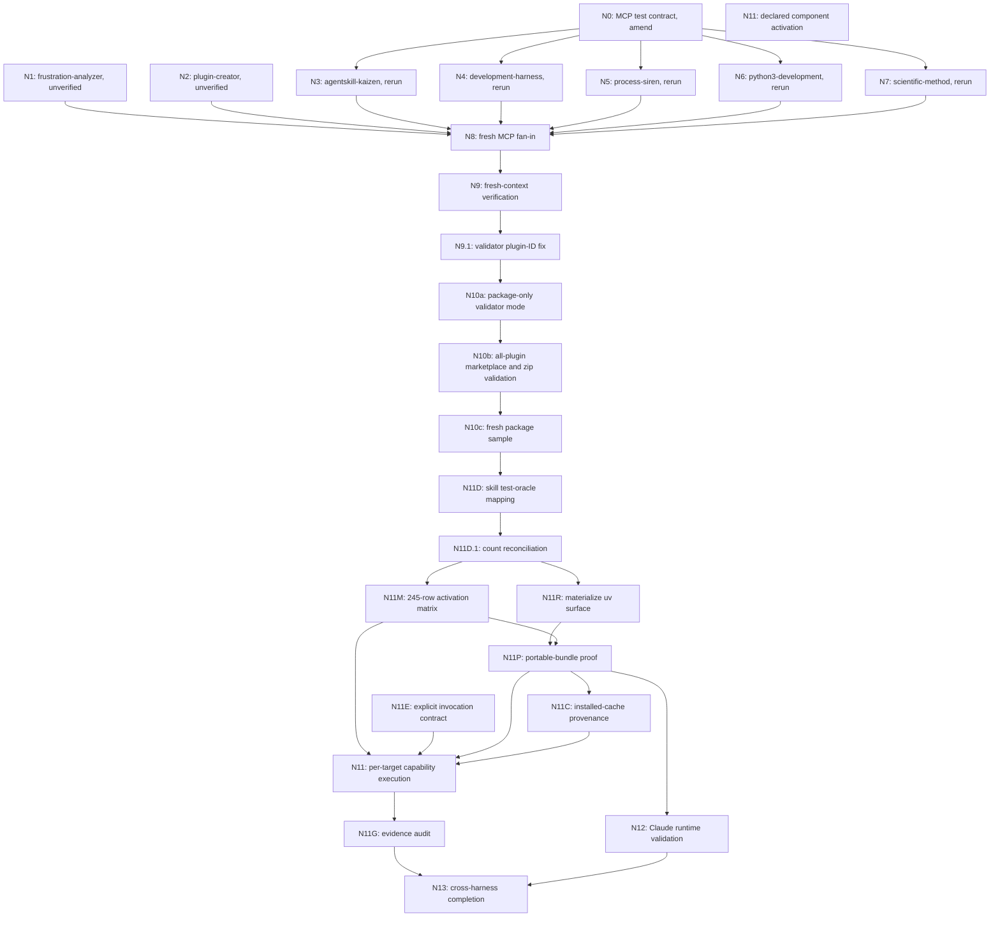

# Codex Plugin Enablement Validation Graph

## Goal

Produce artifact-backed proof that every Codex plugin can be distributed through a marketplace
and that declared capabilities work through the intended harness. Preserve Claude compatibility.

## Validation Integrity Ledger

No warning or error is "expected" by default. A validation result is usable only when its
redacted, reproducible artifact is retained under `plan/` and linked from its node. An exception
must name the exact tool/version, warning text or identifier, upstream cause, affected scope,
expiry/review condition, and why it cannot hide a failure. No exception has been recorded for this
Codex-plugin enablement work.

The following results are recorded as failures or limits, not waived outcomes:

1. A prior slim pytest invocation used `--no-project` and `-o addopts=''` without
   `pytest-asyncio`. It emitted `PytestConfigWarning: Unknown config option: asyncio_mode`.
   That run is invalid because it bypassed the repository's `--strict-config` gate.
2. A full `uv run pytest` attempt selected host Python 3.14 and failed while building `cvxopt`
   because `umfpack.h` is absent. No tests ran, and the dependency-build deprecation warning is
   not accepted as clean output. The full project environment remains unverified.
3. The replacement focused runner passed with no warnings:
   `uv run --no-project --python 3.12 --with pytest==9.0.3 --with pytest-asyncio==1.3.0 pytest -o addopts='' --strict-config --strict-markers -q tests/test_generate_codex_skill_activation_matrix.py tests/test_validate_codex_plugin_isolated.py tests/test_validate_codex_skill_activation.py`.
   It reported `13 passed`. This is runner evidence for those stdlib-only validator tests, not a
   substitute for a full project test environment.
4. The only retained runtime-evidence artifact is
   `plan/codex-skill-activation-evidence/xdg-base-directory.json`, for the later non-MCP
   sentinel. It does not support any N1 through N9 MCP claim. All earlier MCP completion prose
   below is historical, unverified, and cannot satisfy a gate until replaced by retained evidence.
5. `--package-only` is an N10 distribution probe: its success means marketplace registration and
   installation only. It must be labelled `distribution-only` and cannot contribute activation,
   behavior, safety, or cross-harness completion evidence.

## Dependency Audit

| Node | Reads prior node output? | Verdict |
| --- | --- | --- |
| N0: define MCP validation contract | No | Specification retained; must be amended by the integrity ledger. |
| N1: validate frustration-analyzer MCP | No | Unverified: no retained protocol or Codex artifact. |
| N2: validate plugin-creator MCP | No | Unverified: no retained protocol or Codex artifact. |
| N3: validate agentskill-kaizen MCP | No | Historical claim unverified: rerun required. |
| N4: validate development-harness MCP | No | Historical claim unverified: rerun required. |
| N5: validate process-siren MCP | No | Historical claim unverified: rerun required. |
| N6: validate python3-development MCP | No | Historical claim unverified: rerun required. |
| N7: validate scientific-method MCP | No | Historical claim unverified: rerun required. |
| N8: consolidate MCP results | Yes, reads N1 through N7 | Invalidated: it has no retained node artifacts to consolidate. |
| N9: independently verify selected MCP claims | Yes, reads N8 claims and re-derives from source | Unverified: no fresh-run artifact retained. |
| N9.1: correct isolated validator plugin-ID resolution | Yes, consumes N9 runtime proof | Targeted retry. |
| N10a: add package-only validator mode | Yes, consumes N9.1 | Mechanical phase prerequisite. |
| N10b: validate marketplace/zip distribution for all plugins | Yes, consumes N10a and resolved MCP configuration | Parallel mechanical checks. |
| N10c: re-derive selected non-directory package claims | Yes, consumes N10b claims | Fresh verification. |
| N11D: map activation test units and existing test oracles | Yes, consumes N10b installability | Parallel discovery. |
| N11D.1: reconcile the declared-skill inventory | Yes, reads N11D partitions and the Git index | Fan-in count check. |
| N11M: commit a per-target activation matrix | Yes, consumes N11D and N11D.1 | Execution prerequisite. |
| N11E: establish explicit Codex skill-invocation evidence | No | Harness contract prerequisite. |
| N11R: materialize the standalone uv bundle surface | Yes, consumes N11D.1 | Source remediation. |
| N11P: prove portable regular-file bundle mechanics | Yes, consumes N11M and N11R | Distribution prerequisite. |
| N11C: bind each app-server skill input to the installed cache | Yes, consumes N11P | Injection provenance prerequisite. |
| N11: run per-target Codex distribution, injection, behavior, and safety proofs | Yes, consumes N11M, N11E, N11P, and N11C | Capability execution. |
| N11G: adversarially audit retained per-target evidence | Yes, consumes N11 | Final Codex gate. |
| N12: validate Claude runtime integration | Yes, consumes N11P; requires Claude authentication | Hard cross-harness gate. |
| N13: declare cross-harness validation complete | Yes, consumes N11G and N12 | Completion gate. |

Hidden edges: N3 through N7 share network package registries, but do not share source writes.
Each node uses a private temporary cache where practical and performs no repository edits. The
host permits a limited number of concurrent subagents. N3 through N5 and N7 occupy available
slots; N6 queues until a current node completes. There are no destructive or outward-facing
actions.

## Graph

## MCP Node Contract

Each N3 through N7 node returns exactly these fields:

1. Plugin and declared MCP server names.
2. FastMCP guidance source: active skill name, or bundled skill path if unavailable.
3. Server protocol proof: `fastmcp list` from outside the plugin directory and one successful,
   non-sensitive `fastmcp call`. If a server cannot use that workflow, state why with the command
   output instead of substituting a static check.
4. Codex proof: `uv run --no-project --python 3.12 scripts/validate_codex_plugin_isolated.py`
   using `--distribution-mode copy --zip-unzip --run --copy-auth-from-current-home`, followed by
   a prompt requiring one named MCP tool. The prompt must forbid direct repository or `SKILL.md`
   reads.
5. Status for each server: pass, fail, blocked, or inconclusive; command evidence and the
   smallest concrete failure cause.
6. No repository changes. Do not expose credentials, session content, or generated auth files.

## Historical MCP Claims (Not Evidence)

The following is a historical narrative retained for diagnosis only. It is not a completed
execution state: N1 through N9 require a fresh run that writes one redacted artifact per server
before any downstream gate may consume the result.

- N3: complete. Both package installs passed; `kaizen-duckdb` failed at the uvx launcher and
  `kaizen-analysis` failed at the host Cargo/libgit2 dependency.
- N4: complete. `sequential_thinking` list/call passed; local `backlog` and `sam` failed at the
  host Cargo/libgit2 dependency; its apparent Codex package-install failure was later shown to
  be a validator defect, not a marketplace-name requirement.
- N5: complete. Package install passed; mcp-mermaid protocol proof was inconclusive after Node
  runtime failures and disk exhaustion, and Codex reported the named tool unavailable.
- N6: complete. sequential-thinking list/call and isolated Codex named-tool proof passed;
  CocoIndex remains blocked at the host Cargo/libgit2 dependency.
- N7: complete. Package install passed; experiment-registry was blocked by the host Cargo/libgit2
  dependency followed by disk exhaustion, and Codex reported the named tool unavailable.

The completion count is five of five new MCP nodes. N8 retains the individual server-level
distinction above instead of reducing a plugin to one pass/fail label.

## N8 MCP Fan-in Ledger

Expected nodes: N3, N4, N5, N6, N7. Received: five of five. No result is missing.

| Node | Plugin | Package copy/zip install | Server protocol and named tool | Codex named tool | Result to carry forward |
| --- | --- | --- | --- | --- | --- |
| N3 | agentskill-kaizen | Pass | kaizen-duckdb failed at the uvx launcher; kaizen-analysis failed at Cargo/libgit2 | Both failed to initialize | Host-tooling blocked; retry after launcher and Cargo repair. |
| N4 | development-harness | Validator defect: it used directory name rather than manifest ID `dh` | sequential-thinking list/call passed; backlog and sam failed at Cargo/libgit2 | Blocked by the invalid validator install selector | Correct validator, then retry only Codex package install. |
| N5 | process-siren | Pass | Inconclusive after Node runtime failures and ENOSPC | Named tool unavailable after MCP initialization closed | Retry only after stable Node runtime and adequate disk space. |
| N6 | python3-development | Pass | sequential-thinking list/call passed; CocoIndex blocked at Cargo/libgit2 | sequential-thinking passed | Retain positive sequential-thinking proof; retry only CocoIndex after Cargo repair. |
| N7 | scientific-method | Pass | experiment-registry blocked at Cargo/libgit2, then ENOSPC | Named tool unavailable after MCP initialization closed | Retry after host repair and adequate disk space. |

N9 verification receives these two claims, not the agents' reasoning: (1) Codex accepts a plugin
whose manifest ID is `dh` while its directory is `development-harness`, or the current validator
is at fault; (2) the positive python3-development sequential-thinking proof survives a fresh
package-install and direct tool-call replay. The verifier must re-derive both from source and
runtime evidence.

## N9 Fresh Verification

- Claim 1 passed: Codex installed a copied, zip-unzipped development-harness bundle as
  `dh@<marketplace>` and rejected `development-harness@<marketplace>`. Manifest ID and directory
  are intentionally independent.
- Claim 2 passed: FastMCP discovered and called `sequentialthinking` through the configured npx
  command with `is_error: false`. An isolated copied, zip-unzipped python3-development install
  then invoked that named MCP tool through Codex while source and SKILL reads were forbidden.

N9.1 corrects the validator to use manifest ID for marketplace entry and install selector while
retaining the directory name for source paths. N10 cannot begin until this regression is tested.

## N10 Package Distribution Fan-in

N10a passed: package-only mode preserves temporary copy and zip/unzip, registers the marketplace,
installs the manifest ID, and deliberately skips `codex exec`. Its five focused tests and a live
`development-harness`/`dh` package-only run passed.

N10b expected 30 plugin directories and received 30 final results. Every final result passed
copy, zip/unzip, isolated marketplace registration, and manifest-ID installation.

| Batch | Final result | Notes |
| --- | --- | --- |
| N10b-1 | 6/6 pass | Retry replaced an invalid wrong-directory invocation. |
| N10b-2 | 6/6 pass | Includes development-harness installed as `dh`. |
| N10b-3 | 5/5 pass | GitLab was retried in N10b-5 after an invalid wrong-directory invocation. |
| N10b-4 | 6/6 pass | Includes MCP-bearing plugins; this is distribution proof only. |
| N10b-5 | 7/7 pass | Includes the GitLab retry and `the-rewrite-room` installed as `rwr`. |

N10c is a fresh sample check of non-directory IDs before N11. N11 remains required because a
successful install proves bundle distribution, not that a declared skill, hook, or MCP component
does useful work through Codex.

## N11D Skill-Test Discovery Fan-in

N11D is classification and test-oracle discovery only. It is not runtime evidence, and none of
its workers may substitute a direct `SKILL.md` read for a skill load.

| Partition | Plugin surface | Declared operational skills | Result |
| --- | --- | ---: | --- |
| N11D-1 | development-harness | 59 | 58 pre-rebase skills mapped; `meta-workflow-graph-refresh` still needs task-oracle mapping. |
| N11D-2 | plugin-creator | 43 | Operational top-level skills mapped; `examples/skills/example-skill` is a fixture, not a declared skill. |
| N11D-3 | python-engineering | 42 | Routing and tool-executing classes mapped. |
| N11D-4 | python3-development | 34 | Specialist and chained Python workflow classes mapped. |
| N11D-5 | agent-orchestration, agentskill-kaizen, brainstorming-skill, fastmcp-creator, frustration-analyzer, holistic-linting, orchestrator-discipline, process-siren, rtfp, scientific-method, verification-gate | 26 | Delegation, MCP, transcript, scientific-method, verification, and process classes mapped. |
| N11D-6 | bash-development, dasel, perl-development, clang-format, commitlint, conventional-commits, dot-dash, gitlab-skill, litellm, llamafile | 30 | Reference, local-command, and external-service classes mapped. |
| N11D-7 | summarizer, the-rewrite-room, twelve-factor-app, uv | 10 | Summarization, documentation, architecture, and uv classes mapped; N11R materializes uv as a regular directory. |
| N11D-8 | xdg-base-directory | 1 | Mapped: one read-only XDG location-classification task, with no MCP, hook, or agent chain. |

The N11D-5 worker reported 28 skills, but the Git index proves its assigned plugins contain 26.
The fan-in therefore uses the index-derived count and treats the worker's count as an input error,
not as a capability claim.

N11D.1 reconciled the current repository inventory after the rebase:

- 246 tracked `SKILL.md` files under `plugins/`; one is the plugin-creator example fixture.
- 245 manifest-declared operational skill surfaces remain after excluding that fixture.
- `development-harness:meta-workflow-graph-refresh` arrived from `origin/main` during the rebase
  and is an additional pending N11D row.
- N11R materialized `plugins/uv/skills/uv` as a regular copy. It remains independently validated
  as `uv:uv`, not collapsed into `python3-development:uv`.
- The activation ledger therefore contains 245 declared plugin-surface targets.

The `xdg-base-directory:xdg-base-directory` activation task is: state the XDG configuration,
data, cache, state/history, and runtime-lock locations using the repository's XDG conventions.
It forbids filesystem access, subprocesses, network access, writes, and direct repository or
`SKILL.md` reads. Its observable is an answer that distinguishes those locations, names the
corresponding `XDG_*` variables, and requires configured paths to be absolute. This task is
derived from the plugin README; it remains unactivated until N11.

## N11M Per-Target Activation Matrix

N11 cannot start until a committed matrix contains exactly 245 rows, one for every declared
plugin-surface target. A batch is only scheduling convenience; it cannot replace the retained
record for any individual target. Every row contains:

1. Plugin manifest ID, skill name, and declared source path.
2. One existing repository-prose or fixture source, with its exact task reference. A mapper may
   inspect source to derive this row; the runtime test agent must receive the row and must not
   read `SKILL.md` to invent or repair its task.
3. The expected bounded behavior and a reviewable outcome oracle.
4. Safety class: read-only, local-command, MCP, hook, transcript, network, credential, or write.
5. The exact isolated marketplace install and app-server invocation method.
6. Artifact identifiers for distribution, installed-cache provenance, explicit injection,
   behavior, and safety evidence; redaction requirements where data can be sensitive.

The matrix also identifies chains, but a router's successful test never substitutes for an
explicit test of every declared downstream skill.

## N11 Explicit Invocation Contract

N11 uses an isolated marketplace-installed bundle. Each test begins a fresh Codex session and
names exactly one target as `$<plugin-id>:<skill-name>`. The task text must be taken from the N11M
matrix's existing repository prose or fixture reference; it must not be invented for the test.
The task forbids direct source or `SKILL.md` reading, and a failure to load the named skill is a
failed activation rather than permission to work around it.

Normal release-CLI output proves only that the explicit marker and task were submitted. It does
not itself prove runtime skill injection. An activation pass additionally requires one harness
observable: either an app-server `skill` input item loaded from the installed plugin cache, or a
debug Codex analytics event containing `skill_invocation` with `invoke_type: explicit` and the
tested plugin ID. This follows the Codex plugin suite's explicit-skill path:
https://github.com/openai/codex/blob/64bb8094ba3b2c77becea8281a4b070e05e6c758/codex-rs/core/tests/suite/plugins.rs#L1085-L1108

Because app-server accepts a caller-provided skill path, N11C supplies mandatory provenance for
every app-server test: after the temporary marketplace install, resolve the input path, require it
to be below the just-installed plugin cache root for the selected manifest ID/version, and retain
both the resolved skill digest and the full installed-tree digest. The full installed tree must
match the copied distribution tree and contain no symbolic links. Shell variables configure the
test process only; they never establish plugin or skill provenance.

The app-server lane disables Codex's host-owned Apps feature (`codex --disable apps app-server`)
before the JSONL session begins. With ChatGPT authentication, that feature otherwise materializes
the `codex_apps` MCP server even for a plugin that declares no MCP configuration. Every remaining
MCP startup, MCP tool, command-execution, file-change, or approval event is a failure in this
read-only lane. MCP-bearing plugins use the separate FastMCP CLI lane.

Each activation record must distinguish four independent results:

1. Distribution: copied bundle, archive, marketplace registration, and install succeeded.
2. Injection: the named skill was explicitly loaded by Codex through the harness observable.
3. Behavior: the existing-prose task produced the declared, bounded observable outcome.
4. Safety: no prohibited source read, mutation, network call, transcript access, or credential use occurred.

N11R independently remediates `uv:uv`. Current Codex source rejects symbolic links when packing
and when unpacking a bundle, so this source-tree symlink cannot remain the distributed
representation:
https://github.com/openai/codex/blob/64bb8094ba3b2c77becea8281a4b070e05e6c758/codex-rs/core-plugins/src/plugin_bundle_archive.rs#L82-L108
https://github.com/openai/codex/blob/64bb8094ba3b2c77becea8281a4b070e05e6c758/codex-rs/core-plugins/src/plugin_bundle_archive.rs#L153-L202
N11R replaces it with a regular-file, plugin-contained representation. N11P then verifies that
the representation has no links and can flow through the available official distribution path.
Until that path is exposed by the installed CLI, the graph records the exact limitation and uses
source-level archive checks only as static evidence, never as an activation pass.

## N11E and N11F Execution Evidence

`xdg-base-directory:xdg-base-directory` is a narrow N11E/N11C sentinel, not a behavior-complete
plugin claim. A 2026-08-04 isolated app-server run installed the copied plugin, verified an exact
full-tree SHA-256 match against cache version `1.1.7`, and injected the cache skill
`1.1.7/skills/xdg-base-directory/SKILL.md` using the explicit app-server `skill` input item. The
turn completed in about ten seconds with no MCP, command-execution, file-change, or approval
events. Redacted evidence is `plan/codex-skill-activation-evidence/xdg-base-directory.json`.

This sentinel does **not** satisfy N11 behavior: it has no retained, machine-checkable semantic
oracle. Its evidence proves distribution, installed-cache provenance, explicit injection, and the
read-only safety profile only. The activation JSONL client uses byte-level newline framing; a
buffered text reader combined with `select` previously hid already-buffered protocol messages and
caused a false timeout.

N11F had two intentionally non-equivalent discovery results:

1. The repository's copy/zip/unzip validator materialized `uv`'s external symlink, then installed
   and produced useful read-only `uv` guidance. This is helper behavior, not proof of Codex's
   official archive semantics, and it did not include the required app-server injection evidence.
2. The installed `codex-cli 0.146.0-alpha.9.2` has no `plugin package` or `plugin pack`
   subcommand, so N11F-1 could not execute the official tar packer against the source symlink.
   It made no source change and is recorded as blocked rather than as a package pass or failure.

The source-level link-rejection evidence remains the authoritative portability finding until N11R
materializes the plugin and N11P tests an available official packaging path.

## N11 Safety and Completion Gates

Each N11 matrix row selects a monitored isolated execution profile. MCP rows use the FastMCP
client-CLI protocol before Codex integration; hook rows run only against disposable fixtures;
transcript rows use approved redacted fixtures; and network, credential, or write rows remain
blocked until an explicitly safe local mock or test fixture exists. Retain redacted evidence, not
raw transcripts, authorization files, or sensitive tool output.

N11G audits that every one of the 245 evidence bundles independently contains distribution,
installed-cache provenance, explicit injection, behavior, and safety evidence. N12 is a separate
hard gate: it requires an authenticated Claude invocation of the packaged plugin and its named
component. The cross-harness goal cannot be reported complete while N12 is blocked.

## Consolidation and Verification

N8 expects five results: N3, N4, N5, N6, and N7. It names any missing result and keeps plugin,
server, command, status, and failure cause for every received node. N9 is a fresh-context check:
it reruns a sample of successful claims without reading the agents' synthesis, then routes a
failure only to its originating node. At most three targeted retries are allowed; a repeated
failure requires replanning.

## Approval Gate

None. This graph runs local test processes and temporary marketplace copies only. Any commit,
push, release, or marketplace publication requires a separate explicit approval node.
