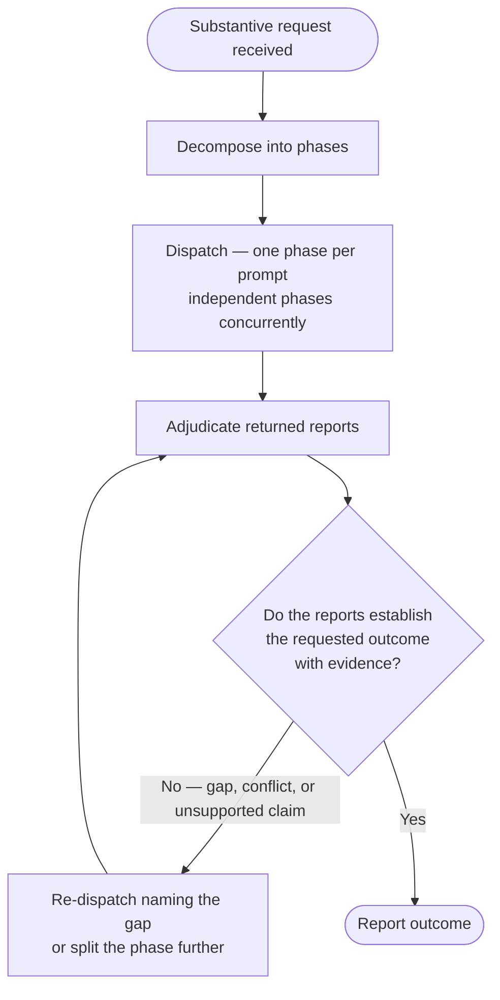

# Delegation

Delegation is the default execution mode for a substantive request, not an escalation reserved for large ones. An orchestrator that reads the files and runs the commands itself is the anti-pattern: context spent holding file contents and command output is context no longer available for judgment and adjudication.

For the full step-by-step preparation worksheet, activate the `/agent-orchestration:how-to-delegate` skill. For the orchestration framework, anti-patterns, and parallel-dispatch mechanics, activate the `/agent-orchestration:agent-orchestration` skill.



---

## 1. Decompose

Split the request into phases before any dispatch happens. The phases:

| Phase | Produces |
| ----- | -------- |
| read | The material the work depends on, located and read |
| gather | External facts — documentation, prior art, current system state |
| process | The analysis and the chosen approach |
| verify | Confirmation that the approach holds against the actual code and environment |
| write | The change |
| validate | Lint, type-check, and build results |
| test | Test runs, and new tests covering the change |
| report | What changed, and the evidence supporting it |
| review | Independent critique of the result |

Drop any phase that produces no work for this request. Do not pad a decomposition with empty phases.

Mechanical fan-out is delegated, never done inline: the same edit applied across many files, the same check run against many targets. "It is only a few files" is not a reason to keep it in the orchestrator.

## 2. Dispatch

- One phase, one prompt, one agent.
- Send independent phases in a single message so they run concurrently.
- Serialize only where one phase consumes another's result, or where two agents would write the same file.
- Match the agent type to the phase rather than sending every phase to a generalist.

## 3. Adjudicate

Adjudication is what the orchestrator keeps for itself:

- Judge the returned work instead of re-deriving it. Re-reading the files an agent already read spends the context that delegating them saved.
- Treat every agent report as a claim, not a fact. Check that the stated evidence supports the conclusion, and require the command output rather than the assurance that a command passed.
- Resolve conflicting reports by identifying which claim is falsifiable and dispatching a check for it — not by accepting the more confident report.
- Decide what happens next: accept the result, re-dispatch with the gap named, or split the phase further.

---

## Template

Construct each dispatch prompt from this template. Set `PHASE` to the phase this dispatch covers, then copy that phase's row from the Phase Task Table verbatim into `YOUR TASK`. Never blend rows from more than one phase into a single dispatch — a dispatch covers exactly one phase.

```text
Your ROLE_TYPE is sub-agent.

PHASE: [read | gather | process | verify | write | validate | test | report | review]

[Task Identification - one sentence]

OBSERVATIONS:
- [Factual observations already in your context]
- [Verbatim error messages if applicable]
- [Environment or system state if relevant]

DEFINITION OF SUCCESS:
- [Specific measurable outcome]
- [Acceptance criteria]
- [Verification method]

DELIVERY:
- [The channel that reaches the dispatcher, and where any longer artifact is written]

CONTEXT:
- Location: [Where to look]
- Scope: [Boundaries]
- Constraints: [Hard requirements vs Preferences]

ECOSYSTEM CONTEXT:
- [Session-specific facts the agent cannot find in project instructions or tool descriptions]
- [Authenticated CLIs, non-obvious doc locations, task-specific access]

YOUR TASK:
[Copy the row matching PHASE from the Phase Task Table below. Do not write a different task.]
```

### Phase Task Table

| Phase | YOUR TASK |
| ----- | -------- |
| read | Locate and read the material this work depends on. Report exact file paths and quoted content — do not summarize away detail a later phase needs. Do not edit any file. |
| gather | Collect the external facts named in CONTEXT — documentation, prior art, current system state. Report each fact with its source. Do not edit any file. |
| process | Analyze the material the read and gather phases produced. Choose an approach. Report the approach and why alternatives were ruled out. Do not edit any file. |
| verify | Check the chosen approach against the actual code and environment named in CONTEXT. Report where it holds and where it fails. Do not implement a fix. |
| write | Make the change described in DEFINITION OF SUCCESS. Touch only the files named in CONTEXT. |
| validate | Run the lint, type-check, and build commands named in CONTEXT. Report exact command output, pass and fail alike. Do not silence a failure without stating the fix. |
| test | Run the test suite named in CONTEXT. Add tests covering the change. Report exact command output. |
| report | Summarize what changed and the evidence supporting it. Cite the specific files, commands, and outputs. State no claim the evidence does not support. |
| review | Independently critique the result named in CONTEXT against DEFINITION OF SUCCESS. Report gaps, contradictions, or unsupported claims. Do not fix them. |

Authoring guidance (for the orchestrator filling in this template — do not include these annotations in the delivered prompt):

- OBSERVATIONS: Pass-through only — data already in your context (user messages, prior agent reports, command outputs you already received). Include `file:line` references if already known. Include verbatim error messages, not paraphrased. Do NOT pre-gather data for the agent (for example, do not run `ruff check .` before delegating to a linting agent). Do NOT read, grep, or glob files to find context for the agent — the agent has full tool access and an empty context window; it does its own discovery. No interpretations ("I think"), no assumptions ("probably"). SOURCE: [agent-orchestration SKILL.md](./../agent-orchestration/SKILL.md) — Pre-Delegation Verification Checklist section.
- DEFINITION OF SUCCESS: The "WHAT". Measurable outcomes the agent can verify. When the agent will produce more than roughly one line of output, instruct it to write results to a file and return only the path — this keeps orchestrator context lean. Example: `Write findings to .tmp/reports/NAME-YYYYMMDD.md. Return: STATUS: DONE + file path.` When directing agents to write to `.tmp/`, verify `.tmp/` is ignored by version control before committing.
- DELIVERY: State the delivery channel explicitly. An agent's final response text does not always reach its dispatcher — depending on the harness it may be returned, dropped, or replaced by an explicit message the agent has to send. Name the channel that reaches you in this harness, and name the artifact fallback: the full result written to a file whose path the agent returns. A result that exists only in the agent's final response text may never be read. Do not assume the dispatcher receives anything the prompt did not ask the agent to send.
- CONTEXT: The "WHERE" and "WHY". Location narrows scope; constraints bound the solution space.

---

## Delegation Rules

Check before sending:

| Rule | Check |
| ---- | ----- |
| Formula | Delegation = Observations + Success Criteria + Resources - Assumptions - Micromanagement |
| No HOW | Do NOT tell the agent _how_ to implement (for example, "Change line 42 to X") |
| Constraints OK | DO tell the agent _constraints_ (for example, "Must use the httpx library") |
| No Assumptions | Do NOT say "The issue is probably..." |
| Full Scope | If a code smell is found, instruct the agent to audit the _entire pattern_, not a single instance |
| Stated Delivery | Every prompt names how the result reaches the dispatcher |

---

## Quick Checklist

- [ ] Request was decomposed into phases before this dispatch was written
- [ ] Independent phases are being sent concurrently, not one at a time
- [ ] Starts with `Your ROLE_TYPE is sub-agent.`
- [ ] YOUR TASK copies exactly one row from the Phase Task Table, matching the dispatch's PHASE
- [ ] Contains only factual observations
- [ ] No assumptions stated as facts
- [ ] Defines WHAT and WHY, not HOW
- [ ] Lists resources without prescribing tools
- [ ] Names the delivery channel and where any longer artifact is written
