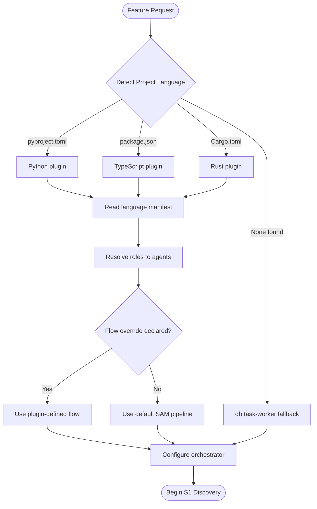
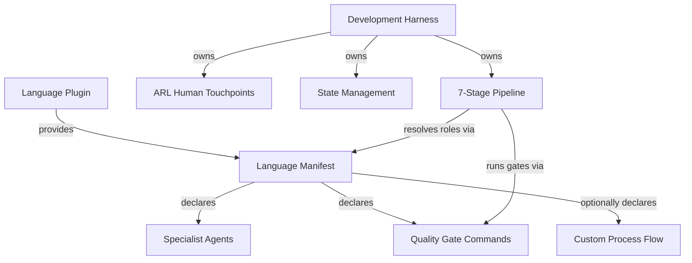
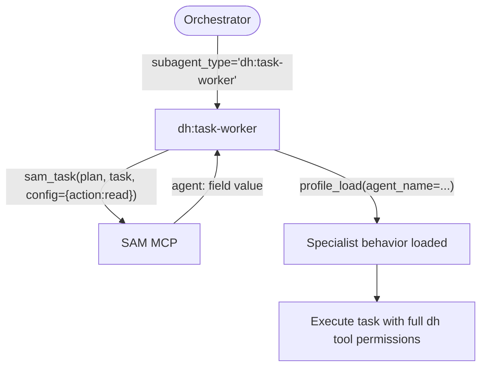

# Development Harness Plugin - AI-Facing Documentation

Language-agnostic development process harness that orchestrates feature development through a structured 7-stage pipeline. Any language plugin can compose with this harness by providing a language manifest declaring specialist agents and quality gates.

**Target contract:** See [docs/PURPOSE.md](./docs/PURPOSE.md) for the authoritative system purpose, target architecture, and current-state boundaries.

---

## Plugin Identity

**Name:** `dh`
**Version:** 0.1.0
**Purpose:** Provide a reusable, language-independent development workflow based on the Stateless Agent Methodology (SAM) with ARL-derived human touchpoints and Voltron-style language plugin composition.

**Design Principles:**

- The harness owns the *process*; language plugins own the *specialists*
- Every stage produces a logical handoff. Document artifacts use `artifact_register` and `artifact_read`; plans and task state use `sam_plan` and `sam_task`. Neither surface exposes direct filesystem paths.
- Human escalation follows ARL constraint analysis, not arbitrary checkpoints
- Without a language manifest, the harness falls back to `dh:task-worker` (specialist profile not loaded — task-worker executes directly)
- Task complexity is context-fit under uncertainty — see [Context-Fit Complexity Model](./docs/sdlc-layers/layer-0/context-fit-complexity.md)

---

## How It Works

### SAM 7-Stage Pipeline

The harness walks a feature request through seven stages, each producing a named artifact
registered through the configured backend. Stages gate on artifact completion, not conversation state.

1. **S1 Discovery** - Understand the feature, codebase, and constraints
2. **S2 Planning + RT-ICA** - Generate a plan with information completeness analysis
3. **S3 Context Integration** - Validate the plan against actual codebase state
4. **S4 Task Decomposition** - Break the plan into executable task files
5. **S5 Execution** - Implement tasks using language-appropriate specialists
6. **S6 Forensic Review** - Verify each task against its acceptance criteria
7. **S7 Final Verification** - Certify the feature meets original requirements

The default flow with ARL touchpoint gates is defined in [./skills/development-harness/references/default-development-flow.md](./skills/development-harness/references/default-development-flow.md).

### ARL Human Touchpoints

Not every stage requires human review. The harness uses ARL-derived constraint analysis to decide when to escalate. Escalation triggers include unbound constraints, domain knowledge gaps, high-risk irreversible changes, and novel architecture decisions. Routine changes with existing patterns proceed autonomously.

Details in [./skills/development-harness/references/human-touchpoint-model.md](./skills/development-harness/references/human-touchpoint-model.md).

### Voltron-Style Composition

Language plugins snap into the harness by providing a manifest that maps abstract roles to concrete agents and declares quality gate commands. The harness resolves roles at runtime based on project detection.

---

## Role Resolution



The full resolution protocol is documented in [./skills/development-harness/references/role-resolution-protocol.md](./skills/development-harness/references/role-resolution-protocol.md).

---

## State Management

The configured backend is the sole storage boundary for work items, grooming, plans, task
records, artifact manifests, and artifact content. `create_backend()` resolves that backend once;
MCP, CLI, skills, and agents use its logical protocols and do not select a second provider.

Remote-capable providers privately compose `FileCache` for snapshots, stale reads, queued offline
mutations, provider revisions, and artifact/plan continuity. Cache misses are unavailable data,
not authoritative empty results; revision conflicts retain pending work. Beads, SQLite, and Memory
use native storage directly: they never instantiate `FileCache`, read or write backlog YAML, or
queue remote mutations.

Agents address plans and tasks logically (`P{id}/T{M}`) through `sam_plan`, `sam_task`, or the
grouped DH CLI adapter. Physical paths, cache records, provider IDs, and wire formats are backend
internals. Use `sam_active_task` for session-scoped execution context.

Full conventions in [./skills/development-harness/references/artifact-conventions.md](./skills/development-harness/references/artifact-conventions.md).

**Gotcha — Large plans must use the incremental append workflow:**

For plans with 16+ tasks, use the three-call incremental workflow instead of a single monolithic
the `sam_plan` create action:

1. `sam_plan(config={"action":"create", "slug":"<slug>", "goal":"<goal>", "tasks":[], "owner_reference":<work_item_reference>})` — creates a drafting plan and returns a UUID-hex plan ID (e.g. `Pa1b2c3d4`)
2. `sam_plan(plan='Pa1b2c3d4', config={"action":"append_task", "task":<single_task_object>})` × N — appends tasks one at a time (replace `Pa1b2c3d4` with the actual returned ID)
3. `sam_plan(plan='Pa1b2c3d4', config={"action":"finalize"})` — clears drafting state and makes the plan ready

While a plan is in `state="drafting"`, `sam_plan(plan='<returned-plan-id>', config={"action":"ready"})`
and `sam_plan(plan='<returned-plan-id>', config={"action":"status"})` return their normal result
models with `state="drafting"` instead of dispatchable task data — this prevents dispatching a
partial plan. Only `finalize` makes the plan visible to the dispatch loop.

CLI equivalent: `plan create --slug ... --goal ... --owner-reference <work_item_reference>` (omit
`--task-id`/`--task-title` to start in `state="drafting"`) → `plan append-task --plan-address
<plan_id> --task-id ... --task-title ...` × N → `plan finalize --plan-address <plan_id>`. See
[docs/TASK_FILE_FORMAT.md](./docs/TASK_FILE_FORMAT.md) "DH CLI Usage Guide" for the full
grouped-command reference.

**Gotcha — `append_task` is single-writer only:**

`append_task` is single-writer for a given plan. Serialize appends through the configured backend;
concurrent writes are outside the contract. Do NOT call `append_task` for
the same plan from multiple agents or sessions simultaneously.

Plans, tasks, and artifacts are logical backend records. Their physical representation is private to
the configured backend; access them through `sam_*` and `artifact_*` operations.

---

## Artifact Manifest System

Document artifacts are registered in a structured manifest owned by the configured backend. The
manifest is the discovery mechanism — consumers query it via MCP to find artifacts for a work item.

**MCP tools (on backlog server) — Artifact Management:**

- `artifact_register` — Register or update an artifact entry (`item_id`, `artifact_type`, `artifact_id`, `status`, `agent`, `content`)
- `artifact_list` — List all artifacts for a work item, optionally filtered by `artifact_type`
- `artifact_get` — Get metadata for a specific artifact type on a work item
- `artifact_read` — Read logical artifact content resolved by the configured backend

Each tool above has a full CLI equivalent under `artifact register|list|get|read` — see
[docs/backend-providers.md](./docs/backend-providers.md) "CLI vs MCP Capability Surface" for the
authoritative flag mapping.

**Artifact types and owners:**

| Type | Owner agent | Notes |
|---|---|---|
| `feature-context` | `@dh:feature-researcher` | S1 discovery output |
| `architect` | `@dh:swarm-task-planner` | S2 architecture output |
| `codebase-analysis` | **`@dh:code-reviewer`** | Code review verdict; read by `complete-implementation` Phase T1 |
| `T0-baseline` | `@dh:t0-baseline-capture` | Pre-implementation baseline |
| `TN-verification` | `@dh:tn-verification-gate` | Post-implementation verification |
| `dispatch-plan` | `dispatch_create_plan` | Milestone dispatch plan |
| `audit-report` | **`@dh:doc-drift-auditor`** | Documentation drift audit; NOT used by `@dh:code-reviewer` |

Task plans are not artifact-manifest entries. Create, read, and update them through `sam_plan`, then
associate the returned logical address with the owning work item through `backlog_update`.

**CRITICAL — type ownership is exclusive:** `codebase-analysis` is owned by `@dh:code-reviewer`. `audit-report` is owned by `@dh:doc-drift-auditor`. These types must not be cross-assigned. `complete-implementation` reads the code review verdict via `artifact_read(item_id=<owner>, artifact_type="codebase-analysis")` — a wrong type silently skips the quality gate.

**Registration:** Producers call `artifact_register` after creating document-artifact content.
Plans are the exception: `sam_plan` owns plan content and task state, and `backlog_update` stores
only the logical plan association on the owning work item. Never duplicate plan content through
`artifact_register`.

**Consumer discovery:** Consumers (including worktree-isolated agents) call `artifact_list` then
`artifact_read` for document artifacts and `sam_plan` for plans instead of using filesystem access.
The configured backend resolves content for every worktree.

**MCP-native rule for agents:** Agents store document artifacts via `artifact_register` with
`content=` and store plans through `sam_plan`. The configured backend owns persistence and retrieval.
The `Write` tool is permitted only for repo-relative deliverables (source code, tests, documentation
files committed to the repo).

**Prohibited patterns — do not write these in agent instructions or tool calls:**

- Direct filesystem writes for system artifacts — use `artifact_register(item_id=<owner>, artifact_type=<type>, artifact_id=<logical-id>, content=...)` instead
- Direct filesystem reads for system artifacts — use `artifact_read(item_id=<owner>, artifact_type="T0-baseline")` instead
- `artifact_register(...)` without `content=` — identifier-only registration does not persist artifact content

## Dispatch Orchestration System

Wave-based parallel execution state for `/work-milestone`. State is persisted to SQLite at `~/.dh/projects/{project-slug}/dispatch-state.db` via the `dispatch_state.DispatchStateManager` class (imported by `server.py`).

**MCP tools (on backlog server) — Dispatch Orchestration:**

- `dispatch_read(milestone_number)` — Read provider-owned dispatch content. Returns the parsed plan structure or an error.
- `dispatch_validate(milestone_number)` — Validate structural integrity of an existing dispatch plan. Returns is_valid, errors, warnings.
- `dispatch_stale_check(milestone_number)` — Check whether any wave items have stale or dead PIDs and return staleness summary.
- `dispatch_create_plan(milestone_number, plan, overwrite, validate, issue)` — Validate and persist a dispatch plan atomically. `plan` is a typed DispatchPlan object. Returns `milestone_number`, `wave_count`, `item_count`, `is_valid`, `errors`, `warnings`, and `messages`. Set overwrite=True when re-grooming. Pass issue to auto-register as a `dispatch-plan` artifact.
- `dispatch_conflicts(milestone_number, repo)` — Analyze Impact Radius conflicts for open issues in a milestone. Returns `conflict_groups` and `count`.
- `dispatch_wave_start(milestone, wave_num, items)` — Create a wave entry; initialise all items with `status=pending`. Call before spawning processes. Returns error if wave already exists.
- `dispatch_item_status(milestone, issue, status, result, error, cost)` — Record completion or failure of one item. Looks up item by milestone+issue across all waves. Valid status: `complete`, `failed`, `skipped`.
- `dispatch_wave_status(milestone, wave_num)` — Query wave progress with per-item detail and elapsed time. Checks stale PIDs (marks dead processes failed) before returning.
- `dispatch_spawn(milestone, wave_num, ...)` — Background task tool (`task=True`) that calls `dispatch_wave_start` then spawns one `claude -p` kage-bunshin process per wave item. Used by `/work-milestone`.

Every tool above has a full CLI equivalent under `dispatch
read|validate|stale-check|create-plan|conflicts|wave-start|item-status|wave-status|spawn` — see
[docs/backend-providers.md](./docs/backend-providers.md) "CLI vs MCP Capability Surface" for the
authoritative flag mapping.

**Workflow:** `/groom-milestone` calls `dispatch_create_plan` to validate and persist provider-owned dispatch content. `/work-milestone` calls `dispatch_wave_start` per wave, `dispatch_spawn` to launch sessions, and `dispatch_wave_status` to poll progress. Spawned sessions call `dispatch_item_status` on completion.

---

## Composition Model



**What the harness owns:**

- Process orchestration (stage sequencing, gating, looping)
- Human touchpoint decisions (ARL constraint analysis)
- Artifact management (naming, storage, cross-referencing)
- Fallback behavior (`dh:task-worker` when no manifest exists)

**What language plugins own:**

- Specialist agents (architect, test-designer, code-reviewer)
- Quality gate commands (format, lint, typecheck, test)
- Project detection markers (config files, source patterns)
- Optionally, a custom process flow overriding the default pipeline

Language plugin authors should use the template at [./templates/language-manifest-template.md](./templates/language-manifest-template.md).

The manifest schema is documented in [./skills/development-harness/references/language-manifest-schema.md](./skills/development-harness/references/language-manifest-schema.md).

---

## Dispatch Pattern (Extension Rules)

**`dh:task-worker` is the universal dispatch agent for all dh workflows. It must be used for every agent dispatch — no exceptions.**

**Every dh skill and extension point dispatches `dh:task-worker`; specialist behavior is loaded internally through the task's `agent:` profile.**

### Why

`dh:task-worker` carries full dh tool permissions (SAM MCP, backlog MCP). When a task's `agent:` field is set, `task-worker` reads it via SAM MCP and passes it to `profile_load` to load specialist behavior internally. This ensures the SAM lifecycle (claim → execute → `sam_task(config={"action":"state"})`) is always owned by an agent that has the tools to execute it.

Dispatching `dh:task-worker` preserves SAM and backlog MCP access so the worker can execute the complete SAM lifecycle and update task state.

### The `agent:` field in SAM task YAML is not an orchestrator routing directive

The `agent:` field is read by `task-worker` — not by the orchestrator. The orchestrator always passes only the task reference (plan address + task ID). `task-worker` internally calls `profile_load(agent_name=...)` to specialize its behavior for that task.



### Extension rule

When adding a new dispatch step to any dh skill, reference file, or workflow document:

- Dispatch `subagent_type="dh:task-worker"` — always
- Keep `subagent_type="dh:task-worker"` regardless of task complexity
- The `agent:` field in the task YAML selects the specialist; the orchestrator does not

---

## Skills Overview

**Main orchestration:**

- `/dh:development-harness` - Entry point. Detects language, resolves roles, orchestrates S1-S7.

**SAM workflow:**

- `/dh:add-new-feature` - Plan a feature: discovery, analysis, architecture, task decomposition
- `/dh:implement-feature` - Execute tasks from a SAM task file via agent delegation loop
- `/dh:start-task` - Start or complete a specific task inside a SAM task file
- `/dh:complete-implementation` - Quality gates after all tasks are COMPLETE
- `/dh:gate-push` - Resolve branch → backlog issue/plan, then run complete-implementation gates and push/PR

**Workflow stages:**

- `/dh:discovery` - S1 feature and codebase understanding
- `/dh:planning` - S2 plan generation with RT-ICA
- `/dh:context-integration` - S3 plan validation against codebase
- `/dh:task-decomposition` - S4 break plan into executable tasks
- `/dh:execution` - S5 implement tasks with language specialists
- `/dh:forensic-review` - S6 verify task completion
- `/dh:final-verification` - S7 certify feature completion

**Planning tools:**

- `/dh:clear-cove-task-design` - Task design methodology
- `/dh:generate-task` - Generate individual task files
- `/dh:planner-rt-ica` - Information completeness analysis for planning
- `/dh:validation-protocol` - Validation patterns and checklists

**Implementation:**

- `/dh:implementation-manager` - Coordinate implementation across tasks

**Backlog management:**

- `/dh:backlog` - Backlog overview and operations reference
- `/dh:create-backlog-item` - Create new backlog items
- `/dh:work-backlog-item` - Work on a backlog item through its lifecycle
- `/dh:groom-backlog-item` - Groom and prioritize backlog items

**Milestone management:**

- `/dh:groom-milestone` - Groom milestone issues into dispatch plans
- `/dh:work-milestone` - Execute milestone tasks in isolated worktrees

**Testing:**

- `/dh:comprehensive-test-review` - Review test coverage and quality
- `/dh:analyze-test-failures` - Diagnose and categorize test failures
- `/dh:test-failure-mindset` - Systematic approach to understanding test failures

**Other:**

- `/dh:dispatch` - Dispatch tasks to agents using teams-first parallel execution; prefer over implement-feature when milestone-scoped work needs concurrent agent dispatch
- `/dh:dh-meta-docs` - Plugin meta-documentation
- `/dh:interop` - Cross-plugin interoperability
- `/dh:subagent-contract` - Subagent contract definitions

---

## Agents Overview

**Planning and decomposition:**

- `@dh:swarm-task-planner` - Decompose features into parallel task streams
- `@dh:plan-validator` - Validate plans for completeness and feasibility

**Research and analysis:**

- `@dh:feature-researcher` - Research feature requirements and prior art
- `@dh:codebase-analyzer` - Analyze codebase structure and patterns
- `@dh:ecosystem-researcher` - Research external dependencies and ecosystem
- `@dh:alignment-analyst` - Compare implementation against design intent for grooming
- `@dh:fact-checker` - Verify item claims against primary sources during grooming
- `@dh:impact-analyst` - Assess blast radius and affected systems for backlog items

**Verification:**

- `@dh:feature-verifier` - Verify feature meets acceptance criteria
- `@dh:integration-checker` - Check integration points and compatibility
- `@dh:t0-baseline-capture` - Capture baseline state before implementation
- `@dh:tn-verification-gate` - Verify acceptance criteria after implementation
- `@dh:contract-verification` - Verify method signatures and type contracts match architect spec

**Context management:**

- `@dh:dh-context-gathering` - Gather context from codebase and documentation
- `@dh:context-refinement` - Refine and validate gathered context

**Documentation:**

- `@dh:doc-drift-auditor` - Detect documentation drift from implementation
- `@dh:service-docs-maintainer` - Generate and maintain service documentation

**Review:**

- `@dh:code-reviewer` - Independent code review against acceptance criteria (S6 Forensic Review)

**Execution:**

- `@dh:task-worker` - Universal dispatch and task executor; loads specialist profiles through each task's `agent:` field
- `@dh:backlog-item-groomer` - Groom a backlog item with RT-ICA assessment and resource map

---

## When to Use

Activate this plugin when:

- Starting feature development in any language project
- Planning an implementation that needs structured decomposition
- Running the full development workflow from discovery through verification
- Working in a multi-language project where process should be consistent
- Needing human touchpoint decisions based on constraint analysis rather than arbitrary gates

Do NOT use when:

- Making a quick fix that does not need staged planning
- Working on documentation-only changes
- The language plugin already provides its own complete workflow (check for flow override in manifest)

---

## Required Reading by Task Type

Load these documents based on what you are doing. They contain the system design knowledge required for that work to succeed.

**Modifying the pipeline process, stage sequencing, or touchpoint gates:**

- Load [Default Development Flow](./skills/development-harness/references/default-development-flow.md) — defines the S1-S7 pipeline, ARL gates, and stage handoffs
- Load [Artifact Conventions](./skills/development-harness/references/artifact-conventions.md) — artifact naming, required sections per type, cross-referencing tokens

**Modifying data structures, domain models, or task/plan schemas:**

- Load [Domain model source](./sam_schema/core/models.py) — authoritative `Task` and `Plan` Pydantic models. This is the source of truth for all field definitions. Notable plan-level fields: `autonomy` (enum `full_auto` | `checkpoint` | `per_task`, default `full_auto`) controls implement-feature dispatch gating — see `Plan` class and [implement-feature SKILL.md](./skills/implement-feature/SKILL.md) for how it is consumed.
- Load [Task File Format](./docs/TASK_FILE_FORMAT.md) — field reference, authorized writers, sam CLI usage. **Drift warning**: this is a snapshot. Verify fields against `models.py` before relying on it for implementation.
- Load [Workflow Architecture Diagram](./docs/workflow-architecture-diagram.md) — data shapes, publisher-consumer map, SAM state machine, hook trigger conditions

**Modifying the backlog lifecycle, grooming, or issue state machine:**

- Load [Backlog Item Lifecycle](./docs/backlog-item-lifecycle.md) — end-to-end issue journey from creation through closure
- Load [Backend Providers](./docs/backend-providers.md) — pluggable backend abstractions, GitHub/GitLab/Linear capabilities

**Modifying artifact handling, divergence detection, or plan management:**

- Load [Plan Artifact Lifecycle](./docs/plan-artifact-lifecycle.md) — immutable vs mutable artifacts, divergence classification, annotation rules
- Load [Artifact Conventions](./skills/development-harness/references/artifact-conventions.md) — storage model, file naming, cross-reference tokens

**Modifying or extending the SDLC layer architecture (Layer 0/1/2 design):**

- Load [Layer 0 README](./docs/sdlc-layers/layer-0/README.md) — framework design: evidence discipline, orchestrator discipline, context-fit complexity, RT-ICA gate, verification protocol
- Load [Layer 1 README](./docs/sdlc-layers/layer-1/README.md) — language plugin design: harness role mapping, workflow pattern taxonomy, linting discovery protocol
- Load [Layer 2 README](./docs/sdlc-layers/layer-2/README.md) — stack profile design: profile schema, profile templates
- Load [ARL Meta Layer](./docs/sdlc-layers/arl-meta-layer.md) — ARL human probing design across layers

**Adding skills or agents, or modifying workflow logic (Mermaid forks, agent dispatch, MCP tools, artifact flows):**

- Run `/dh:meta-workflow-graph-refresh` — step-by-step extraction and assembly process for keeping `docs/dh-workflow-graph.json` accurate after structural changes; covers which layer to re-extract, how to run the ensemble, and how to rebuild the graph

Note: Four layer-0 design documents (artifact-conventions, task-file-format, sam-pipeline, arl-touchpoints) were consolidated into the canonical skill references on 2026-03-31. The layer-0 files now contain redirects to the canonical locations. The remaining layer-0 files (evidence-discipline, orchestrator-discipline, context-fit-complexity, rt-ica-gate, verification-protocol) contain design principles with no operational equivalent — they are authoritative in place.

### Documentation Update Triggers

After completing your work, update the architectural documents above if your changes fall into these categories:

| Change type | Update required |
|---|---|
| Process change (new stage, changed sequencing, new touchpoint) | Yes — update Default Development Flow |
| Data structure change (new field, changed type, new entity) | Yes — update `models.py` first, then Task File Format |
| New or removed MCP tool | Yes — update Workflow Architecture Diagram; run `/dh:meta-workflow-graph-refresh` to update G8 layer |
| New artifact type or changed artifact lifecycle | Yes — update Artifact Conventions and Plan Artifact Lifecycle; run `/dh:meta-workflow-graph-refresh` to update G2 layer |
| New skill, agent, or Mermaid decision fork added | Yes — run `/dh:meta-workflow-graph-refresh` to update L0/L1 or G4 layer |
| Refactoring (same behavior, different code structure) | No |
| Agent prompt changes (better instructions, same behavior) | No |
| UI/UX changes | No |

---

## Layer Model

This harness implements the **SDLC Layer Separation Architecture**. Layer 0 = framework (this harness); Layer 1 = language plugin; Layer 2 = stack profile (optional). See [docs/sdlc-layers/](./docs/sdlc-layers/).

Layer-0 operational specifications (pipeline flow, artifact conventions, touchpoint model, task format) live in the skill references and docs — see "Required Reading by Task Type" above. Layer-0 design principles (evidence discipline, orchestrator discipline, context-fit complexity) live in [docs/sdlc-layers/layer-0/](./docs/sdlc-layers/layer-0/).

---

## Testing MCP Servers Against Fresh Source Code

Built-in MCP tool calls (`mcp__plugin_dh_backlog__*`, `mcp__plugin_dh_sam__*`) run against the **plugin cache**, not the current source. After modifying `backlog_core/` or `sam_schema/`, the cache is stale until a session restart + version bump. To test changes immediately, use `fastmcp` CLI against the source files:

Run all commands from the **project root** (where `pyproject.toml` lives). `$(pwd)` resolves to the project root at execution time.

**Suppress banner noise**: Set `FASTMCP_SHOW_SERVER_BANNER=false` to suppress the startup banner. Set `FASTMCP_LOG_ENABLED=false` to suppress INFO log lines. Both can be combined:

```bash
FASTMCP_SHOW_SERVER_BANNER=false FASTMCP_LOG_ENABLED=false uv run fastmcp call ...
```

SOURCE: [FastMCP Settings docs](https://gofastmcp.com/more/settings) — `FASTMCP_SHOW_SERVER_BANNER` (bool, default true), also controllable via `--no-banner`.

**Backlog server** (`scripts/run_backlog_server.py`):

```bash
# List all tools
FASTMCP_SHOW_SERVER_BANNER=false FASTMCP_LOG_ENABLED=false uv run fastmcp list \
  --command "uv run --script $(pwd)/plugins/development-harness/scripts/run_backlog_server.py"

# View a backlog item (full content)
FASTMCP_SHOW_SERVER_BANNER=false FASTMCP_LOG_ENABLED=false uv run fastmcp call \
  --command "uv run --script $(pwd)/plugins/development-harness/scripts/run_backlog_server.py" \
  --target backlog_view \
  --input-json '{"selector": "groom-milestone", "summary": false}'

# List backlog items (compact — body excluded by default, use fields=["body"] to include)
FASTMCP_SHOW_SERVER_BANNER=false FASTMCP_LOG_ENABLED=false uv run fastmcp call \
  --command "uv run --script $(pwd)/plugins/development-harness/scripts/run_backlog_server.py" \
  --target backlog_list \
  --input-json '{"search": "sdlc", "limit": 3}'
```

**SAM server** (`scripts/run_sam_server.py`):

```bash
# List all tools
FASTMCP_SHOW_SERVER_BANNER=false FASTMCP_LOG_ENABLED=false uv run fastmcp list \
  --command "uv run --script $(pwd)/plugins/development-harness/scripts/run_sam_server.py"

# List all plans
FASTMCP_SHOW_SERVER_BANNER=false FASTMCP_LOG_ENABLED=false uv run fastmcp call \
  --command "uv run --script $(pwd)/plugins/development-harness/scripts/run_sam_server.py" \
  --target sam_plan \
  --input-json '{"config":{"action":"list"}}'
```

**Why `--command` is required**: The server files use relative imports (`from . import models`) and sibling packages (`import dh_paths`). Running `fastmcp call server.py` directly hits an asyncio conflict when invoked from within Claude Code's async context. The `--command` flag launches the runner script as a fresh subprocess, matching how the plugin cache launches the server.

**`--json` output structure**: When using `--json`, fastmcp wraps the result — parse with:

```python
outer = json.loads(stdout)
data = json.loads(outer["content"][0]["text"])
```

**`backlog_list` filter notes**:

- `status` matches workflow labels (e.g. `"status:in-progress"`, `"status:groomed"`), NOT GitHub open/closed state. Passing `"open"` returns zero results.
- `body` is excluded from default list responses. Use `fields=["body"]` to include it, or check `available_fields` in the response for the full list of requestable fields.

**Backend selection during testing**: Prefix `fastmcp call` commands with `BACKLOG_BACKEND=sqlite` or `BACKLOG_BACKEND=memory` to test against a non-GitHub backend without requiring live credentials:

```bash
BACKLOG_BACKEND=memory FASTMCP_SHOW_SERVER_BANNER=false FASTMCP_LOG_ENABLED=false \
uv run fastmcp call \
  --command "uv run --script $(pwd)/plugins/development-harness/scripts/run_backlog_server.py" \
  --target backlog_list \
  --input-json '{}'
```

**When to use this vs built-in MCP calls**: Use `fastmcp call` to verify behavior after editing `backlog_core/` or `sam_schema/` source files. Use built-in MCP calls for normal workflow operations where the cached server is sufficient.

---

## Backend Providers

When discussing, extending, or adding backend providers for the development harness — including state management, task management, planning, issues, jobs, milestones, or boards — read [docs/backend-providers.md](./docs/backend-providers.md) first. Amend that document with any new points, references, discoveries, or user inputs that arise during the conversation.

The backlog MCP server uses the provider-neutral `WorkItemBackend` and `ContentProvider`
protocols (`backlog_core/backend_protocol.py`). One configured backend owns all work-item,
grooming, plan, task, artifact-manifest, and artifact-content operations. The following backend
families are available:

- `github` (default) — GitHub Issues via GraphQL + PyGithub REST. Requires `GITHUB_TOKEN`.
- `sqlite` — local 6-table SQLite schema, WAL mode. No external credentials.
- `memory` — in-memory native test double. No persistence, YAML, or `FileCache`.
- `beads` — routes to `bd` CLI via lazy subprocess wrapper. Auto-detected when `.beads/dh-backend` marker file exists at project root (explicit opt-in required). `bd` binary validated on first use; raises `BdNotInstalledError` on failure with no silent fallback.

Select via `BACKLOG_BACKEND` env var, `backlog.backend` key in `.dh/config.yaml` (project config dir or `~/.dh/`), or auto-detected from `.beads/dh-backend` marker file presence. Default is `github` when no selector matches — existing deployments require no changes.

Future platform backends (GitLab, Linear, Supabase) will implement the same Protocol. See [docs/backend-providers.md](./docs/backend-providers.md) for the full Protocol reference, method groups, configuration examples, and platform capability comparison.

The backlog MCP server also exposes `profile_load` (agent_profile tool) for loading named agent
profiles that specialize task-worker behavior at dispatch time. Profile definitions live in the
backlog server configuration; see [docs/backend-providers.md](./docs/backend-providers.md) for
the module boundary.

Remote-capable providers privately compose `FileCache`; it owns stale snapshots, queued offline
mutations, revisions, and provider-specific plan/artifact persistence. Beads, SQLite, and Memory
use native storage directly and never read/write backlog YAML or instantiate `FileCache`.
Backend unavailability and unsupported content capabilities are explicit outcomes; callers do not
fall back to another provider.

Plans and artifacts are addressed logically through `sam_*` and `artifact_*` operations. An
issue or owner reference links a plan to its work item; it never selects a separate plan backend.

### Plan and artifact capability boundary

The configured backend implements the logical plan and artifact capabilities. `sam_plan`,
`sam_task`, `sam_active_task`, and `artifact_*` calls use that same backend; there is no
`TASKBACKEND`, independent artifact provider, local filesystem fallback, or per-plan backend
selection. Remote providers may use a private `FileCache` for stale reads and queued writes.
Beads, SQLite, and Memory remain native-only and never use YAML or cache storage.

---

## References

- [Backend Providers](./docs/backend-providers.md)
- [Default Development Flow](./skills/development-harness/references/default-development-flow.md)
- [Role Resolution Protocol](./skills/development-harness/references/role-resolution-protocol.md)
- [Language Manifest Schema](./skills/development-harness/references/language-manifest-schema.md)
- [Human Touchpoint Model](./skills/development-harness/references/human-touchpoint-model.md)
- [Artifact Conventions](./skills/development-harness/references/artifact-conventions.md)
- [Language Manifest Template](./templates/language-manifest-template.md)

---

## Sources

- SAM methodology: <https://github.com/bitflight-devops/stateless-agent-methodology>
- Flow experiments & learnings: <https://github.com/Jamie-BitFlight/sam-flow-experiments>
- ARL skill: `plugins/plugin-creator/skills/arl/`
- RT-ICA skill: `plugins/development-harness/skills/planner-rt-ica/`
