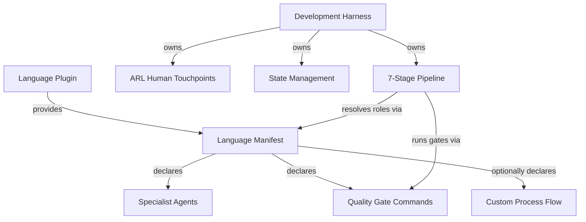

# Development Harness Plugin - AI-Facing Documentation

Language-agnostic development process harness that orchestrates feature development through a structured 7-stage pipeline. Any language plugin can compose with this harness by providing a language manifest declaring specialist agents and quality gates.

**Target contract:** See [docs/PURPOSE.md](./docs/PURPOSE.md) for the authoritative system purpose, target architecture, and current-state boundaries.

---

## Plugin Identity

**Name:** `dh`
**Version:** 0.1.0
**Purpose:** Provide a reusable, language-independent development workflow based on the Stateless Agent Methodology (SAM) with ARL-derived human touchpoints and Voltron-style language plugin composition.

**Design Principles:**

- The harness owns the *process*; language plugins own the *specialists*
- Every stage produces a logical handoff. Document artifacts use `artifact_register` and `artifact_read`; plans and task state use `sam_plan` and `sam_task`. Neither surface exposes direct filesystem paths.
- Human escalation follows ARL constraint analysis, not arbitrary checkpoints
- Without a language manifest, the harness falls back to `dh:task-worker` (specialist profile not loaded — task-worker executes directly)
- Task complexity is context-fit under uncertainty — see [Context-Fit Complexity Model](./docs/sdlc-layers/layer-0/context-fit-complexity.md)

---

## How It Works

### SAM 7-Stage Pipeline

S1 Discovery → S2 Planning+RT-ICA → S3 Context Integration → S4 Task Decomposition → S5 Execution
→ S6 Forensic Review → S7 Final Verification. Each stage produces a named artifact registered
through the configured backend and gates on artifact completion, not conversation state. Load
`dh:dh-meta-docs` for the full stage definitions and ARL touchpoint gates.

### ARL Human Touchpoints

ARL-derived constraint analysis decides when a stage escalates to human review instead of
proceeding autonomously — not arbitrary checkpoints. Load `dh:dh-meta-docs` for the human
touchpoint model.

### Voltron-Style Composition

Language plugins snap into the harness by providing a manifest that maps abstract roles to
concrete agents and declares quality gate commands. The harness resolves roles at runtime based on
project-language detection, falling back to `dh:task-worker` when no manifest matches. Load
`dh:dh-meta-docs` for the role-resolution protocol.

---

## State Management

The configured backend is the sole storage boundary for work items, grooming, plans, task
records, artifact manifests, and artifact content — resolved once via `create_backend()`. See
[docs/backend-providers.md](./docs/backend-providers.md) for cache behavior, revision-conflict
handling, and the per-family (`github`/`sqlite`/`memory`/`beads`) storage contract.

Agents address plans and tasks logically (`P{id}/T{M}`) through `sam_plan`, `sam_task`, or the
grouped DH CLI adapter. Physical paths, cache records, provider IDs, and wire formats are backend
internals. Use `sam_active_task` for session-scoped execution context.

Load `dh:dh-meta-docs` for the artifact conventions.

**Gotcha — Large plans must use the incremental append workflow:**

For plans with 16+ tasks, use the three-call incremental workflow instead of a single monolithic
`sam_plan` create action:

1. `sam_plan(config={"action":"create", "slug":"<slug>", "goal":"<goal>", "tasks":[], "owner_reference":<work_item_reference>})` — creates a drafting plan and returns a UUID-hex plan ID (e.g. `Pa1b2c3d4`)
2. `sam_plan(plan='Pa1b2c3d4', config={"action":"append_task", "task":<single_task_object>})` × N — appends tasks one at a time (replace `Pa1b2c3d4` with the actual returned ID)
3. `sam_plan(plan='Pa1b2c3d4', config={"action":"finalize"})` — clears drafting state and makes the plan ready

While a plan is in `state="drafting"`, `sam_plan(plan='<returned-plan-id>', config={"action":"ready"})`
and `sam_plan(plan='<returned-plan-id>', config={"action":"status"})` return their normal result
models with `state="drafting"` instead of dispatchable task data — this prevents dispatching a
partial plan. Only `finalize` makes the plan visible to the dispatch loop.

CLI equivalent: `plan create --slug ... --goal ... --owner-reference <work_item_reference>` (omit
`--task-id`/`--task-title` to start in `state="drafting"`) → `plan append-task --plan-address
<plan_id> --task-id ... --task-title ...` × N → `plan finalize --plan-address <plan_id>`.

**Gotcha — `append_task` is single-writer only:**

`append_task` is single-writer for a given plan. Serialize appends through the configured backend;
concurrent writes are outside the contract. Do NOT call `append_task` for
the same plan from multiple agents or sessions simultaneously. See
[ADR-1770-1](./docs/adrs/ADR-1770-1-single-writer-task-backend.md) for the rationale.

Plans, tasks, and artifacts are logical backend records. Their physical representation is private to
the configured backend; access them through `sam_*` and `artifact_*` operations.

---

## Artifact Manifest System

Document artifacts are registered in a structured manifest owned by the configured backend,
discovered via `artifact_list`/`artifact_read` rather than filesystem access.

**MCP tools (on backlog server):** `artifact_register`, `artifact_list`, `artifact_get`,
`artifact_read` — each has a full CLI equivalent under `artifact register|list|get|read`. See
[docs/backend-providers.md](./docs/backend-providers.md) "CLI vs MCP Capability Surface" for the
authoritative flag mapping.

Load the `dh:create-artifact` skill before registering or reading an artifact — it is the
authoritative registry of accepted `artifact_type` strings, the producing agent for each, and the
`Gate-read` ownership rule that keeps a gated read from resolving the wrong document.

**Prohibited patterns — do not write these in agent instructions or tool calls:**

- Direct filesystem writes for system artifacts — use `artifact_register(item_id=<owner>, artifact_type=<type>, artifact_id=<logical-id>, content=...)` instead
- Direct filesystem reads for system artifacts — use `artifact_read(item_id=<owner>, artifact_type="T0-baseline")` instead
- `artifact_register(...)` without `content=` — identifier-only registration does not persist artifact content

## Dispatch Orchestration System

Wave-based parallel execution state for `/work-milestone`, persisted to SQLite via
`dispatch_state.DispatchStateManager`.

**MCP tools (on backlog server):** `dispatch_read`, `dispatch_validate`, `dispatch_stale_check`,
`dispatch_create_plan`, `dispatch_conflicts`, `dispatch_wave_start`, `dispatch_item_status`,
`dispatch_wave_status`, `dispatch_spawn` — each has a full CLI equivalent under `dispatch
read|validate|stale-check|create-plan|conflicts|wave-start|item-status|wave-status|spawn`. See
[docs/backend-providers.md](./docs/backend-providers.md) "CLI vs MCP Capability Surface" for the
authoritative flag mapping.

The `/dh:groom-milestone` and `/dh:work-milestone` skills own the per-tool call sequence and
parameters for this workflow; load whichever skill owns the step you're changing rather than
restating its steps here.

---

## Composition Model

**What the harness owns:**

- Process orchestration (stage sequencing, gating, looping)
- Human touchpoint decisions (ARL constraint analysis)
- Artifact management (naming, storage, cross-referencing)
- Fallback behavior (`dh:task-worker` when no manifest exists)

**What language plugins own:**

- Specialist agents (architect, test-designer, code-reviewer)
- Quality gate commands (format, lint, typecheck, test)
- Project detection markers (config files, source patterns)
- Optionally, a custom process flow overriding the default pipeline

Language plugin authors should use the template at [./templates/language-manifest-template.md](./templates/language-manifest-template.md).

Load `dh:dh-meta-docs` for the language-manifest schema.

---

## Skills Overview

**Main orchestration:**

- `/dh:development-harness` - Entry point. Detects language, resolves roles, orchestrates S1-S7.

**SAM workflow:**

- `/dh:add-new-feature` - Plan a feature: discovery, analysis, architecture, task decomposition
- `/dh:implement-feature` - Execute tasks from a SAM plan via agent delegation loop
- `/dh:start-task` - Start or complete a specific SAM task
- `/dh:complete-implementation` - Quality gates after all tasks are COMPLETE
- `/dh:gate-push` - Resolve branch → backlog issue/plan, then run complete-implementation gates and push/PR

**Workflow stages:**

- `/dh:discovery` - S1 feature and codebase understanding
- `/dh:planning` - S2 plan generation with RT-ICA
- `/dh:context-integration` - S3 plan validation against codebase
- `/dh:task-decomposition` - S4 break plan into executable tasks
- `/dh:execution` - S5 implement tasks with language specialists
- `/dh:forensic-review` - S6 verify task completion
- `/dh:final-verification` - S7 certify feature completion

**Planning tools:**

- `/dh:clear-cove-task-design` - Task design methodology
- `/dh:generate-task` - Generate individual tasks
- `/dh:planner-rt-ica` - Information completeness analysis for planning
- `/dh:validation-protocol` - Validation patterns and checklists

**Implementation:**

- `/dh:implementation-manager` - Coordinate implementation across tasks

**Backlog management:**

- `/dh:create-backlog-item` - Create new backlog items
- `/dh:work-backlog-item` - Work on a backlog item through its lifecycle
- `/dh:groom-backlog-item` - Groom and prioritize backlog items

**Milestone management:**

- `/dh:groom-milestone` - Groom milestone issues into dispatch plans
- `/dh:work-milestone` - Execute milestone tasks in isolated worktrees

**Testing:**

- `/dh:comprehensive-test-review` - Review test coverage and quality
- `/dh:analyze-test-failures` - Diagnose and categorize test failures
- `/dh:test-failure-mindset` - Systematic approach to understanding test failures

**Other:**

- `/dh:dispatch` - Dispatch tasks to agents using teams-first parallel execution; prefer over implement-feature when milestone-scoped work needs concurrent agent dispatch
- `/dh:dh-meta-docs` - Plugin meta-documentation
- `/dh:interop` - Cross-plugin interoperability
- `/dh:subagent-contract` - Where a dispatched step's output goes, and how it signals state upstream

---

## Agents Overview

**Planning and decomposition:**

- `@dh:swarm-task-planner` - Decompose features into parallel task streams
- `@dh:plan-validator` - Validate plans for completeness and feasibility

**Research and analysis:**

- `@dh:feature-researcher` - Research feature requirements and prior art
- `@dh:codebase-analyzer` - Analyze codebase structure and patterns
- `@dh:ecosystem-researcher` - Research external dependencies and ecosystem
- `@dh:alignment-analyst` - Compare implementation against design intent for grooming
- `@dh:fact-checker` - Verify item claims against primary sources during grooming
- `@dh:impact-analyst` - Assess blast radius and affected systems for backlog items

**Verification:**

- `@dh:feature-verifier` - Verify feature meets acceptance criteria
- `@dh:integration-checker` - Check integration points and compatibility
- `@dh:t0-baseline-capture` - Capture baseline state before implementation
- `@dh:tn-verification-gate` - Verify acceptance criteria after implementation
- `@dh:contract-verification` - Verify method signatures and type contracts match architect spec

**Context management:**

- `@dh:dh-context-gathering` - Gather context from codebase and documentation
- `@dh:context-refinement` - Refine and validate gathered context

**Documentation:**

- `@dh:doc-drift-auditor` - Detect documentation drift from implementation
- `@dh:service-docs-maintainer` - Generate and maintain service documentation

**Review:**

- `@dh:code-reviewer` - Independent code review against acceptance criteria (S6 Forensic Review)

**Execution:**

- `@dh:task-worker` - Blank-canvas SAM task executor dispatched in place of a generic agent; loads specialist profiles through each task's `agent:` field
- `@dh:backlog-item-groomer` - Groom a backlog item with RT-ICA assessment and resource map

---

## When to Use

Activate this plugin when:

- Starting feature development in any language project
- Planning an implementation that needs structured decomposition
- Running the full development workflow from discovery through verification
- Working in a multi-language project where process should be consistent
- Needing human touchpoint decisions based on constraint analysis rather than arbitrary gates

Do NOT use when:

- Making a quick fix that does not need staged planning
- Working on documentation-only changes
- The language plugin already provides its own complete workflow (check for flow override in manifest)

---

## Required Reading by Task Type

Load these documents based on what you are doing. They contain the system design knowledge required for that work to succeed.

**Modifying the pipeline process, stage sequencing, or touchpoint gates:**

- Load `dh:dh-meta-docs` — routes the S1-S7 pipeline, ARL gates, stage handoffs, artifact naming, and cross-reference tokens

**Modifying data structures, domain models, or task/plan schemas:**

- Load [Domain model source](./sam_schema/core/models.py) — authoritative `Task` and `Plan` Pydantic models. This is the source of truth for all field definitions. Notable plan-level fields: `autonomy` (enum `full_auto` | `checkpoint` | `per_task`, default `full_auto`) controls implement-feature dispatch gating — see `Plan` class and [implement-feature SKILL.md](./skills/implement-feature/SKILL.md) for how it is consumed.
- Load [Workflow Architecture Diagram](./docs/workflow-architecture-diagram.md) — data shapes, publisher-consumer map, SAM state machine, hook trigger conditions

**Modifying the backlog lifecycle, grooming, or issue state machine:**

- Load [Backlog Item Lifecycle](./docs/backlog-item-lifecycle.md) — end-to-end issue journey from creation through closure
- Load [Backend Providers](./docs/backend-providers.md) — pluggable backend abstractions, GitHub/GitLab/Linear capabilities

**Modifying markdown consumption, content pagination, table-of-contents/section addressing, or response sizing:**

- Load [Component Architecture](./docs/component-architecture.md) — which package owns what, and the points where two components resemble each other and are not the same. Read this before working in any package in this plugin
- Load [Agent Markdown Consumption — Behaviour Specification](./docs/agent-markdown-consumption-contract.md) — normative requirements R1-R8 for how markdown reaches an agent, across every transport
- Load [MCP Progressive-Disclosure Contract](./docs/mcp-progressive-disclosure-contract.md) — mechanical reference for ordinal addressing, navigation parameters, and response shapes
- Load [CONTEXT.md](./CONTEXT.md) — domain vocabulary for this area (Collection, Generation, Navigation, Control set, and related terms); read before writing new prose about markdown consumption so terminology matches
- Read [docs/adrs/](./docs/adrs/) — reasoning and rejected alternatives behind the contract's decisions, not restated in the contract itself

**Modifying `backlog_core/` internals — any backend implementation, GitHub content/CAS storage, offline queueing, or collaborator boundaries within `GitHubBackend`:**

- Load [backlog_core/ARCHITECTURE.md](./backlog_core/ARCHITECTURE.md) — the authoritative module design doc: per-collaborator responsibilities, the GitHub writable-records design (CAS-on-blob-SHA, envelope validation, fail-closed semantics, why this replaced an earlier Gist-backed store), offline/replay policy, and the reasoning behind decisions that read as arbitrary without it. Read this BEFORE diagnosing a bug or proposing a fix anywhere in `backlog_core/models.py`, `backlog_core/operations.py`, or `backlog_core/backends/*.py` — this file already answers "why does it work this way" for most of what looks, from the code alone, like an odd or missing design choice. A recurring failure shape across independently-diagnosed bugs (e.g. "a queued mutation never gets acknowledged after the thing it was waiting for already happened," seen 3 times in one session before this doc was read) is itself a signal to stop and read this file rather than keep patching instances.

**Modifying artifact handling, divergence detection, or plan management:**

- Load [Plan Artifact Lifecycle](./docs/plan-artifact-lifecycle.md) — immutable vs mutable artifacts, divergence classification, annotation rules
- Load `dh:dh-meta-docs` — routes the artifact storage model, file naming, and cross-reference tokens

**Modifying or extending the SDLC layer architecture (Layer 0/1/2 design):**

- Load [Layer 0 README](./docs/sdlc-layers/layer-0/README.md) — framework design: evidence discipline, orchestrator discipline, context-fit complexity, RT-ICA gate, verification protocol
- Load [Layer 1 README](./docs/sdlc-layers/layer-1/README.md) — language plugin design: harness role mapping, workflow pattern taxonomy, linting discovery protocol
- Load [Layer 2 README](./docs/sdlc-layers/layer-2/README.md) — stack profile design: profile schema, profile templates
- Load [ARL Meta Layer](./docs/sdlc-layers/arl-meta-layer.md) — ARL human probing design across layers

**Adding skills or agents, or modifying workflow logic (Mermaid forks, agent dispatch, MCP tools, artifact flows):**

- Run `/dh:meta-workflow-graph-refresh` — step-by-step extraction and assembly process for keeping `docs/dh-workflow-graph.json` accurate after structural changes; covers which layer to re-extract, how to run the ensemble, and how to rebuild the graph

Note: The layer-0 design documents artifact-conventions, task-file-format, sam-pipeline, and arl-touchpoints were consolidated into the canonical skill references on 2026-03-31. The layer-0 files now contain redirects to the canonical locations. The remaining layer-0 files (evidence-discipline, orchestrator-discipline, context-fit-complexity, rt-ica-gate, verification-protocol) contain design principles with no operational equivalent — they are authoritative in place.

### Documentation Update Triggers

After completing your work, update the architectural documents above if your changes fall into these categories:

| Change type | Update required |
|---|---|
| Process change (new stage, changed sequencing, new touchpoint) | Yes — update Default Development Flow |
| Data structure change (new field, changed type, new entity) | Yes — update `models.py` first |
| New or removed MCP tool | Yes — update Workflow Architecture Diagram; run `/dh:meta-workflow-graph-refresh` to update G8 layer |
| New artifact type or changed artifact lifecycle | Yes — update Artifact Conventions and Plan Artifact Lifecycle; run `/dh:meta-workflow-graph-refresh` to update G2 layer |
| New skill, agent, or Mermaid decision fork added | Yes — run `/dh:meta-workflow-graph-refresh` to update L0/L1 or G4 layer |
| Refactoring (same behavior, different code structure) | No |
| Agent prompt changes (better instructions, same behavior) | No |
| UI/UX changes | No |

---

## Layer Model

This harness implements the **SDLC Layer Separation Architecture**. Layer 0 = framework (this harness); Layer 1 = language plugin; Layer 2 = stack profile (optional). See [docs/sdlc-layers/](./docs/sdlc-layers/).

Layer-0 operational specifications (pipeline flow, artifact conventions, touchpoint model, task format) live in the skill references and docs — see "Required Reading by Task Type" above. Layer-0 design principles (evidence discipline, orchestrator discipline, context-fit complexity) live in [docs/sdlc-layers/layer-0/](./docs/sdlc-layers/layer-0/).

---

## Testing MCP Servers Against Fresh Source Code

Built-in MCP tool calls (`mcp__plugin_dh_backlog__*`, `mcp__plugin_dh_sam__*`) run against the
plugin cache, not current source — stale until a session restart + version bump. Before verifying
a change to `backlog_core/` or `sam_schema/` without restarting the session, read
[docs/testing-mcp-servers.md](./docs/testing-mcp-servers.md) for the `fastmcp` CLI workaround.

---

## Backend Providers

When discussing, extending, or adding backend providers for the development harness — including
state management, task management, planning, issues, jobs, milestones, or boards — read
[docs/backend-providers.md](./docs/backend-providers.md) first. It is the authoritative Protocol
reference (`WorkItemBackend`/`ContentProvider`), the `github`/`sqlite`/`memory`/`beads` family
comparison, configuration, and the `profile_load` module boundary. Amend that document, not this
one, with any new points, references, discoveries, or user inputs that arise during the
conversation.

### Plan and artifact capability boundary

Backlog items and SAM plans/tasks do NOT share one backend protocol, but this is a distinct-interface
split, not a distinct-storage one. Backlog operations (`backlog_add`, `backlog_view`, etc.) route
through `WorkItemBackend` (`./backlog_core/backend_types.py`), which is independently configurable
across the `github`/`sqlite`/`memory`/`beads` families above. `sam_plan` and `sam_task` route
through a separate `TaskBackend` protocol — defined in `./sam_schema/core/task_backend.py`,
re-exported by `./dh_core/protocols.py` — and every plan/task CRUD function in
`./dh_core/operations.py` (`create_plan`, `read_plan`, `list_plans`, `read_task`, `claim_task`,
etc.) takes a `TaskBackend` parameter, not a `WorkItemBackend`. Concretely, `TaskBackend` is
implemented by `ContentTaskProvider` (`./sam_schema/core/backends/content.py`), which is not an
independently-selected backend the way `WorkItemBackend`'s GitHub/SQLite/Beads/Memory choice is —
it is an adapter that persists plan/task state through the *same* `ContentProvider`
(`./backlog_core/backend_types.py`) that `artifact_*` calls use, wrapping `InMemoryTaskProvider`'s
established in-memory behavior. `sam_active_task` is not a `TaskBackend` consumer in the same way as
`sam_plan`/`sam_task`: it primarily routes through a third, separate protocol, `ContextBackend`
(`get_context_config().backend`), for session-scoped active-task state, and only incidentally
resolves a `TaskBackend` on its `update` action (to cross-validate/append task-section content
against the plan the active-task address points at). There is no local filesystem fallback or
per-plan backend selection — each protocol still resolves to exactly one configured backend
instance per its own selection rules. Remote providers may use a private `FileCache` for stale
reads and queued writes. Beads, SQLite, and Memory remain native-only and never use YAML or cache
storage.

---

## References

- [Backend Providers](./docs/backend-providers.md)
- [Testing MCP Servers](./docs/testing-mcp-servers.md)
- `dh:dh-meta-docs`
- `dh:create-artifact`
- [Language Manifest Template](./templates/language-manifest-template.md)

---

## Sources

- SAM methodology: <https://github.com/bitflight-devops/stateless-agent-methodology>
- Flow experiments & learnings: <https://github.com/Jamie-BitFlight/sam-flow-experiments>
- ARL skill: `plugins/plugin-creator/skills/arl/`
- RT-ICA skill: `plugins/development-harness/skills/planner-rt-ica/`
