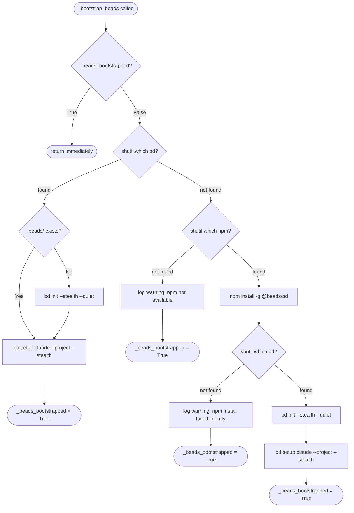

# Backlog MCP Package — Architecture Spec

> **Status: target architecture.** The provider-owned `FileCache` boundary described here is the
> required end state. Direct YAML access and independently selected artifact/task providers named
> as migration debt below remain in the current implementation until the linked implementation
> tasks remove them.

## Overview

Extract all business logic from `.claude/skills/backlog/scripts/backlog.py` into a clean Python package at `.claude/skills/backlog/backlog_core/`. The package exposes the same functionality through two thin wrappers:

1. **CLI wrapper** (`backlog.py`) — Typer CLI, calls operations module
2. **MCP server** (`server.py`) — FastMCP 3.x, calls operations module

## Source File

All logic originates from: `.claude/skills/backlog/scripts/backlog.py`

Each agent MUST read the full source file and extract ONLY the functions assigned to their module.

## Storage Ownership and File Cache

The configured backend is the only storage boundary visible to the CLI, MCP server, and operations
layer. Work items, grooming, plans, artifact manifests, and artifact content are always accessed
through that backend's protocols.

Backends fall into two storage categories:

- **Remote-capable providers** — GitHub, GitLab, Linear, Jira, and equivalent network providers are
  authoritative when reachable. Each provider privately owns a durable `FileCache` that supplies
  offline reads and queues offline mutations. Successful provider reads and writes refresh the
  corresponding cache records.
- **Local providers** — Beads, SQLite, and Memory use their native storage directly. They do not
  instantiate `FileCache`, do not read or write backlog YAML, and do not pay file-cache overhead.

`FileCache` is constructed by the backend factory and injected only into remote-capable providers.
It is private to the selected provider: it is not exposed through `BacklogConfig`, and callers must
not obtain or manipulate it independently.

The cache owns all local persistence needed for remote-provider continuity:

- `yaml_io.py` — private YAML serialisation used only by `FileCache` for backlog snapshots,
  grooming, synchronization checkpoints, and pending mutations.
- Cached plan and artifact files plus their manifests and provider revisions.
- The durable pending-write queue used while the provider is unreachable.

`github_sync.py` remains a pure provider-format adapter. `render_issue_body` serialises a
`BacklogItem` to GitHub markdown; `parse_issue_body` reconstructs a `BacklogItem` from issue body
text; `merge_item` merges local and remote items with conflict resolution rules. It performs no
cache I/O.

**Bulk migration**: `scripts/migrate_backlog_to_yaml.py` converts an existing backlog directory
from `.md` frontmatter files to `.yaml` format in-place. It uses `yaml_io.load_item` and
`yaml_io.save_item` and deletes the source `.md` file after a successful write.

## Module Dependency Graph

```text
models.py             ← standalone, no imports from other mcp modules
backend_types.py      ← provider-neutral protocols and node types; imports models for type annotations
parsing.py            ← imports from models; pure parsing, selection, and transformation helpers
entry_blocks.py       ← timestamped entry block parse/render/rewrite; imports from models, parsing
yaml_io.py            ← private YAML codec imported only by file_cache.py and migration tooling
file_cache.py         ← remote-provider cache, artifact files, checkpoints, and pending-write queue
reconciliation.py     ← filesystem-free classification/merge engine; imports models and pure format helpers
github_sync.py        ← GitHub issue body conversion (render/parse/merge); imports from models, parsing, entry_blocks
gh_client.py          ← imports from models, parsing
rendering.py          ← shared rendering utilities (section_display_title, render_groomed_section); imported by backend implementations
backend_protocol.py   ← re-exports backend_types contracts plus config/composition root; imports backend constructors
backends/             ← provider implementations; remote providers privately compose FileCache
operations.py         ← imports from models, pure helpers, and backend_protocol only
dispatch_state.py     ← imports from models (DispatchItemRecord, DispatchWaveRecord); no MCP awareness
server.py             ← imports from models, operations, dispatch_state, backend_protocol
backlog.py            ← imports from operations (thin CLI wrapper)
```

The required storage dependency direction is:

```text
CLI / MCP → operations → configured backend protocol
                         ├─ remote provider → remote API + private FileCache → yaml_io
                         └─ local provider  → native store only
```

Direct dependencies from `operations.py`, `server.py`, or general parsing helpers to `file_cache.py`,
`yaml_io.py`, or cache paths are forbidden. Import-boundary tests must enforce this rule.

## Output Pattern

Functions that previously used `typer.echo()` for status/progress messages must instead use an `Output` object (defined in models.py). Each function that needs to communicate status takes an optional `output: Output | None = None` parameter.

```python
# In models.py — ALL models use Pydantic BaseModel
from pydantic import BaseModel, Field


class Entry(BaseModel):
    """Timestamped addressable content entry within a section."""

    id: str  # ISO timestamp used as primary key
    content: str
    struck: bool = False
    struck_at: str = ""
    struck_reason: str = ""


class Section(BaseModel):
    """A section containing a list of timestamped entries."""

    entries: list[Entry] = Field(default_factory=list)


class GroomedData(BaseModel):
    """Structured groomed section with a date and named subsections."""

    date: str = ""
    subsections: dict[str, str] = Field(default_factory=dict)


class BacklogItemMetadata(BaseModel):
    """Durable logical and provider checkpoint fields."""

    source: str = "Not specified"
    added: str = ""
    priority: str = ""
    item_type: str = Field(default="Feature", alias="type", serialization_alias="type")
    status: str = ""
    issue: str = ""
    last_synced: str = ""
    updated_at: str = ""
    groomed: str = ""
    plan: str = ""
    topic: str = ""
    research_first: str = ""
    files: str = ""
    suggested_location: str = ""
    close_reason: str = ""
    assignees: list[str] = Field(default_factory=list)
    labels: list[str] = Field(default_factory=list)
    milestone: str = ""
    milestone_info: MilestoneInfo = Field(default_factory=MilestoneInfo)
    layer: str = ""
    language: str = ""
    stack: str = ""
    followup_to: str = ""
    sync_fingerprint: str = ""

    model_config = {"populate_by_name": True, "extra": "ignore"}


class BacklogItem(BaseModel):
    """Logical backlog item with nested durable metadata."""

    title: str = ""
    description: str = ""
    metadata: BacklogItemMetadata = Field(default_factory=BacklogItemMetadata)
    file_path: str = ""
    skip: bool = False
    sections: dict[str, Section | GroomedData] = Field(default_factory=dict)


# Notes:
# - `metadata` owns provider reference/revision, sync fingerprint, status, priority, plan address,
#   and other durable logical fields.
# - `file_path` and `skip` are runtime-only fields excluded by FileCache serialisation.
# - `sections` holds Entry-bearing sections ("fact_check", "rt_ica", "issue_classification")
#   plus a "groomed" key (GroomedData). Populated by github_sync.parse_issue_body.


class Output(BaseModel):
    messages: list[str] = Field(default_factory=list)
    warnings: list[str] = Field(default_factory=list)
    errors: list[str] = Field(default_factory=list)

    def info(self, msg: str) -> None: ...
    def warn(self, msg: str) -> None: ...
    def error(self, msg: str) -> None: ...


# Also: IssueStatus, PullRequestRef, ViewItemResult, IssueLocalFields
```

**CRITICAL**: No `Any` type anywhere. Use `BacklogItem` instead of `dict` for items.
Use `IssueStatus` instead of `dict[str, str]` for status results.
Use `PullRequestRef` instead of `dict[str, Any]` for PR references.
Use `ViewItemResult` instead of `dict[str, Any]` for view results.

Replace `typer.echo(msg)` → `output.info(msg)`
Replace `typer.echo(msg, err=True)` → `output.warn(msg)`
Replace `typer.Exit(1)` → raise appropriate exception from models.py

## Error Handling Pattern

Functions that previously raised `typer.Exit(1)` must instead raise one of:

- `BacklogError` — general errors
- `ItemNotFoundError(selector)` — item not found
- `DuplicateItemError(duplicates)` — fuzzy duplicate detected
- `GitHubUnavailableError` — GITHUB_TOKEN missing or API unreachable
- `ValidationError` — input validation failure

---

## Module: models.py

**Responsibility**: Constants, regex patterns, type maps, exceptions, Output handler.

**Functions/data extracted from backlog.py** (line references are approximate):

- Constants: `BACKLOG_DIR`, `DEFAULT_REPO`, `SECTION_RE`, `SKIP_STATUS`, `GITHUB_ISSUE_URL_RE`, `GITHUB_ISSUE_TITLE_TRUNCATE`, `MIN_FRONTMATTER_PARTS`, `TYPE_TO_LABEL`, `ROLE_MAP`, `BENEFIT_MAP`, `FUZZY_DUPLICATE_THRESHOLD`, `_COMMIT_PREFIX_RE`, `_FIELD_TO_INDEX`
- Add new: `PRIORITY_SECTIONS` dict mapping priority strings to section headings (from the `add` command)
- Exception classes: `BacklogError`, `ItemNotFoundError`, `DuplicateItemError`, `AmbiguousSelectorError`, `GitHubUnavailableError`, `ValidationError`
- Pydantic models: `Entry`, `Section`, `GroomedData`, `BacklogItem`, `Output`, `IssueStatus`, `PullRequestRef`, `ViewItemResult`, `IssueLocalFields`

**Exports** (public API):
All constants, all exception classes, all Pydantic models.

**Imports from other modules**: None.

---

## Module: parsing.py

**Responsibility**: Pure item parsing and transformation, item search, slug generation, body section
utilities, view helpers, and normalize helpers. Runtime backlog-directory traversal belongs to
`FileCache`, not this provider-neutral module.

**Current active functions** (post-YAML migration):

- Date helpers: `today()`, `now_iso()`
- Slug/title: `title_to_slug()`, `normalize_issue_title()`, `infer_type()`
- Selector: `parse_issue_selector()`
- Item parsing: `parse_item_file()` (legacy `.md` path — deprecated and restricted to migration
  tooling). Existing `parse_backlog_from_directory()` and `parse_backlog()` entry points are
  migration debt; runtime callers must use the configured backend, and remote cache traversal moves
  behind `FileCache`.
- Item search: `find_item()` (dedup rule: when multiple title-substring matches share exactly one distinct issue number, returns the first match instead of raising `AmbiguousSelectorError`; still raises when matches have different issue numbers, or when any matching item is unnumbered), `find_fuzzy_duplicates()`
- Item filtering: `items_needing_issues()`, `items_with_issues()`
- Issue body: `build_issue_body()`, `build_issue_body_from_file()`
- Body utilities: `extract_groomed_section()`, `build_body_extra_only()`, `merge_sections()`
- Section extraction (used by `github_sync.py`): `extract_sections()`, `extract_groomed_section()`
- View helper: `view_result_from_local_item()`
- Normalize helper: `extract_normalize_metadata()`

**Exports**: All functions above (without leading underscores).

**Imports from other modules**: `from .models import ...`, `from ruamel.yaml import YAML, YAMLError`.

---

## Module: entry_blocks.py

**Responsibility**: Parse, render, rewrite, and diff timestamped HTML div entry blocks embedded in
GitHub issue section bodies. Each entry is identified by an ISO timestamp used as a primary key.

**Public functions**:

- Wrap: `wrap_entry(content)` — wraps content in a new timestamped `<div><sub>…</sub></div>` block
- Wrap with specific timestamp: `wrap_entry_with_timestamp(content, timestamp)` — for legacy migration and overwrites
- Parse: `parse_entries(section_body, show, since, added_date)` — parses all entry blocks from a section body string; `show` accepts `"all"`, `"last"`, `"first"`, `"struck"`, positive/negative int
- Strike: `strike_entry(entry_raw, reason)` — wraps entry content in a `<details>` struck block
- Rewrite: `rewrite_section(existing_body, new_content, entry_id, replace, reason, added_date)` — orchestrates append, targeted-entry replace, or full-replace-and-strike operations
- Diff: `generate_diff(local, remote)` — git-diff-style comparison of entry blocks between two section bodies

**Imports from other modules**: `from .models import Entry`, `from .parsing import now_iso`

---

## Module: yaml_io.py

**Responsibility**: Private YAML codec for `FileCache`. It is not a storage API for operations,
server tools, local backends, or provider-neutral business logic. Provides a format-detecting
reader that falls back to the legacy `.md` parser during migration.

**Public API** (`__all__`): `detect_format`, `load_item`, `load_item_text`, `save_item`

- `detect_format(path)` — returns `"yaml"` or `"legacy_md"` based on file suffix; raises `ValueError` for unsupported extensions
- `load_item(path)` — reads `BacklogItem` from `.yaml` or `.md` file; `.md` emits `DeprecationWarning`
- `load_item_text(text, path)` — parses `BacklogItem` from in-memory string; format determined by `path` suffix; file need not exist on disk
- `save_item(item, path)` — serialises `BacklogItem` to YAML; excludes `file_path` and `skip`; line-wrapping disabled

**Key behaviours**:
- Uses `ruamel.yaml` (typ="safe" for reads, typ="rt" for writes); no `python-frontmatter` dependency
- `.md` load path delegates to `parsing.parse_item_file()` and emits `DeprecationWarning`

**Imports from other modules**: `from .models import BacklogItem`, `from .parsing import parse_item_file`

**Allowed consumer**: `file_cache.py` and explicit migration tooling only. Runtime imports from
`operations.py`, `server.py`, or backend-neutral helpers are architecture violations.

---

## Module: file_cache.py

**Responsibility**: Durable offline cache owned privately by a remote-capable backend. It is the
only runtime component permitted to read or write backlog YAML and cached plan or artifact files.

**Stored state**:

- Provider snapshots for backlog items and grooming content
- Cached plans, artifact manifests, and artifact content
- Last acknowledged provider revision and synchronization fingerprint
- Pending mutations created while the provider is unreachable

**Offline behavior**:

- Reads return the latest cached value with explicit stale-state metadata.
- Creates, updates, grooming changes, plans, and artifact mutations update the cache atomically and
  append a durable pending mutation.
- A missing cache record is reported as unavailable data, never as an authoritative empty result.

**Reconnect behavior**:

- The owning provider reconciles pending mutations against the last acknowledged provider revision.
- Applied mutations update the provider revision and fingerprint before leaving the queue.
- Concurrent provider changes produce an explicit conflict and retain the pending mutation.
- Failed synchronization never discards cached content or queued work.

The cache-record update and queue append are one durable transaction. Every queued mutation has a
stable idempotency key derived from its logical object, base revision, and intended content. Replay
removes only mutations explicitly acknowledged by the provider; after a partial replay, applied
entries remain checkpointed and every unapplied, conflicted, or failed entry remains queued.

**Dependency direction**: provider backend → `file_cache.py` → `yaml_io.py`. No higher-level module
may access the cache directly.

---

## Module: reconciliation.py

**Responsibility**: Filesystem-free reconciliation policy used internally by remote-capable
backends. It compares normalized provider snapshots with logical cached records, applies canonical
merge and field-ownership rules, and returns cache/provider actions plus outcome counts.

The module imports only models and pure parse/render/merge helpers. It does not import
`backend_protocol.py`, `operations.py`, `file_cache.py`, `yaml_io.py`, provider clients, or path
resolvers. The owning backend supplies snapshots and records, executes returned actions through its
private provider adapter and `FileCache`, then reports a `ReconcileResult`.

---

## Module: github_sync.py

**Responsibility**: Bidirectional conversion between `BacklogItem` and GitHub issue body markdown.
Operations layer never writes raw markdown body strings directly — they go through this adapter.

**Public API** (`__all__`): `render_issue_body`, `parse_issue_body`, `merge_item`, `SECTION_HEADING`, `heading_to_section_key`, `heading_to_unknown_key`, `unknown_key_to_heading`

- `render_issue_body(item)` — serialises `BacklogItem` to GitHub markdown; embeds metadata in an
  invisible `<!-- backlog-metadata: -->` HTML comment; renders description, entry-bearing sections,
  and groomed section in canonical order
- `parse_issue_body(body, existing)` — reconstructs `BacklogItem` from issue body text; extracts
  metadata comment for priority/type/status/added; maps `## Section` headings to typed section
  models; non-body fields are carried over from `existing` when provided
- `merge_item(local, remote)` — merges remote into local; local metadata is authoritative; sections
  are merged per-entry (struck state wins over active; longer content wins on tie; unique entries
  from either side are preserved)
- `SECTION_HEADING` — dict mapping section storage keys to GitHub markdown heading text (e.g. `"fact_check"` → `"Fact-Check"`)
- `heading_to_section_key(heading_text)` — maps a `## Heading` text to its section storage key; returns `None` for unknown headings
- `heading_to_unknown_key(heading_text)` — converts an unknown heading to an `"unknown__"` prefixed storage key
- `unknown_key_to_heading(key)` — reverses `heading_to_unknown_key`; strips prefix, title-cases result

**Known section keys** (BacklogItem.sections):
- `"fact_check"` → `## Fact-Check`
- `"rt_ica"` → `## RT-ICA`
- `"issue_classification"` → `## Issue Classification`
- `"groomed"` → `## Groomed (date)` (GroomedData type, not Section)

**Dependency direction**: `models ← parsing ← entry_blocks ← github_sync` (must remain acyclic;
do not import from `gh_client.py`, `operations.py`, or `server.py`)

**Imports from other modules**: `from .entry_blocks import parse_entries`,
`from .models import BacklogItem, Entry, GroomedData, Section`,
`from .parsing import extract_sections`

---

## Module: rendering.py

**Responsibility**: Backend-neutral shared rendering utilities for backlog sections. Extracts
rendering logic from `github_sync` into a location `WorkItemBackend` implementations can import,
ensuring identical logical section rendering where the provider representation requires it.

**Dependency direction**: `models ← rendering` (must remain acyclic; do not import from `github_sync`, `operations`, `gh_client`, or `server`)

**Public API** (`__all__`): `GROOMED_SUBSECTION_ORDER`, `SECTION_HEADING`, `render_groomed_section`, `section_display_title`, `unknown_key_to_heading`

- `SECTION_HEADING` — dict mapping known section storage keys to display heading text (e.g. `"fact_check"` → `"Fact-Check"`); shared constant used by all backends
- `GROOMED_SUBSECTION_ORDER` — canonical render order for `GroomedData` subsections (heading text as stored)
- `render_groomed_section(groomed)` — renders a `GroomedData` as `## Groomed ({date})` with `### subsection` children in canonical order; extras appended alphabetically
- `section_display_title(key, groomed_date)` — returns the human-readable title for a section storage key; handles known keys via `SECTION_HEADING`, `"unknown__"` prefix via `unknown_key_to_heading`, and the special `"groomed"` key with optional date
- `unknown_key_to_heading(key)` — strips `"unknown__"` prefix, replaces underscores with spaces, and title-cases the result

**Imports from other modules**: `from .models import GroomedData` (type annotation only, under `TYPE_CHECKING`)

---

## Module: gh_client.py

**Responsibility**: GitHub API connection, issue CRUD, status/label management, view enrichment.

**Functions extracted from backlog.py**:

- Connection: `_get_github()` → `get_github()`, `_try_get_github()` → `try_get_github()`
- Issue CRUD: `create_issue_for_item()`, `_close_github_issue()` → `close_github_issue()`, `_resolve_github_issue()` → `resolve_github_issue()`
- PR check: `_check_open_prs_for_issue()` → `check_open_prs_for_issue()`
- Status: `_batch_fetch_statuses()` → `batch_fetch_statuses()`, `_fetch_item_status()` → `fetch_item_status()`, `_apply_status_in_progress()` → `apply_status_in_progress()`
- Issue queries: `_fetch_open_issues_by_title()` → `fetch_open_issues_by_title()`
- View enrichment: `_view_enrich_from_github()` → `view_enrich_from_github()`
- Issue data: `_issue_to_local_fields()` → `issue_to_local_fields()`
- Groomed sync: `_sync_groomed_to_github_issue()` → `sync_groomed_to_github_issue()`
- Fetch: `_fetch_github_issue_body()` → `fetch_github_issue_body()`

**Exports**: All functions listed above.

**Imports from other modules**:
- `from .models import ...` (constants, Output, exceptions)
- `from .parsing import ...` (build_issue_body, infer_type, normalize_issue_title, etc.)

---

## Module: backend_protocol.py

**Responsibility**: Re-exports contracts defined in `backend_types.py`, defines `BacklogConfig`, and
provides the `create_backend()` factory plus `get_config()` / `set_config()` / `reset_config()`.
This keeps operations and server code decoupled from provider APIs, native stores, and file-cache
implementation details.

**Public API** (`__all__`): `WorkItemBackend`, `SyncProvider`, `ContentProvider`, `BranchBackend`,
`BacklogConfig`, provider-neutral node types, `create_backend`, `get_config`, `set_config`,
`reset_config`

- `WorkItemBackend` — `@runtime_checkable` Protocol defining the provider-neutral work-item
  contract. Optional provider capabilities use separate protocols such as `SyncProvider` and
  `ContentProvider` and `BranchBackend`.
- `SyncProvider` — optional one-method `reconcile(request) -> ReconcileResult` capability implemented
  only by remote-capable backends.
- `ContentProvider` — logical plan/artifact capability implemented by the configured backend:

  ```python
  class ContentProviderError(Exception):
      """Base error for logical content capability failures."""

  class ContentUnavailableError(ContentProviderError):
      """Requested content is not available from the selected backend."""

  class ContentConflictError(ContentProviderError):
      """The expected revision no longer matches provider state."""

  class UnsupportedCapabilityError(ContentProviderError):
      """The selected backend does not implement logical content storage."""

  class ContentKind(StrEnum):
      PLAN = "plan"
      ARTIFACT_MANIFEST = "artifact_manifest"
      ARTIFACT_CONTENT = "artifact_content"

  class ContentRef(BaseModel):
      kind: ContentKind
      namespace: str = ""
      artifact_type: str = ""
      name: str

  class ContentQuery(BaseModel):
      kind: ContentKind
      owner_reference: str = ""
      search: str = ""
      offset: int = Field(default=0, ge=0)
      limit: int = Field(default=100, ge=1, le=100)

  class ContentRecord(BaseModel):
      reference: ContentRef
      owner_reference: str = ""
      content: str
      revision: str = ""
      stale: bool = False
      pending: bool = False

  class ContentWrite(BaseModel):
      reference: ContentRef
      content: str
      owner_reference: str | None = None
      expected_revision: str = ""

  @runtime_checkable
  class ContentProvider(Protocol):
      def list_content(self, query: ContentQuery) -> list[ContentRecord]: ...
      def get_content(self, reference: ContentRef) -> ContentRecord: ...
      def put_content(self, request: ContentWrite) -> ContentRecord: ...
  ```

  The complete `ContentRef` is storage identity. Plans require empty `namespace` and
  `artifact_type`, so `(PLAN, "", "", plan_id)` remains stable while mutable
  `ContentRecord.owner_reference` is reassigned. Artifact manifests require the owning work-item
  reference as `namespace` and use the canonical name `manifest`. Artifact content requires both
  the owning work-item namespace and `artifact_type`, producing
  `(ARTIFACT_CONTENT, item_reference, artifact_type, artifact_id)`. Pydantic model validation
  rejects references that violate these kind-specific invariants. This prevents equal artifact
  paths on different items or under different artifact types from colliding.

  For plans, `ContentWrite.owner_reference=None` preserves the current owner; any string, including
  `""`, atomically reassigns or unlinks it. For artifact kinds, ownership is fixed by
  `ContentRef.namespace`; validation rejects a non-`None` write owner that conflicts with that
  namespace.

  An empty plan owner means unlinked content in the backend instance's project namespace.
  Providers must not share plan names across backend instances or project roots.
  `list_content()` provides bounded plan discovery
  without requiring a known name; artifact callers normally address content directly. `revision`
  is opaque and compared only for equality. Remote offline reads may return `stale=True`; accepted
  offline writes return `pending=True`. Local-provider results set both flags false. Missing cached remote data raises
  `ContentUnavailableError`, revision mismatch raises `ContentConflictError`, and a backend without
  the capability raises `UnsupportedCapabilityError`. No caller selects a second provider after any
  of these outcomes.

  Plan create/update MCP inputs retain the existing optional numeric `issue` field and add
  `owner_reference: str | None = None`. For update, `None` preserves ownership, a non-empty string
  reassigns it, and explicit `""` unlinks it. For create, `None` normalizes to unlinked `""`.
  The operation rejects `issue` together with any non-`None` owner reference, stringifies `issue`
  for numeric providers, and otherwise passes the opaque value unchanged. This preserves existing
  callers while allowing Beads and future provider IDs.
- `BacklogConfig` — dataclass wrapping only the active backend instance; passed by dependency
  injection to `operations.py` and `server.py`. It does not expose a cache object.
- `create_backend(name)` — sole composition root for backend storage. It resolves the configured
  provider, creates a `FileCache` for remote-capable providers, and injects it into that provider.
  GitHub also privately composes its existing issue/Gist plan and artifact persistence adapters
  behind `ContentProvider`; their provider wire formats do not escape the backend.
  Local providers are created without a cache. Resolution order is explicit name →
  `BACKLOG_BACKEND` environment variable → `backlog.backend` in `.dh/config.yaml` →
  `.beads/dh-backend` marker auto-detect → default `"github"`.
- `get_config()` — returns the module-level `BacklogConfig` singleton, auto-initialising on first call.

**Rendering utilities via protocol dispatch**: Rendering methods (`section_heading`,
`render_groomed_section`, `section_display_title`) are part of the `WorkItemBackend` protocol
surface. Callers access rendering through the active backend rather than importing directly from
`github_sync`. Shared rendering logic lives in `rendering.py` and is used by backend implementations.

**Imports from other modules**: `from .models import ...` (type annotations only, under
`TYPE_CHECKING`) plus backend constructors at the composition root. It does not expose or proxy
provider-specific APIs or file-cache operations.

---

## Backends: backends/

**Responsibility**: Platform-specific implementations of `WorkItemBackend` and optional capability
protocols.

- `backends/github_backend.py` — remote-capable `GitHubBackend`: delegates to GitHub adapters and
  privately owns the injected `FileCache`. Requires `GITHUB_TOKEN`. Default backend.
- Future GitLab, Linear, Jira, and equivalent network backends follow the same remote-provider
  composition: provider API plus a private `FileCache`.
- `backends/sqlite_backend.py` — local `SQLiteBackend`: native SQLite storage. No `FileCache` and no
  backlog YAML access.
- `backends/memory_backend.py` — local `InMemoryBackend`: in-process native storage. No persistence,
  `FileCache`, or backlog YAML access.
- `backends/beads_backend.py` — local `BeadsBackend`: native Beads/Dolt storage through `bd`. No
  `FileCache` and no backlog YAML access.

Backend selection is resolved once via `create_backend()`; consumers access only
`get_config().backend`. Remote backends may import `file_cache.py`; local backends must not.

### Provider-owned artifacts and plans

The configured backend is also the single routing decision for plans, grooming, artifact manifests,
and artifact content. A backend may implement these capabilities through internal provider-specific
components, but callers must not independently choose a second artifact or filesystem provider.

For a remote provider, artifact and plan reads and writes participate in the same cache and pending
mutation rules as work-item content. For Beads, SQLite, and Memory, those values remain in native
backend storage only. Unsupported capabilities fail explicitly through the selected backend; they
must not fall back to YAML or another provider.

The existing independent `create_artifact_provider()` calls in `operations.py` and `server.py`,
including the server's `LocalFilesystemArtifactProvider` fallback, are migration debt. They must be
replaced by artifact capabilities obtained from the configured backend.

---

## Module: operations.py

**Responsibility**: Provider-neutral orchestration over the configured backend. Each public function
returns a structured result and takes an optional `output: Output` parameter. Operations may combine
business rules and pure transformations, but all persistence, provider communication, cache access,
and artifact access go through `get_config().backend`.

**Functions extracted/refactored from backlog.py**:

- File metadata: `_update_item_metadata()` → `update_item_metadata()`
- ADD: `_add_item_index_format()` → part of `add_item()`; duplicate check logic from `add` command
- LIST: logic from `list_items` command → `list_items()`; `_refresh_local_cache_from_github()` → `refresh_local_cache_from_github()`
- VIEW: logic from `view` command → `view_item()`
- SYNC: `_sync_create_missing_issues()` → `sync_create_missing_issues()`, `_sync_push_groomed_content()` → `sync_push_groomed_content()`, combined `sync_items()`; `_find_or_create_issue()` → `find_or_create_issue()`
- CLOSE: `_close_item_index()`, `_close_cleanup()` → part of `close_item()`
- RESOLVE: `_resolve_item_index()` → part of `resolve_item()`
- UPDATE: refactored `update` command → `update_item()`; `_apply_plan_to_item()`, `_create_issue_and_update_item()`, `_handle_update_groomed()`, `_ensure_github_issue()`, `_write_groomed_to_github()`, `_write_groomed_to_item_file()`, `_resolve_groomed_content()`
- GROOM: `groom` command → `groom_item()`
- NORMALIZE: `normalize` command → `normalize_items()`; `_build_normalized_content()`, `_normalize_item_file()`
- PULL: `pull` command → `pull_items()`; `_pull_single_issue()` → `pull_single_issue()`, `_pull_item()`, `_pull_item_create_new()`, `_pull_item_update_existing()`, `_overwrite_body_from_github()`

**Exports**: `add_item`, `list_items`, `view_item`, `sync_items`, `close_item`, `resolve_item`, `update_item`, `groom_item`, `normalize_items`, `pull_items`, `update_item_metadata`, `pull_single_issue`, `refresh_local_cache_from_github`, `sync_create_missing_issues`, `sync_push_groomed_content`

**Imports from other modules**:
- `from .models import ...`
- Pure, filesystem-free helpers from `parsing.py`
- Protocols and `get_config()` from `backend_protocol.py`

`operations.py` must not import `yaml_io.py`, `file_cache.py`, provider clients, provider-format
adapters, or local backend implementations. Existing direct YAML, provider-client, and independent
artifact-provider access is migration debt and does not describe a permitted architecture.

The same restriction applies to `reconciliation.py`: its current direct `parse_backlog`,
`load_item`, and `save_item` usage must move behind the remote provider's `FileCache`. Reconciliation
classifies snapshots and asks the provider to persist outcomes; it does not own filesystem storage.

---

## Selector Resolution — Beads Nanoid Support

All seven beads-capable tools in `server.py` (`backlog_view`, `backlog_close`, `backlog_resolve`,
`backlog_update`, `backlog_groom`, `backlog_strike_entry`, `backlog_pull`) accept a beads nanoid
(e.g. `bd-a3f8`) as a selector value.

Resolution is handled by `find_item` in `parsing.py`. The resolution order is:

1. GitHub issue URL — extracts integer issue number, matches by `item.issue`
2. `#N` or bare integer — matches by integer issue number
3. String-ID exact match — compares selector directly against `item.issue`; covers beads nanoids and other non-integer backends (Linear, etc.)
4. Title substring — case-insensitive; raises `AmbiguousSelectorError` when multiple distinct items match

The string-ID path fires when the selector is not a URL, `#N`, or bare integer. No additional routing logic is needed in `server.py` — the selector string passes through to `find_item` unchanged. GitHub URL detection is a regex operation (`GITHUB_ISSUE_URL_RE`) — no GitHub token or API call is involved at any point in selector resolution.

SOURCE: `parsing.py:find_item` (string-ID path at `# String-ID exact match` comment), `parsing.py:parse_issue_selector`, commit `f6438cac` (2026-06-19)

---

## Module: server.py

**Responsibility**: FastMCP 3.x server exposing all operations as MCP tools.

**Pattern**: Each CLI subcommand becomes a `@mcp.tool()` decorated function that calls the corresponding operation and returns a dict.

**Tools** (14 total):

*Backlog management (10):*

1. `backlog_add` — calls `operations.add_item()`
2. `backlog_list` — calls `operations.list_items()`
3. `backlog_view` — calls `operations.view_item()`
4. `backlog_sync` — calls `operations.sync_items()`
5. `backlog_close` — calls `operations.close_item()`
6. `backlog_resolve` — calls `operations.resolve_item()`
7. `backlog_update` — calls `operations.update_item()`
8. `backlog_groom` — calls `operations.groom_item()`
9. `backlog_normalize` — calls `operations.normalize_items()`
10. `backlog_pull` — calls `operations.pull_items()`

*Dispatch orchestration (4):*

11. `dispatch_wave_start(milestone, wave_num, items)` — creates a wave entry with item records; initialises all items with `status=pending`; returns error if wave already exists
12. `dispatch_item_status(milestone, issue, status, result, error, cost)` — records completion or failure of a single dispatch item; looks up item by milestone+issue across all waves; valid status values: `complete`, `failed`, `skipped`
13. `dispatch_wave_status(milestone, wave_num)` — queries current wave status with per-item detail; checks stale PIDs (marks dead processes failed) before returning
14. `dispatch_spawn(milestone, wave_num, ...)` — background task (`@mcp.tool(task=True)`) that spawns parallel kage-bunshin sessions for a wave; calls `dispatch_wave_start` then launches one `claude -p` process per item

**Key patterns**:
- Use `Annotated[type, Field(...)]` for parameter validation
- Catch `BacklogError` subclasses and convert to structured error responses
- Return dicts with result data + output messages
- Dispatch tools wrap `dispatch_state.DispatchStateManager` via `asyncio.to_thread()`
- Use `if __name__ == "__main__": mcp.run()` for STDIO transport

**Imports**: `from fastmcp import FastMCP`, `from .models import ...`, `from .operations import ...`, `from .dispatch_state import DispatchStateManager`

---

## Module: dispatch_state.py

**Responsibility**: SQLite-backed state persistence for dispatch orchestration. Standalone — no MCP or FastMCP imports.

**Class**: `DispatchStateManager(db_path)`

- `ensure_schema()` — creates `waves` and `items` tables if absent; idempotent
- `create_wave(milestone, wave_num, items)` → `DispatchWaveRecord` — inserts wave row and all item rows; raises `sqlite3.IntegrityError` if wave already exists
- `get_wave(milestone, wave_num)` → `DispatchWaveRecord | None`
- `get_all_waves(milestone)` → `list[DispatchWaveRecord]`
- `set_item_in_progress(milestone, wave_num, issue, pid)` — marks item in-progress, records PID
- `set_item_complete(milestone, wave_num, issue, result, cost)` — marks item complete; triggers wave completion check
- `set_item_failed(milestone, wave_num, issue, error)` — marks item failed; triggers wave completion check
- `get_item(milestone, wave_num, issue)` → `DispatchItemRecord | None`
- `get_wave_items(milestone, wave_num)` → `list[DispatchItemRecord]`
- `check_stale_pids()` → `list[DispatchItemRecord]` — probes each in-progress PID with `os.kill(pid, 0)`; marks dead items failed; returns newly failed items

**Storage**: SQLite at `~/.dh/projects/{project-slug}/dispatch-state.db`. `server.py` initialises the path; `dispatch_state.py` does not resolve it.

**Imports from other modules**: `from .models import DispatchItemRecord, DispatchWaveRecord`

---

## Lifespan Bootstrap

At server startup, `server.py` auto-bootstraps the [beads](https://github.com/beads-dev/beads) toolchain so every user gets the `bd` binary, `.beads/` project database, and Claude PreCompact/SessionStart hooks without manual setup.

### How It Wires In

The FastMCP constructor receives a `lifespan=_beads_lifespan` parameter (see `server.py`, `FastMCP(...)` call). FastMCP invokes this hook once per server startup (or once per `Client(mcp)` context manager entry in tests). The hook runs `_bootstrap_beads()` in a thread executor before yielding to accept tool calls:

```text
FastMCP startup → _beads_lifespan → asyncio.run_in_executor(_bootstrap_beads) → yield → tools available
```

The `@lifespan` decorator is imported from `fastmcp.server.lifespan`.

### Sentinel Pattern

A module-level `_beads_bootstrapped: bool = False` sentinel prevents repeated execution. The sentinel is checked at the top of `_bootstrap_beads()` and set to `True` on every exit path (including degradation paths). This matters because tests open multiple `Client(mcp)` connections — without the sentinel, bootstrap would run on every connection.

Tests reset the sentinel via `monkeypatch.setattr("backlog_core.server._beads_bootstrapped", False)`.

### Bootstrap Decision Tree



### Execution Paths

| Path | Condition | Actions |
|------|-----------|---------|
| Happy (bd present, `.beads/` exists) | `bd` on PATH, `.beads/` directory exists | `bd setup claude --project --stealth` |
| Happy (bd present, no `.beads/`) | `bd` on PATH, `.beads/` missing | `bd init --stealth --quiet`, then `bd setup claude --project --stealth` |
| Install | `bd` absent, `npm` present | `npm install -g @beads/bd`, `bd init`, `bd setup` |
| Degraded — npm absent | `bd` absent, `npm` absent | Warning logged, returns |
| Degraded — install failed | `bd` absent, `npm` present but install silent-failed | Warning logged, returns |

### Subprocess Call Contracts

All subprocess calls in `_bootstrap_beads()` follow these rules:

- `check=False` — non-zero exits do not raise exceptions; the next `shutil.which()` check determines outcome
- `capture_output=True` — suppresses stdout/stderr from subprocess; prevents MCP transport pollution
- `cwd=project_dir` — set on all `bd` commands; absent on `npm install` (npm installs globally)
- Command as list (never `shell=True`) — prevents shell injection

### Project Directory Source

Bootstrap receives the project root from `models.get_repo_root()`, which returns the path set during `_init_models()` at module import time. The sequence is: `sys.argv` → `_parse_args()` → `_init_models(project_dir)` → `models._REPO_ROOT` → `models.get_repo_root()` → `_bootstrap_beads(project_dir)`.

---

## CLI wrapper: backlog.py (rewritten)

**Responsibility**: Thin Typer CLI that imports from `operations` module.

**Pattern**: Each `@app.command()` function:
1. Creates `Output()` instance
2. Calls the corresponding `operations.*()` function
3. Prints `output.messages` and `output.warnings`
4. Catches exceptions and converts to `typer.Exit(1)`

**Keeps**: Rich table formatting for `list` command, text formatting for `view` command.
These are CLI-specific display concerns that don't belong in core logic.

**Imports**: `from .operations import ...`, `from .models import ...`

---

## Module: Progressive Disclosure (ordinal_mapper.py, disclosure_handler.py, disclosure_types.py)

**Responsibility**: Deliver backlog item content progressively. Large items are navigated
via a token-efficient ordinal map rather than returned in a single call.

Contract reference: `docs/mcp-progressive-disclosure-contract.md`.

### MarkdownIndexer Integration

`OrdinalPathMapper.build_map()` calls `_index_entry_subtree()` for each level-2 entry to
index sub-headings and code fences into the resolution index.

**Construction sequence** (DN-1 — actual sequence differs from architecture spec §4.1):

```text
MarkdownItParser().parse("inline", entry_content)  →  MarkdownIndexer().build(result)
```

`MarkdownIndexer.build()` takes a `ParserResult`, not a raw string.
`MarkdownItParser` is imported from `progressive_markdown.parser`.

**MarkdownDocument fields** (DN-2 — field names differ from architecture spec §4.1):

- `.sections: dict[str, SectionNode]` — sections by ID (the spec documented `.sections_by_id`)
- `.code_blocks: dict[str, CodeBlock]` — code blocks by ID (the spec documented `.code_blocks_by_id`)
- `.root_section_ids: list[str]` — IDs of top-level sections

`SectionNode` fields used: `.child_ids`, `.code_block_ids`, `.body_span`, `.title`, `.level`.
`CodeBlock` fields used: `.content` (raw fence body, no delimiters), `.language`.

### Ordinal Assignment

| Node type | Ordinal format | Assigned by |
|---|---|---|
| Section (level 1) | `N` | `build_map()` |
| Entry (level 2) | `N.M` | `build_map()` |
| Sub-heading (level 3+) | `N.M.K[.J...]` | `_collect_section_children()` recursively |
| Code fence (direct body) | `parent.code.K` | `_emit_direct_fence_ordinals()` |

K and J are 0-based sibling indices. Direct-body fences are code blocks that are not
contained within any named section (they appear before the first heading in the entry body).

### Navigate-on-Parent Gate

Whether a node returns a child map or prose body differs by depth:

- **Level-2 entry**: `has_sub_heading_children` is `True` iff
  `len(doc.root_section_ids) >= _MIN_ROOT_SECTIONS_FOR_PARENT` (constant value `2`).
  Entries with a single top-level heading are treated as leaves and return full content.
- **Level-3+ sub-heading node**: `has_sub_heading_children` is `True` iff
  `bool(node.child_ids)` — any child section triggers parent behavior.

Source: `ordinal_mapper.py`, `_MIN_ROOT_SECTIONS_FOR_PARENT` constant and
`_collect_section_children()`.

### Resolution Index vs Map Text Split (§5.3)

`_ResolutionIndex: dict[str, _SubtreeNode]` is built eagerly to all depths during
`build_map()`. `resolve()` and `valid_ordinals()` operate on this complete index.

`MapResponse.map_text` is bounded by `TOKEN_BUDGET` (from
`progressive_markdown.list_navigator`) and may omit deep ordinals from the rendered listing.
Deep ordinals remain resolvable via `navigate=`.

### Token Counting

All token counts use the `ENCODING` singleton from `progressive_markdown.list_navigator`
(ADR-2). No additional tiktoken instantiation occurs in this subsystem.

### Key Files

| File | Responsibility |
|---|---|
| `ordinal_mapper.py` | Ordinal assignment, `_ResolutionIndex`, `_SubtreeNode`, fence extraction |
| `disclosure_handler.py` | Request parsing, navigate-on-parent dispatch, `_ORDINAL_PATTERN` |
| `disclosure_types.py` | `NavigateResponse`, `MapResponse`, `BoundedResponse`, `OrdinalNotFoundError` |
