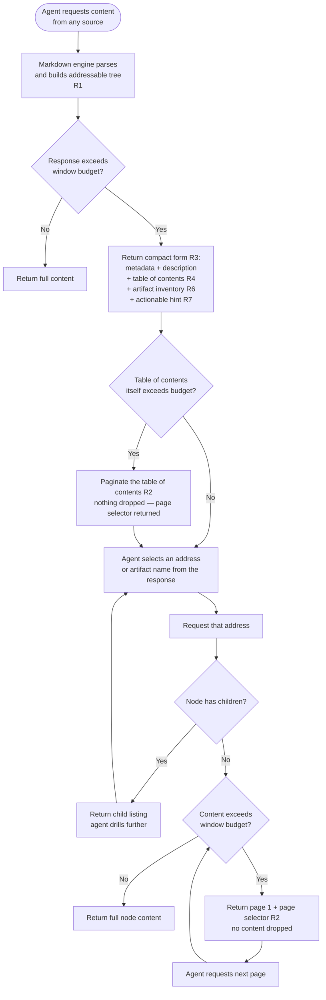

# Agent Markdown Consumption — Behaviour Specification

Every consumer of every operation described here is an AI agent. There is no human reader.

Requirements R1–R7 are normative. The open questions section names decisions not yet made;
until each is resolved, an implementation satisfying the surrounding requirements is correct.

## Purpose

Define one contract for how markdown reaches an agent. An agent must never receive an
unbounded dump, must never receive silently truncated content, and must always receive
enough structure to request exactly the part it needs next.

## Normative requirements

### R1 — One markdown engine, all consumption

A single markdown engine serves every markdown consumption path across the plan/task system
and the backlog system. It parses content from any source, builds an addressable tree, and
returns paginated results.

No component may hand-build a table of contents, a section listing, a content excerpt, or a
bounded response of its own. Where such an implementation exists today it is deleted, not
maintained in parallel. A second implementation is a defect regardless of whether it works.

Sources include, and are not limited to: issue and item bodies, plan documents, task
documents, and the reports and artifacts produced during grooming.

### R2 — Everything paginates, including the table of contents

Every response that can exceed the window budget paginates. This applies recursively and
without exception — a table of contents that exceeds the budget paginates exactly as a
content body does.

No response may drop, elide, or truncate addressable nodes to fit a budget. Content that
does not fit the current page is reachable on a subsequent page, never merely implied.

Harnesses commonly cap a single tool response at ~10,000 tokens, adjustable. The engine's
budget is configurable and must not exceed the harness cap.

### R3 — Threshold triggers the compact form, automatically

When a response would exceed the budget, the compact form is returned instead. This is
automatic: no opt-in parameter, no prior knowledge required of the caller.

The compact form contains item metadata, the top description, the table of contents, the
inventory of associated reports and artifacts, and a hint naming the exact next call.

### R4 — One addressing scheme

Addresses in a table of contents are the same addresses accepted by every retrieval
operation. An agent copies an address from a response and passes it back unchanged. Exactly
one scheme exists across the whole system.

### R5 — Addresses accepted wherever content is requested

Every operation that returns markdown accepts an address to scope what it returns, and a
page selector to traverse it.

### R6 — Sections and artifacts are one inventory

An agent viewing an item receives, in one response, both the section table of contents and
the associated reports and artifacts. Both are requestable by name. Discovering what exists
never requires a second call to a different tool.

### R7 — Hints must be actionable

A response that withholds content states what the caller must do to obtain it, using
addresses valid in that same response. A hint must never recommend retrieving everything as
its first suggestion, never recommend an action the caller has already exhausted, and never
name a mechanism absent from the response it accompanies.

## Required flow

## Open questions requiring a decision

1. Budget value — one configurable constant for all operations, and what default relative to
   the ~10,000 token harness cap.
2. Compact-form composition when both the table of contents and the artifact inventory are
   large — page them together, or independently.
3. Whether an agent may request an explicit page size, or only accept the configured budget.

## Implementation appendix — shape to code

The engine described by R1 exists as the `progressive_markdown` package: `Navigator`
(`map`, `view_section`, `view_code`, `links`, `search_sections`, each taking `page` and
`budget`), `Paginator` (`paginate_blocks`, `paginate_text`), and a `MarkdownContentProvider`
protocol for arbitrary sources.

Duplicate implementations to delete rather than refactor, in the backlog server layer
(`backlog_core/server.py`, `backlog_core/operations.py`) shared by the MCP tool and CLI paths
that call it:

- the compact manifest, over-budget directory, and section-index builders, which emit a
  bracket-numbered index that neither paginates nor matches the engine's addresses — the
  same index format is hand-built in three separate functions
- the entry-block pagination and paged-body rendering, which duplicate `Paginator`
- the section-filter assembly, which duplicates parser-level node extraction

The address-based navigation path (`disclosure_handler`, `ordinal_mapper`) already routes
through the engine and is the reference for how the remaining paths should call it.

## Related documents

- [MCP Progressive-Disclosure Contract](./mcp-progressive-disclosure-contract.md) — mechanical
  reference for ordinal addressing, navigation parameters, and response shapes on one conforming
  implementation. Subordinate to this contract for behaviour.
- [Unified Section Layer Brief](./unified-section-layer-brief.md) — defines the cross-provider
  entry and ID contract that markdown sources are built from. Complementary, not overlapping:
  that brief owns entry and ID identity; this contract owns pagination and disclosure of the
  content built from those entries.
