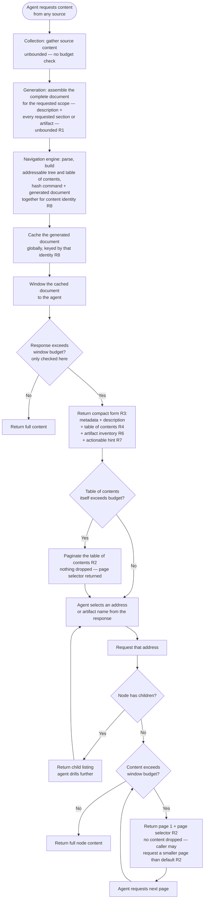

# Agent Markdown Consumption — Behaviour Specification

Every consumer of every operation described here is an AI agent. There is no human reader.

Requirements R1–R8 are normative. Design decisions resulting from questions raised while
implementing this contract are recorded as ADRs in `docs/adrs/`, referenced from the
requirement they resolve — not left as unresolved prose in this document.

## Purpose

Define one contract for how markdown reaches an agent. An agent must never receive an
unbounded dump, must never receive silently truncated content, and must always receive
enough structure to request exactly the part it needs next.

## Scope — operations bound by this contract

Every operation that returns markdown to an agent is bound, on every transport. This
includes, and is not limited to:

- reading an item and any filtered view of one
- reading a plan or a task
- reading an artifact's content
- any listing operation whose result embeds content rather than only metadata

An operation is not exempt because its content is usually small. Requirements apply to the
operation, not to a size class of its typical payload.

## Normative requirements

### R1 — One markdown engine, all consumption

A single markdown engine serves every markdown consumption path across the plan/task system
and the backlog system. It parses content from any source, builds an addressable tree, and
returns paginated results.

No component may hand-build a table of contents, a section listing, a content excerpt, or a
bounded response of its own. Where such an implementation exists today it is deleted, not
maintained in parallel. A second implementation is a defect regardless of whether it works.

Sources include, and are not limited to: issue and item bodies, plan documents, task
documents, and the reports and artifacts produced during grooming.

**Pipeline layering** (ADR-3072-1): three stages, in order — Collection (gathering source
content from wherever it lives), Generation (assembling the complete document for a requested
scope: description and every requested section or artifact), and Navigation (this engine).
Generation supplies Navigation the document to parse; it does not assign addresses or build the
table of contents itself — `component-architecture.md` gives `progressive_markdown` sole
ownership of "assigning addresses" and "pagination of every result including a table of
contents," and R4 requires every table-of-contents entry to carry an address, so those addresses,
and the table of contents built from them, exist only after Navigation parses the generated
document and builds its addressable tree. Collection and Generation are unbounded — never
truncated, never budget-checked. The engine's authority is over Navigation only: it receives a
complete generated document,
gives it a content identity (R8), caches it globally (ADR-3082-1), and is the only point anywhere in
the path where a size budget is applied. "Unbounded" is a real cost for a pathological source,
not a theoretical one — see ADR-3072-1's known limitation for a concrete measurement and why
this decision does not add a ceiling to fix it.

**Navigation is source-agnostic.** It has no knowledge of, and no need to know, what kind of
thing it is windowing — an issue, a PR, a plan, an artifact, a local file. It receives markdown
text and the parameters of the current request (scope, address, page) and renders a view; it
never learns where that text came from or reaches back to a backend to get more of it. This is
a global markdown viewer, not a per-source one — the same relationship a browser's chrome has
to the page it renders, indifferent to whether the page came from `file://` or `https://`. The
`MarkdownContentProvider` protocol (implementation appendix) is the seam that makes this true:
every source implements `get_markdown(source) -> str`, and nothing past that seam is
source-specific.

### R2 — Everything paginates, including the table of contents

Every response that can exceed the window budget paginates. This applies recursively and
without exception — a table of contents that exceeds the budget paginates exactly as a
content body does.

No response may drop, elide, or truncate addressable nodes to fit a budget. Content that
does not fit the current page is reachable on a subsequent page, never merely implied.

Harnesses commonly cap a single tool response at ~10,000 tokens, adjustable. The engine's
budget is configurable and must not exceed the harness cap, is sourced from one constant
(ADR-3072-1), and is never applied outside the Navigation stage (R1).

A caller may request a page smaller than the configured default. A tool response has no local
equivalent of `tail` — a caller that wants to peek at part of a large result depends on the
server accepting an explicit, smaller page-size request.

### R3 — Threshold triggers the compact form, automatically

When a response would exceed the budget, the compact form is returned instead. This is
automatic: no opt-in parameter, no prior knowledge required of the caller.

The compact form contains item metadata, the top description, the table of contents, the
inventory of associated reports and artifacts, and a hint naming the exact next call.

This is progressive disclosure: an agent never receives structure it has no use for. The
table of contents is not the whole item's table of contents by default — it is scoped to
exactly what was requested (R5), and sized accordingly. Requesting one section with several
subheadings returns a table of contents no larger than that section's own subheadings.
Requesting two or three sections returns a table of contents spanning only those. Requesting
the item as a whole returns a table of contents spanning the whole item. If what was
requested fits in one page regardless of scope, no table of contents is returned at all —
there is nothing to navigate when everything already fits, so the navigational aid is pure
overhead and is omitted, not just collapsed to a stub.

### R4 — One addressing scheme

Addresses in a table of contents are the same addresses accepted by every retrieval
operation. An agent copies an address from a response and passes it back unchanged. Exactly
one scheme exists across the whole system.

### R5 — Addresses accepted wherever content is requested

Every operation that returns markdown accepts an address to scope what it returns, and a
page selector to traverse it.

### R6 — Sections and artifacts are one inventory

An agent viewing an item discovers both its sections and its associated reports and artifacts
without a second call to a different tool. Both are requestable by name. This is the invariant
R6 guarantees — not that both inventories always fit in the first page: sections and artifacts
are windowed by the same paginated response (R2), so when the combined inventory exceeds one
page, the caller reaches the remainder with a same-tool page request named by R7's hint, never a
different tool or a separate lookup. It does not require a table-of-contents structure to always
be present. When content fits in one page
(R3), sections and artifacts appear directly in that single response, without table-of-contents
scaffolding around them — there is nothing to navigate, so there is nothing to name a table of
contents. The table of contents exists only when there is more than one page's worth of content
to navigate (R3); R6's discoverability guarantee holds either way.

This requirement changes the response shape of the item-view operation on every transport,
and supersedes the current arrangement in which artifacts are discovered through a separate
lookup. It states intended behaviour, not current behaviour.

The Generation stage (R1) realizes this directly: sections and artifact content are assembled
into one document before Navigation parses it, assigns it one address space (R4), and windows
it. There is no separate pagination path for the artifact inventory — it pages exactly as the
rest of the generated document does (ADR-3072-1), so a combined inventory larger than one page
is reached by a page request, not by a second call to a different tool.

### R7 — Hints must be actionable

A response that withholds content states what the caller must do to obtain it, using
addresses valid in that same response. A hint must never recommend retrieving everything as
its first suggestion, never recommend an action the caller has already exhausted, and never
name a mechanism absent from the response it accompanies.

### R8 — Paginated content is addressed by content identity

A response that paginates returns a stable identifier derived from the content it paginates,
alongside the page position. Subsequent pages are requested with that identifier plus a page
selector or an address, never by re-describing the source. The original scope or query is not
repeated on follow-up calls — it is retained server-side as the entry's stored command (see
below), not something the caller carries forward.

The control set (ADR-3075-4, ADR-3082-1) is out-of-process and content-keyed only — no
session-identifying value is part of any request. Concretely, an initial request states scope
(`selector="#2529", section="RT-ICA"` or similar); every request after that states only
`hash="<identifier>"` plus `page`, `navigate` (R4's address), `pagesize` (the caller override
from R2), and an optional `refresh` selector — one of `revalidate` or `force` (ADR-3075-3) —
absent by default, meaning "serve whatever the control set already holds." Nothing about locating
the control set depends on which session, tool, or transport made the request — `content_id`
alone addresses the row.

This hash-based shape states intended behaviour, not current behaviour: the
control set it depends on (ADR-3075-1 through ADR-3075-4) is not yet implemented, and
`backlog_view`'s current parameters carry no `hash` or session-routing field. [MCP
Progressive-Disclosure Contract](./mcp-progressive-disclosure-contract.md) documents today's
shipped parameter set (`selector` plus `navigate`, repeated on every call) and must be updated
to this shape once the control set ships.

The identifier resolves against cached content. Serving a later page does not re-collect from the
provider and does not re-run Generation — "does not re-parse" means no repeated network
round-trip and no repeated document assembly, not a promise that the stored raw markdown is never
turned back into an addressable structure. The control set (ADR-3082-1) stores raw generated
content, not a parsed tree, and a follow-up call landing on a fresh CLI process reparses that
stored content in-memory to serve the requested page — a cheap, deterministic, in-process step,
consistent with ADR-3075-1's premise that re-parsing is cheap.

A request whose identifier no longer matches current content, because of a write this
contract's own paths can see, is reported as stale and then automatically recovered — see
"Stale entries are recoverable, not dead ends" below (ADR-3075-2) for the recovery behaviour,
which happens on the same ordinary request and is not gated behind a caller opt-in. Pages from
two different versions of a document are never returned as though they were one document.
**This is not a contradiction of "does not re-collect" above** (flagged in review — worth
stating plainly): the distinction is between re-collecting to *detect* staleness and
re-collecting to *recover* from it once detected. Detection never happens by the read path
re-collecting to compare — it happens by write-triggered invalidation (below), a side effect of
the write that changed the source. Recovery does re-collect, automatically, once an entry is
known stale (below).

Only a write made through a path outside this contract's Scope is invisible to write-triggered
invalidation — a write from a concurrent session is not a blind spot: invalidation is global
(ADR-3082-1, ADR-3075-2), so any caller's write reaches the one shared entry. An agent that needs
certainty against the out-of-Scope-write blind spot uses the explicit, caller-requested
revalidation or forced refresh described in "Cache metadata is visible to the agent" below — an
opt-in path the caller chooses for confidence before automatic detection would otherwise catch a
change, additive to write-triggered invalidation, not the only path that ever re-collects.

The identifier is derived from both the command (source, scope, parameters) and the Generation
stage's output for that command — not a hash of the raw upstream source alone (ADR-3075-1), and
not a hash of the generated content alone either. Content-only hashing was flagged in review as
a real collision: two different commands can produce byte-identical generated documents (a
coincidence, not a contract violation), and a content-only hash would give them the same
identifier while the entry retains only one command — a later requery or revalidation could
then execute the wrong command entirely and return content unrelated to what the caller asked
for. The identifier binds command and content together precisely so two different commands
never collide even when their output happens to match. Two different scopes of the same source
(the whole item vs. one filtered section) produce different generated documents and, by the
same binding, different identifiers. The cache backing this has no fixed retention window tied
to any session — see ADR-3082-1's "Reversal: content-keyed, not session-keyed", which corrects
ADR-3075-1's original "session-scoped only" framing: entries age out by a global TTL and size
budget, not by the requesting session ending, and an entry can outlive the session that created
it or be read by a different session entirely.

**One shared, global control set — out-of-process, not an in-process cache** (ADR-3075-4,
storage mechanism and content-keying per ADR-3082-1). The control set is a single store for
every caller, not reinstantiated per operation, per subcommand, per transport, or per session —
but it cannot be an in-process cache (a server-held dict, an MCP lifespan context) and satisfy
that, because the CLI is not a running service: it is a separate OS process per invocation with
no memory of any prior call and no shared memory to an MCP server process, by construction, no
matter how the MCP side is wired. The store is one out-of-process SQLite database at
`$DH_STATE_HOME/control-set.db` (WAL mode), rows keyed by `content_id` alone — no
session-identifying value anywhere — bounded globally (LRU eviction past a tunable size target)
with a periodic, rate-limited age-based cleanup pass (hourly to daily, not on every write), so
entries never accumulate unboundedly and cleanup does not depend on any caller exiting cleanly.
An item viewed through one MCP tool and then again through a different tool, through the CLI, or
by an entirely different session, still hits the same entry if the request scope and content
identity match and the entry has not since been evicted — because every caller reads and writes
the same content-keyed rows, not because any of them hold state in memory. If the entry has been
evicted, the response states plainly that the content must be requested again, not a generic
error or silent empty result. A cache scoped to one process is a violation of R1 (a
second, narrower implementation of what the engine already owns), not a smaller version of a
correct implementation.

**Stale entries are recoverable, not dead ends** (ADR-3075-2). A control-set entry retains the
command that produced it — the source, scope, and parameters Collection and Generation used to
build it — not only its content identity. When a request's identifier no longer matches
current content, the stored command is used to requery the backend and regenerate the
document. Recovery does not re-apply the request's original page or `navigate` address selector
to the regenerated document — page boundaries and addresses can shift underneath it, and
honoring the old selector risks skipping, duplicating, or misresolving content. Recovery serves
page 1 of the regenerated document under the new identity instead (or an explicit restart
response, for a `navigate` ordinal that no longer resolves), informing the caller the identity
changed — this is what keeps the "never mixed-versions" guarantee above true rather than
contradicting it. The caller is not required to restate its whole request from scratch, and this
recovery happens automatically on the very request that surfaces the stale identifier — it is
not an opt-in the caller must request separately. The explicit revalidation and forced-refresh
paths (ADR-3075-3, below) serve a different purpose: gaining certainty before write-triggered
invalidation would otherwise catch a change, not the only path that ever recollects.

**Writes invalidate globally; reads do not have to discover staleness on their own**
(ADR-3075-2, scoping corrected by ADR-3082-1's content-keyed reversal). A control-set entry is
not left to be discovered stale only when a later read happens to hit it with a mismatched hash.
A write that modifies the source a cache entry was generated from marks that entry stale (not
deleted — its stored command survives, see "Stale entries are recoverable" below) as a side
effect of the write, regardless of which caller made the write. Every mutation path bound by
this contract's sources — item updates, section writes, artifact registration, task and plan
state changes — is a source of invalidation for the one shared control-set entry generated from
what it touched, whichever session or tool happens to have written it.

**Cache metadata is visible to the agent, not only used internally** (ADR-3075-3). Every
response backed by the control set carries its content identity, the command that produced it,
and when it was generated — the same three things the cache uses internally to detect
staleness. This is not exposed as a debugging aid; it gives the agent a basis to judge
freshness itself, independent of the server's own write-triggered invalidation (which may not
have run yet, or may not know about a write made through a path outside this contract). An
agent that just wrote to something it is about to re-read, or that otherwise has reason to
distrust automatic invalidation, may explicitly request revalidation or a forced refresh
instead of trusting whatever the control set already holds.

## Required flow

## Design decisions

The five questions previously open in this section (#3072–#3076) are resolved and folded into
R1, R2, R6, and R8 above. The reasoning, rejected alternatives, and why each choice is hard to
reverse are recorded in ADRs, not restated here:
[ADR-3072-1](./adrs/ADR-3072-1-budget-applies-only-at-navigation.md) (budget/layering),
[ADR-3075-1](./adrs/ADR-3075-1-content-identity-and-cache-scope.md) (identity/scope),
[ADR-3075-2](./adrs/ADR-3075-2-stale-cache-recovery-and-write-invalidation.md) (requery on
stale, write invalidation),
[ADR-3075-3](./adrs/ADR-3075-3-cache-metadata-visible-to-agent.md) (agent-visible cache
metadata), and
[ADR-3075-4](./adrs/ADR-3075-4-out-of-process-session-keyed-control-set.md) (out-of-process
store; its session-keying decision is superseded by
[ADR-3082-1](./adrs/ADR-3082-1-sqlite-backed-bounded-eviction.md), which is content-keyed only).

Vocabulary introduced by these decisions — Collection, Generation, Navigation, Navigate, table
of contents, budget — is defined once in [`CONTEXT.md`](../CONTEXT.md), not duplicated in this
contract.

## Implementation appendix — shape to code

The engine described by R1 exists as the `progressive_markdown` package:
`ProgressiveMarkdownNavigator` (`map`, `view_section`, `view_code`, `links`,
`search_sections`, each taking `page` and `budget`), `Paginator` (`paginate_blocks`,
`paginate_text`), and a `MarkdownContentProvider` protocol for arbitrary sources.

`ProgressiveMarkdownNavigator` and `Paginator` currently have no consumers. The engine's
parser and indexer are imported by the address-navigation path; its navigation and
pagination layer is not used by anything.

**A naming caveat on stage boundaries, flagged in review.** `ProgressiveMarkdownNavigator.load()`
itself calls `provider.get_markdown(source, ...)` — the class named "Navigator" contains a method
that performs Collection (fetching from the provider). Read narrowly, this looks like it
contradicts R1's "Navigation never reaches back to a backend." It doesn't, but the class
boundary doesn't make that obvious: `load()` is the Collection+Generation entry point (it fetches
and assembles the document once), and the *other* methods on the same object — `map`,
`view_section`, `view_code`, `links`, `search_sections` — are the actual Navigation stage,
operating on what `load()` already fetched. One class currently hosts both a Collection+Generation
step and the Navigation stage proper; the seam described in R1 (`MarkdownContentProvider`) is
real and does separate them by responsibility, but not by class boundary. Not a contradiction of
R1's layering, but the class name invites the misreading — worth a rename or a doc comment when
this code is next touched, not a reason to treat R1 and the shipped code as inconsistent.

Duplicate implementations to delete rather than refactor, in the backlog server layer
(`backlog_core/server.py`, `backlog_core/operations.py`) shared by the MCP tool and CLI paths
that call it:

- the compact manifest, over-budget directory, and section-index builders, which emit a
  bracket-numbered index that neither paginates nor matches the engine's addresses — the
  same index format is hand-built in three separate functions
- the entry-block pagination and paged-body rendering, which duplicate `Paginator`
- the section-filter assembly, which duplicates parser-level node extraction

The address-based navigation path (`disclosure_handler`, `ordinal_mapper`) already routes
through the engine and is the reference for how the remaining paths should call it.

## Related documents

- [MCP Progressive-Disclosure Contract](./mcp-progressive-disclosure-contract.md) — mechanical
  reference for ordinal addressing, navigation parameters, and response shapes on one conforming
  implementation. Subordinate to this contract for behaviour.
- [Unified Section Layer Brief](./unified-section-layer-brief.md) — defines the cross-provider
  entry and ID contract that markdown sources are built from. Complementary, not overlapping:
  that brief owns entry and ID identity; this contract owns pagination and disclosure of the
  content built from those entries.
