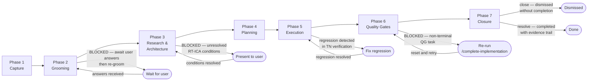
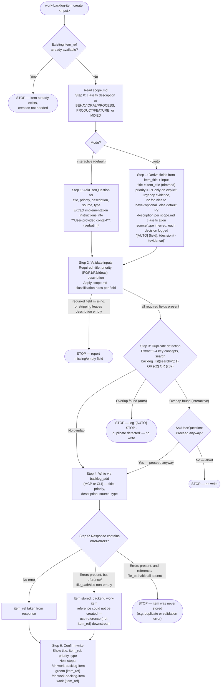
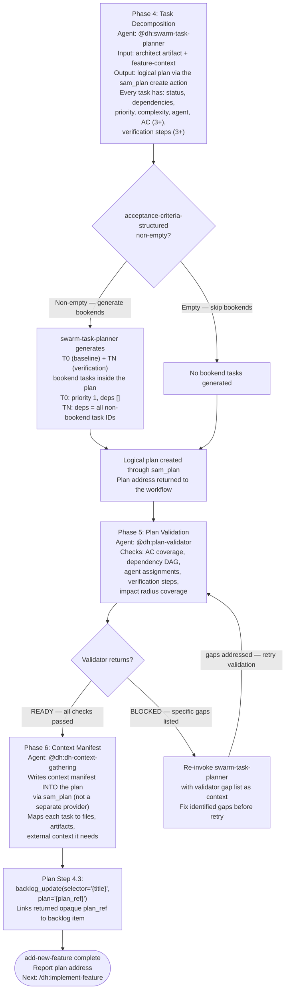
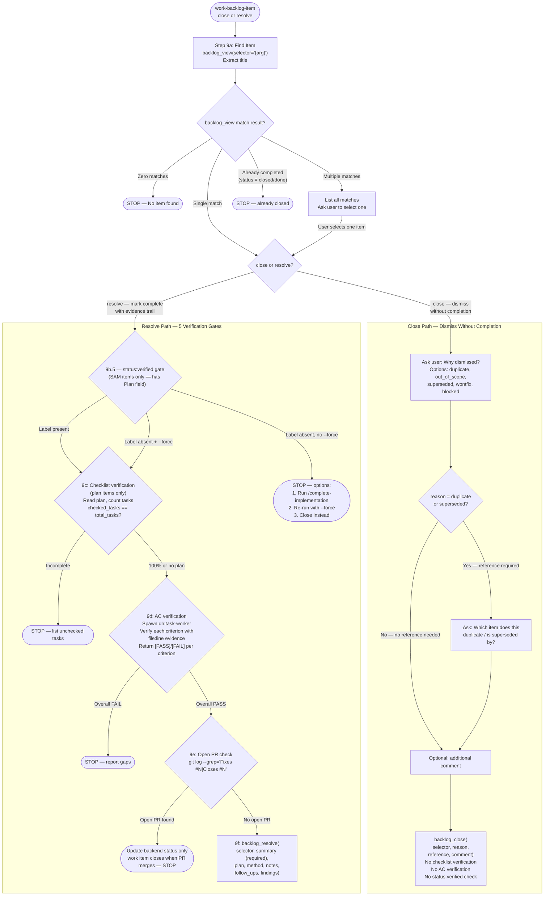

```mermaid
flowchart TD
    P2_START(["groom &lt;item_ref&gt;"]) --> P2_SCOPE_READ["Read scope.md<br>Grooming answers 'what/is it clear/what do<br>we have' — never architecture or task decomposition"]
    P2_SCOPE_READ --> P2_LOAD["Intake: Load item<br>backlog_view(selector=item_ref)"]

    P2_LOAD --> P2_A{"Check A — Prior implementation?<br>git log + backlog merged-prs<br>match title keywords"}
    P2_A -->|"Evidence found"| P2_SKIP_A(["SKIP — backlog_resolve<br>'Completed via PR/commit'"])
    P2_A -->|"No evidence"| P2_B{"Check B — Location validity?<br>Glob(suggested_location)"}
    P2_B -->|"Path not found,<br>no substitute via Grep"| P2_SKIP_B(["SKIP — suggested_location<br>gone with no substitute"])
    P2_B -->|"Path exists, no location set,<br>or substitute found and written"| P2_C{"Check C — Age and activity?<br>added &gt;90d AND ungroomed AND<br>no comments AND no plan"}
    P2_C -->|"Condition met, overlap with<br>recent item found"| P2_C_ASK["interactive: AskUserQuestion<br>proceed? / auto: log WARN, proceed"]
    P2_C -->|"Condition not met, or<br>no overlap found"| P2_D
    P2_C_ASK --> P2_D{"Check D — Item state?<br>state field from Load Item"}
    P2_D -->|"closed, no commit/PR evidence"| P2_SKIP_D(["SKIP — recommend manual review"])
    P2_D -->|"closed, evidence found"| P2_RESOLVE_D(["backlog_resolve → SKIP"])
    P2_D -->|"open"| P2_E{"Check E — Already groomed today?<br>groomed == today AND required<br>sections present"}
    P2_E -->|"Yes"| P2_DRIFT["groom-drift.md<br>Mode A (has plan): Plan Drift<br>Mode B (no plan): Grooming Drift"]
    P2_E -->|"No"| P2_EXTRACT["Extract item details:<br>title, description, source,<br>suggested_location, priority, labels,<br>groomed, research_first"]
    P2_DRIFT --> P2_FINALLY(["finally.md — report drift, STOP"])

    P2_EXTRACT --> P2_GATE{"Discovery Gate<br>(analyze.md) — skip if item has<br>no issue_number, or is type:fix/type:bug"}
    P2_GATE -->|"Skip gate"| P2_RTICA_INIT
    P2_GATE -->|"feature-context artifact exists"| P2_LOADART["Load artifact, use as prior context"]
    P2_GATE -->|"No artifact, but AC + Expected<br>Behavior + Desired Structure<br>sections all non-empty"| P2_SYNTH["Synthesize feature-context artifact<br>directly from those sections"]
    P2_GATE -->|"No artifact, sections thin"| P2_DISCOVERY["Skill(skill='dh:discovery', item_ref)<br>then verify artifact registered;<br>retry once; else STOP"]
    P2_LOADART --> P2_RTICA_INIT
    P2_SYNTH --> P2_RTICA_INIT
    P2_DISCOVERY -->|"artifact registered<br>(first or retried attempt)"| P2_RTICA_INIT
    P2_DISCOVERY -->|"still absent after retry"| P2_STOP_DISCOVERY(["STOP — dh:discovery completed<br>but no feature-context artifact"])

    P2_RTICA_INIT["RT-ICA Initial Snapshot<br>(orchestrator) — AVAILABLE/DERIVABLE/MISSING<br>from extracted item details only<br>backlog_groom(section='RT-ICA')"]
    P2_RTICA_INIT --> P2_SCOPE_SIZE["Scope Sizing (orchestrator decision)<br>issue type + AVAILABLE/DERIVABLE/MISSING mix<br>→ MINIMAL / NARROW / STANDARD / FULL"]

    P2_SCOPE_SIZE --> P2_WAVE0{"Wave 0 — pre-swarm research<br>skip for type:bug/type:fix,<br>no researchable technology,<br>or pure admin task"}
    P2_WAVE0 -->|"Run"| P2_RESEARCH["technical-researcher agent<br>writes Research section<br>BLOCKED → proceed without it, do not halt"]
    P2_WAVE0 -->|"Skip"| P2_WAVE1
    P2_RESEARCH --> P2_WAVE1

    subgraph P2_SWARM [Parallel Grooming Swarm — agents sized by Scope Sizing]
        direction TB
        P2_WAVE1["Wave 1 (parallel):<br>• impact-analyst → Impact Radius<br>• fact-checker → Fact-Check<br>• classifier → Issue Classification<br>  (+ Root-Cause Analysis if defect/recurring-pattern)"]
        P2_WAVE2["Wave 2 (after Wave 1):<br>• rtica-assessor → RT-ICA<br>  (re-reads Fact-Check/Impact Radius)<br>• alignment-analyst → Design Intent Alignment<br>  (depends on impact-analyst)"]
        P2_WAVE3["Wave 3 (after Wave 2):<br>• groomer → all groomed subsections"]
        P2_WAVE1 --> P2_WAVE2
        P2_WAVE2 -->|"RT-ICA STATUS: BLOCKED"| P2_WAVE2_BLOCK(["Stop — present MISSING<br>conditions; do not proceed to Wave 3"])
        P2_WAVE2 -->|"RT-ICA STATUS: DONE"| P2_WAVE3
    end

    P2_WAVE3 --> P2_RTICA_FINAL["RT-ICA Final Pass (orchestrator)<br>Re-assess every condition, self-resolution<br>pass with Grep/Read/WebSearch/Bash citation<br>per MISSING/DERIVABLE condition"]

    P2_RTICA_FINAL --> P2_DECISION{RT-ICA Final decision?}
    P2_DECISION -->|"APPROVED"| P2_OUTVAL["Output Validation Gate<br>Check sections_index for 8 required<br>sections + minimum content per section"]
    P2_DECISION -->|"BLOCKED — MISSING remain"| P2_BLOCKED(["Batch MISSING conditions, present to user<br>Wait for answers, mark AVAILABLE with<br>citation, re-check — loop until APPROVED"])
    P2_BLOCKED -->|"re-check APPROVED"| P2_OUTVAL

    P2_OUTVAL -->|"All present"| P2_HYPOTHESIS["Hypothesis Resolution<br>(if description has **Hypothesis** lines)<br>Rewrite each line per RCA/Fact-Check verdict"]
    P2_OUTVAL -->|"Missing — attempt 1 or 2"| P2_RETRY["Re-spawn groomer, same model,<br>targeted prompt for missing sections only"]
    P2_RETRY --> P2_OUTVAL
    P2_OUTVAL -->|"Missing after 3 attempts"| P2_BLOCKED_VAL(["backlog_update(status='blocked')<br>Report missing sections, STOP"])

    P2_HYPOTHESIS --> P2_WRITE["Write Groomed Content —<br>batch backlog_groom(sections={...},<br>mark_groomed=True) atomically advances<br>needs-grooming → groomed"]
    P2_WRITE --> P2_FINALLY
```

# Backlog Item End-to-End Lifecycle

**Audience**: Contributor/developer process reference. It preserves the observable workflow while
the configured backend owns storage and provider-specific persistence.

**Purpose**: Authoritative process graph for the full journey of a backlog item — from idea capture through implementation, verification, and closure. This document connects the backlog management layer (item creation, grooming, research) to the SAM execution layer (planning, implementation, quality gates).

**Sources**:

- `plugins/development-harness/skills/work-backlog-item/SKILL.md`
- `plugins/development-harness/skills/work-backlog-item/scripts/parser/command-routes.json`
- `plugins/development-harness/skills/work-backlog-item/references/workflows/create/start.md`, `.../create/scope.md`
- `plugins/development-harness/skills/work-backlog-item/references/workflows/groom/start.md`, `.../groom/intake.md`, `.../groom/analyze.md`, `.../groom/swarm.md`, `.../groom/finalize.md`, `.../groom/groom-drift.md`, `.../groom/finally.md`, `.../groom/scope.md`
- `plugins/development-harness/skills/work-backlog-item/references/workflows/work/start.md`, `.../work/prepare.md`, `.../work/plan.md`, `.../work/rt-ica-gate.md`, `.../work/feasibility-gate.md`
- `plugins/development-harness/skills/add-new-feature/SKILL.md`
- `plugins/development-harness/skills/implement-feature/SKILL.md`
- `plugins/development-harness/skills/start-task/SKILL.md`
- `plugins/development-harness/skills/complete-implementation/SKILL.md`

Note: this document's close/resolve semantics (Phase 7) were originally sourced from an ADR
(`docs/adr-9-close-resolve-semantics.md`), which is a record of a past deliberation, not the
current-design authority. No `ARCHITECTURE.md` in this plugin currently documents the close/resolve
semantic split as the authoritative design — that is a documentation gap, not something this
citation can be redirected to close. The semantics themselves are stated directly in Phase 7 below
and were re-verified against `backlog_core/ARCHITECTURE.md` and the `work-backlog-item` close/resolve
workflow rather than against the ADR.

**Last verified**: 2026-09-07

## Governing Design Constraint: Context-Fit Complexity

This lifecycle is structured according to the [Context-Fit Complexity Model](./sdlc-layers/layer-0/context-fit-complexity.md). Phase boundaries, node contracts, and step granularity follow the model's core equation:

```text
Complexity = context required for (knowledge loading + uncertainty resolution + execution)
             relative to context available
```

**How to read node contracts through the context-fit lens:**

- **Inputs column** = the knowledge payload the agent must load. When inputs come from a single prior node, the knowledge is already in scope — zero-overhead execution. When inputs require 5 artifacts from 3 sources, the knowledge payload is large — candidate for scale-out.
- **Outputs column** = what persists as durable findings for downstream consumption. Transient context (intermediate research, failed attempts, verbose logs) should be garbage-collected — only the durable output survives.
- **Edge Conditions column** = the uncertainty resolution gate. Each condition is an observable fact that determines the next node. When all conditions are AVAILABLE, uncertainty cost is zero. When conditions require tool verification, uncertainty adds to the context budget.

**Optimization principle:** When adjacent nodes share the same knowledge payload, combining them reduces handoff overhead without increasing complexity. When a single node's knowledge payload exceeds comfortable working context, slicing at knowledge-boundary seams produces subtasks that each fit. The goal is context-fit right-sizing — not minimum steps, not maximum parallelism, but each agent receiving exactly the context it needs to act reliably.

**Why:** "Stateless" in SAM (Stateless Agent Methodology) means each agent receives complete context, acts, and terminates. The context-fit model formalizes what "complete context" means. This lifecycle document is the map of how that context flows from idea to implementation. Optimizing the lifecycle means finding better context fits so fewer steps are needed to reach implementation.

### Knowledge Reuse vs Knowledge Gathering

Every lifecycle execution generates knowledge — codebase patterns discovered during grooming, architecture decisions made during planning, domain constraints surfaced during research. The context-fit optimization question for each piece of knowledge is: should it be gathered fresh each time, or stored for retrieval by relationship?

**Gathered knowledge** is discovered by agents during execution — file reads, web searches, codebase analysis. It costs context budget every time. It is always fresh but always expensive.

**Stored knowledge** lives in a persistent graph — the groomed item's sections, the architect spec, the artifact manifest, the backlog item's dependencies and cross-references. It costs retrieval by key or relationship, not discovery. It can go stale but is cheap to access.

**The optimization:**

- When the same knowledge is gathered by multiple agents across multiple items (e.g., "what testing framework does this project use?", "what is the module boundary for backlog_core?"), that knowledge is a candidate for the persistent graph. Store it once, retrieve by relationship.
- When knowledge is item-specific and changes between executions (e.g., "what files did the architect spec identify?", "what are the acceptance criteria for this task?"), it belongs in the artifact flow — passed as node contract Inputs, not stored globally.
- When knowledge is both reusable AND volatile (e.g., "what is the current state of the codebase?"), use progressive disclosure — store the stable structure, gather the volatile details on demand.

**Practical signals for what to store vs gather:**

- If a gathering agent runs the same Grep/Read pattern across 3+ items → store the result as a codebase-analysis artifact, reference by relationship
- If an agent needs domain context that was already produced by a prior phase of a different item → cross-reference via the artifact manifest, do not re-discover
- If the grooming swarm's fact-checker verifies the same claim across multiple items → store the verification as a reusable finding, not per-item
- If the swarm-task-planner makes the same decomposition pattern for similar features → extract the pattern as a template, not a one-off plan

The node contracts in this document support this: the Inputs column shows what knowledge each node needs. When that knowledge is the same across many executions of the same node, it belongs in the persistent graph. When it varies per execution, it belongs in the artifact flow.

---

> [!IMPORTANT]
> When provided a process map or Mermaid diagram, treat it as the authoritative procedure. Execute steps in the exact order shown, including branches, decision points, and stop conditions.
> A Mermaid process diagram is an executable instruction set. Follow it exactly as written: respect sequence, conditions, loops, parallel paths, and terminal states. Do not improvise, reorder, or skip steps. If any node is ambiguous or missing required detail, pause and ask a clarifying question before continuing.
> When interacting with a user, report before acting the interpreted path you will follow from the diagram, then execute.

---

## Overview

The following diagram is the authoritative procedure for backlog item phase overview. Execute steps in the exact order shown, including branches, decision points, and stop conditions.



Phases 3 and 4 both execute inside the `/dh:add-new-feature` skill (invoked by `/dh:work-backlog-item`). The skill runs 6 sequential phases: discovery, codebase analysis, architecture, task decomposition, plan validation, and context manifest.

Each phase produces logical records and artifacts through the configured backend. Work-item state,
grooming, plans, tasks, artifact manifests, and artifact content share that backend; remote
providers may privately use `FileCache`, while Beads, SQLite, and Memory use native storage.

---

## Phase 1: Item Capture

**Entry precondition**: User identifies a feature, bug, or chore worth tracking, and no existing
backlog item reference already covers it.

**Skill**: `/dh:work-backlog-item create` (the `create` route defined in
[command-routes.json](../skills/work-backlog-item/scripts/parser/command-routes.json), documented
in [create/start.md](../skills/work-backlog-item/references/workflows/create/start.md))

**Actor**: Orchestrator, in `interactive` mode (default) or `auto` mode.

The following diagram is the authoritative procedure for Phase 1 — Item Capture
(`/dh:work-backlog-item create`). Execute steps in the exact order shown, including branches,
decision points, and stop conditions.



### Node Contracts

| Node | Actor | Inputs | Outputs | Edge Conditions |
|------|-------|--------|---------|-----------------|
| P1_START | user or orchestrator | `create` route with an item-title/description input | skill invocation | always → P1_EXIST |
| P1_EXIST | orchestrator | any `item_ref` already resolved by the caller | existence check | existing ref → P1_SKIP, none → P1_SCOPE |
| P1_SKIP | orchestrator | — | "item already exists" report | terminal |
| P1_SCOPE | orchestrator | raw description | classification: BEHAVIORAL/PROCESS, PRODUCT/FEATURE, or MIXED | always → P1_MODE |
| P1_MODE | orchestrator | `mode` input (`interactive` default, or `auto`) | mode selection | interactive → P1_COLLECT_INT, auto → P1_COLLECT_AUTO |
| P1_COLLECT_INT | user | answers to 5 `AskUserQuestion` prompts (title, priority, description, source, type) | collected fields, extracted `**User-provided context**` block if implementation details were supplied | always → P1_VALIDATE |
| P1_COLLECT_AUTO | orchestrator | `item_title`, user input, optional matched research file | derived fields, `[AUTO]` decision log per field | always → P1_VALIDATE |
| P1_VALIDATE | orchestrator | collected fields | validated fields | valid → P1_DEDUP, missing/empty required field → P1_STOP_INVALID |
| P1_STOP_INVALID | orchestrator | missing/empty field name | error report | terminal |
| P1_DEDUP | `backlog_list` MCP/CLI | 2-4 extracted concepts | overlap match result | overlap + interactive → P1_CONFIRM, overlap + auto → P1_STOP_DUP, no overlap → P1_WRITE |
| P1_CONFIRM | user | matched item's title, ref, location | proceed/decline decision | yes → P1_WRITE, no → P1_STOP_DECLINE |
| P1_STOP_DUP | orchestrator | duplicate match | error report (no write) | terminal |
| P1_STOP_DECLINE | orchestrator | user decline | error report | terminal |
| P1_WRITE | `backlog_add` MCP/CLI | title, priority, description, source, type | raw tool response | always → P1_RESULT |
| P1_RESULT | orchestrator | response `error`/`errors`, `item_ref`, `reference`/`file_path`/`title` | 3-way outcome classification | no error → P1_REF, error with a stored-item signal → P1_PARTIAL, error with no stored-item signal → P1_STOP_NEVER |
| P1_REF | orchestrator | response `item_ref` | normalized `#N` selector | always → P1_DONE |
| P1_PARTIAL | orchestrator | response `reference`/`file_path`/`title` | selector fallback (item exists, no backend work-item reference yet) | always → P1_DONE |
| P1_STOP_NEVER | orchestrator | response with no stored-item signal | "item never stored" error report | terminal |
| P1_DONE | orchestrator | selector (`item_ref` or `reference`), title, priority, type | confirmation message, next-step suggestions | terminal |

**Scope boundary at creation time** (`create/scope.md`): a PRODUCT/FEATURE item strips
implementation instructions, design decisions, and file/code-level prescriptions from the
description, preserving them instead as `**User-provided context**: {verbatim text}` or, for an
unconfirmed causal guess, `**Hypothesis**: {text}`. A BEHAVIORAL/PROCESS item — one whose
description defines what an agent, workflow, or system must do — preserves the full procedural
text unchanged (the hypothesis-labeling rule still applies to any embedded causal claim). A MIXED
item preserves the behavioral spec and isolates only the code-level prescriptions as
user-provided context. **Why:** grooming and architecture need to know WHAT is broken or required,
not HOW to fix it — except when the item itself IS the "what," as with a process/behavioral
requirement.

**Key fields**:

- `**User-provided context**` / `**Hypothesis**` — the mechanism that preserves the user's own
  words when implementation detail or an unconfirmed cause is stripped from `description`. Never
  edited, summarized, or reformatted. **Why:** it is the arbiter of original intent when grooming
  later needs to check what was actually asked for.
- `source`, `type` — optional in the schema (`source` defaults to `Not specified`); auto mode
  derives them from context (research-file match, defect vs. feature keywords) rather than leaving
  them unset.

**Canonical status after this phase**: `needs-grooming`

**Failure paths**:

- Missing/empty required field (title, priority, description) — STOP, report field name.
- Content overlap detected in `auto` mode — STOP, no write.
- `backlog_add` response carries `error`/`errors` with no `reference`/`file_path`/`title` — STOP,
  the item was never stored (a distinct failure mode from the partial-success case where the item
  is stored but no backend work-item reference could be created).

**Transition to next phase**: Text suggestion only (Step 6's "Next steps:" block). No automatic
invocation. The transition from capture to grooming is entirely implied — a human or orchestrator
must decide to invoke the next step. (Originally confirmed by a 2026-03-02 process audit, Finding 9
Gap A — see "Unimplemented Extensions and Known Gaps" below; unchanged in the current `create`
workflow.)

---

## Phase 2: Grooming

**Entry precondition**: Item is selected for detail work, identified by a single `#N` item
reference (grooming operates on one item per invocation; it no longer accepts a section-wide
scope argument — see the note on discontinued behavior below).

**Skill**: `/dh:work-backlog-item groom` (the `groom` route defined in
[command-routes.json](../skills/work-backlog-item/scripts/parser/command-routes.json), documented
in [groom/start.md](../skills/work-backlog-item/references/workflows/groom/start.md))

**Actor**: Orchestrator dispatches standalone `Agent()` calls per swarm agent — no team, no
`SendMessage` between agents; an agent that depends on another's output re-reads that agent's
section from the item via MCP.

The following diagram is the authoritative procedure for Phase 2 — Grooming
(`/dh:work-backlog-item groom`). Execute steps in the exact order shown, including branches,
decision points, and stop conditions.



### Node Contracts

| Node | Actor | Inputs | Outputs | Edge Conditions |
|------|-------|--------|---------|-----------------|
| P2_START | orchestrator | `#N` item reference | skill invocation | always → P2_SCOPE_READ |
| P2_SCOPE_READ | orchestrator | — | grooming scope boundary in context | always → P2_LOAD |
| P2_LOAD | `backlog_view` MCP/CLI | item_ref | full item content, `state` field | always → P2_A |
| P2_A | orchestrator | `git log`, `backlog merged-prs` matched on title keywords | evidence of prior completion | found → P2_SKIP_A, none → P2_B |
| P2_SKIP_A | `backlog_resolve` MCP/CLI | matched PR/commit | item resolved, terminal for this item | terminal |
| P2_B | orchestrator | `suggested_location` (if any), `Glob`/`Grep` results | location validity | path missing with no substitute → P2_SKIP_B, otherwise (path OK, no location set, or substitute written) → P2_C |
| P2_SKIP_B | orchestrator | — | skip report | terminal |
| P2_C | orchestrator | `metadata.added`, `metadata.groomed`, comments, `plan` field, `backlog_list` keyword overlap | staleness/possible-supersession determination | condition met + overlap → P2_C_ASK, otherwise → P2_D |
| P2_C_ASK | user (interactive) or orchestrator (auto) | possibly-superseded candidate title | proceed decision (auto always proceeds, logged) | always → P2_D |
| P2_D | orchestrator | `state` field | open/closed determination | closed + no evidence → P2_SKIP_D, closed + evidence → P2_RESOLVE_D, open → P2_E |
| P2_SKIP_D | orchestrator | — | "closed, no commit/PR found — recommend manual review" | terminal |
| P2_RESOLVE_D | `backlog_resolve` MCP/CLI | matched evidence | item resolved | terminal |
| P2_E | orchestrator | `groomed` date, required-section presence | already-groomed-today determination | groomed today → P2_DRIFT, otherwise → P2_EXTRACT |
| P2_DRIFT | haiku `dh:task-worker` agent (`groom-drift.md`) | plan address (Mode A) or groomed sections' file paths (Mode B), git history since that date | drift findings written to item | always → P2_FINALLY |
| P2_EXTRACT | orchestrator | full item content | title, description, source, suggested_location, priority, `item_ref`, `issue_number`, labels, groomed, research_first | always → P2_GATE |
| P2_GATE | orchestrator | `issue_number`, labels, existing `feature-context` artifacts, groomed-section richness | discovery-gate routing | skip conditions met → P2_RTICA_INIT, artifact exists → P2_LOADART, rich sections but no artifact → P2_SYNTH, thin sections and no artifact → P2_DISCOVERY |
| P2_LOADART | `artifact_read` MCP/CLI | existing `feature-context` artifact | prior context for swarm agents | always → P2_RTICA_INIT |
| P2_SYNTH | orchestrator + `artifact_register` | AC, Expected Behavior, Desired Structure/Scope sections | synthesized `feature-context` artifact | always → P2_RTICA_INIT |
| P2_DISCOVERY | `Skill(dh:discovery)` | item_ref | registered `feature-context` artifact (verified via `artifact_list`, retried once on miss) | registered → P2_RTICA_INIT, still absent after retry → P2_STOP_DISCOVERY |
| P2_STOP_DISCOVERY | orchestrator | — | error report ("re-run /dh:discovery manually") | terminal |
| P2_RTICA_INIT | orchestrator | extracted item details only | AVAILABLE/DERIVABLE/MISSING categorization written via `backlog_groom(section='RT-ICA')`, dated | always → P2_SCOPE_SIZE |
| P2_SCOPE_SIZE | orchestrator | RT-ICA snapshot distribution, issue type | scope size (MINIMAL/NARROW/STANDARD/FULL) | always → P2_WAVE0 |
| P2_WAVE0 | orchestrator | item type, description | Wave 0 skip/run decision | skip conditions met → P2_WAVE1, else → P2_RESEARCH |
| P2_RESEARCH | `technical-researcher` agent | technology, concern, depth derived from item | Research section written, or `STATUS: BLOCKED` (proceed without it) | always → P2_WAVE1 |
| P2_WAVE1 | `impact-analyst` + `fact-checker` + `classifier` (parallel `Agent()` calls) | item description, codebase state, primary sources, Research section (if present) | Impact Radius, Fact-Check, Issue Classification (+ Root-Cause Analysis for defect/recurring-pattern) sections | all complete → P2_WAVE2 |
| P2_WAVE2 | `rtica-assessor` + `alignment-analyst` (parallel `Agent()` calls) | Wave 1 sections, item details | RT-ICA reassessment (`STATUS: DONE` or `BLOCKED`), Design Intent Alignment section | DONE → P2_WAVE3, BLOCKED → P2_WAVE2_BLOCK |
| P2_WAVE2_BLOCK | orchestrator | MISSING conditions from Wave 2 RT-ICA | user-facing report | terminal (does not reach Wave 3) |
| P2_WAVE3 | `groomer` agent (`subagent_type="dh:backlog-item-groomer"`) | all prior sections (re-read by the agent itself, not pasted into the prompt) | Reproducibility, Priority, Impact, Benefits, Expected Behavior, Acceptance Criteria, Files, Resources, Dependencies, Effort — each via `backlog_groom(section='{name}')` | complete → P2_RTICA_FINAL |
| P2_RTICA_FINAL | orchestrator | full swarm output, initial RT-ICA snapshot | final RT-ICA report (replaces snapshot), self-resolution attempts with tool-result citations | always → P2_DECISION |
| P2_DECISION | orchestrator | RT-ICA final result | APPROVED or BLOCKED determination | APPROVED → P2_OUTVAL, BLOCKED → P2_BLOCKED |
| P2_BLOCKED | orchestrator | MISSING conditions list, `<mode/>` | batched user-facing report; in `auto` mode, a MISSING condition with exactly one viable option is auto-resolved | user answers received → P2_OUTVAL (re-check), unresolved → remains blocked |
| P2_OUTVAL | orchestrator | `backlog_view(summary=True).sections_index`, per-section content reads | presence/minimum-content check against the 8 required sections | all present with minimum content → P2_HYPOTHESIS, missing (attempt < 3) → P2_RETRY, missing (attempt 3) → P2_BLOCKED_VAL |
| P2_RETRY | `groomer` agent (same model, targeted prompt) | list of missing section names | re-attempted section writes | always → P2_OUTVAL |
| P2_BLOCKED_VAL | `backlog_update` MCP/CLI (`status='blocked'`) | missing-section list after 3 attempts | item marked blocked | terminal |
| P2_HYPOTHESIS | orchestrator | `description`'s `**Hypothesis**` lines, Root-Cause Analysis / Fact-Check verdicts | `description` rewritten in place via `backlog_update` (each line resolved independently) | always → P2_WRITE |
| P2_WRITE | `backlog_groom` MCP (`sections=`, `mark_groomed=True`) | all groomed sections including the RT-ICA final report | atomic batch write, status `needs-grooming` → `groomed` | always → P2_FINALLY |
| P2_FINALLY | orchestrator (`finally.md`) | terminal outcome (Groomed/Blocked/Skipped/Drift) | one-line report to caller, `backlog_pull` refresh if needed, control returned | terminal |

**Discontinued behavior**: earlier versions of this phase accepted a section-wide scope argument
(`P0`/`P1`/`P2`/`all`) to groom every matching item in one invocation. The current `groom` route
takes a single `#N` item reference; grooming multiple items means invoking the route once per item.

**Pre-groom checks (Intake, `intake.md`)**: five checks run in order, first failure determines the
outcome — Check A (prior implementation evidence), Check B (`suggested_location` still valid or
substitutable), Check C (stale/possibly-superseded: added >90 days ago, ungroomed, no comments, no
plan, with keyword overlap against recently-added items), Check D (item `state` open vs. closed),
Check E (already groomed today with required sections present). This replaces an earlier "is the
job still valid?" check that had no observable criterion attached to it (see Audit Finding F4
below, now addressed by these five concrete checks).

**Discovery Gate (`analyze.md`)**: new since the earlier version of this document. For a
feature/refactor item with a linked backend issue, grooming requires a `feature-context` artifact
before the swarm runs — either an existing one, one synthesized directly from already-rich groomed
sections, or one produced by invoking `dh:discovery` (retried once on a verification miss, then a
hard STOP). The gate is skipped entirely for bug/fix items or items with no linked issue.

**Swarm agents and their outputs** (`swarm.md`):

- **technical-researcher** (Wave 0, optional) — Pre-swarm research on the item's primary
  technology or internal module. Skipped for bug/fix items, items with no researchable technology,
  or pure administrative tasks. A `STATUS: BLOCKED` result does not halt the groom.
- **impact-analyst** (Wave 1) — Builds an affected-systems inventory, then runs a 5-question
  impact checklist per system. Writes `section="Impact Radius"` in 6 named categories (Code
  Producers/Consumers/Other References, Documentation, Configuration/CI, Agent Instructions),
  leading with `SCOPE_EXPANSION:` when it finds systems beyond the original description.
- **fact-checker** (Wave 1) — Verifies item claims against primary sources; training-data recall
  is not evidence. Every `**Hypothesis**: {text}` line in the description becomes its own claim,
  prefixed `HYPOTHESIS:` with the line's exact text. Writes `section="Fact-Check"`. `REFUTED` maps
  to RT-ICA MISSING, `INCONCLUSIVE` to DERIVABLE.
- **classifier** (Wave 1) — Classifies the issue type via a 5-branch decision tree (procedural,
  recurring-pattern, defect, missing-guardrail, unbounded-design), no blocking dependencies. Writes
  `section="Issue Classification"`. For `defect`, invokes the `find-cause` skill for a
  Root-Cause Analysis section; for `recurring-pattern`, runs a frequency search against resolved
  items via `backlog_list`.
- **rtica-assessor** (Wave 2) — Assesses information completeness using Wave 1 output; blocked by
  impact-analyst and fact-checker. Re-reads Fact-Check (a `REFUTED` claim marks its condition
  MISSING) and Impact Radius (a `SCOPE_EXPANSION:` line adds conditions). Writes `section="RT-ICA"`.
- **alignment-analyst** (Wave 2) — Compares existing implementation against the item's design
  intent, blocked by impact-analyst. Writes `section="Design Intent Alignment"`, leading with a
  `MISSION_ALIGNED`/`MISSION_DIVERGENT` verdict line.
- **groomer** (Wave 3, `subagent_type="dh:backlog-item-groomer"`) — Runs after all other agents,
  reading every prior section itself (`item_ref` only is passed in the dispatch prompt). Produces
  Reproducibility, Priority, Impact, Benefits, Expected Behavior, Acceptance Criteria, Files,
  Resources, Dependencies, Effort, each via its own `backlog_groom(section=...)` call. The
  description/acceptance-criteria separation instruction that guides this agent lives in
  `swarm.md`'s "Groomer prompt" section.

**RT-ICA runs twice**: an initial snapshot (item-level info only, before the swarm — used for
scope sizing) and a final pass (after the full swarm output — in `finalize.md`). The final report
replaces the initial snapshot in the item (same `section="RT-ICA"` write overwrites). **Why:** the
snapshot calibrates swarm intensity; the final pass incorporates swarm discoveries (a fact-checked
`REFUTED` claim converts a condition from AVAILABLE to MISSING, a self-resolution attempt with a
cited tool result converts DERIVABLE or MISSING to AVAILABLE).

**Output Validation Gate (`finalize.md`)**: after RT-ICA Final is APPROVED, presence and minimum
content are checked for 8 required sections (RT-ICA, Impact Radius, Fact-Check, Acceptance
Criteria, Reproducibility, Issue Classification, Priority, Design Intent Alignment) via
`backlog_view`'s `sections_index`. A missing section triggers up to two same-model retries with a
targeted prompt naming only the missing sections; a third failed attempt marks the item `blocked`
and stops. This gate did not exist in an earlier version of this document — it is the concrete
implementation of what that version called "Recommended completeness check before Phase 3" (see
the note below) and of Audit Finding F6's request for a groomer-output quality check (now
addressed — see "Unimplemented Extensions and Known Gaps" below).

**Metadata written**: `groomed` metadata is set to `YYYY-MM-DD`. This records when grooming
occurred and is distinct from the item's status field.

**Status advancement via `mark_groomed`**: Passing `mark_groomed=True` to the `backlog_groom` MCP
tool triggers a status transition after all content writes complete: the item's status is set to
`groomed` through the configured backend, which applies its equivalent status transition and any
provider synchronization. The flag works with both single-section writes and the batch `sections`
parameter; with `sections`, all content is written first and the status transition fires exactly
once after the batch completes. This is the atomic write-and-advance path `finalize.md` calls
"Preferred: batch write with atomic status transition" — the current groom workflow always reaches
this point through that batch call, not a chain of separate single-section calls (see Gap 1 in
"Unimplemented Extensions and Known Gaps" below).

**Idempotent**: Calling `backlog_groom` with `mark_groomed=True` multiple times is safe; the
configured backend treats an already-groomed item as a no-op.

**Error handling**: A backend status-transition failure is returned explicitly. Content writes and
their queued remote mutation, when applicable, retain their backend-defined outcome.

**Re-lookup failure**: After content is written, `groom_item` re-parses the backlog to locate the item by selector before advancing status. If this re-lookup returns `None` (e.g., selector ambiguity after a title change during content write), the status advance is skipped. The response contains `mark_groomed_skipped: true` and a human-readable `mark_groomed_skip_reason` that includes the selector and indicates the item was not found in the re-parsed backlog. A warning is also emitted. The caller must check for `mark_groomed_skipped` in the result dict and re-run the `backlog_groom` call if the status advance is required.

**When to use**: Pass `mark_groomed=True` on the final `backlog_groom` call when all required sections have been written and the item is approved for planning. Using the `sections` parameter to write all sections in a single call combined with `mark_groomed=True` is the recommended pattern — it writes all content and advances the status atomically.

**Failure paths**:

- Pre-groom check A-D fails — item skipped with report (see per-check outcomes above).
- Discovery Gate STOP — `dh:discovery` completed without registering a `feature-context` artifact after one retry.
- RT-ICA BLOCKED — STOP, present MISSING conditions to user, wait for answers.
- Output Validation Gate fails after 3 attempts — item marked `blocked`, STOP.
- Advisory AC overlap check: `_check_ac_overlap()` in `operations.py` issues a non-blocking warning when the Acceptance Criteria section is written and the description already contains checkbox items or acceptance headers (`## Acceptance`, `### Acceptance Criteria`). This fires for both single-section and batch `sections` writes.

**Transition to next phase**: No explicit invocation of the next skill from `finally.md` — control
returns either to the `work-backlog-item` SKILL.md router (if `groom` was the invoked route) or to
the `work` route's `prepare.md` (if grooming ran as a prerequisite for `work`). Transition from
grooming to milestone grouping is still not mentioned anywhere in the `groom` workflow (Audit
Finding 9 Gap B — unchanged in the current implementation).

**Recommended completeness check before Phase 3 — now implemented**: an earlier version of this
document recommended verifying RT-ICA, Acceptance Criteria, and Description presence before
entering Phase 3, because the RT-ICA presence check alone did not verify full grooming
completeness. The Output Validation Gate described above now performs exactly this kind of check
(and more: 8 required sections, not 3) as part of every groom invocation, so this is no longer an
open recommendation — it is enforced before an item can be marked `groomed`.

---

## Phase 3: Research and Architecture

**Entry precondition**: Item is groomed. `/dh:work-backlog-item` has been invoked on the `work`
route, which runs an RT-ICA gate and a feasibility gate (Prepare phase, `rt-ica-gate.md` Step 3.2
and `feasibility-gate.md` Step 3.4) and composes a feature request (Plan phase, `plan.md` Step 4.1)
before invoking `/dh:add-new-feature` via `Skill()` call (Plan phase Step 4.2).

**Skill**: `/dh:add-new-feature` (Phases 1-3 of 6 internal phases)

**Actor**: Orchestrator invokes `/dh:add-new-feature`; each internal phase delegates to a specialist agent sequentially.

Phases 3 and 4 of the lifecycle both execute inside `/dh:add-new-feature`. The skill runs 6 sequential phases internally: Pre-Phase (artifact discovery), Phase 1 (feature research), Phase 2 (codebase analysis), Phase 3 (architecture), Phase 4 (task decomposition), Phase 5 (plan validation), Phase 6 (context manifest).

The following diagram is the authoritative procedure for Phase 3 — Research and Architecture (/dh:work-backlog-item through /dh:add-new-feature Phases 1-3). Execute steps in the exact order shown, including branches, decision points, and stop conditions.

```mermaid
flowchart TD
    P3_AUTOGROOM(["Prepare Step 3.1:<br>Auto-Groom"]) --> P3_GROOMED_CHECK{"Item's groomed field<br>set (YYYY-MM-DD)?"}
    P3_GROOMED_CHECK -->|"Absent/empty — ungroomed"| P3_GROOM_NOW["Run the groom route directly:<br>/dh:work-backlog-item groom {item_ref}"]
    P3_GROOMED_CHECK -->|"Set — groomed"| P3_STALE["Two-phase staleness check:<br>functional commits on Impact Radius<br>files since groom date?"]
    P3_STALE -->|"None, or COSMETIC_ONLY diff"| P3_RTICA_CHECK
    P3_STALE -->|"FUNCTIONAL_DRIFT"| P3_REGROOM["Write staleness-context section,<br>then re-enter the groom route directly:<br>/dh:work-backlog-item groom {item_ref}<br>(same route as ungroomed items —<br>not a separate skill)"]
    P3_STALE -->|"SUPERSEDED"| P3_CLOSE(["backlog_close(reason='superseded') — STOP"])
    P3_GROOM_NOW --> P3_RTICA_CHECK
    P3_REGROOM --> P3_RTICA_CHECK

    P3_RTICA_CHECK(["Prepare Step 3.2:<br>RT-ICA Gate"]) --> P3_RTICA_FRESH{"RT-ICA section present AND<br>fresh (Date &lt;= 7 days old,<br>and not older than metadata.updated_at)?"}
    P3_RTICA_FRESH -->|"Present and fresh — reuse"| P3_RTICA_USE["Use cached APPROVED/BLOCKED decision<br>Carry DERIVABLE items as<br>'Assumptions to confirm'"]
    P3_RTICA_FRESH -->|"Absent or stale — re-run"| P3_RTICA_RUN["Skill(skill='dh:rt-ica', args=item_ref)<br>Step 3.3: stamp Date: header on result"]
    P3_RTICA_USE --> P3_RTICA_GATE{RT-ICA decision?}
    P3_RTICA_RUN --> P3_RTICA_GATE
    P3_RTICA_GATE -->|BLOCKED| P3_BLOCKED(["STOP — present unresolved<br>conditions to user<br>Do not proceed to feasibility gate"])
    P3_RTICA_GATE -->|APPROVED| P3_FEAS["Prepare Step 3.4: Feasibility Gate<br>4 criteria in order: technical feasibility,<br>effort proportionality, blast radius,<br>prior-attempt/over-engineering check"]
    P3_FEAS -->|"BLOCKED — any criterion fails"| P3_FEAS_BLOCK(["STOP — report failing criterion,<br>observable check, required action<br>Do not proceed to Plan phase"])
    P3_FEAS -->|"PASS (warnings allowed)"| P3_COMPOSE["Plan Step 4.1:<br>Compose feature request<br>Append Feasibility Assessment block"]
    P3_COMPOSE --> P3_INVOKE["Plan Step 4.2:<br>Skill(skill='dh:add-new-feature',<br>args='{composed feature request}')<br>Direct skill call — not a suggestion"]

    P3_INVOKE --> P3_ARTIFACT_DISCOVER{"Pre-Phase:<br>Artifact Discovery<br>artifact_list(item_id={work_item_reference})<br>Existing artifacts?"}
    P3_ARTIFACT_DISCOVER -->|"Artifacts exist —<br>inject into delegation prompts"| P3_ARTIFACT_APPEND["Append prior_artifacts block<br>to each phase delegation prompt"]
    P3_ARTIFACT_DISCOVER -->|"No artifacts —<br>start fresh"| P3_RESEARCH
    P3_ARTIFACT_APPEND --> P3_RESEARCH

    P3_RESEARCH["Phase 1: Feature Research<br>Agent: @dh:feature-researcher<br>Output: feature-context artifact<br>Constraint: WHAT/WHY only — no HOW<br>Artifact registered: feature-context"]

    P3_RESEARCH --> P3_CODEBASE{"Phase 2: Codebase Analysis<br>Does feature-context reference unfamiliar<br>patterns, unknown architecture, or<br>untested conventions?<br>Agent: @dh:codebase-analyzer"}
    P3_CODEBASE -->|"Yes — unknown patterns<br>or conventions present"| P3_CODEBASE_OUT["Output: codebase-analysis artifact<br>per focus area<br>Constraint: WHAT exists today only"]
    P3_CODEBASE -->|"No — patterns already<br>captured in feature-context"| P3_ARCHITECT
    P3_CODEBASE_OUT --> P3_ARCHITECT

    P3_ARCHITECT["Phase 3: Architecture Design<br>Agent: resolved via profile_list capability match<br>Input: feature-context + optional codebase analysis<br>Output: architect artifact<br>Constraint: HOW only — interfaces, contracts, models"]
```



### Node Contracts

| Node | Actor | Inputs | Outputs | Edge Conditions |
|------|-------|--------|---------|-----------------|
| P3_AUTOGROOM | orchestrator (`work` route, Prepare `groom-check.md`, Step 3.1) | item's `groomed` field | ungroomed/groomed branch | always → P3_GROOMED_CHECK |
| P3_GROOMED_CHECK | orchestrator | `groomed` field value | ungroomed vs. groomed determination | absent/empty → P3_GROOM_NOW, set → P3_STALE |
| P3_GROOM_NOW | orchestrator | item_ref | groom route invoked directly (same route Phase 2 describes, not a separate skill) | always → P3_RTICA_CHECK |
| P3_STALE | orchestrator + drift-assessment agent | Impact Radius file paths, `git log`/`git diff` since groomed date | FUNCTIONAL_DRIFT / SUPERSEDED / COSMETIC_ONLY classification | none or COSMETIC_ONLY → P3_RTICA_CHECK, FUNCTIONAL_DRIFT → P3_REGROOM, SUPERSEDED → P3_CLOSE |
| P3_REGROOM | orchestrator | staleness diff summary | staleness-context section written, groom route re-entered directly for this same item_ref | always → P3_RTICA_CHECK |
| P3_CLOSE | `backlog_close` MCP/CLI | commit references | item closed as superseded | terminal |
| P3_RTICA_CHECK | orchestrator (`work` route, Prepare `rt-ica-gate.md`, Step 3.2) | RT-ICA section (if any), `metadata.updated_at` | freshness determination | always → P3_RTICA_FRESH |
| P3_RTICA_FRESH | orchestrator | RT-ICA `Date:` header, 7-day threshold, `metadata.updated_at` | present-and-fresh vs. absent-or-stale | fresh → P3_RTICA_USE, absent/stale → P3_RTICA_RUN |
| P3_RTICA_USE | orchestrator | cached RT-ICA section content | RT-ICA decision (APPROVED/BLOCKED) reused as-is | always → P3_RTICA_GATE |
| P3_RTICA_RUN | `Skill(dh:rt-ica)` | item_ref | fresh RT-ICA result, `Date:` header stamped (Step 3.3) | always → P3_RTICA_GATE |
| P3_RTICA_GATE | orchestrator | RT-ICA decision | gate result | BLOCKED → P3_BLOCKED, APPROVED → P3_FEAS |
| P3_BLOCKED | orchestrator | MISSING conditions list | user-facing report, feasibility gate and `add-new-feature` NOT invoked | terminal |
| P3_FEAS | orchestrator (Prepare `feasibility-gate.md`, Step 3.4) | `suggested_location`, Priority/Effort section, Impact Radius (or Resources fallback), item body text | PASS (with optional WARNs) or BLOCKED on the first failing criterion | PASS → P3_COMPOSE, BLOCKED → P3_FEAS_BLOCK |
| P3_FEAS_BLOCK | orchestrator | failing criterion, observable check, required action | structured BLOCKED report; retry path is "re-groom, then re-run `/work-backlog-item {title}`" | terminal |
| P3_COMPOSE | orchestrator (Plan `plan.md`, Step 4.1) | groomed item, DERIVABLE items, Feasibility Assessment block | composed feature request with 'Assumptions to confirm' and feasibility summary | always → P3_INVOKE |
| P3_INVOKE | orchestrator (Plan `plan.md`, Step 4.2) | composed feature request | `Skill()` call to `dh:add-new-feature` | always → P3_ARTIFACT_DISCOVER |
| P3_ARTIFACT_DISCOVER | `artifact_list` MCP | opaque owner reference | existing artifact manifest (or empty) | artifacts exist → P3_ARTIFACT_APPEND, none → P3_RESEARCH |
| P3_ARTIFACT_APPEND | orchestrator | artifact manifest | `prior_artifacts` block added to delegation prompts | always → P3_RESEARCH |
| P3_RESEARCH | `@dh:feature-researcher` | composed feature request, prior artifacts (if any) | feature-context artifact registered with owner, `artifact_type`, logical `artifact_id`, and content | always → P3_CODEBASE |
| P3_CODEBASE | orchestrator | feature context, codebase state | codebase analysis decision | invoked → P3_CODEBASE_OUT, skipped → P3_ARCHITECT |
| P3_CODEBASE_OUT | `@dh:codebase-analyzer` | focus areas (patterns, architecture, testing, conventions) | registered `codebase-analysis` artifact content | always → P3_ARCHITECT |
| P3_ARCHITECT | `profile_list`-resolved agent | feature context + optional codebase analysis | registered `architect` artifact content | terminal (continues to Phase 4) |

**Agent selection for architecture**: The skill does NOT hardcode a specific language plugin's agent. It calls `mcp__plugin_dh_backlog__profile_list()` at runtime to fetch every installed agent's declared capability and matches the task against those descriptions (none matching → dh:task-worker fallback).

**Artifact registration**: Each document-artifact phase calls `artifact_register` with the opaque
owner reference, `artifact_type`, logical artifact identifier, and `agent` fields. The configured
backend owns content persistence. Plans are created and read only through `sam_plan`.

**Storage**: Feature context and architecture specs are registered as logical artifacts through the
configured backend. Remote providers may cache them privately; local providers keep them in native
storage.

**Artifact access is MCP-first**: Consumers retrieve artifacts via
`artifact_read(item_id=<owner-reference>, artifact_type=<type>)` and register them via
`artifact_register(item_id=<owner-reference>, artifact_type=<type>, artifact_id=<logical-id>,
agent=<producer>, content=<body>)`. Task plans are accessed via `sam_task` and `sam_plan`. The
configured backend resolves storage internally — consumers use logical addresses, never provider
or filesystem paths.

**A feasibility gate now exists** between RT-ICA APPROVED and SAM planning invocation
(`feasibility-gate.md`, Prepare Step 3.4 — see the diagram above). It evaluates, in order:
technical feasibility (does `suggested_location` resolve, do referenced APIs exist), effort
proportionality (is the estimated effort tier proportionate to the item's priority), blast radius
(affected-system count, with a live `rg` recount when Impact Radius rows carry a `pattern:` field),
and a prior-attempt / over-engineering check (a 1-file Impact Radius paired with a 4+ task Effort
estimate is treated as a signal to use `--quick` instead). This closes what an earlier version of
this document recorded as Audit Finding F1 — "No Feasibility Assessment Step" — which was accurate
when the audit that raised it was run (2026-03-02) but is superseded by the current `work` workflow
(see the "Addressed" note on Finding F1 below).

---

## Phase 4: Planning

**Entry precondition**: The `architect` artifact exists for the logical owner and is retrievable with
`artifact_read(item_id=<owner-reference>, artifact_type="architect")`. Still inside
`/dh:add-new-feature` (Phases 4-6 of 6 internal phases).

**Skill**: `/dh:add-new-feature` (Phases 4-6)

**Actor**: Orchestrator delegates to specialist agents sequentially.

The following diagram is the authoritative procedure for Phase 4 — Planning (/dh:add-new-feature Phases 4-6). Execute steps in the exact order shown, including branches, decision points, and stop conditions.



### Node Contracts

| Node | Actor | Inputs | Outputs | Edge Conditions |
|------|-------|--------|---------|-----------------|
| P4_DECOMPOSE | `@dh:swarm-task-planner` | architect and feature-context artifacts | logical plan via the `sam_plan` create action, tasks with status/deps/priority/complexity/agent/AC/verification | always → P4_BOOKEND |
| P4_BOOKEND | orchestrator | `acceptance-criteria-structured` field | bookend decision | non-empty → P4_BOOKEND_GEN, empty → P4_NO_BOOKEND |
| P4_BOOKEND_GEN | `@dh:swarm-task-planner` | structured acceptance criteria | T0 task (priority 1, deps=[]) + TN task (deps=all non-bookend IDs) inside plan | always → P4_CREATED |
| P4_NO_BOOKEND | orchestrator | — | no bookend tasks | always → P4_CREATED |
| P4_CREATED | `sam_plan` MCP | slug, goal, tasks, owner reference | logical plan address; plan content remains on the SAM capability | always → P4_VALIDATE |
| P4_VALIDATE | `@dh:plan-validator` | logical plan record | READY or BLOCKED with specific gap list | always → P4_VAL_RESULT |
| P4_VAL_RESULT | orchestrator | validator output | routing decision | READY → P4_CONTEXT, BLOCKED → P4_FIX |
| P4_FIX | orchestrator | validator BLOCKED output with gap list | re-invoke `swarm-task-planner` with gap context | loops back to P4_DECOMPOSE |
| P4_CONTEXT | `@dh:dh-context-gathering` | logical plan record, codebase state, artifact manifest | context manifest written into plan via `sam_plan` | always → P4_LINK |
| P4_LINK | `backlog_update` MCP | item selector (title), plan address | `plan` field linked on backlog item, `status` → `in-progress` | always → P4_DONE |

> **Quick-path exception**: When the fix arrives via the Proactive Fix Gate (--quick), the SAM plan
> slug is `quick-{slug}` with a single T1 task (complexity=low). The state machine transition
> (`groomed → in-progress` or `needs-grooming → in-progress` when the item was created inline by
> quick/start.md Step 2) occurs during quick-path execution, not at Step 7 of the full
> work-backlog-item pipeline.

| P4_DONE | orchestrator | slug, logical plan address | completion report, next-step instruction (`/dh:implement-feature`) | terminal |

**Storage**: The SAM plan is created via the `sam_plan` create action through the configured backend. The same
backend owns the plan and its task records; no second task provider is selected.

**plan-validator returns READY or BLOCKED** (not PASS/BLOCKED as previously documented). BLOCKED includes specific gaps that must be fixed before retrying.

**T0 baseline is a bookend task during EXECUTION, not during planning**. The `swarm-task-planner` generates T0 and TN as tasks inside the logical plan with appropriate priority and dependency settings. They dispatch automatically during execution via normal SAM readiness ordering — T0 fires first (priority 1, no deps), TN fires last (depends on all implementation tasks). No special handling is needed in the dispatch loop.

Bookend generation at P4_BOOKEND_GEN is now backed by hard schema-level enforcement, not just agent instructions: `BookendValidator` (`sam_schema/core/dependencies.py`) is wired into `dh_core/operations.py`'s `create_plan` and `finalize_plan`, so a plan with non-empty `acceptance-criteria-structured` and missing/misconfigured T0 or TN tasks is rejected at write time rather than silently persisted (#3277).

**context-gathering writes into the plan record** via `sam_plan`, not to a separate provider.

**Status advance**: `backlog_update(selector="{title}", plan="{plan_ref}")` links the opaque plan
reference returned by `sam_plan` to
the work item through the configured backend. The `status` transition to `in-progress` happens via
`work-backlog-item`'s Plan phase, Step 4.3 (`plan.md`).

**Failure paths**:

- plan-validator returns BLOCKED — re-run Phase 4 (task decomposition) to fix gaps before retrying Phase 5.
- No specific fix protocol is defined for BLOCKED plans beyond "fix the identified gaps." The recommended approach is to re-invoke `swarm-task-planner` with the validator's BLOCKED output (listing specific gaps) as additional context, so the planner can address each gap directly rather than regenerating from scratch.

---

## Phase 5: Execution

**Entry precondition**: SAM plan exists and is linked to the backlog item. `/dh:add-new-feature` has completed.

**Skill**: `/dh:implement-feature`

**Actor**: Orchestrator runs the dispatch loop; specialist agents execute individual tasks via `/dh:start-task`.

The following diagram is the authoritative procedure for Phase 5 — Execution (/dh:implement-feature). Execute steps in the exact order shown, including branches, decision points, and stop conditions.

```mermaid
flowchart TD
    P5_START(["Orchestrator invokes<br>/dh:implement-feature"]) --> P5_STATUS["sam_plan(plan='P{N}', config={\"action\":\"status\"})<br>Query plan status"]

    P5_STATUS --> P5_READY{"Fetch ready tasks<br>(ONCE per batch)<br>sam_plan(plan='P{N}', config={\"action\":\"ready\"})"}
    %% Note: BLOCKED tasks also produce no ready tasks — see Gap note in Phase 5 prose
    P5_READY -->|"No ready tasks —<br>all tasks show COMPLETE"| P5_COMPLETE
    P5_READY -->|"1 task ready"| P5_DISPATCH_SINGLE["Dispatch via single Agent call<br>Skill(skill='start-task',<br>args='P{N} --task {T}')"]
    P5_READY -->|"2+ tasks ready"| P5_DISPATCH_TEAM["Parallel Agent() calls<br>One agent per ready task, no team<br>Each calls start-task"]

    P5_DISPATCH_SINGLE --> P5_HOOK
    P5_DISPATCH_TEAM --> P5_HOOK

    P5_HOOK["SubagentStop hook fires:<br>task_status_hook.py marks<br>task COMPLETE through configured backend"]

    P5_HOOK --> P5_CONCERNS{"Agent returned<br>&lt;concerns&gt; block?"}
    P5_CONCERNS -->|Yes| P5_LOG_CONCERNS["Append concerns to backlog<br>via backlog_groom"]
    P5_CONCERNS -->|No| P5_BATCH_CHECK
    P5_LOG_CONCERNS --> P5_BATCH_CHECK

    P5_BATCH_CHECK{"All tasks in batch<br>complete?"}
    P5_BATCH_CHECK -->|No| P5_WAIT["Wait for remaining agents"]
    P5_BATCH_CHECK -->|Yes| P5_STATUS
    P5_WAIT --> P5_BATCH_CHECK

    P5_COMPLETE(["Completion Gate:<br>All tasks show COMPLETE"])
    P5_COMPLETE --> P5_INVOKE_QG["Invoke directly:<br>Skill(skill='complete-implementation',<br>args='{plan_address_or_item_reference}')<br>Explicit invocation — not a suggestion"]
```

### Node Contracts

| Node | Actor | Inputs | Outputs | Edge Conditions |
|------|-------|--------|---------|-----------------|
| P5_START | orchestrator | plan address (from P4_DONE) | skill invocation | always → P5_STATUS |
| P5_STATUS | `sam_plan` MCP | plan address `P{N}` | plan status summary (per-task states) | always → P5_READY |
| P5_READY | `sam_plan` MCP (`plan="<plan-address>", config={"action":"ready"}`) | plan address | list of ready tasks (deps resolved, not claimed) | none ready + all terminal → P5_COMPLETE, 1 ready → P5_DISPATCH_SINGLE, 2+ ready → P5_DISPATCH_TEAM |
| P5_DISPATCH_SINGLE | orchestrator | plan address, task ID | `Skill('start-task', args)` call | always → P5_HOOK |
| P5_DISPATCH_TEAM | orchestrator | plan address, ready task IDs | one `Agent()` call per ready task, dispatched in parallel, each calls `start-task` | always → P5_HOOK |
| P5_HOOK | `task_status_hook.py` (SubagentStop) | agent completion signal, active-task context | task status → COMPLETE through configured backend | always → P5_CONCERNS |
| P5_CONCERNS | orchestrator | agent output | concerns block presence check | concerns present → P5_LOG_CONCERNS, none → P5_BATCH_CHECK |
| P5_LOG_CONCERNS | `backlog_groom` MCP | concerns text | concerns appended to backlog item | always → P5_BATCH_CHECK |
| P5_BATCH_CHECK | orchestrator | batch task states | batch completion check | all complete → P5_STATUS (loop), incomplete → P5_WAIT |
| P5_WAIT | orchestrator | running agent handles | agent completion signals | agent completes → P5_BATCH_CHECK |
| P5_COMPLETE | orchestrator | `sam_plan(plan="<plan-address>", config={"action":"status"})` showing all COMPLETE | completion gate passed | always → P5_INVOKE_QG |
| P5_INVOKE_QG | orchestrator | logical plan address | `Skill('complete-implementation', args)` call | terminal (enters Phase 6) |

**start-task internal procedure** (Actor: specialist agent):

1. `sam_task(plan="P{N}", task="T{M}", config={"action":"read"})` — returns a `TaskAssignment` model
2. Optionally discovers supporting document artifacts via `artifact_list` + `artifact_read`
3. Selects task (from `--task` argument or first `not-started` with resolved deps)
4. Loads task-level skills via `Skill(skill="{skill-name}")` for each name in `task.skills`
5. `sam_task(plan="P{N}", task="T{M}", config={"action":"claim"})` — if `claimed: false`, STOP (do not implement). The configured backend transitions status to `in-progress`; serialize claims for the same task.
6. Registers active-task context with `sam_active_task(config={"action":"set","plan":"P{N}","task":"T{M}"})` (required for hook-driven updates)
7. Implements against acceptance criteria and verification steps
8. Commits (prohibition on `Fixes #N` trailers — only `/dh:complete-implementation` Final Step may include these)

**Hook mechanisms**:

- `SubagentStop` hook (on `/dh:implement-feature`) — marks task COMPLETE after sub-agent finishes through the configured backend
- `PostToolUse` hook (on `/dh:start-task`, matcher: Write|Edit|Bash) — records `last-activity` timestamp on every tool call during task execution through the active-task context.

**Bookend task dispatch**:

- T0 dispatches first (priority 1, no dependencies) — runs `t0-baseline-capture` agent and registers a `T0-baseline` artifact
- TN dispatches last (depends on all non-bookend tasks) — runs `tn-verification-gate` agent and registers a `TN-verification` artifact
- Both persist through the configured backend
- `artifact_register` instructions are added to bookend task delegation prompts

**complete-implementation is explicitly invoked** when all tasks show COMPLETE. The skill uses `Skill(skill="complete-implementation", args="{plan_address_or_item_reference}")` — a direct invocation, not a text suggestion.

**BLOCKED task handling**: NOT FOUND in source. Neither `implement-feature` nor `start-task` documents an explicit procedure for BLOCKED tasks. The completion gate triggers only when all tasks are COMPLETE. No documented escalation path or loop-exit condition for BLOCKED tasks exists in these skill files.

**Recommended BLOCKED task escalation**: When `sam_plan(plan="<plan-address>", config={"action":"status"})` shows tasks in BLOCKED state after multiple dispatch cycles with no progress, the recommended approach is for the orchestrator to escalate to the user with: the blocked task list, each task's blocking reason (from the task body or status output), and a request for direction. The dispatch loop should not spin indefinitely on BLOCKED tasks — if a full dispatch cycle produces no state changes (no tasks transition from BLOCKED to another state), the orchestrator should break the loop and report. This guidance is not currently codified in the skill files; it is a documented recommendation for orchestrator behavior.

**Failure paths**:

- `sam_task(config={"action":"claim"})` returns `claimed: false` — agent stops, does not implement (another agent is running this task)
- TN verification with `status: regressed` on any criterion — detected in Phase 6 pre-phase, not in the execution loop itself

---

## Phase 6: Quality Gates

**Entry precondition**: All SAM execution tasks reach terminal status (COMPLETE).

**Skill**: `/dh:complete-implementation`

**Actor**: Orchestrator invokes the skill; it delegates to 6 specialist agents sequentially via start-task.

### Full Phase 6 Flow (Pre-Phases through Closure)

The following diagram is the authoritative procedure for Phase 6 — Quality Gates (/dh:complete-implementation). Execute steps in the exact order shown, including branches, decision points, and stop conditions.

```mermaid
flowchart TD
    P6_START(["/dh:complete-implementation invoked"]) --> P6_TN_CHECK{"Pre-Phase 1 — TN Verification Check<br>Read TN-verification artifact via artifact_read<br>Aggregate — FAIL if any record<br>has status = regressed"}
    P6_TN_CHECK -->|"Any regressed"| P6_TN_BLOCK(["STOP — list each criterion<br>with check_command, T0/TN stdout<br>Block completion"])
    P6_TN_CHECK -->|"All passed or file absent"| P6_ARTIFACT_DISCOVER

    P6_ARTIFACT_DISCOVER["Pre-Phase 1a: Artifact Discovery<br>artifact_list(item_id={work_item_reference})<br>when the owner reference is known<br>Pass manifest to QG agents"]

    P6_ARTIFACT_DISCOVER --> P6_CONCERNS{"Pre-Phase 1b: Process Concerns<br>backlog_view — does item have<br>## Concerns section with<br>unchecked items?"}
    P6_CONCERNS -->|"Unchecked concerns exist"| P6_CONCERNS_VERIFY["For each concern:<br>Verify by reading file/running check<br>If verified: check off + create backlog item<br>If not verified: check off as 'Not confirmed'<br>Update via backlog_groom section='Concerns'"]
    P6_CONCERNS -->|"No concerns section<br>or all checked"| P6_QG_CREATE
    P6_CONCERNS_VERIFY --> P6_QG_CREATE

    P6_QG_CREATE{"Check for existing QG plan<br>sam_plan(config={action:'list',search:'qg-{slug}'})<br>Result?"}
    P6_QG_CREATE -->|"No existing plan"| P6_QG_BUILD["build_quality_gate_plan(<br>slug, owner_reference, impl_plan_address)<br>from sam_schema.core.quality_gates<br><br>sam_plan(config={action:'create',<br>slug:'qg-{slug}',goal:'Quality gate enforcement',<br>tasks:[...], owner_reference})"]
    P6_QG_CREATE -->|"Existing plan —<br>some tasks remain non-terminal"| P6_QG_RESET["Reset BLOCKED tasks to not-started<br>via sam_task(config={action:'state'})<br>Re-enter dispatch loop"]
    P6_QG_CREATE -->|"Existing plan —<br>all tasks terminal"| P6_VERIFY_GATE

    P6_QG_BUILD --> P6_CLAIM
    P6_QG_RESET --> P6_CLAIM

    subgraph P6_LOOP [SAM Dispatch Loop]
        P6_CLAIM["sam_task(plan='P{N}', task='T{M}',<br>config={action:'claim'}) + start-task<br>per ready task"] --> P6_T0
        P6_CLAIM --> P6_T1
        P6_T0["T0: multi-perspective-review<br>Deps: none (parallel)<br>Any REJECT → follow-up handling<br>like T1 NEEDS_WORK"]
        P6_T1["T1: code-reviewer<br>Deps: none"]
        P6_T1 -->|complete| P6_T2["T2: feature-verifier<br>Deps: T1"]
        P6_T2 -->|complete| P6_T3["T3: integration-checker<br>Deps: T2"]
        P6_T3 -->|complete| P6_T4["T4: doc-drift-auditor<br>Deps: T3"]
        P6_T4 --> P6_T4_DRIFT{"T4 ARTIFACTS return:<br>Total findings count > 0?"}
        P6_T4_DRIFT -->|"1 or more findings —<br>drift"| P6_T5["T5: service-docs-maintainer<br>Deps: T4"]
        P6_T4_DRIFT -->|"0 findings —<br>no drift"| P6_SKIP_T5["sam_task(plan='P{N}', task='T5',<br>config={action:'state',status:'skipped'})"]
        P6_T5 --> P6_T6["T6: context-refinement<br>Deps: T5"]
        P6_SKIP_T5 --> P6_T6
    end

    P6_LOOP --> P6_VERIFY_GATE{"Completion Verification Gate<br>sam_plan(plan='P{N}', config={action:'status'})<br>All 7 tasks terminal?"}
    P6_VERIFY_GATE -->|"All complete/skipped<br>(only T5 may be skipped)"| P6_FOLLOWUP
    P6_VERIFY_GATE -->|"Any non-terminal<br>or unauthorized skip"| P6_BLOCKED(["COMPLETION BLOCKED<br>Report failed tasks<br>To resume: re-run<br>/complete-implementation"])

    P6_FOLLOWUP["Recursive Follow-up Detection<br>Detect follow-up artifact records from<br>T1 ARTIFACTS output or artifact_list<br>for the owner reference"]
    P6_FOLLOWUP --> P6_DETECT{"Follow-up files found?"}
    P6_DETECT -->|"No follow-up files"| P6_APPLY_VERIFIED
    P6_DETECT -->|"Follow-up artifacts exist"| P6_ROUTE["For each follow-up artifact:<br>1. Use its logical plan address and owner reference<br>2. Search work items via backlog_list<br>3. If matched: backlog_update with the plan address<br>4. If unmatched: create a work item through backlog_add"]

    P6_ROUTE --> P6_DEPTH_GUARD{depth >= 5?}
    P6_DEPTH_GUARD -->|"Yes — limit reached"| P6_DEPTH_STOP["RECURSION DEPTH LIMIT REACHED<br>Route remaining to backlog"]
    P6_DEPTH_GUARD -->|"No — continue"| P6_RTCA_GUARD{BLOCKED-FOR-PLANNING?}
    P6_RTCA_GUARD -->|"Yes — blocked"| P6_RTCA_STOP["RECURSION STOPPED — RT-ICA BLOCKED<br>Resume: /dh:work-backlog-item"]
    P6_RTCA_GUARD -->|"No — proceed"| P6_RECURSE{"Recursion gate:<br>BOTH conditions required<br>1. follow-up slug matches parent<br>2. follow-up priority = High"}
    P6_RECURSE -->|"Both conditions met"| P6_RECURSE_IMMEDIATE["Recurse immediately:<br>Skill('implement-feature', followup)<br>Then re-run complete-implementation"]
    P6_RECURSE -->|"Either condition not met"| P6_DEFER(["Defer follow-up<br>Output: 'to resume:<br>/dh:work-backlog-item &lt;title&gt;'"])

    P6_RECURSE_IMMEDIATE --> P6_APPLY_VERIFIED
    P6_DEFER --> P6_APPLY_VERIFIED

    P6_APPLY_VERIFIED["Apply verified status<br>backlog_update(owner_reference, verified=True)"]
    P6_APPLY_VERIFIED --> P6_FINAL["Final commit and push<br>Read resolved work-item Concerns: surface active entries<br>Final Handoff Output:<br>'Clear context and run:<br>/dh:work-backlog-item &lt;next-item&gt;'"]
```



### Node Contracts

| Node | Actor | Inputs | Outputs | Edge Conditions |
|------|-------|--------|---------|-----------------|
| P6_START | orchestrator | plan address (from P5_INVOKE_QG) | skill invocation | always → P6_TN_CHECK |
| P6_TN_CHECK | orchestrator | `TN-verification` artifact | aggregated TN result (pass/regressed) | any regressed → P6_TN_BLOCK, all passed or artifact absent → P6_ARTIFACT_DISCOVER |
| P6_TN_BLOCK | orchestrator | per-criterion regression details (check_command, T0/TN stdout) | regression report | terminal (blocks completion) |
| P6_ARTIFACT_DISCOVER | `artifact_list` MCP | opaque owner reference | artifact manifest for QG agents | always → P6_CONCERNS |
| P6_CONCERNS | `backlog_view` MCP | item selector | `## Concerns` section with unchecked items | unchecked concerns → P6_CONCERNS_VERIFY, no concerns → P6_QG_CREATE |
| P6_CONCERNS_VERIFY | orchestrator | unchecked concern items | per-concern: verified → backlog item created, not verified → checked off as 'Not confirmed'; `backlog_groom(section='Concerns')` | always → P6_QG_CREATE |
| P6_QG_CREATE | `sam_plan` MCP | `search='qg-{slug}'` | existing QG plan presence check | no plan → P6_QG_BUILD, plan with remaining tasks → P6_QG_RESET, all terminal → P6_VERIFY_GATE |
| P6_QG_BUILD | `build_quality_gate_plan()` + `sam_plan` MCP | slug, owner reference, impl_plan_address | QG plan (`qg-{slug}`) with 7 tasks | always → P6_LOOP |
| P6_QG_RESET | `sam_task` MCP (`config={"action":"state"}` per task) | BLOCKED task IDs | tasks reset to `not-started` | always → P6_LOOP |
| P6_CLAIM | orchestrator | ready task IDs from QG plan | `sam_task(config={"action":"claim"})` + `start-task` per ready task | always → P6_T0 and P6_T1 (both ready, first iteration) |
| P6_T0 | `dh:multi-perspective-review` (orchestrated) | implementation code, plan artifacts | per-perspective verdicts (APPROVE/REJECT) | any REJECT → follow-up handling (same path as T1 NEEDS_WORK); else complete |
| P6_T1 | `code-reviewer` agent | implementation code, plan artifacts | code review output | complete → P6_T2 |
| P6_T2 | `feature-verifier` agent | T1 output, implementation, acceptance criteria | feature verification result | complete → P6_T3 |
| P6_T3 | `integration-checker` agent | T2 output, integration points | integration check result | complete → P6_T4 |
| P6_T4 | `doc-drift-auditor` agent | T3 output, documentation files, codebase | drift audit; `Total findings: {count}` in ARTIFACTS return; full report in `audit-report` artifact | always → P6_T4_DRIFT |
| P6_T4_DRIFT | orchestrator | T4 `Total findings` count from ARTIFACTS return | drift presence determination | 1 or more findings → P6_T5, 0 findings → P6_SKIP_T5 |
| P6_T5 | `service-docs-maintainer` agent | T4 drift findings, documentation files | updated documentation | complete → P6_T6 |
| P6_SKIP_T5 | `sam_task` MCP (`config={"action":"state"}`) | T5 task ID, `status='skipped'` | T5 marked skipped | always → P6_T6 |
| P6_T6 | `context-refinement` agent | T5 output (or skip), full QG context | refined context artifacts | complete → P6_VERIFY_GATE |
| P6_VERIFY_GATE | `sam_plan` MCP (`config={"action":"status"}`) | QG plan address | all-terminal check | all complete/skipped (T5 only) → P6_FOLLOWUP, non-terminal or unauthorized skip → P6_BLOCKED |
| P6_BLOCKED | orchestrator | failed task list | blocked report with resume instruction | terminal |
| P6_FOLLOWUP | orchestrator | QG plan state | follow-up routing decision | always → P6_DETECT |
| P6_DETECT | orchestrator | T1 ARTIFACTS output and artifact manifest | follow-up artifact records | always → P6_ROUTE |
| P6_ROUTE | orchestrator + `backlog_list` + `backlog_update`, or `/dh:work-backlog-item create` when no match is found | follow-up files, backlog state | follow-ups linked or created | always → P6_RECURSE |
| P6_DEPTH_GUARD | orchestrator | `{recursion_depth}`, `DH_RECURSIVE_REVIEW_TASK_DEPTH` (=5) | depth comparison result | depth >= 5 → P6_DEPTH_STOP; depth < 5 → P6_RTCA_GUARD |
| P6_DEPTH_STOP | orchestrator | in-scope follow-up titles, parent owner reference, depth count | systemic design issue warning; `backlog_add` per remaining in-scope finding | terminal for recursion path |
| P6_RTCA_GUARD | orchestrator | plan artifact (BLOCKED-FOR-PLANNING signal) | RT-ICA status determination | BLOCKED → P6_RTCA_STOP; not BLOCKED → P6_RECURSE |
| P6_RTCA_STOP | orchestrator | blocking gaps from planner-rt-ica artifact, followup backlog item title | RT-ICA BLOCKED message with gap list and resume instruction | terminal for this follow-up; continues to next follow-up if any |
| P6_RECURSE | orchestrator | follow-up slug, follow-up priority, parent slug | recursion gate evaluation | slug matches parent AND priority=High → P6_RECURSE_IMMEDIATE, either not met → P6_DEFER |
| P6_RECURSE_IMMEDIATE | orchestrator | follow-up logical plan address | `Skill('implement-feature', followup)` then re-run `complete-implementation` | always → P6_APPLY_VERIFIED |
| P6_DEFER | orchestrator | follow-up title | deferred follow-up message | always → P6_APPLY_VERIFIED |
| P6_APPLY_VERIFIED | `backlog_update` MCP | opaque owner reference, `verified=True` | backend status becomes verified | always → P6_RESOLVE |
| P6_RESOLVE | `backlog_resolve` MCP | item selector, summary | work item closed, item state → resolved | always → P6_FINAL |
| P6_FINAL | orchestrator | resolved logical item reference | final commit, push; Concerns block displayed if active entries present; slug-search routing output | active concerns → Concerns block + slug-search; no concerns or section absent → slug-search only; backend error → warning + slug-search |

**Input modes**: The skill accepts either a logical plan address (SAM path → 7-task QG) or an opaque work-item owner reference (proportional path → 5-task QG when no linked plan exists).

**Proportional Quality Gate path** (owner-reference-only, no linked plan):

- 5 tasks: T1 code-reviewer, T2 test verification, T3 acceptance check, T4 doc-drift-auditor, T5 service-docs-maintainer
- Plan created via `build_proportional_quality_gate_plan` with a slug derived from the owner reference and a `pqg-` prefix
- T1–T4 required; T5 (documentation update) may be skipped only when T4 finds no drift — same skip whitelist as the SAM path
- No recursive follow-up handling (explicitly skipped)
- Verified status applied through `backlog_update(owner_reference, verified=True)`

**T5 skip condition** (applies to both the SAM and proportional paths): After T4 completes, the orchestrator reads the `Total findings: {count}` line from the `doc-drift-auditor` agent's `ARTIFACTS` return block (the full drift report is registered as the `audit-report` artifact). If `Total findings: 0` → skip T5 via `sam_task(config={"action":"state","status":"skipped"})`. If 1 or more → T5 proceeds. If the count line is absent, the orchestrator reads the `audit-report` artifact and treats a non-empty `## Findings by Category` as drift. **Why:** Documentation update has no value when no drift exists. Other QG tasks (code review, feature verification, integration check) always have verification value even if the implementation is perfect — but running `service-docs-maintainer` on a codebase with no drift would produce no changes.

**Recursive follow-up routing** requires BOTH conditions: (1) the follow-up slug matches the parent feature slug, and (2) the follow-up priority is High. **Why:** Slug matching prevents unrelated bugs found during review from hijacking the current feature's quality gates. Priority gating prevents low-priority same-feature follow-ups from delaying completion.

**Depth guard**: The recursion counter `{recursion_depth}` is initialized to 0 at skill invocation and increments by 1 before each call to `implement-feature`. When `{recursion_depth}` reaches `DH_RECURSIVE_REVIEW_TASK_DEPTH = 5`, Guard 1 fires: all remaining in-scope follow-ups are routed to the backlog with a systemic design issue warning and recursion stops. The counter resets between separate `/complete-implementation` invocations — it is not persisted.

**RT-ICA BLOCKED stop**: Guard 2 checks whether the follow-up's linked planner-rt-ica artifact contains `BLOCKED-FOR-PLANNING`. If so, the follow-up is not recursed and the user receives the blocking conditions with a resume instruction: `/dh:work-backlog-item {title}`. Remaining follow-ups continue processing.

**Out-of-scope routing**: A follow-up provider-owned plan or artifact record whose structured scope
is `out-of-scope` is routed to the backlog via `backlog_add` at the Classify step (Step 3) and never
reaches the recursion gate. The record remains addressable through its opaque `plan_ref` or logical
artifact identity; no task-file path is involved. This prevents out-of-scope findings from blocking
the current implementation cycle.

**complete-implementation invokes `backlog_resolve` as its terminal step**. After quality gates pass, it: (1) applies verified status through the configured backend, (2) commits and pushes, (3) calls `backlog_resolve(selector, summary="Implementation complete — AC verified PASS")` to close the work item and transition to resolved. `/work-backlog-item resolve` remains available if `complete-implementation` was interrupted before the resolve step.

**Failure paths**:

- TN regression detected — STOP, block completion with per-criterion details
- Any QG task non-terminal or unauthorized skip (skip on task other than T5) — COMPLETION BLOCKED, report failed tasks, user re-runs the skill
- BLOCKED tasks on resume are reset to `not-started` via `sam_task(config={"action":"state"})`, then loop re-enters

---

## Phase 7: Closure

**Entry precondition**: `status:verified` label applied (for SAM items via `/dh:complete-implementation`). Or: user decides to dismiss an item at any point.

**Skill**: `/dh:work-backlog-item` (Step 9 — close or resolve sub-commands)

**Actor**: Orchestrator, with user input for reason/summary.

### Semantics

The close/resolve semantics match natural language:

- **close** = dismissed without completion. Item will NOT be worked. Terminal, no work done.
- **resolve** = completed with evidence trail. Work IS done. Terminal.

Both operations close the logical work item through the configured backend. The distinction lives in
the structured result and any provider-specific representation.

The following diagram is the authoritative procedure for Phase 7 — Closure (/dh:work-backlog-item close or resolve). Execute steps in the exact order shown, including branches, decision points, and stop conditions.



### Node Contracts

| Node | Actor | Inputs | Outputs | Edge Conditions |
|------|-------|--------|---------|-----------------|
| P7_START | user | `close` or `resolve` sub-command + item selector | skill invocation | always → P7_FIND |
| P7_FIND | `backlog_view` MCP | item selector (title, `#N`, or search string) | item match result, extracted title | always → P7_FIND_RESULT |
| P7_FIND_RESULT | orchestrator | match result | routing decision | zero matches → P7_STOP_NOTFOUND, multiple → P7_PICK, already closed → P7_STOP_CLOSED, single match → P7_ROUTE |
| P7_STOP_NOTFOUND | orchestrator | — | error report | terminal |
| P7_PICK | orchestrator | multiple matching items | user selection prompt | user selects → P7_ROUTE |
| P7_STOP_CLOSED | orchestrator | — | already-closed report | terminal |
| P7_ROUTE | orchestrator | sub-command (`close`/`resolve`) | path selection | close → P7_CLOSE_REASON, resolve → P7_VERIFIED_GATE |
| P7_CLOSE_REASON | user | — | dismissal reason (duplicate, out_of_scope, superseded, wontfix, blocked) | always → P7_CLOSE_REF |
| P7_CLOSE_REF | orchestrator | reason value | reference-needed check | duplicate/superseded → P7_CLOSE_ASK_REF, other → P7_CLOSE_COMMENT |
| P7_CLOSE_ASK_REF | user | — | reference item (title or `#N`) | always → P7_CLOSE_COMMENT |
| P7_CLOSE_COMMENT | user | — | optional comment text | always → P7_CLOSE_CALL |
| P7_CLOSE_CALL | `backlog_close` MCP | selector, reason, reference, comment | work item closed, `{"status": "closed", "close_reason": "{reason}", "close_reference": "{reference}", "close_comment": "{comment}"}` metadata | terminal |
| P7_VERIFIED_GATE | orchestrator | verified status, `--force` flag, plan presence | verified gate result | verified → P7_CHECKLIST_GATE, absent + `--force` → P7_CHECKLIST_GATE, absent without force → P7_STOP_UNVERIFIED |
| P7_STOP_UNVERIFIED | orchestrator | — | 3-option report (run QG, force, or close) | terminal |
| P7_CHECKLIST_GATE | orchestrator | logical plan, task completion counts | checklist completeness check | incomplete → P7_STOP_UNCHECKED, 100% or no plan → P7_AC_GATE |
| P7_STOP_UNCHECKED | orchestrator | unchecked task list | unchecked tasks report | terminal |
| P7_AC_GATE | `dh:task-worker` | acceptance criteria, codebase state | per-criterion `[PASS]`/`[FAIL]` with file:line evidence | overall PASS → P7_PR_CHECK, overall FAIL → P7_STOP_AC_FAIL |
| P7_STOP_AC_FAIL | orchestrator | per-criterion gap report | AC failure report | terminal |
| P7_PR_CHECK | orchestrator | `git log --grep='Fixes #N\|Closes #N'` | open PR presence check | PR found → P7_STOP_PR_WAIT, no PR → P7_RESOLVE_CALL |
| P7_STOP_PR_WAIT | orchestrator | open PR reference | local status update only, wait for PR merge | terminal |
| P7_RESOLVE_CALL | `backlog_resolve` MCP | selector, summary (required), plan, method, notes, follow_ups, findings | work item closed, `{"status": "done", "priority": "completed", "plan": "{plan}"}` metadata | terminal |

**close metadata**: `{"status": "closed", "close_reason": "{reason}", "close_reference": "{reference}", "close_comment": "{comment}"}`. The configured backend records the close reason, related reference, and comment and transitions the work item to closed.

**resolve metadata**: `{"status": "done", "priority": "completed", "plan": "{plan}"}`. The configured backend records the evidence and transitions the work item to resolved.

**"Already implemented" discovery** during grooming should use `resolve(summary="Already implemented via PR #N / commit {sha}")`, not `close` — the work IS done, matching resolve's semantics above, not close's "no work done" semantics.

**complete-milestone is NOT referenced** anywhere in `work-backlog-item/SKILL.md`. The transition from resolve to milestone closure is not documented (audit Finding 9 Gap E).

**Failure paths**:

- Resolve without `status:verified` and no `--force` — STOP with 3 options
- Checklist incomplete — STOP with unchecked task list
- AC verification FAIL — STOP with per-criterion gap report
- Open PR detected — defer work-item closure to PR merge, update backend status only

**`--cleanup` flag**: Both `backlog_close` and `backlog_resolve` accept `cleanup: bool`; when requested, cleanup is managed by the configured backend. It does not expose or require local-file deletion, and the current Step 9 procedure does not exercise it.

**`--force` flag**: Bypasses `status:verified` gate (9b.5) and open PR gate (9e).

---

## Unimplemented Extensions and Known Gaps

### Gap 1: No Batch Section Write for Grooming (Audit F6, session observation) — Addressed

Each grooming section required a separate `backlog_groom` call with `section` and `content`. No single-call API wrote all sections atomically. This made the grooming process chatty (7+ sequential MCP calls) and complicated failure recovery if interrupted mid-way.

**Current state**: `finalize.md`'s "Write Groomed Content" step now documents a preferred
batch-write path — a single `backlog_groom(sections={...}, mark_groomed=True)` call that writes
every groomed subsection (including the RT-ICA final report) and advances status atomically. The
incremental single-section path described above remains available and is documented as an
alternative for sections that become ready mid-swarm, not the default.

### Gap 2: Description / Groomed Section Overlap (Session observation)

The item's initial `## Description` body and groomed subsections (especially `### Acceptance Criteria`) frequently contain overlapping content.

**Convention enforced as of #1077:**
- `backlog_groom` emits an advisory warning in `output.warnings` when writing an "Acceptance Criteria" section and the item's description contains checkboxes (`- [ ]`) or an `## Acceptance` / `### Acceptance Criteria` header.
- The groomer agent prompt included an explicit DESCRIPTION / AC SEPARATION instruction to prevent restatement — that instruction now lives in `groom/swarm.md`'s "Groomer prompt" section (`groom-backlog-item/references/groomer-agent.md`, cited when this convention was first recorded, belonged to the since-retired `groom-backlog-item` skill).

The warning is advisory — the write still proceeds. No suppression mechanism exists; the warning fires on every qualifying `backlog_groom` call.

### Gap 3: No Auto-Advance After Grooming (Session observation) — Addressed

After `backlog_groom` writes all sections and sets the `groomed` metadata field, status transition
is owned by the configured backend.

**Current state**: this is no longer accurate as a description of a gap. `finalize.md`'s
`mark_groomed=True` parameter explicitly and atomically advances the item's status from
`needs-grooming` to `groomed` as part of the same call that writes content (see "Status
advancement via `mark_groomed`" above) — there is no separate manual advance step to forget.

### Gap 4: No Machine-Readable Parent/Child Links (Session observation)

The GraphQL `addSubIssue` mutation is implemented in `backlog_core/gh_client.py` and used for SAM task sub-issues. However, no general `backlog_link_parent` MCP tool exists for arbitrary backlog-to-backlog item linking. Inter-item dependencies in groomed items are prose-only (the `### Dependencies` section lists titles or issue numbers as text).

### Gap 5: Compaction Recovery (Tracked: #1069)

When the orchestrator runs `/dh:implement-feature` and dispatches a batch of parallel `Agent()` calls, that batch's state is held only in the orchestrator's context window. If auto-compaction fires, the orchestrator loses awareness of running dispatches and abandons them.

Target fix: Write dispatch state to beads (`bd`) before dispatching the batch. `PreCompact` hook folds active beads into compact summary. `SessionStart` hook restores. On recovery, `bd list --status=in_progress` resumes from last known state.

### Gap 6: Proactive Handoff Flush (Tracked: #1070)

At 40% context pressure, write a structured handoff before compaction rather than losing state. Not yet implemented.

### Audit Finding F1: No Feasibility Assessment Step (Severity: High) — Addressed

No gate exists between RT-ICA APPROVED and SAM planning invocation for technical feasibility, effort/value assessment, risk assessment, or alternative evaluation. RT-ICA checks information completeness, not feasibility. Source: audit Finding 1 (2026-03-02).

**Current state**: `feasibility-gate.md` (Prepare Step 3.4) now runs between the RT-ICA gate and
SAM planning invocation, evaluating technical feasibility, effort proportionality, blast radius,
and a prior-attempt/over-engineering check — see the corrected Phase 3 diagram and prose above.

### Audit Finding F2: Discussion Phase Absent (Severity: Medium)

No skill provides a structured discussion or interview step between creation and grooming. ARL human-probing design doc exists but is not implemented (marked "Status: Design"). Source: audit Finding 2 (2026-03-02).

### Audit Finding F3: RT-ICA Staleness (Severity: Low-Medium)

No staleness check on RT-ICA results. If groomed in a previous session and codebase changed, old RT-ICA may be stale — yet `work-backlog-item` accepts without re-verification. No defined policy for when RT-ICA should be re-run vs. accepted from cache. Source: audit Finding 3 (2026-03-02).

### Audit Finding F4: Vague "Is Job Valid?" Condition (Severity: Medium) — Addressed

`groom-backlog-item` Step 2, check C1: "Is the job still valid?" — no observable fact or concrete check specified. What signals indicate invalid scope is not defined. Source: audit Finding 4 (2026-03-02).

**Current state**: `groom/intake.md`'s five pre-groom checks (A-E, see Phase 2 above) replace the
single vague C1 check with concrete, observable criteria — Check C specifically operationalizes
staleness/possible-supersession as "added >90 days ago, ungroomed, no comments, no plan, with
keyword overlap against recently-added items," each condition independently checkable against tool
output rather than left to judgment.

### Audit Finding F6: No Feedback Loop on Groomer Agent Quality (Severity: Medium) — Addressed

Groomer output is written through `backlog_groom` in Step 9. No quality check, no section
completeness validation, no rejection/retry path if output is incomplete or includes implementation
details. Source: audit Finding 6 (2026-03-02).

**Current state**: `groom/finalize.md`'s Output Validation Gate (see Phase 2 above) checks the 8
required sections for presence and minimum content, retries the groomer with a targeted prompt
twice on a miss, and marks the item `blocked` after a third failed attempt — a section-completeness
check and a bounded rejection/retry path both now exist. Its separate "scope boundary check" scans
groomer-produced sections for implementation-prescriptive language patterns and logs (but does not
block on) violations.

### Audit Finding F7: Auto-Mode P1 Default (Severity: Low) — Addressed

`create-backlog-item` auto mode defaults to P1 when no urgency keywords match. Most items default to P1 regardless of actual importance. Source: audit Finding 7 (2026-03-02).

**Current state**: `create/start.md`'s auto-mode field derivation table now defaults to `P2`
("Otherwise default to `P2`") rather than `P1` — `P1` requires explicit urgency evidence
(`critical`, `required`, `must`, or an explicit priority flag) in the input.

### Audit Finding F8: Fact-Check Auto-Commits and Pushes (Severity: Low)

`fact-check` SKILL.md Step 6 auto-commits and pushes without user confirmation. No other skill in the chain auto-pushes. Source: audit Finding 8 (2026-03-02).

### Audit Finding F9: Implied Handoffs (Severity: High)

Six critical transitions between skills are implied (text suggestions) but not explicitly invoked:

- **Gap A**: `create-backlog-item` → `groom-backlog-item` — text output only
- **Gap B**: `groom-backlog-item` → `group-items-to-milestone` — not mentioned
- **Gap C**: `group-items-to-milestone` → `start-milestone` — not mentioned
- **Gap D**: `complete-implementation` → `work-backlog-item resolve` — partially resolved. `complete-implementation` outputs a handoff to the next item but not an explicit resolve instruction for the current item. This document now recommends adding the resolve instruction (see Phase 6, "Recommended resolve handoff")
- **Gap E**: `work-backlog-item resolve` → `complete-milestone` — not mentioned (`complete-milestone` not referenced in skill)
- **Gap F**: `fact-check` → back to `groom-backlog-item` — implicit session coupling

Source: audit Finding 9 (2026-03-02).

### Audit Finding F10: Draft Lifecycle Doc Not Promoted (Severity: Medium) — Addressed

A draft lifecycle doc existed but was not referenced by any skill. This document (the one you are reading) was created to address this gap and supersedes the draft. Source: audit Finding 10 (2026-03-02).

### Missing Reference Files — Correction (Session observation 2026-03-25, corrected 2026-09-07)

This document previously stated that `groom-backlog-item/SKILL.md` referenced
`./references/issue-classification.md` and `./references/groomer-agent.md`, that neither file
existed on disk, and that the `references/` directory under `groom-backlog-item/` did not exist.
Re-checked directly against the filesystem: `plugins/development-harness/skills/groom-backlog-item/references/`
exists and contains `issue-classification.md`, `groomer-agent.md`, `groomer-output-validation.md`,
and `drift-check.md`. `git log --diff-filter=A` on those two files shows both were added when the
`groom-backlog-item` skill was lifted into this plugin, and `git show` of `groom-backlog-item/SKILL.md`
as it stood on 2026-03-25 confirms both files were already present in the tree at that commit — the
original claim was false at the time it was recorded, not something that later went stale. The
`groom-backlog-item` skill (including this `references/` directory) is being retired in favor of
`/dh:work-backlog-item groom`, whose own reference files (`groom/swarm.md`, `groom/analyze.md`, and
the rest — see Phase 2 above) do not reuse or reference `issue-classification.md` or
`groomer-agent.md`; nothing else in the repository does either
(checked: `grep -rln "groom-backlog-item/references\|groomer-agent.md\|issue-classification.md" --include="*.md" .`
matched only this file).

### BLOCKED Task Handling Undocumented (Session observation 2026-03-25)

Neither `implement-feature` nor `start-task` documents an explicit procedure for BLOCKED tasks during execution. The completion gate triggers only on COMPLETE. No escalation path or loop-exit condition for mixed terminal states (COMPLETE + BLOCKED) exists in these skill files.

---

## Related Documents

- [Workflow Architecture Diagram (SAM pipeline detail)](./workflow-architecture-diagram.md)
- [Plan Artifact Lifecycle Policy](./plan-artifact-lifecycle.md)
- For the S1-S7 pipeline and stage handoffs, or artifact naming and file layout — load
  `dh:dh-meta-docs`, which routes to both.
- [Domain model source (authoritative field definitions)](../sam_schema/core/models.py)
- [Backend Providers](./backend-providers.md)
- [Process Audit (2026-03-02)](./process-audit-backlog-lifecycle-2026-03-02.md)
