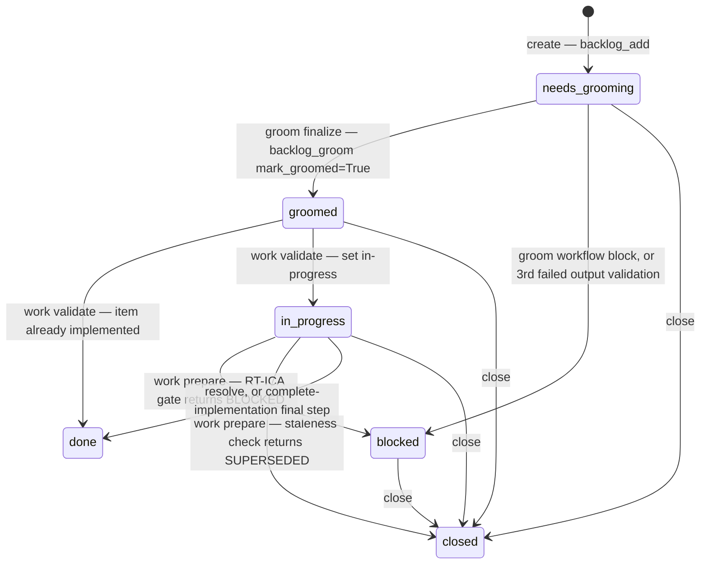
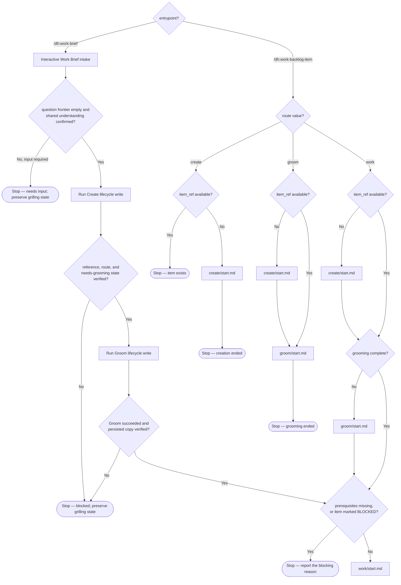

# Backlog Item Lifecycle — Canonical Reference

This document defines the desired item statuses, the route that writes each status, and the gates
between stages. Implementation conformance is audited against this contract; an observed gap
belongs in the backlog and does not weaken the contract.

## Consumer workflow

Use the configured backlog provider through the supported MCP tool or CLI operation. Treat
selectors, artifact references, and plan addresses as opaque strings: pass them back exactly as
returned.

Run the stages in order: create, groom, work, then close or resolve. Use `backlog_list` or
`backlog_view` for lookup. Use `backlog_update`, `backlog_groom`, `backlog_close`, and
`backlog_resolve` for lifecycle writes. Use `sam_plan` and `sam_task` (or the `plan` CLI) for plan
and task progress. Use `artifact_list` and `artifact_read` for artifact discovery and retrieval.

Completion criterion: the returned logical reference, status, and provider outcome are recorded;
a missing or unavailable result is reported with its warning/error metadata rather than replaced
with a guessed local value.

## Contributor boundary

Route every lifecycle read and write through `backlog_core.operations` and the routed backend
capability. Keep provider-specific identifiers, wire field names, timestamps, cache paths, and
reconciliation mechanics inside adapters.

---

## 1. Status Model

### Status writes

| Status | Operation that writes it | What the write does |
|---|---|---|
| `needs-grooming` | `backlog_add` | Creates the item. The local record stores `open`. On GitHub, the new issue carries the `status:needs-grooming` label. `backlog_list` reports `needs-grooming` for an item that has no status of its own |
| `groomed` | `backlog_groom(mark_groomed=True)` | Writes `groomed`. On an item with an issue, adds `status:groomed` and removes `status:needs-grooming`. The write does not check the current status |
| `in-progress` | `backlog_update(status='in-progress')` | Writes `in-progress`. On GitHub, adds `status:in-progress` and removes `status:needs-grooming` |
| `blocked` | `backlog_update(status='blocked')` | Writes `blocked`. Returns an error when the item has no issue reference (integer-ID backend) or no backend reference (string-ID backend) |
| `done` | `backlog_resolve` | Requires a summary. Writes `done`, sets priority to `completed`, and closes the provider issue with the evidence fields |
| `closed` | `backlog_close` | Requires a reason: `duplicate`, `out_of_scope`, `superseded`, `wontfix`, or `blocked`. Writes `closed` with `close_reason`, `close_reference`, and `close_comment`, and closes the provider issue |

`backlog_update` accepts two status values: `in-progress` and `blocked`. It rejects `done`,
`resolved`, and `closed` with an error that names `backlog resolve` and `backlog close`. It rejects
every other value as unrecognized. `needs-grooming` and `groomed` have no `backlog_update` path.

`resolved` and `completed` are read-only values. No operation writes them. `backlog_resolve`
treats an item whose status is `done`, `resolved`, or `completed` as already resolved.
`backlog_close` treats an item whose status is `closed` or `done` as already closed.

`backlog_update(verified=True)` applies the `status:verified` label. `verified` is a label, not a
status. The call applies no label to an item without an integer issue number.

`backlog_close` and `backlog_resolve` refuse to run when an open pull request references the
item's issue. `force=True` bypasses that check.

### Transitions made by the workflows

Mermaid state IDs use underscores. The status values use hyphens: `needs_grooming` is the status
`needs-grooming`.

The `work` pipeline gate in `dh:work-backlog-item` stops when the item is marked BLOCKED.

`dh:group-items-to-milestone` assigns the issue to a GitHub milestone and sets Project V2 Status to
`Backlog`. `dh:complete-milestone` adds the `status:done` label to each issue still open in the
milestone, closes the GitHub milestone, and sets Project V2 Status to `Done` for closed issues.

---

## 2. Pipeline Stages

`dh:work-backlog-item` is the entry point for provider-backed backlog routes. The skill coerces its own
arguments to `scripts/parser/parse.schema.json`. `scripts/parser/command-routes.json` maps each
route to its workflow file: `create`, `groom`, `work`, `close`, `resolve`, `setup-github`,
`progress`, and `resume`. `close` and `resolve` share `close/start.md`. An argument with an issue
reference or a title and no route word runs the `work` pipeline.

Pipeline order: `create` → `groom` → `work`. Before a target stage runs, the skill runs each
earlier stage whose output is missing.

`/dh:work-brief` is the entrypoint for an arbitrary conversation, interview, brainstorming session,
or backlog context. It is an offline, one-off workflow that follows `/dh:work-backlog-item` while
bypassing the configured backend to create a local-only item. It supports feature, bug-fix, and
documentation work in projects without a configured DH backend, and immediate work that should not
first be filed remotely. The resulting local item stores the Work Brief and follows the ordinary
Create → Groom → Work lifecycle.

Work Brief intake is a pre-lifecycle activity. It performs and verifies the normal Create and Groom
lifecycle writes, then enters Work. It does not bypass or add a lifecycle stage to the ordinary
`create` → `groom` → `work` order.

Interactive intake opens a scratch state file, names its exact path at the start of every grilling
response, and reads and updates it every turn. It establishes the observable current problem or
desired outcome and current relevance, then gathers only the clarification, discovery, research,
grilling, brainstorming, feasibility evidence, constraints, examples, and validation the request
needs. The state records settled decisions, answered and intentionally unresolved questions,
evidence references, concerns, and the remaining question frontier.

### Stage Definitions

| Activity or stage | Route | Workflow file | Output | Status write |
|---|---|---|---|---|
| Pre-lifecycle Work Brief intake | `/dh:work-brief` | Interactive intake | Verified local Work Brief ready for design, then entry to Work | `needs-grooming` from Create, then `groomed` from Groom |
| Create | `create` | `create/scope.md`, `create/start.md` | `item_ref` from `backlog_add` | `needs-grooming` |
| Groom | `groom` | `groom/start.md` | Groomed sections on the item | `groomed` |
| Work | `work` | `work/start.md` | Plan address on the item, written by `backlog_update(plan=...)` | `in-progress`, before any gate runs |

### Stage Transitions

Ready for design has the meaning defined in [CONTEXT.md](../CONTEXT.md). Operationally, intake
reaches it only after Create returns and verifies the reference, route, and `needs-grooming` state,
then Groom persists the normalized dataset and a read-back verifies it. Missing input records the
unanswered questions and ends `needs-input`; Create, Groom, persistence, or verification failure
ends blocked. Both outcomes preserve grilling state and claim no readiness.

### Checks inside the stages

- **Groom intake**: when `groomed` equals today's date and the required sections exist, intake
  returns DRIFT. The groom workflow runs `groom/groom-drift.md` and stops.
- **Work locate**: when the item already has a plan address, the work workflow runs
  `/dh:implement-feature` with that address and stops.
- **Work validate**: the workflow checks for an already-implemented item and resolves it. Then it
  sets the status to `in-progress`. Then it runs the discovery gate for an item with a linked
  issue and no `type:fix` or `type:bug` label.
- **Work prepare, auto-groom**: this step runs for every item. An ungroomed item runs the groom
  workflow. A groomed item runs a staleness check on its Impact Radius files: `FUNCTIONAL_DRIFT`
  re-grooms, `SUPERSEDED` closes the item as `superseded` and stops, `COSMETIC_ONLY` continues.
  The step treats an ambiguous result as `FUNCTIONAL_DRIFT`.
- **Work prepare, RT-ICA gate**: the gate runs `dh:rt-ica` again when the RT-ICA section is
  absent, has no date, has a date older than 7 calendar days, or is older than
  `metadata.updated_at`.
- **Work mode**: in interactive mode, the work workflow stops after planning and a summary. In
  auto mode, it runs `/dh:implement-feature` and `/dh:complete-implementation` with the plan
  address.

### Blocking Gates

| Gate | Location | Result when the gate blocks | Status write |
|---|---|---|---|
| RT-ICA `BLOCKED-FOR-PLANNING` | `groom/start.md` finalize step | Present the MISSING conditions, route to `groom/error.md` Workflow Block | `blocked` |
| Output validation, 3 failed attempts | `groom/finalize.md` | Stop | `blocked` |
| Discovery gate, no `feature-context` artifact after one retry | `work/validate.md` | Stop | None |
| RT-ICA gate BLOCKED | `work/start.md` Error Routing | Present the MISSING conditions, stop | `blocked` |
| Feasibility gate BLOCKED | `work/prepare.md` | Stop | None |
| `status:verified` label absent, item has a plan | `close/start.md` resolve path | Stop. `--force` bypasses this gate | None |
| Plan has unfinished tasks, item has a plan | `close/start.md` resolve path | Stop | None |
| Acceptance-criteria verification FAIL, item has a plan | `close/start.md` resolve path | Stop | None |

### RT-ICA decision tokens

The groom stage writes one of the three tokens that `dh:planner-rt-ica` owns:
`APPROVED-FOR-PLANNING`, `APPROVED-WITH-GAPS`, or `BLOCKED-FOR-PLANNING`. `groom/start.md` stops on
`BLOCKED-FOR-PLANNING`, continues on the other two, and routes any other token to `groom/error.md`.
The work stage's RT-ICA gate reads the groom tokens and the two `dh:rt-ica` tokens. Its token table
is in `work/rt-ica-gate.md`.

Ready for design is a Work Brief handoff gate. It does not rename or replace `status: groomed`,
`APPROVED-FOR-PLANNING`, `APPROVED-WITH-GAPS`, or `BLOCKED-FOR-PLANNING`.

### Quality gates before `status:verified`

`/dh:complete-implementation` applies the label in this order:

1. It runs a quality gate plan. With a feature plan, the plan has 7 tasks: T0 Multi-Perspective
   Review, T1 Code Review, T2 Feature Verification, T3 Integration Check, T4 Documentation Drift
   Audit, T5 Documentation Update, T6 Context Refinement. Without a feature plan, the proportional
   plan has 5 tasks and omits T0 and T6.
2. It runs the Completion Verification Gate after the dispatch loop.
3. It routes follow-up plans, then calls `backlog_update(verified=True)`. On the Beads backend it
   skips this call.
4. It commits the remaining changes and pushes them. The commit body carries `Fixes #NNN` when the
   item has a GitHub issue number.
5. After the push completes, it runs `backlog resolve`, which writes `done`.

---

## 3. State persistence and provider outcomes

Route lifecycle state through the configured `WorkItemBackend` and its optional `ContentProvider`
and `SyncProvider` capabilities. The provider owns the authoritative record.

In Beads-backed projects, use `bd` for native issue, status, dependency, readiness, label, notes,
and metadata operations. Use the MCP or CLI surface for operations that Beads does not provide.

### Providers

| Provider | Storage |
|---|---|
| `github` | GitHub issues, labels, and repository contents. Reads made while unauthenticated or network blocked can return `stale=True`. Writes made while unauthenticated or network blocked that the provider accepts return `pending=True` and queue for the next successful sync |
| `beads` | The `bd` CLI |
| `sqlite` | A local SQLite database file |
| `memory` | Process-local dicts and lists. A test double |

Local providers set `stale` and `pending` to false. Missing cached remote data raises
`ContentUnavailableError`. A revision mismatch raises `ContentConflictError`. A backend without the
capability raises `UnsupportedCapabilityError`. Handle each of these outcomes within the originally
selected provider.

The active-task context is an ephemeral session pointer. `/dh:start-task` writes it with
`active-task set`. `active-task clear` removes it.

### Backend selection

The backlog provider resolves in this order:

1. The `BACKLOG_BACKEND` environment variable.
2. The project `.dh/config.yaml`: `backlog.backend`, then `backend.name`.
3. The user `~/.dh/config.yaml`: `backlog.backend`, then `backend.name`.
4. The project `.beads/dh-backend` marker file, which selects `beads`.
5. `github`.

The supported identifiers are `github`, `memory`, `sqlite`, and `beads`. See
[Backend Providers](./backend-providers.md) for the Protocol reference, method groups, and
configuration.

The reserved `brief~<mandatory-2-3-word-slug>-<4-lowercase-hex>` prefix is the only
reference-level exception. It selects the existing project-local SQLite adapter without changing
the configured primary backend and never falls back remotely. All other references use the
resolution order above.

### Fields Stored Per Item

| Field | Set by | Description |
|---|---|---|
| `status` | The operations in Section 1 | Current status value |
| `priority` | `backlog_add`; `backlog_resolve` sets `completed` | `P0`, `P1`, `P2`, `Ideas`, or `completed` |
| `groomed` | Every `backlog_groom` content write | Date of the most recent groomed content write |
| `reference` | The provider, at create | Opaque logical item reference |
| `issue` | The provider adapter | Provider-native issue identifier, such as `#42` or a Beads ID |
| `plan` | `backlog_update(plan=...)` | Opaque SAM plan address. Pass it to `sam_plan` or `plan` unchanged |
| `milestone` | The provider issue | Milestone of the linked issue |
| `updated_at` | Reconciliation | Provider revision of the item |
| `close_reason`, `close_reference`, `close_comment` | `backlog_close` | Dismissal record |
| Groomed sections | `backlog_groom` | RT-ICA, Impact Radius, Fact-Check, and the other groomed sections |

### SAM plans and task addresses

Create a plan with `sam_plan(config={"action": "create", "slug": "<slug>", "goal": "<goal>",
"tasks": [...]})` or `plan create`. Read a task with `sam_task(plan="{plan_address}",
task="{task_id}", config={"action": "read"})` or `plan read --address {plan_address}/{task_id}`.
Find plans with `sam_plan(config={"action": "list", "search": "{search_term}"})` or
`plan list --search {search_term}`.

Write the returned plan address to the backlog item with
`backlog_update(selector='{item_ref}', plan='{plan_address}')`.

Plan creation atomically records the Plan address's selected backend and Work Brief reference. A
later operation with only a Plan address uses that binding and fails closed when it cannot resolve
it.

Completion criterion: every consumer-facing response preserves the selected provider's `stale`,
`pending`, warning, or error signal, and no route claims synchronization that the provider did not
acknowledge.

---

## 4. Route Reference

### Routes That Modify Item State

| Route or skill | Condition | Operation | Result |
|---|---|---|---|
| `work-backlog-item create` | No `item_ref` exists | `backlog_add` | New item, `needs-grooming` |
| `work-backlog-item groom` | Output validation passes | `backlog_groom(mark_groomed=True)` | `groomed` |
| `work-backlog-item groom` | Workflow Block or escalation in `groom/error.md` | `backlog update --status blocked` | `blocked` |
| `work-backlog-item groom` | Output validation fails 3 times | `backlog_update(status='blocked')` | `blocked` |
| `work-backlog-item work` | Validate finds the item already implemented | `backlog_resolve` | `done` |
| `work-backlog-item work` | Validate step, every run | `backlog_update(status='in-progress')` | `in-progress` |
| `work-backlog-item work` | RT-ICA gate BLOCKED | `backlog_update(status='blocked')` | `blocked` |
| `work-backlog-item work` | Staleness check returns `SUPERSEDED` | `backlog_close(reason='superseded')` | `closed` |
| `work-backlog-item work` | Planning returns a plan | `backlog_update(plan=...)` | Plan address on the item; no status change |
| `work-backlog-item close` | The user gives a reason | `backlog_close` | `closed` |
| `work-backlog-item resolve` | The resolve-path gates pass | `backlog_resolve` | `done` |
| `dh:complete-implementation` | Quality gates pass | `backlog_update(verified=True)`, commit, then `backlog resolve` | `status:verified` label applied; final commit pushed with `Fixes #NNN`; status=done |

---

## 5. Priority

`backlog_add` requires one of `P0`, `P1`, `P2`, or `Ideas`. On GitHub, the new issue carries a
`priority:{value}` label. `backlog_resolve` sets the priority to `completed`.

In `auto` mode, `work-backlog-item create` derives the priority:

- An explicit, valid user-provided priority wins.
- `P1` needs explicit urgency evidence, such as `critical`, `required`, `must`, or a priority flag.
- `nice to have` or `optional` gives `P2`.
- Every other input gives `P2`.
- `P0` needs the user to state `P0`.

---

## 6. Groomed Item Content

For an interactively normalized Work Brief, the existing `sections["groomed"]` / `GroomedData`
content layer owns the terminal grilling provenance: settled decisions, answered and intentionally
unresolved questions, evidence references, and concerns consumed by discovery, architecture, and
planning. The orchestrator reads the persisted content back and verifies complete conversion
without omission, duplication, or speculation. Only then is it the sole durable copy and the
scratch grilling file is deleted. No new top-level Entry-bearing section or parallel provenance
document is introduced.

### Required groomed sections

`groom/finalize.md` validates 8 required sections before it marks the item groomed: `RT-ICA`,
`Impact Radius`, `Fact-Check`, `Acceptance Criteria`, `Reproducibility`, `Issue Classification`,
`Priority`, and `Design Intent Alignment`. The minimum content of each section is in the "Required
sections and minimum content" table in that file.

When a required section is missing, the finalize step spawns the groomer again with the same model
and a prompt that names the missing sections. After the 3rd failed attempt, it sets the status to
`blocked` and stops. The groomer runs as `dh:backlog-item-groomer` on the sonnet model.

### Issue Classification types

`dh:classifier` writes one of five types:

| Type | Analysis |
|---|---|
| `procedural` | None |
| `recurring-pattern` | 6-sigma frequency analysis |
| `defect` | 5-whys root-cause analysis |
| `missing-guardrail` | None |
| `unbounded-design` | Design framing |

### RT-ICA section

`dh:rtica-assessor` owns the section format (`agents/rtica-assessor.md`, Phase 7). The section
carries a `Date: YYYY-MM-DD` line, a conditions table, and a plain `Decision:` line. Each condition
has one of three states: `AVAILABLE`, `DERIVABLE`, or `MISSING`. The work stage's staleness check
reads the `Date:` line.

---

## References

- For create, groom, work, close, and resolve procedures and gates, load `dh:work-backlog-item`,
  which routes to each stage.
- [Backend Providers](./backend-providers.md) — provider capabilities, configuration, and
  transport boundaries
