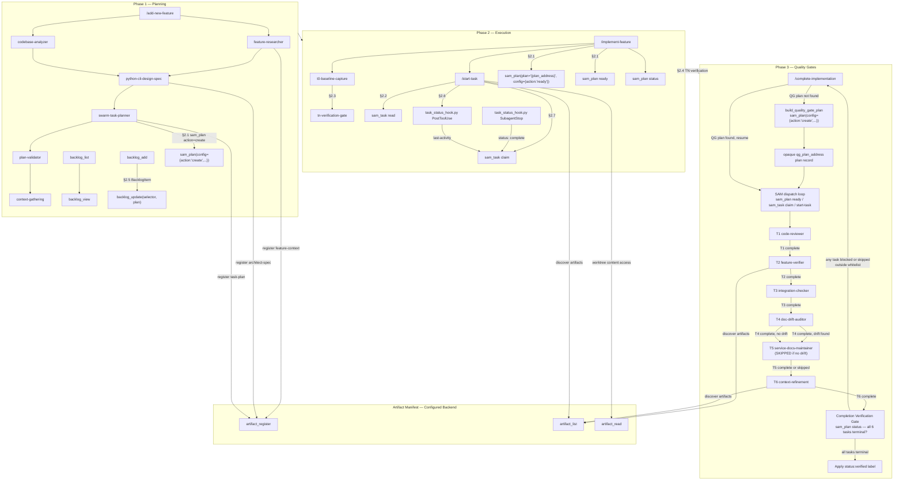
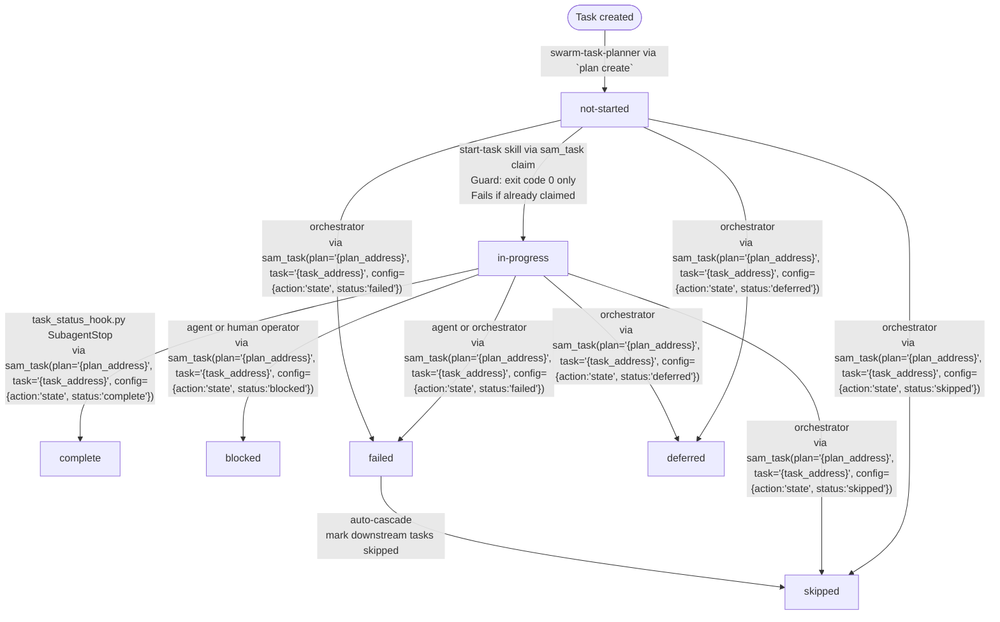
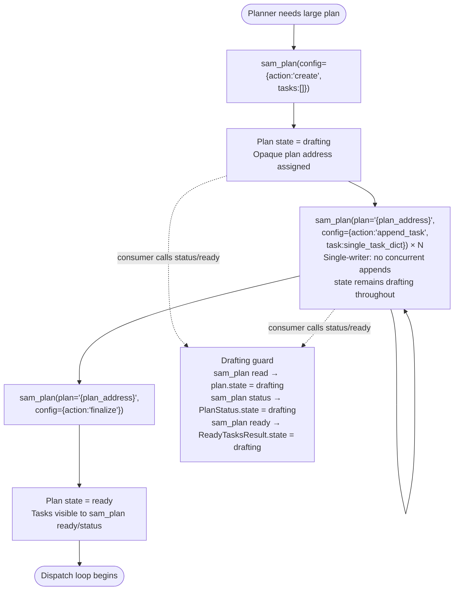
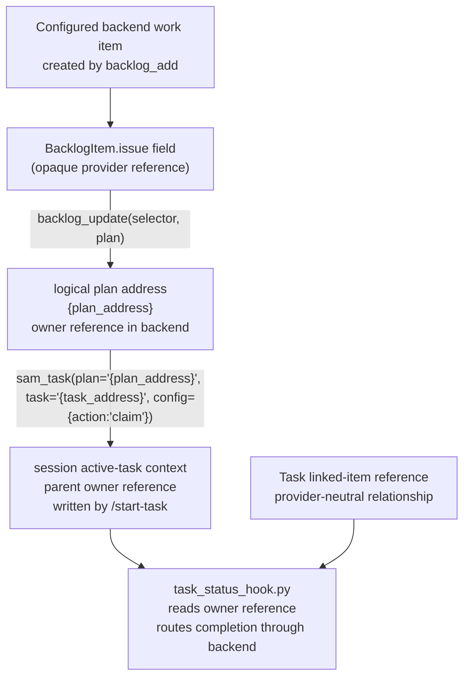
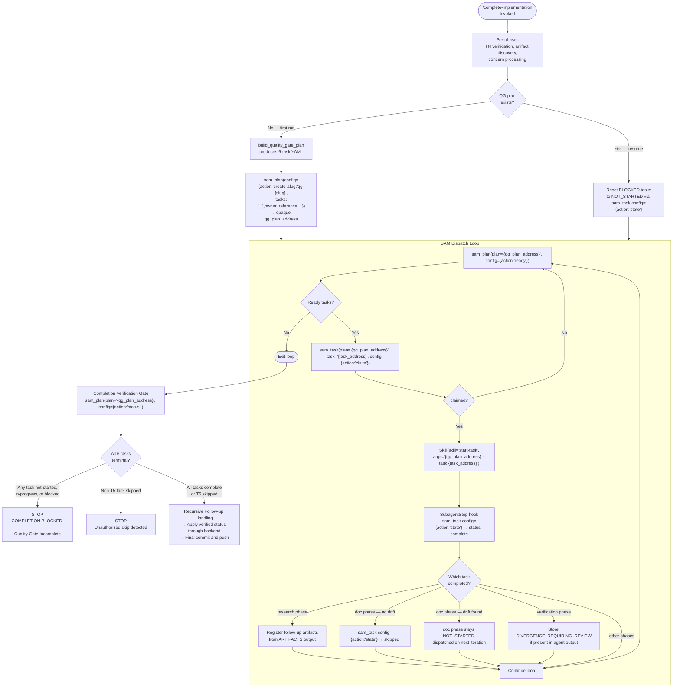

# Workflow Architecture Diagram

**Audience**: Contributor/developer reference for workflow contracts and data shapes. The
configured backend owns logical work items, grooming, plans, tasks, and artifacts; provider
storage details shown here are not caller-facing interfaces.

> **Snapshot**: 2026-08-12 (SAM-enforced quality gates and configured-backend storage)
>
> Sources: `plugins/development-harness/docs/TASK_FILE_FORMAT.md`, `backlog_core/server.py`, `backlog_core/models.py`,
> `plugins/development-harness/skills/implementation-manager/scripts/task_status_hook.py`,
> `plugins/development-harness/skills/complete-implementation/SKILL.md`
> Last verified: 2026-08-12

**Table of Contents**

- [1. Pipeline Overview](#1-pipeline-overview)
- [2. Data Structure Shapes](#2-data-structure-shapes)
- [3. Publisher-Consumer Map](#3-publisher-consumer-map)
- [4. SAM Task State Lifecycle](#4-sam-task-state-lifecycle)
- [4a. Incremental Plan Creation Lifecycle](#4a-incremental-plan-creation-lifecycle)
- [5. Cross-System Dependency Chain](#5-cross-system-dependency-chain)
- [6. Hook Trigger Conditions](#6-hook-trigger-conditions)
- [7. Quality Gate SAM Dispatch Flow](#7-quality-gate-sam-dispatch-flow)

---

## 1. Pipeline Overview



---

## 2. Data Structure Shapes

### 2.1 sam_plan ready output (ReadyTasksResult)

Output of the configured-backend plan-ready operation. For Beads-native readiness, prefer `bd ready --parent <bead-id> --json`; use the DH CLI adapter only when richer structured readiness is required.

```json
{
  "feature": "string (plan slug)",
  "ready_tasks": [
    {
      "task": "{task_address}",
      "title": "string",
      "agent": "string",
      "skills": ["skill-name"],
      "priority": 1,
      "complexity": "low|medium|high",
      "dependencies": []
    }
  ],
  "count": 3
}
```

### 2.1a sam_plan status output (PlanStatus + autonomy)

Output of the configured-backend plan-status operation. For Beads-native status, prefer `bd show <bead-id> --json` or `bd update`; use the DH CLI adapter for structured plan status.

```json
{
  "feature": "string (plan slug)",
  "total_tasks": 6,
  "by_status": {
    "not-started": 3,
    "in-progress": 1,
    "complete": 2
  },
  "ready_tasks": ["{task_address}"],
  "blocked_tasks": [],
  "completion_pct": 33.3,
  "has_cycles": false,
  "autonomy": "full_auto"
}
```

`autonomy` is surfaced from the `Plan` model (default `"full_auto"`). The `/implement-feature` Progress Loop reads this field to determine whether to dispatch all tasks without pausing (`full_auto`), pause after each dependency wave (`checkpoint`), or dispatch one task at a time with confirmation (`per_task`).

### 2.2 TaskAssignment (`sam_task` read for an opaque plan/task address)

Output of the configured-backend task-read operation. In a Beads workspace, use `bd show <bead-id> --json` for native task reads; use the DH CLI adapter for structured task addresses.

```json
{
  "plan_address": "{plan_address}",
  "plan_slug": "string",
  "plan_goal": "string",
  "plan_context": "string",
  "plan_acceptance_criteria": ["string"],
  "task": {
    "task": "{task_address}",
    "title": "string",
    "status": "not-started|in-progress|complete|blocked|deferred|skipped|failed",
    "agent": "string",
    "dependencies": ["{dependency_task_address}"],
    "priority": 1,
    "complexity": "low|medium|high",
    "skills": ["string"],
    "started": "ISO 8601 | null",
    "completed": "ISO 8601 | null",
    "last-activity": "ISO 8601 | null",
    "linked_item_reference": "opaque | null",
    "is-bookend": "bool | null",
    "bookend-type": "t0-baseline|tn-verification | null",
    "body": "markdown string"
  }
}
```

### 2.3 T0 Baseline Artifact (configured backend)

Written by `t0-baseline-capture` agent. Array of per-criterion capture records.

```yaml
- criterion_id: "AC1"
  check_command: "uv run pytest tests/"
  exit_code: 1
  stdout: "string"
  stderr: "string"
```

### 2.4 TN Verification Artifact (configured backend)

Written by `tn-verification-gate` agent. Array of `BookendVerification` records. No top-level verdict field.

```yaml
- criterion_id: "AC1"
  check_command: "uv run pytest tests/"
  t0_exit_code: 1
  tn_exit_code: 0
  status: "passed|regressed|pre-existing-fail|newly-passing"
  stdout_diff_summary: "string"
```

`/complete-implementation` aggregates the verdict by scanning all records for `status: regressed`.

### 2.5 BacklogItem fields (backlog_core/models.py `BacklogItem`)

Relevant fields for the pipeline:

```json
{
  "title": "string",
  "priority": "P0|P1|P2|Ideas",
  "description": "string",
  "source": "string",
  "item_type": "Feature|Bug|Refactor|Docs|Chore",
  "issue": "string (provider work-item reference, or empty)",
  "plan": "string (logical plan address) | empty string"
}
```

### 2.6 Active-task context (session-scoped)

Written by `/start-task` skill via `active-task set --address "{plan_address}/{task_address}"` (CLI) or `mcp__plugin_dh_sam__sam_active_task(config={"action":"set","plan":"{plan_address}","task":"{task_address}"})` (MCP) — both write the same session-scoped context.
Read by `task_status_hook.py` PostToolUse handler.

```json
{
  "plan": "{plan_address}",
  "task_id": "{task_address}",
  "owner_reference": "work-item-719"
}
```

`owner_reference` is omitted when the plan is unlinked. The hook treats absence as `None` and
skips owner synchronization.

> **Storage note**: Set and clear this context with `active-task` or `sam_active_task`; its
> session storage is an implementation detail and is not a plan or artifact provider.

### 2.7 sam_task claim output

Output of the SAM MCP task-claim operation. In a Beads workspace, use `bd update <bead-id> --status in_progress` for native status; use the DH CLI adapter when claiming structured SAM tasks.

```json
{
  "claimed": true,
  "task_id": "{task_address}",
  "started": "2026-03-15T13:00:00Z"
}
```

Exit code 1 when: already claimed, task not found, or `status != not-started`.

---

## 3. Publisher-Consumer Map

| Artifact | Publisher | Consumer(s) |
|----------|-----------|-------------|
| `feature-context` artifact | `feature-researcher` | `python-cli-design-spec`, `swarm-task-planner` |
| `codebase-analysis` artifact | `codebase-analyzer` | `swarm-task-planner` |
| `architect` artifact | `python-cli-design-spec` | `swarm-task-planner`, executing agents via `/start-task` |
| `{plan_address}` plan record | `swarm-task-planner` via `sam_plan(config={"action":"create", ...})` (monolithic) or the same action followed by `append_task` × N → `finalize` (incremental) | `/implement-feature`, `sam_plan` ready/status actions, all execution agents |
| `T0-baseline` artifact | `t0-baseline-capture` | `tn-verification-gate` |
| `TN-verification` artifact | `tn-verification-gate` | `/complete-implementation` Pre-Phase 1 check |
| `{qg_plan_address}` plan record | `/complete-implementation` via `build_quality_gate_plan` + `sam_plan(config={"action":"create", ...})` | SAM dispatch loop (T1–T6 quality gate tasks) |
| session active-task context | `/start-task` skill | `task_status_hook.py` PostToolUse handler |
| `last-activity` field in task | `task_status_hook.py` PostToolUse handler | progress reporting |
| `status: complete`, `completed` field | `task_status_hook.py` SubagentStop handler | ``plan ready` readiness evaluation |
| `status: in-progress`, `started` field | `sam_task claim` via `/start-task` | `sam_plan status`, `sam_plan ready` exclusion |
| Follow-up task files | `code-reviewer` | `/complete-implementation` recursion gate |
| Context Manifest in task file | `context-gathering`, `context-refinement` | executing agents, future sessions |
| Artifact manifest (configured backend) | Producer agents via `artifact_register` | Consumer agents via `artifact_list`, worktree agents via `artifact_read` |

---

## 4. SAM Task State Lifecycle



Readiness rule: a task is ready when `status == not-started` AND all dependency task IDs have successful status. Successful statuses: `complete`, `deferred`. Terminal statuses for lifecycle/completion checks: `complete`, `deferred`, `skipped`, `failed`.

---

## 4a. Incremental Plan Creation Lifecycle

Plans with 16+ tasks should use the incremental append workflow instead of a single monolithic
`create` call. The plan passes through a `drafting` intermediate state that prevents partial
plans from being dispatched.



**Key invariants**:

- `state="drafting"` is set by `create` when `tasks=[]` (empty task list).
- `state="ready"` is set by `create` when `tasks` contains at least one task definition (monolithic path).
- `append_task` leaves `state` unchanged — it never transitions drafting → ready.
- `finalize` is the only operation that transitions `drafting` → `ready`.
- Single-writer assumption: `append_task` is not required to be atomic under concurrent writers.
  Callers must serialize writes to the same logical plan through the configured backend.

---

## 5. Cross-System Dependency Chain

The work-item owner reference propagates through these fields:



Key invariant: the plan owner reference identifies the work item, while the task linked-item
reference identifies the task relationship. The hook uses both relationships through the same
configured backend; neither field selects storage.

---

## 6. Hook Trigger Conditions

Script: `plugins/development-harness/skills/implementation-manager/scripts/task_status_hook.py`

Hook input arrives via stdin as JSON. The hook reads `hook_event_name` to route.

### 6.1 SubagentStop

```text
Trigger:    hook_event_name == "SubagentStop"
Matcher:    (none — fires on every sub-agent completion)
Context:    Declared on /implement-feature skill and /complete-implementation skill
```

Processing sequence:

1. Read `prompt` field from hook input (falls back to `tool_input.prompt`).
2. Parse prompt for `/start-task <path> --task <id>` or `Skill(skill="start-task", args="<path> --task <id>")` pattern.
3. If no match, read the session-scoped active-task context.
4. If still no match, exit 0 silently (not a `/start-task` sub-agent).
5. Call `sam_task(plan="{plan_address}", task="{task_address}", config={"action":"state", "status":"complete"})` via the FastMCP CLI subprocess; on MCP failure, exit 0 (best-effort).
6. Call `sam_task(plan="{plan_address}", task="{task_address}", config={"action":"update", "set_fields":{"completed": <ISO timestamp>}})` via the FastMCP CLI subprocess.
7. Clear the session-scoped active-task context.

Backend synchronization is the responsibility of the configured backend (see [Backend Providers](./backend-providers.md)) — not the hook. The hook is backend-agnostic and only routes status writes through the SAM MCP server.

Fields written: `status: complete`, `completed: <ISO timestamp>`

### 6.2 PostToolUse (Write|Edit|Bash)

```text
Trigger:    hook_event_name == "PostToolUse"
            AND tool_name in {"Write", "Edit", "Bash"}
Matcher:    Write|Edit|Bash
Context:    Declared on /start-task skill
```

Processing sequence:

1. Read `session_id` from hook input. If absent, exit 0.
2. Read the session-scoped active-task context. If absent, exit 0.
3. Resolve the logical plan address and task ID from context.
4. Read the current task via `sam_task(plan="{plan_address}", task="{task_address}", config={"action":"read"})`. If `status == complete`, return without writing.
5. Call `sam_task(plan="{plan_address}", task="{task_address}", config={"action":"update", "set_fields":{"last-activity": <ISO timestamp>}})`.

Fields written: `last-activity: <ISO timestamp>`

Guard: skipped silently when task status is already `complete`.

---

## 7. Quality Gate SAM Dispatch Flow

The `/complete-implementation` skill enforces quality gates via a SAM-based dispatch loop. Each of the 6 phases is a task in a dedicated plan returned by the configured backend. The phase dependency chain enforces ordered execution. No phase can start until the previous phase's task reaches terminal status.



### Skip Whitelist

Only T5 (Documentation Update) may have `status: skipped`. Skipping is triggered by the orchestrator via `sam_task` with `config={"action":"state","status":"skipped"}` immediately after T4 completes with no drift findings. All other tasks must reach `status: complete`.

### QG Plan File Location

The quality-gate plan record is created by `sam_plan(config={"action":"create", ...})` through the configured backend. The
returned opaque `{qg_plan_address}` is passed to all subsequent `sam_plan` and `sam_task` calls:
`sam_plan(plan="{qg_plan_address}", config={"action":"ready"})`,
`sam_task(plan="{qg_plan_address}", task="{task_address}", config={"action":"claim"})`,
`sam_task(plan="{qg_plan_address}", task="{task_address}", config={"action":"state"})`, and
`sam_plan(plan="{qg_plan_address}", config={"action":"status"})`. Do not infer a numeric
sequence or filesystem path from the address.

---

## Related Documents

Read these together to get the full system picture:

- [Default Development Flow](../skills/development-harness/references/default-development-flow.md) — S1-S7 stage sequencing, ARL touchpoint gates
- [Artifact Conventions](../skills/development-harness/references/artifact-conventions.md) — naming, file layout, cross-referencing
- [Plan Artifact Lifecycle](./plan-artifact-lifecycle.md) — immutable vs mutable artifacts, divergence detection
- [Backlog Item Lifecycle](./backlog-item-lifecycle.md) — end-to-end issue journey from creation to closure
- [Task File Format](./TASK_FILE_FORMAT.md) — task field reference, authorized writers, sam CLI (snapshot — verify against `models.py` for planning)
- [Beads and workflow usage](./beads-and-workflow-usage.md) — provider-native versus structured workflow routing
- [Domain model source](../sam_schema/core/models.py) — authoritative field definitions (`Task` class)
