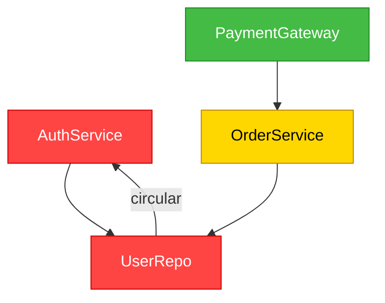

# Architecture Audit — Module Dependency Graph

Generates a Mermaid module-dependency graph with severity color-coding from import/include analysis of the project source. Registers the result as a `codebase-analysis` artifact.

## When to Invoke

Invoke when:

- A task explicitly asks for an architecture review, dependency graph, or coupling analysis
- Circular dependencies need to be detected and visualized
- Module-level coupling must be communicated visually to stakeholders
- Running as part of a broader code review that requires structural analysis

Do NOT invoke for:

- Line-level code quality findings — use `dh:code-review-python`, `dh:code-review-typescript`, etc.
- Test quality analysis (out of scope for this skill)

## SOP (Architecture Audit)

<workflow>

### Step 1: Discover Source Modules

**1a. Probe for AST / knowledge-graph tools**

Before falling back to Glob, check whether a richer indexing skill is available in the current session. Try each probe in order and stop at the first success:

| Tool | Probe command | What it provides |
|---|---|---|
| `ccc` (CocoIndex Code) | `ccc search --limit 1 module imports` | Semantic index of modules, paths, and relationships already built from the codebase |
| `graphify` (global CLI, PyPI: `graphifyy`) | `which graphify` | AST knowledge graph via tree-sitter — local extraction, no API calls for code; outputs `graphify-out/graph.json` + `GRAPH_REPORT.md` |

**If `ccc` is available and initialized:**

1. Run a broad semantic search to enumerate the primary source modules:

   ```bash
   ccc search --limit 50 "module definition class function"
   ccc search --limit 50 "import dependency package"
   ```

2. Collect the returned file paths — these form the initial module set. Deduplicate and normalize to relative paths from the project root.
3. For each module file returned, also check its immediate file-level neighbors with a targeted search:

   ```bash
   ccc search --path '<module_dir>/*' --limit 20 "imports dependencies"
   ```

4. Merge all discovered file paths into the candidate module list and proceed to Step 1b for any gaps.

**If `graphify` is available (globally installed via `uv tool install graphifyy` / `pipx install graphifyy`):**

1. Probe availability: `which graphify` (or `graphify --version`). If not found, skip this branch.

2. Check whether `graphify-out/graph.json` already exists in the project root.
   - If it **does**, use it directly (it may have been committed to the repo for team use). Treat it as fresh unless it is older than 24 hours or the working tree has uncommitted source file changes, in which case run step 3.
   - If it **does not**, continue to step 3.

3. Build the graph (AST extraction is local — no API calls required for code files):

   ```bash
   graphify . --no-viz
   ```

   `--no-viz` skips the HTML output and produces only `graphify-out/graph.json` and `graphify-out/GRAPH_REPORT.md`.

4. Query the graph to enumerate modules and their dependency edges:

   ```bash
   graphify query "list all source code files and their import dependencies"
   graphify query "show circular imports and highly coupled modules"
   ```

   Also read `graphify-out/GRAPH_REPORT.md` — it summarizes **god nodes** (most-connected modules), **surprising connections**, and confidence-tagged relationships (`EXTRACTED`, `INFERRED`, `AMBIGUOUS`).

5. Use the graphify output to directly populate the module list (Step 1b candidate set), the import edges (Step 2), and the coupling/cycle pre-analysis (Steps 3–4). Only fall back to Grep for intra-project import parsing on nodes where graphify reported `AMBIGUOUS` confidence.

**1b. Glob-based fallback (always run if 1a produced < 20 modules or no tool was available)**

Use `Glob` to enumerate source files. Exclude generated code, vendor trees, and build artifacts:

| Language | Include patterns | Exclude |
|---|---|---|
| Python | `**/*.py` | `**/test_*.py`, `**/__pycache__/**`, `**/.venv/**` |
| TypeScript / JS | `**/*.ts`, `**/*.tsx`, `**/*.js`, `**/*.mjs` | `**/node_modules/**`, `**/dist/**`, `**/.next/**` |
| Go | `**/*.go` | `**/vendor/**` |
| Rust | `**/*.rs` | `**/target/**` |
| Java / Kotlin | `**/*.java`, `**/*.kt` | `**/build/**`, `**/target/**` |

**Merge** Glob results with any paths already discovered in Step 1a, deduplicate, then limit the combined set to at most **200 modules**. If more exist, restrict to the top-level source directories and note the exclusion in the report.

### Step 2: Parse Import Relationships

For each module, use `Grep` to extract import/include/require statements:

| Language | Grep pattern |
|---|---|
| Python | `^(import\|from\s+\S+\s+import)` |
| TypeScript / JS | `^(import\s\|const .* = require\()` |
| Go | `"` inside `import (…)` blocks |
| Rust | `^(use\|mod\s)` |
| Java / Kotlin | `^import\s` |

Map each import to its source module. Only record **intra-project** imports — ignore stdlib and third-party packages. A dependency exists when module A imports module B and B is in the discovered module set.

Normalize identifiers to short PascalCase labels for graph readability (e.g., `src/api/handler.ts` → `ApiHandler`, `auth/users.py` → `AuthUsers`).

### Step 3: Detect Circular Dependencies

Perform DFS cycle detection over the dependency adjacency list:

1. Build `{module → [imported modules]}`.
2. For each unvisited node run DFS, tracking the recursion stack.
3. A back-edge (target is already in the recursion stack) marks a cycle — record every module in it as **critical**.

Also compute in-degree + out-degree for each node:

- Degree ≥ 10 → **high-coupling** (warning) unless also critical.
- All others → **clean**.

### Step 4: Color-Code Nodes

| Class | Condition | Fill | Stroke |
|---|---|---|---|
| Critical | Participates in a circular dependency | `#FF4444` | `#CC0000` |
| Warning | Degree ≥ 10 (not critical) | `#FFD700` | `#B8860B` |
| Clean | No circular dep, degree < 10 | `#44BB44` | `#228822` |

### Step 5: Emit the Mermaid Flowchart

Produce a `flowchart TD` block. Rules:

- Each edge `A --> B` means A imports B.
- Circular back-edges are annotated: `A -->|circular| C`.
- Every node gets a `style` directive with its class fill/stroke colors.
- Limit to **50 nodes** maximum. If the graph exceeds 50 nodes, show the highest-degree and all critical nodes only, and note the truncation.
- Node IDs are short camelCase — no spaces or special characters.

Example structure (illustrative, not literal output):

````markdown

````

### Step 6: Assemble and Register the Report

Assemble the markdown report (see Output Format below).

Register via MCP when `issue_number` is available:

```text
mcp__plugin_dh_backlog__artifact_register(
  issue_number={issue_number},
  type="codebase-analysis",
  artifact_id="architecture-graph-{slug}",
  content={report_markdown},
  status="complete",
  agent="code-review-architecture"
)
```

If `issue_number` is not available, output the report inline and note that artifact registration was skipped.

</workflow>

## Output Format

````markdown
# Architecture Audit — Module Dependency Graph

**Scope:** {language} — {N} modules analyzed

---

## Dependency Graph


---

## Findings

### 🔴 Circular Dependencies (Critical)

| Cycle | Modules Involved |
|---|---|
| Cycle 1 | `ModuleA → ModuleB → ModuleA` |

### 🟡 High-Coupling Modules (Warning)

| Module | In-Degree | Out-Degree | Total Degree |
|---|---|---|---|
| `ServiceFacade` | 8 | 5 | 13 |

### 🟢 Clean Modules

{N} modules with no circular dependencies and total degree < 10.

---

## Summary

**Total modules analyzed:** {N}
**Circular dependency participants:** {count} — Critical
**High-coupling modules:** {count} — Warning
**Clean modules:** {count}

{One paragraph describing overall architecture health and the most important findings.}
````

## Color Legend

| Color | Meaning | Recommended Action |
|---|---|---|
| 🔴 Red (`#FF4444`) | Circular dependency — breaks build tooling, causes runtime errors, prevents safe refactoring | Break the cycle by extracting shared types to a common module or applying dependency inversion |
| 🟡 Yellow (`#FFD700`) | High coupling (degree ≥ 10) — high change-propagation risk | Extract a façade or split responsibilities across smaller modules |
| 🟢 Green (`#44BB44`) | Clean — no circular dependency, low coupling | No action required |
