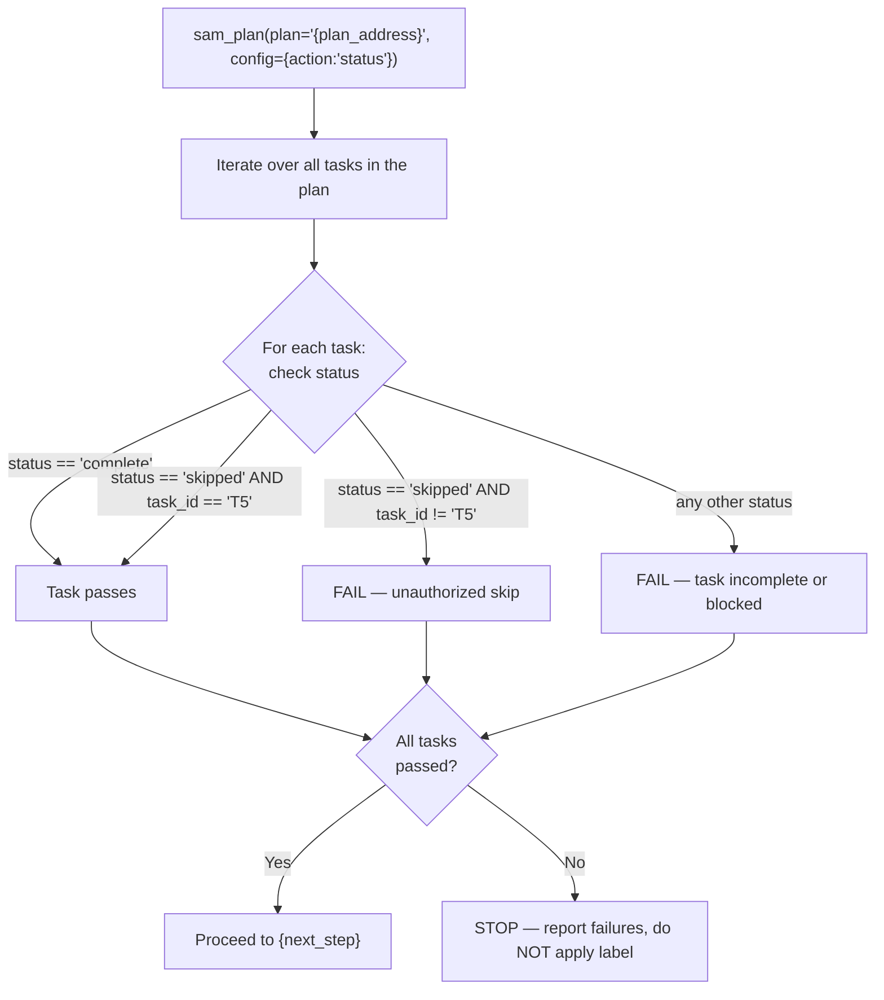

# Completion Verification Gate

Shared procedure for both the Proportional Quality Gates path and the full SAM path. The caller
supplies `{plan_address}` (`{pqg_plan_address}` or `{qg_plan_address}`), `{gate_name}` (for the
failure banner), `{resume_arg}` (for the re-run command), and `{next_step}` (what "Proceed" leads
to).

After the dispatch loop exits, verify all tasks in the plan reached terminal status before allowing
label application:

```bash
uv run "${CLAUDE_PLUGIN_ROOT}/sam_schema/cli.py" plan status --plan-address "{plan_address}"
```



**Skip whitelist**: ONLY T5 (Documentation Update) may have `status: skipped`. Any other task with
`status: skipped` is an unauthorized skip — treat as a failure.

**On verification failure**, output:

```text
COMPLETION BLOCKED — {gate_name}

Failed tasks:
  {task_id} ({phase_name}): status={status}
  [repeat for each failing task]

To resume: re-run /complete-implementation {resume_arg}
BLOCKED tasks will be reset to NOT_STARTED automatically.
```

Stop. Do not apply the `status:verified` label.

**On verification success**, proceed to `{next_step}`.
