# Migration Fidelity Sign-Off Gate

> [!IMPORTANT]
> When provided a process map or Mermaid diagram, treat it as the authoritative procedure. Execute steps in the exact order shown, including branches, decision points, and stop conditions.
> A Mermaid process diagram is an executable instruction set. Follow it exactly as written: respect sequence, conditions, loops, parallel paths, and terminal states. Do not improvise, reorder, or skip steps. If any node is ambiguous or missing required detail, pause and ask a clarifying question before continuing.
> When interacting with a user, report before acting the interpreted path you will follow from the diagram, then execute.

The following diagram is the authoritative procedure for Pre-Phase 1a Migration Fidelity Sign-Off. Execute steps in the exact order shown, including branches, decision points, and stop conditions.

```mermaid
flowchart TD
    %% Detection phase — scan three signal sources before gate activates
    D1["Check issue title for migration keywords:<br>'migrat', 'convert format', 'replace .md',<br>'format conversion', 'move from', 'transition from'"]
    D1 --> D2["Check issue body/description for same keywords"]
    D2 --> D3["For each task in the plan, call<br>sam_task(plan='{plan_id}', task='{task_id}', config={action:'read'})<br>and check acceptance_criteria field<br>for: 'delete', 'remove source',<br>'after migration complete', 'drop the source'<br>Note: acceptance_criteria is a direct str field on Task model"]
    D3 --> Signal{"Any migration signal found<br>across issue title, body, or task criteria?"}
    Signal -->|"No signal found"| Skip(["Skip gate — proceed to Artifact Discovery"])
    Signal -->|"Signal found — gate activates"| Fid1{"Evidence exists (verification summary or commit SHA)<br>that fidelity check ran on REAL production records<br>(not only synthetic fixtures) with zero data loss?"}
    Fid1 -->|"Confirmed"| Fid2
    Fid1 -->|"Unconfirmed"| CollectF1["Record: Fidelity check on real data — unconfirmed"]
    CollectF1 --> Fid2
    Fid2{"Content completeness verified field-by-field<br>(not only structural validity — loads without error)?"}
    Fid2 -->|"Confirmed"| Fid3
    Fid2 -->|"Unconfirmed"| CollectF2["Record: Content completeness verified — unconfirmed"]
    CollectF2 --> Fid3
    Fid3{"All distinct values of constrained fields<br>enumerated from real data before migration<br>and all handled in target model?"}
    Fid3 -->|"Confirmed"| Fid4
    Fid3 -->|"Unconfirmed"| CollectF3["Record: Constrained field values enumerated — unconfirmed"]
    CollectF3 --> Fid4
    Fid4{"Deletion deferred OR occurred only after<br>zero-data-loss confirmation?"}
    Fid4 -->|"Confirmed"| AllConfirmed{"Any unconfirmed items recorded<br>in this pass?"}
    Fid4 -->|"Unconfirmed"| CollectF4["Record: Deletion deferred or confirmed — unconfirmed"]
    CollectF4 --> AllConfirmed
    AllConfirmed -->|"No — all confirmed"| Proceed(["Proceed to Artifact Discovery"])
    AllConfirmed -->|"Yes — unconfirmed items remain"| Blocked["COMPLETION BLOCKED — Migration Fidelity Gate<br>List each unconfirmed item<br>To unblock: run verify_migration_fidelity.py against real production data<br>and read the verdict from its JSON summary, never from a report path<br>OR provide a commit SHA showing completeness assertion ran on real files<br>Do NOT build QG plan, dispatch T1, or apply SAM state until resolved"]
```



## On-Block Output

When `AllConfirmed` routes to `Blocked`, emit:

```text
COMPLETION BLOCKED — Migration Fidelity Gate

Unconfirmed items:
- [list each unchecked item]

To unblock: run `uv run "${CLAUDE_PLUGIN_ROOT}/scripts/verify_migration_fidelity.py"` against real
production data and report its JSON summary. A pass — `classification_counts.CONTENT_LOSS` of 0 and `errors` of 0, exit status 0 —
confirms items 1 and 2. Alternatively, a commit SHA showing the completeness assertion was run on
real files is accepted.

Read the verdict from that summary. Do not accept a filesystem path to a report as the evidence,
and do not open one: a path that resolves where the script ran does not resolve here, so the gate
reads nothing and passes on an empty file.
```

Do NOT build the QG plan, dispatch T1, or apply any SAM state until all items above are confirmed.
