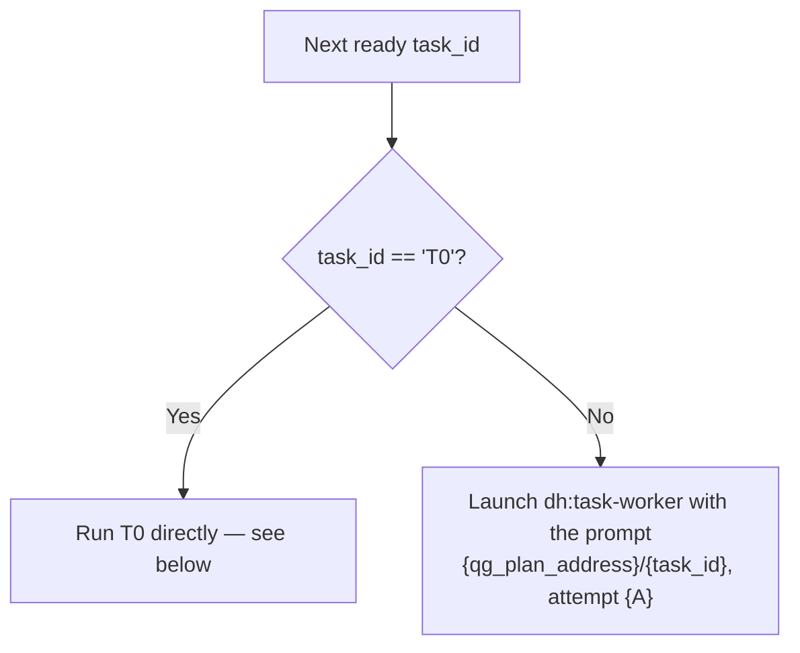

# QG dispatch step

Load `dh:dh-cli-usage` before using `<sam_cli/>` or `<dh_scripts/>`.

Step 2 of the SAM Dispatch Loop in `complete-implementation`: how one quality-gate task is opened,
run, settled and judged. Steps 1 and 3 stay in the skill body.

**2. Dispatch the task:**



**T1-T6 — delegate:** open the attempt, then launch `dh:task-worker`:

```bash
<sam_cli/> plan dispatch --address "{qg_plan_address}/{task_id}"
```

`dispatch` prints the attempt number, sets the task in-progress and starts its lease. Launch
`dh:task-worker` with the dispatch line as its entire prompt:

```text
{qg_plan_address}/{task_id}, attempt {A}
```

The worker runs `dh:start-task`, which appends the report sections and closes the attempt with
`plan finish`. The SubagentStop hook reads the dispatch line to settle the attempt. Send only the dispatch line as the prompt.

`leased` means a runner already holds this task and `not-ready` means its dependencies have not
landed — either way take the next ready task. Any other code stops the loop.

When the delegated run returns, record what came back and judge it:

```bash
<sam_cli/> plan settle \
  --address "{qg_plan_address}/{task_id}" --attempt {A} --return-text "{what came back}"
<sam_cli/> plan read --address "{qg_plan_address}/{task_id}"
```

Accept when the phase's criteria hold — `plan accept --address "{qg_plan_address}/{task_id}"
--note "{why}"` — and send it back otherwise with `plan reclaim --reason judge --response "{what to
change}"`. The full judge table is [the work loop](../../docs/work-ledger/work-loop.md).

**T0 — run it directly, in your own context; do not delegate it.** Its agent is
`dh:multi-perspective-review (orchestrated)` — a workflow that already dispatches its own
reviewers, so a delegated worker would only add a hop to reach the same call.

1. Commit any outstanding changes (`git add -A && git commit ...`).
2. Read the plan row and look for the starting commit — the plan row's `base_sha` when it carries
   one, else `**Implementation base SHA**: <sha>` in its `context` (`implement-feature`'s "Record
   the Implementation Base SHA" step):

   ```bash
   <sam_cli/> plan status --plan-address {plan_address}
   ```

   If neither is there, or if `git cat-file -e "<sha>"` fails (the commit no longer resolves),
   stop:

   ```text
   COMPLETION BLOCKED — No Implementation Base SHA

   This plan has no recorded starting commit for T0's diff review. Every ref-based substitute
   (a branch name, a merge-base) can silently miss commits once this plan's own work reaches
   origin/main — falling back to one would report success without reviewing everything changed.

   To resume: determine the correct starting commit and record it on the plan's context —
   plan update --plan-address {plan_address} --set context="**Implementation base SHA**:
   <sha>\n\n{existing context}" — then re-run /complete-implementation. Setting context
   replaces the whole field, so carry the existing text through. If that answers that the
   ledger holds no such plan, the plan was never imported; use --context in place of --set
   context= to write the content store instead.
   ```

   Do not proceed to Step 1 (no QG plan is created); do not apply `status:verified`.
3. Run the workflow (name it in prose) with `--diff "<sha>..HEAD"`, adding `--issue {item_ref}`
   when known.

You are the runner for this task, so open and close its attempt yourself. `dispatch` before the
workflow runs — it is what sets the task in-progress and holds it against a second dispatch:

```bash
<sam_cli/> plan dispatch --address "{qg_plan_address}/T0"
```

Afterwards, append the two report sections for that attempt and close it:

```bash
<sam_cli/> plan update \
  --plan-address "{qg_plan_address}" --task-id T0 --attempt {A} \
  --append-section "Completion Report" --section-content "{the review summary}"
<sam_cli/> plan update \
  --plan-address "{qg_plan_address}" --task-id T0 --attempt {A} \
  --append-section "Verification Results" --section-content "{per-perspective verdicts, or none}"
<sam_cli/> plan finish \
  --address "{qg_plan_address}/T0" --attempt {A} --result complete --note "{the verdict}"
```

Then continue to Step 3 of the Dispatch Loop exactly as for any other completed task. Moving the status directly
is not a shortcut here: `plan state --new-status in-progress` is refused as `status-invalid`,
because opening an attempt is what puts a task in progress.


Resolve `<sam_cli/>` and `<dh_scripts/>` through `dh:dh-cli-usage`.
