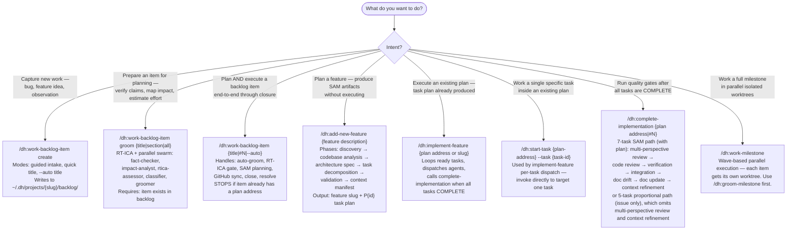
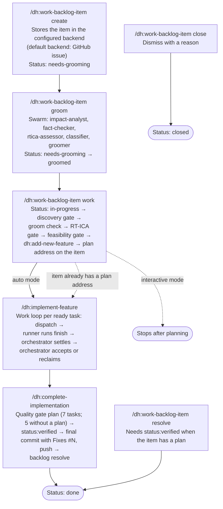

# Development Harness — Plugin Overview and Skill Router

This skill routes to the correct entry point for the development lifecycle. Read it to decide which skill to invoke — not to execute work.

## SAM Workflow Pipeline

```text
/dh:add-new-feature  ──>  /dh:implement-feature  ──>  /dh:complete-implementation
   (planning)            (execution loop)         (quality gates)
```

---

## What This Plugin Provides

The development-harness plugin implements the structured development lifecycle for tracked backlog items. It spans capture through verified closure using a chain of skills backed by the configured backlog backend provider as the source of truth and `~/.dh/projects/{slug}/` as the local state directory. The repository's default configuration currently selects GitHub Issues.

**Skills available:** `/dh:work-backlog-item`, `/dh:add-new-feature`, `/dh:implement-feature`, `/dh:complete-implementation`, `/dh:gate-push`, `/dh:work-milestone`

Plugin-level source copies exist at `plugins/development-harness/skills/` for each skill.

---

## Skill Router — "I want to do X"



---

## Lifecycle — Creation to Verified Closure



**Key invariants:**

- When the item already has a plan address, `/dh:work-backlog-item` runs `/dh:implement-feature` with that address and stops.
- When the RT-ICA gate returns BLOCKED, `/dh:work-backlog-item` sets the item status to `blocked` and stops.
- Only the final commit in `/dh:complete-implementation` carries the `Fixes #N` trailer; task-level commits during `/dh:implement-feature` omit it.
- The SubagentStop hook settles an attempt that the orchestrator did not settle. The hook writes no task status.
- For an item with a plan, `/dh:work-backlog-item resolve` requires the `status:verified` label. The `--force` flag bypasses this check.

---

## Quick Decision Reference

| Situation | Skill |
|---|---|
| Item does not exist yet | `/dh:work-backlog-item create` |
| Item exists, not yet groomed | `/dh:work-backlog-item groom {title}` |
| Item is groomed, no plan yet | `/dh:work-backlog-item {title}` |
| Item has a plan address | `/dh:implement-feature {plan address or slug}` |
| Plan is executing, one task needs focus | `/dh:start-task {plan} --task {id}` |
| All tasks complete, run quality gates | `/dh:complete-implementation {plan address}` |
| Issue number, no plan | `/dh:complete-implementation #{N}` (proportional gates) |
| Groomed item, skip to planning directly | `/dh:add-new-feature {description}` then `/dh:implement-feature` |
| Full milestone in parallel worktrees | `/dh:groom-milestone` then `/dh:work-milestone` |
| Dismiss without completing | `/dh:work-backlog-item close {title}` |
| Mark completed with evidence | `/dh:work-backlog-item resolve {title}` |
