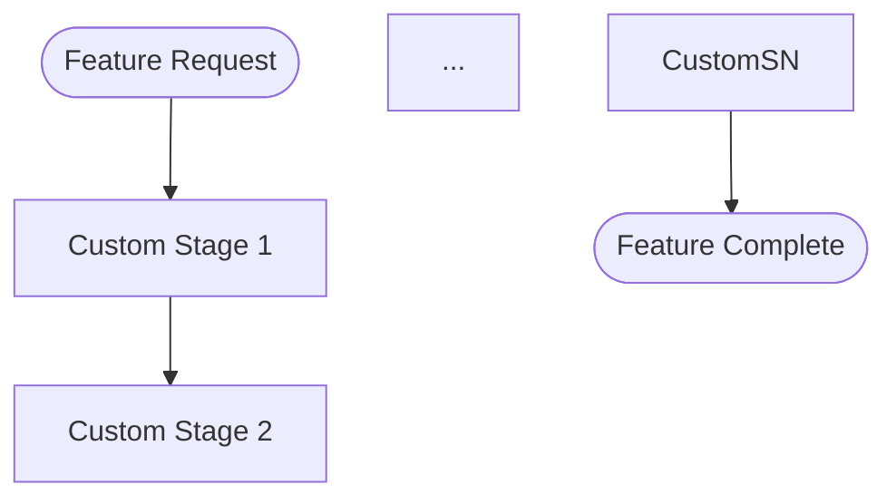

# Language Manifest Schema

The schema for language plugin manifests that compose with the development harness. Language plugin authors create a `manifests/{name}/language-manifest.yaml` file (matching `LanguageManifest` in `plugins/development-harness/scripts/manifest_schema.py`) in their plugin's directory to declare quality gates and project detection rules.

---

## Inherits from Layer 0

Language manifests extend Layer 0 (SDLC-agnostic). They do **not** redefine:

- SAM 7-stage pipeline
- Human touchpoint model
- Artifact conventions
- RT-ICA, verification protocol
- Task record schema

See [docs/sdlc-layers/layer-0/](../../../docs/sdlc-layers/layer-0/). Layer 0 gates apply before role resolution.

---

## Sections

A language manifest contains three required sections and optional sections (Conventions, Process Flow Override).

Agent resolution (architect, test-designer, code-reviewer, design-spec, linting roles) is **not** a manifest section — the harness resolves those at runtime via `profile_list()`, matching task content against every installed agent's own declared capability. See [./role-resolution-protocol.md](./role-resolution-protocol.md). A manifest declaring which agents a plugin provides was the old mechanism and no longer applies; nothing reads a "Role Fulfillment" section.

### 1. Quality Gates (Required)

Declares the commands the harness runs at quality checkpoints.

**Format:**

```markdown
## Quality Gates

- format: `{format command} {files}`
- lint: `{lint command} {files}`
- typecheck: `{typecheck command} {files}`
- test: `{test command}`
- standards: /{plugin}:{standards-skill}
```

**Rules:**

- Commands use backtick-wrapped syntax
- The `{files}` placeholder is replaced with the actual files being checked
- The `test` gate does not take a `{files}` placeholder (runs entire test suite)
- The `standards` gate is optional and references a skill for language-specific standards enforcement
- Commands must be runnable from the project root directory
- **Non-typed languages**: Use `typecheck: (none)` to skip the typecheck gate (e.g., Bash, Perl without strict typing)
- **`live_validation`**: Optional. Declares the command that demonstrably exercises the changed functionality through the real delivery path (not tests). The command must invoke the actual runtime — not test imports or mocked surfaces. When absent, the feature-verifier must flag it as a gap in the verification report. Commands have a 120-second timeout; if the command does not complete within that window, `check_live_validation()` returns `GAPS_FOUND` with a timeout `gap_message` rather than `PASS` or `FAIL`.

**`live_validation` examples by language and delivery surface:**

- MCP server (Python): `` `uv run fastmcp call --command "uv run python scripts/run_server.py" --target health_check --input-json '{}'` ``
- CLI tool (Go): `` `go run ./cmd/mytool --version` ``
- Web service (TypeScript): `` `curl -sf http://localhost:3000/health` ``
- Library (Ruby): `` `ruby -e "require './lib/mylib'; puts MyLib::VERSION"` ``
- Compiled binary (C): `` `./build/mytool --smoke-test` ``
- Web system (agent-browser required): `agent-browser`

Set `live_validation: agent-browser` when the delivery surface is a web system that requires a browser to exercise. The feature-verifier will defer to the `/agent-browser` skill and record `DEFERRED_BROWSER` status rather than failing.

Set `live_validation: claude-skill` when the changed functionality is a Claude Code skill, agent, or plugin component that can only be exercised inside a Claude Code session. The feature-verifier records `DEFERRED_SKILL` status and does not invoke `run_live_validation_skill.py` — the script must be run externally after verification completes. This is not flagged as a gap.

**Example:**

```yaml
live_validation: "claude-skill"
```

---

### 2. Project Detection (Required)

Declares how the harness identifies this language in a project.

**Format:**

```markdown
## Project Detection

- markers: {comma-separated list of config files}
- source-patterns: {comma-separated glob patterns for source files}
- test-patterns: {comma-separated glob patterns for test files}
```

**Rules:**

- Markers are filenames (not paths) that identify the language when found in project root
- Source patterns use standard glob syntax without quotes
- Test patterns identify test files for coverage analysis
- At least one marker must be declared

---

### 3. Conventions (Optional)

Declares language-specific standards for naming, structure, testing, and documentation.

**Format:**

```markdown
## Conventions

- naming: {rules array}
- structure: {rules array}
- testing: {rules array}
- documentation: {rules array}
```

**Schema:**

Each convention category has `rules` (array of strings) and optional `examples` (array of strings).

```yaml
conventions:
  naming:
    rules: ["Use snake_case for functions", "Use PascalCase for classes"]
    examples: ["get_user_by_id", "UserService"]
  structure:
    rules: ["Source in src/", "Tests in tests/"]
  testing:
    rules: ["Test file naming: test_*.py or *_test.py"]
  documentation:
    rules: ["Docstrings for public APIs"]
```

---

### 4. Process Flow Override (Optional)

Replaces the default SAM pipeline with a language-specific flow.

**Format:**

```markdown
## Process Flow Override

(none — uses default harness flow)
```

Or, to declare a custom flow:

````markdown
## Process Flow Override


````

**Rules:**

- Must be a valid mermaid flowchart if declared
- Must produce artifacts compatible with standard naming conventions
- Must include at least one human touchpoint gate
- Must end with a verification stage producing CERTIFIED/NOT_CERTIFIED verdict
- Write `(none — uses default harness flow)` to explicitly use the default

---

## Complete Example — Python

```markdown
# Language Manifest: Python

## Quality Gates

- format: `uv run ruff format {files}`
- lint: `uv run ruff check {files}`
- typecheck: `uv run mypy {files}`
- test: `uv run pytest tests/ --tb=short`
- standards: (a language-specific standards skill, if the plugin has one)

## Project Detection

- markers: pyproject.toml, setup.py, setup.cfg
- source-patterns: src/**/*.py, **/*.py
- test-patterns: tests/**/*.py, test_*.py, *_test.py

## Process Flow Override

(none — uses default harness flow)
```

---

## Skeleton Example — TypeScript

```markdown
# Language Manifest: TypeScript

## Quality Gates

- format: `npx prettier --check {files}`
- lint: `npx eslint {files}`
- typecheck: `npx tsc --noEmit`
- test: `npx vitest run`
- standards: (a language-specific standards skill, if the plugin has one)

## Project Detection

- markers: package.json, tsconfig.json
- source-patterns: src/**/*.ts, src/**/*.tsx
- test-patterns: tests/**/*.test.ts, **/*.spec.ts

## Process Flow Override

(none — uses default harness flow)
```

---

## Skeleton Example — Rust

```markdown
# Language Manifest: Rust

## Quality Gates

- format: `cargo fmt -- --check`
- lint: `cargo clippy -- -D warnings`
- typecheck: `cargo check`
- test: `cargo test`

## Project Detection

- markers: Cargo.toml
- source-patterns: src/**/*.rs
- test-patterns: tests/**/*.rs

## Process Flow Override

(none — uses default harness flow)
```

---

## Skeleton Example — Bash (Non-Typed)

```markdown
# Language Manifest: Bash

## Quality Gates

- format: `shfmt -w {files}`
- lint: `shellcheck {files}`
- typecheck: (none)
- test: `bats tests/`
- standards: (a language-specific standards skill, if the plugin has one)

## Project Detection

- markers: Makefile, .bashrc, *.sh
- source-patterns: **/*.sh, scripts/**/*
- test-patterns: tests/**/*.bats, **/test_*.sh

## Process Flow Override

(none — uses default harness flow)
```

---

## Skeleton Example — Perl (Non-Typed)

```markdown
# Language Manifest: Perl

## Quality Gates

- format: `perltidy -b {files}`
- lint: `perlcritic {files}`
- typecheck: (none)
- test: `prove -r t/`
- standards: /perl-development:perl-standards

## Project Detection

- markers: Makefile.PL, cpanfile, META.json
- source-patterns: lib/**/*.pm, script/**/*
- test-patterns: t/**/*.t

## Process Flow Override

(none — uses default harness flow)
```

---

## Validation Rules

When the harness loads a manifest, it validates:

1. **Structure** — All required sections present (Quality Gates, Project Detection)
2. **Gate commands** — Each command is backtick-wrapped and contains a recognizable command
3. **Markers** — At least one detection marker is declared
4. **Flow override** — If present, is valid mermaid syntax (parsed but not executed during validation)

Validation failures produce warnings but do not block the pipeline. The harness falls back to `dh:task-worker` (no specialist profile) for any section that fails validation.

---

## Sources

- Role resolution protocol: [./role-resolution-protocol.md](./role-resolution-protocol.md)
- Language manifest template: [../../templates/language-manifest-template.md](../../templates/language-manifest-template.md)
- Layer 1 overview: [docs/sdlc-layers/layer-1/layer-1-overview.md](../../../docs/sdlc-layers/layer-1/layer-1-overview.md)

---

`stage_skills` (mapping SDLC stages to domain skills for dispatch to `generic-stage-agent`) was
removed: that agent and its dispatch pipeline (`manifest_resolver.py`, `dispatch_helper.py`) were
built as a proof of concept in March 2026 and never got a live caller — see
[SDLC Stage Naming Taxonomy](./sdlc-stage-taxonomy.md) for what remains valid.

---

## See Also

- [SDLC Stage Naming Taxonomy](./sdlc-stage-taxonomy.md) — canonical stage names and `{domain}-{sdlc-stage}` naming convention
