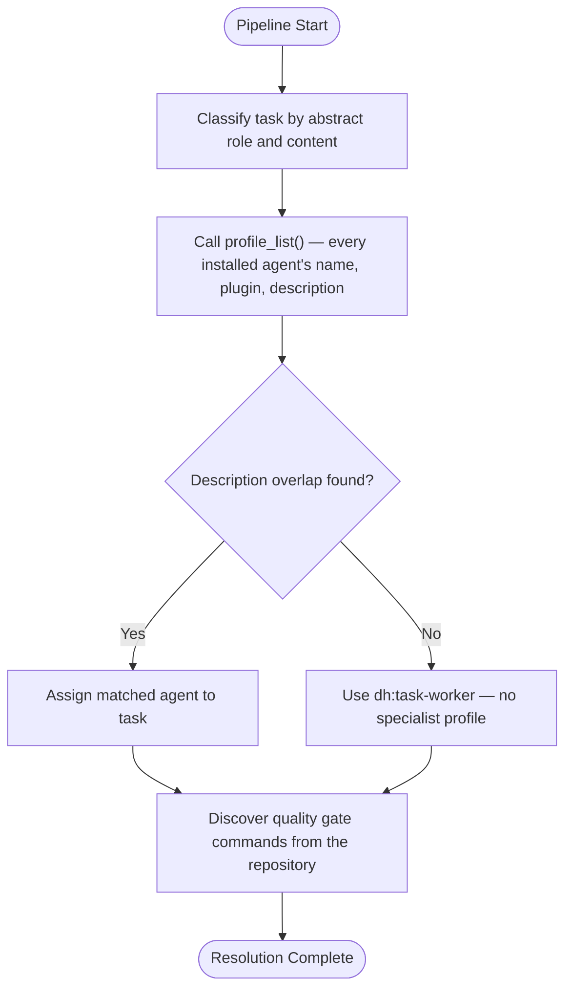

# Agent Resolution Protocol

How the development harness resolves abstract roles to concrete agents at runtime.

---

## Overview

The harness defines abstract roles (architect, test-designer, code-reviewer, design-spec, linting). It resolves each role by calling `mcp__plugin_dh_backlog__profile_list()` — which enumerates every installed agent's declared `name`, `plugin`, and `description` across every plugin, live, with no configuration file to maintain — and matching the role plus the task's actual content (title, requirements, file paths) against those descriptions. Whichever agent's declared capability has the strongest overlap is assigned. No configuration file, hardcoded table, or plugin name is baked into this protocol; installing a new language plugin's agent makes it selectable the next time `profile_list()` is called.

**Layer 0 gates apply before role resolution.** RT-ICA, human touchpoint model, artifact conventions, and verification protocol are enforced before the harness resolves roles. See [docs/sdlc-layers/layer-0/](../../../docs/sdlc-layers/layer-0/).

---

## Resolution Process

---

## Step 1 — Classify the Task

Identify the abstract role a task needs and gather its actual content (title, requirements, file paths) to match against.

**Abstract roles:**

- **architect** — Responsible for design decisions, interface definitions, module structure. Consulted during S2 (Planning) and S4 (Task Decomposition).
- **test-designer** — Responsible for test strategy, test case generation, coverage analysis. Consulted during S4 (Task Decomposition) and S5 (Execution).
- **code-reviewer** — Responsible for code quality review, pattern compliance, idiom enforcement. Consulted during S6 (Forensic Review).
- **design-spec** — Responsible for design specification documents and architectural decision records. Consulted during S2 (Planning).
- **linting** — Responsible for code formatting and linting orchestration. Consulted during S5 (Execution) quality gates.

---

## Step 2 — List Installed Agents

Call `mcp__plugin_dh_backlog__profile_list()` with no `plugin` filter. It scans every `plugins/*/agents/**/*.md` across all installed plugins and returns each one's `name`, `plugin`, `description`, `model`, and `skills` — the live, zero-maintenance capability index. Nothing to keep in sync; a newly installed plugin's agents appear on the next call.

---

## Step 3 — Resolve Roles

Match the role from Step 1 and the task's actual content against the `description` fields returned by Step 2. Assign whichever agent's declared capability has the strongest overlap.

**Resolution rules:**

- If an agent's description plausibly matches, assign it
- If no agent's description matches, fall back to `dh:task-worker` for that role (no specialist profile loaded)
- If the architecture spec specifies an agent explicitly, use that instead of matching

**Dispatch routing rule:**

Record the resolved agent name in the task's `agent:` field, then choose the dispatch target with the decision in `dh:dispatch-contract`. The orchestrator passes only the task reference. The stored value stays plugin-qualified (`plugin:agent-name`).

---

## Step 4 — Discover Quality Gates

Find the command for each gate type in the repository. Check these sources in order:

1. The pre-commit config (`.pre-commit-config.yaml`) or another git hook.
2. The CI workflow (for example, `.github/workflows/*.yml`).
3. The build config: `package.json` scripts, `pyproject.toml`, `Makefile`, or `Cargo.toml`.

**Gate types:**

- **format** — Code formatting check/fix (e.g., `uv run ruff format {files}`)
- **lint** — Static analysis (e.g., `uv run ruff check {files}`)
- **typecheck** — Type checking (e.g., `uv run mypy {files}`)
- **test** — Test execution (e.g., `uv run pytest tests/`)
- **standards** — Language-specific standards skill (e.g., `/python-engineering:stinkysnake`)

**Fallback gates (no source names the command):**

When no source names a gate command, use the default for the detected file types:

- `.py` files detected — `ruff format`, `ruff check`, `mypy`, `pytest`
- `.ts`/`.js` files detected — `prettier`, `eslint`, `tsc`, `jest` or `vitest`
- `.rs` files detected — `cargo fmt`, `cargo clippy`, `cargo test`
- `.go` files detected — `gofmt`, `go vet`, `go test`

---

## Error Handling

**No matching agent:** If no installed agent's description plausibly matches a role, log a warning and dispatch `dh:task-worker` for that role (no specialist profile loaded). The harness does not block on a resolution miss.

**`profile_list()` failure or empty result:** Dispatch `dh:task-worker` for every role and note the failure in the S1 discovery artifact.

**No gate command found:** Use the fallback gates from Step 4.

---

## Sources

- Default development flow: [./default-development-flow.md](./default-development-flow.md)
