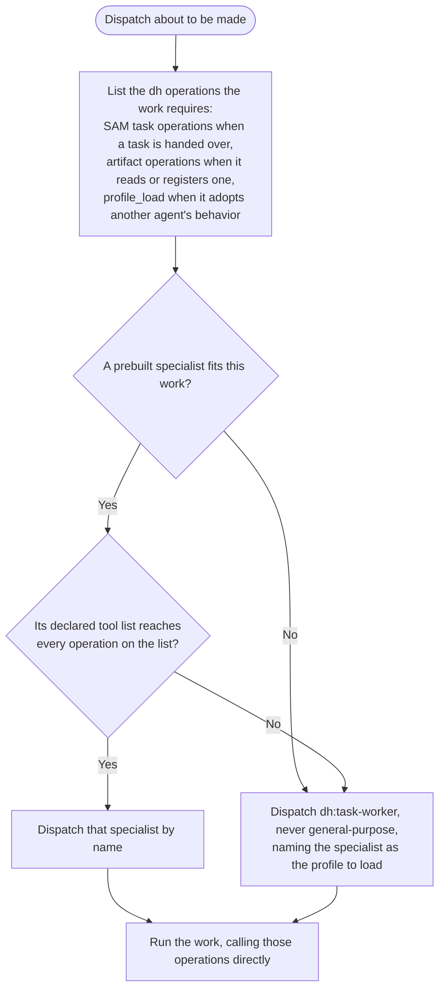

# Dispatch Contract

This contract governs execution. Follow it whenever you dispatch work in a dh workflow or execute
a task you were dispatched to run.

## Dispatch role vocabulary

- Orchestrator — the agent that dispatches. It chooses a dispatch target by fit and passes a task
  reference (plan address plus task ID). It does not read the task's `agent:` field to route.
- Task executor — the dispatched agent. It owns the complete SAM lifecycle for that task: claim,
  execute, write state back.
- Agent profile — specialist behavior an agent loads into itself, named either by the task's
  `agent:` field or by the dispatch prompt. A profile is behavior, not a dispatch target.

## Choose the dispatch target

Every dispatch resolves the same way. Name the operations the dispatched agent will have to call,
then dispatch an agent that can reach all of them.

Read the required operations off the dispatch itself — what it hands over, and what its prompt
instructs the agent to do. This does not depend on knowing the dispatching workflow's own stage or
position.

- It hands over a plan address and a task ID for execution: the agent claims the task, registers it
  as active, and writes its state back, so it needs `sam_plan`, `sam_task`, `sam_active_task`, and
  the ability to load `dh:start-task`.
- Its prompt reads an input artifact or registers its output as one: `artifact_read`,
  `artifact_list`, `artifact_register`.
- It names a specialist whose behavior the dispatched agent has to adopt rather than already being:
  `profile_load`.
- It calls none of these — an independent reviewer whose finding is its response, a contract check
  run after a task closes: the list is empty.

Then choose the target against that list:

- A prebuilt specialist that fits the work and whose declared tool list covers every operation on
  the list is the target. Dispatch it by name, and pass the task reference when there is one. Both
  the dh agent roster and any agents the consuming harness supplies are candidates, and an empty
  list leaves any fitting specialist viable.
- A specialist that fits the work but cannot reach every operation on the list is not a dispatch
  target. Dispatch `subagent_type="dh:task-worker"` and name that specialist in the prompt for the
  worker to load through `profile_load`. The specialist's behavior still arrives; the operations
  arrive with the worker.
- No specialist fits, and a generic agent is what you would otherwise reach for: dispatch
  `subagent_type="dh:task-worker"` in its place. Never dispatch `general-purpose` from a dh skill
  or extension point — it has no SAM or backlog tool access, so it cannot claim a task or write its
  state back, and that failure is silent. `dh:task-worker` is the same blank canvas arriving with
  the dh tools and skills the workflow needs, and it loads the specialist named by the task's
  `agent:` field as a profile.

Read a candidate's declared tool list rather than inferring reach from its name. The dh roster
declares the SAM and artifact operations; agents published by other plugins — a language plugin's
design or implementation specialists — generally declare none of them, so a fitting specialist from
another plugin usually reaches the work as a profile rather than as a dispatch target.

Each unreachable operation fails silently in its own way. A specialist missing the SAM task
operations produces output but never claims or closes the task, so the plan never advances and the
work stays invisible to every later stage. One missing the artifact operations cannot read its
inputs or register its output, so the next stage reads nothing where it expected a deliverable.
Routing work that requires no operations at all through `dh:task-worker` is the same error
inverted: the worker looks up a profile and runs `start-task` instead of performing the review, so
the review never happens and its finding is lost.

## A task's `agent:` field is not a routing directive

That field is read by the dispatched agent after dispatch, not by the orchestrator before it.
Reading it as a routing instruction and dispatching that name directly is the most common way this
contract gets broken. Choosing a target by fit is a different act: it weighs what the work needs
against what each available agent can do, and never depends on the task's stored `agent:` value.

When adding a dispatch step to any dh skill, reference file, or workflow document, apply the same
check: list the operations the step requires, then ask whether a prebuilt specialist both fits the
work and reaches all of them. Name that specialist when it does. Write
`subagent_type="dh:task-worker"` wherever the fitting specialist falls short of that list — naming
it as the profile to load — and wherever a generic agent would otherwise be named.

## Artifacts and plans are logical records, not files

Plans, tasks, and system artifacts live in the configured backend. Address them logically; the
backend owns physical storage, and its layout is not part of this contract.

- Store a document artifact with `artifact_register`, always including its content. Registering an
  identifier without content persists nothing.
- Read a document artifact with `artifact_read`; discover what exists with `artifact_list`.
- Create, read, and update plans and task state through the SAM plan and task operations. Never
  duplicate plan content into an artifact.
- Never construct, read, or write a filesystem path for a plan, task, or system artifact. A path
  that resolves in one worktree does not resolve in another, so a path-based handoff silently
  produces an empty read for the next stage instead of an error.

Use the `Write` tool only for deliverables that belong in the consuming repository — source code,
tests, and documentation files that get committed. Everything else is an artifact.

## Before signaling completion

- Task state was written back through the SAM task operation, not only described in prose.
- Every result a later stage needs is readable through an artifact or plan operation, with no
  filesystem path in the handoff.
- Anything blocking was reported as blocked rather than worked around with an assumption.

For the specialist role boundaries and the DONE/BLOCKED signaling format that apply on top of this
contract, load `dh:subagent-contract`.
