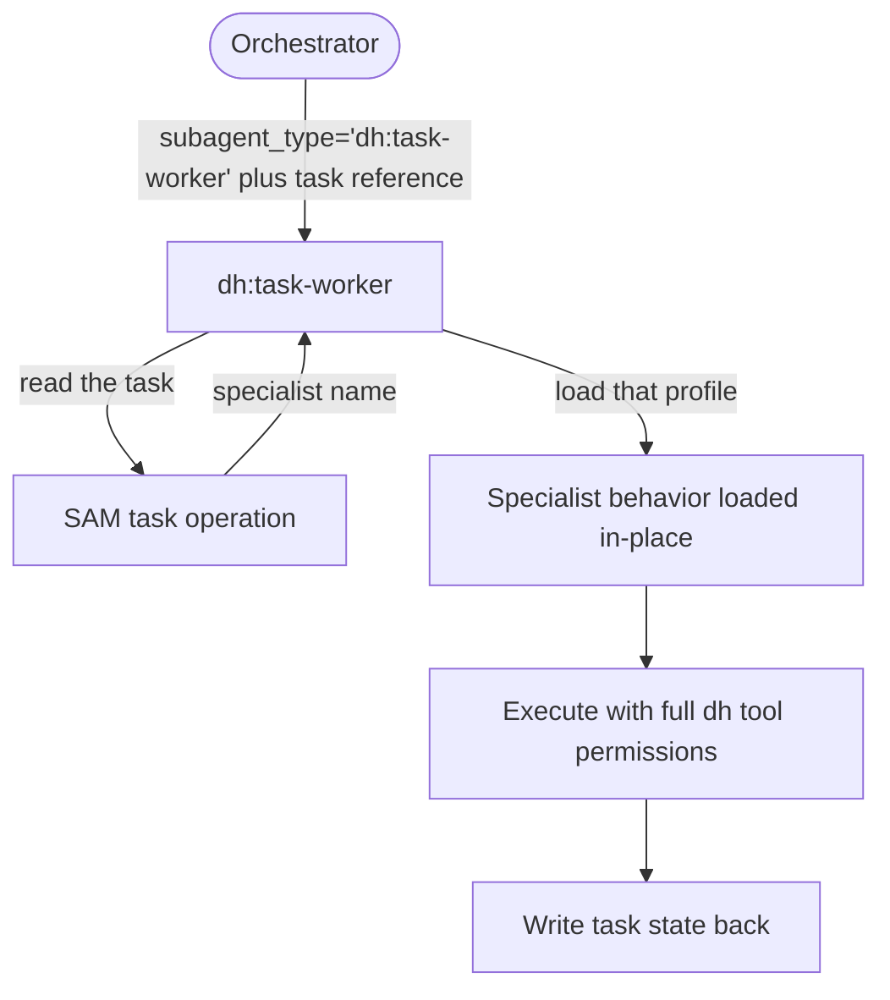

# Dispatch Contract

This contract governs execution. Follow it whenever you dispatch work in a dh workflow or execute
a task you were dispatched to run.

## Dispatch role vocabulary

- Orchestrator — the agent that dispatches. It passes only a task reference (plan address plus
  task ID). It does not choose a specialist and does not read task content to route.
- Task-worker — the dispatched agent (`dh:task-worker`). It reads the task, resolves the
  specialist profile, and owns the complete SAM lifecycle for that task: claim, execute, update
  state.
- Agent profile — specialist behavior the task-worker loads into itself. A profile is behavior,
  not a dispatch target.

## Dispatch `dh:task-worker` to execute a SAM task

Decide which shape a dispatch is before choosing its `subagent_type`: does it hand over a plan
address plus a task ID and expect the dispatched agent to claim that task, do the work, and write
the task's state back? That question is observable at dispatch time from what the dispatch passes
— it does not depend on knowing anything about the dispatching workflow's own position or stage.

If yes — the dispatch is handing over a SAM task for execution — dispatch
`subagent_type="dh:task-worker"` always. No task type, complexity level, or specialist role
changes this. `dh:task-worker` carries the dh tool permissions the SAM lifecycle requires.
Dispatching any other subagent type for a SAM task execution strands the task: the dispatched
agent can produce output but cannot claim the task or write its state back, so the plan never
advances and the work stays invisible to every later stage.

If no — the dispatch is an independent reviewer verifying already-completed work, a contract check
run after a task closes, or any other verifier with no SAM task of its own to claim — keep the
dispatch's own named agent. Routing this shape through `dh:task-worker` makes the worker look up
the completed task's specialist profile and re-run `start-task` instead of performing the review,
so the review or verification never happens and its output is silently lost.

## A task's `agent:` field is not a routing directive

That field is read by the task-worker after dispatch, not by the orchestrator before it. Reading
it as a routing instruction and dispatching that name directly is the most common way this
contract gets broken.

When adding a dispatch step to any dh skill, reference file, or workflow document, apply the same
question: is a plan address and task ID being handed over for execution? If yes, write
`subagent_type="dh:task-worker"` and pass the task reference — let the task's own specialist field
select the specialist. If no, name the specific agent the dispatch requires.

## Artifacts and plans are logical records, not files

Plans, tasks, and system artifacts live in the configured backend. Address them logically; the
backend owns physical storage, and its layout is not part of this contract.

- Store a document artifact with `artifact_register`, always including its content. Registering an
  identifier without content persists nothing.
- Read a document artifact with `artifact_read`; discover what exists with `artifact_list`.
- Create, read, and update plans and task state through the SAM plan and task operations. Never
  duplicate plan content into an artifact.
- Never construct, read, or write a filesystem path for a plan, task, or system artifact. A path
  that resolves in one worktree does not resolve in another, so a path-based handoff silently
  produces an empty read for the next stage instead of an error.

Use the `Write` tool only for deliverables that belong in the consuming repository — source code,
tests, and documentation files that get committed. Everything else is an artifact.

## Before signaling completion

- Task state was written back through the SAM task operation, not only described in prose.
- Every result a later stage needs is readable through an artifact or plan operation, with no
  filesystem path in the handoff.
- Anything blocking was reported as blocked rather than worked around with an assumption.

For the specialist role boundaries and the DONE/BLOCKED signaling format that apply on top of this
contract, load `dh:subagent-contract`.
