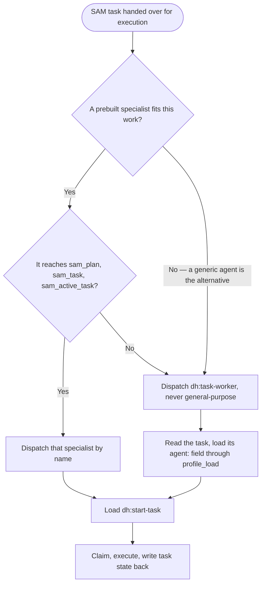

# Dispatch Contract

This contract governs execution. Follow it whenever you dispatch work in a dh workflow or execute
a task you were dispatched to run.

## Dispatch role vocabulary

- Orchestrator — the agent that dispatches. It chooses a dispatch target by fit and passes a task
  reference (plan address plus task ID). It does not read the task's `agent:` field to route.
- Task executor — the dispatched agent. It owns the complete SAM lifecycle for that task: claim,
  execute, write state back.
- Agent profile — specialist behavior an agent loads into itself from the task's `agent:` field.
  A profile is behavior, not a dispatch target.

## Choose the dispatch target

Decide which shape a dispatch is before choosing its `subagent_type`: does it hand over a plan
address plus a task ID and expect the dispatched agent to claim that task, do the work, and write
the task's state back? That question is observable at dispatch time from what the dispatch passes
— it does not depend on knowing anything about the dispatching workflow's own position or stage.

If yes — the dispatch is handing over a SAM task for execution — choose the target this way:

- A prebuilt specialist that fits the work is the target. Dispatch it by name and pass the task
  reference. Both the dh agent roster and any agents the consuming harness supplies are candidates.
- When no specialist fits and a generic agent is what you would otherwise reach for, dispatch
  `subagent_type="dh:task-worker"` in its place. Never dispatch `general-purpose` from a dh skill
  or extension point: it has no SAM or backlog tool access, so it cannot claim the task or write
  its state back, and that failure is silent. `dh:task-worker` is the same blank canvas arriving
  with the dh tools and skills the workflow needs, and it loads the specialist named by the task's
  `agent:` field through `profile_load` as a profile.

Either target must be able to load `dh:start-task` and reach the SAM task operations `sam_plan`,
`sam_task`, and `sam_active_task`. `start-task` performs the claim, the active-task registration,
and the completion write-back through those operations. A specialist whose declared tool list omits
them produces output but never claims or closes the task, so the plan never advances and the work
stays invisible to every later stage — dispatch `dh:task-worker` for that task instead and let the
specialist's behavior arrive as a profile.

If no — the dispatch hands over no task to claim — choose the target by what the step itself
requires:

- The step requires dh operations of its own — it reads or registers an artifact, loads an agent
  profile, or reads plan or task state. Before dispatching the agent the step names, check that
  agent's declared tool list against every dh operation the step's prompt will call. When the tool
  list omits any of them, dispatch `subagent_type="dh:task-worker"` instead and have it load that
  agent through `profile_load` as a profile, exactly as a SAM-task dispatch does. Dispatching the
  named agent directly leaves those calls unavailable to it, so it cannot read its inputs or
  register its output, and the stage produces nothing the next stage can read.
- The step requires no dh operations — an independent reviewer verifying already-completed work, a
  contract check run after a task closes, or any other verifier whose finding is its response —
  keep the dispatch's own named agent. Routing this shape through `dh:task-worker` makes the worker
  look up a specialist profile and run `start-task` instead of performing the review, so the review
  or verification never happens and its output is silently lost.

## A task's `agent:` field is not a routing directive

That field is read by the dispatched agent after dispatch, not by the orchestrator before it.
Reading it as a routing instruction and dispatching that name directly is the most common way this
contract gets broken. Choosing a target by fit is a different act: it weighs what the work needs
against what each available agent can do, and never depends on the task's stored `agent:` value.

When adding a dispatch step to any dh skill, reference file, or workflow document, apply the same
questions: is a plan address and task ID being handed over for execution, does a prebuilt
specialist fit the work, and does it reach the SAM task operations? Name that specialist when it
does. Write `subagent_type="dh:task-worker"` wherever a generic agent would otherwise be named. If
the dispatch is not handing over a SAM task at all, name the specific agent the dispatch requires —
unless the step calls dh operations that agent's declared tool list omits, in which case write
`subagent_type="dh:task-worker"` and have it load that agent as a profile.

## Artifacts and plans are logical records, not files

Plans, tasks, and system artifacts live in the configured backend. Address them logically; the
backend owns physical storage, and its layout is not part of this contract.

- Store a document artifact with `artifact_register`, always including its content. Registering an
  identifier without content persists nothing.
- Read a document artifact with `artifact_read`; discover what exists with `artifact_list`.
- Create, read, and update plans and task state through the SAM plan and task operations. Never
  duplicate plan content into an artifact.
- Never construct, read, or write a filesystem path for a plan, task, or system artifact. A path
  that resolves in one worktree does not resolve in another, so a path-based handoff silently
  produces an empty read for the next stage instead of an error.

Use the `Write` tool only for deliverables that belong in the consuming repository — source code,
tests, and documentation files that get committed. Everything else is an artifact.

## Before signaling completion

- Task state was written back through the SAM task operation, not only described in prose.
- Every result a later stage needs is readable through an artifact or plan operation, with no
  filesystem path in the handoff.
- Anything blocking was reported as blocked rather than worked around with an assumption.

For the specialist role boundaries and the DONE/BLOCKED signaling format that apply on top of this
contract, load `dh:subagent-contract`.
