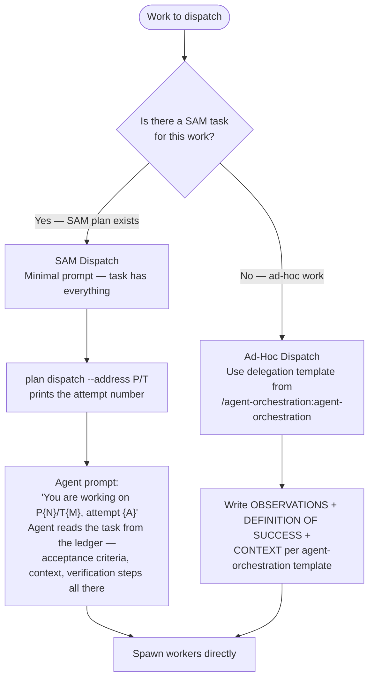
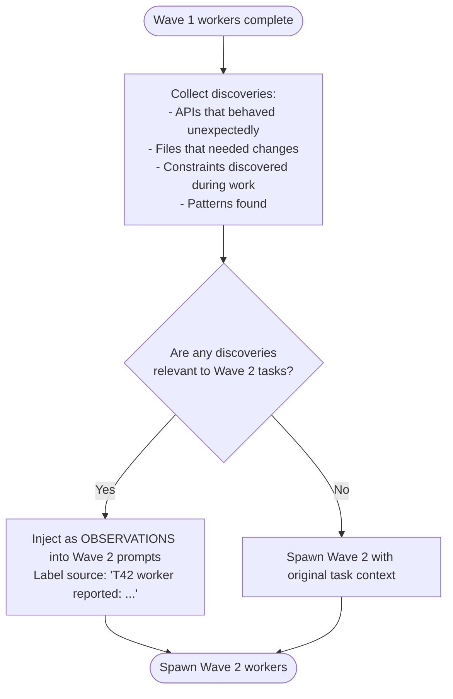
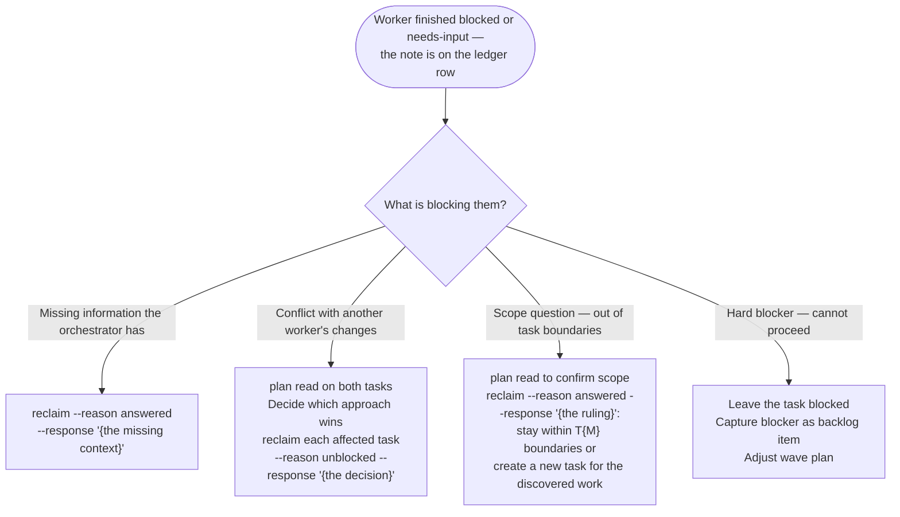

# Dispatch — Orchestrator as Manager

The orchestrator's job is experience sharing and worker health, not prompt engineering.
Workers are specialists. Trust them. Relay what they learn. Unblock them when stuck. Synthesize what they produce.

For the delegation prompt template and pre-send verification, activate the `/agent-orchestration:agent-orchestration` skill.

## Two Dispatch Modes



## Manager Responsibilities

### 1 — Spawn Workers

**Fetch-once rule**: Before spawning any workers, call `backlog_view` **once per issue** that will be worked in this session. Store each result in context keyed by issue number. Do NOT call `backlog_view` again for any issue already fetched — use the stored data for all wave iterations, prompt construction, and relay building. If a `backlog_update` changes an item's state mid-session, replace the cached value with a single new `backlog_view` call for that issue only.

Each worker gets exactly the context needed — no more.

**SAM dispatch (the task is the delegation):**

An attempt is a ledger row, so the plan has to be in the ledger before the first dispatch. A plan
authored through the SAM plan operations lives in the content store; bring it across once, which
answers `exists` and changes nothing when it is already there:

```bash
uv run "${CLAUDE_PLUGIN_ROOT}/sam_schema/cli.py" plan import --from content --plan-address Pf1a2b3c4
```

Open the attempt. `dispatch` sets the task in-progress, starts its lease, and prints the
attempt number — the key every command the worker runs carries back:

```bash
uv run "${CLAUDE_PLUGIN_ROOT}/sam_schema/cli.py" plan dispatch --address Pf1a2b3c4/T42 --worktree {dir}
```

Pass `--worktree` when this harness gives the worker its own git worktree; leave it off otherwise.
Two codes mean "take the next task rather than this one": `leased` (someone already holds it) and
`not-ready` (its dependencies have not landed). Any other code stops the wave.

Then launch the worker with the address and the attempt:

```text
Agent(
  name="T42-worker",
  prompt="Your ROLE_TYPE is sub-agent. You are working on Pf1a2b3c4/T42, attempt 1."
)
```

The worker reads the task from the ledger. All acceptance criteria, verification steps, and context
live in the task. Keep a table of launch handle to address and attempt in your working notes — it
is what lets you tell a worker still running from one whose launch already ended.

**Ad-hoc dispatch:** follow the delegation template from `/agent-orchestration:agent-orchestration` — OBSERVATIONS, DEFINITION OF SUCCESS, CONTEXT.

### 2 — Relay Discoveries Between Waves

Workers learn things during execution. Relay those discoveries to the next wave — this is experience sharing.



Workers report what they observed — relay facts, not interpretations, to the next wave.

### 3 — Handle Blockers

When a worker sends a blocker message:



One command answers the blocker and reopens the task:

```bash
uv run "${CLAUDE_PLUGIN_ROOT}/sam_schema/cli.py" plan reclaim \
  --address P{N}/T{M} --reason answered --response "{what the worker needs to know}"
```

`reclaim` writes the `--response` text as an `Orchestrator Response` section and returns the task
to `not-started` in the same move, so the next `dispatch` finds it ready and its worker reads the
answer as the first thing in its `plan read` output. Appending a section on its own would leave the
task blocked, and a blocked task is not dispatchable — the answer would be written and never read.

Codes `reclaim` may print, and what each asks of you:

| code | what to do |
|---|---|
| `attempts-exhausted` | put the attempt history to the user; on a go-ahead, re-run with `--more-attempts`; on a stop, `plan state --address P/T --new-status skipped --reason user` |
| `task-accepted`, `dependents-started` | the send-back would undo settled work; add `--force` only for a verification-gate failure or a user instruction, and say which in `--reason` |
| `already-open` | an attempt is already open on this task; proceed |

### 4 — Synthesize Results

When all workers return:

1. Record what came back, per worker, against the attempt you dispatched:

   ```bash
   uv run "${CLAUDE_PLUGIN_ROOT}/sam_schema/cli.py" plan settle \
     --address P{N}/T{M} --attempt {A} --return-text "{the worker's response, STATUS line included}"
   ```

   `settle` is what makes a launch that ended distinguishable from one still running. Run it as
   soon as a launch returns, including when the response is empty or the worker crashed — an
   unsettled attempt reads as a worker still at work.

2. Judge each task against the ledger, not against the response text:

   ```bash
   uv run "${CLAUDE_PLUGIN_ROOT}/sam_schema/cli.py" plan read --address P{N}/T{M}
   ```

   Compare the `Completion Report` and `Verification Results` sections against the task's
   acceptance criteria and verification steps. Where they hold, accept:

   ```bash
   uv run "${CLAUDE_PLUGIN_ROOT}/sam_schema/cli.py" plan accept --address P{N}/T{M} --note "{why}"
   ```

   Where a criterion is unmet or a step failed, send it back with what to change:
   `plan reclaim --address P{N}/T{M} --reason judge --response "{what to change and why}"`.

   The full judge table — every status and settled state, and the command each calls for — is
   [the work loop](../../docs/work-ledger/work-loop.md).

3. Identify conflicts — two workers edited the same file or made incompatible changes
4. Run verification (tests, linter) across the full changeset
5. Relay synthesis findings to user or feed into next wave

Artifact pointer pattern: instruct workers to register findings via `artifact_register` with the
full text as `content=`, and to return only the artifact type and identifier. Retrieve each with
`artifact_read` when you need the detail. This keeps orchestrator context lean without any worker
writing a file for another step to read.

Workers dispatched via plain `Agent()` calls terminate automatically when their prompt completes
— there is nothing to release. Confirm every task in the wave reached a terminal status through
`plan status --plan-address P{N}` before treating the wave as done, never by assuming a silent
worker has finished. Each row carries `status`, `accepted`, `attempts`, and a `stale` flag that
tells you when a lease has run out with no worker behind it.

## When to Dispatch

**Dispatch when:**

- 2+ tasks that can run without waiting on each other
- Parallel reviews (security, performance, coverage)
- Multiple SAM tasks in the same wave (check `plan ready --plan-address P{N}`)
- Research tracks that don't depend on each other

**Explore first, then dispatch when:**

- The root cause is unknown — dispatching with wrong diagnosis wastes workers
- Tasks share state — workers would conflict on the same files

## Common Mistakes

**Micromanaging** — "Use sed to edit line 42, then grep to verify." Workers are specialists. Describe what success looks like; let them determine how.

**No discovery relay** — Wave 2 workers miss context Wave 1 workers discovered. Always check if Wave 1 output changes what Wave 2 needs to know.

**Ignoring blocker messages** — Workers go idle waiting for a response. Check messages between waves.

**Pre-gathering data** — Running diagnostics before delegating wastes orchestrator context. Workers gather their own data.
