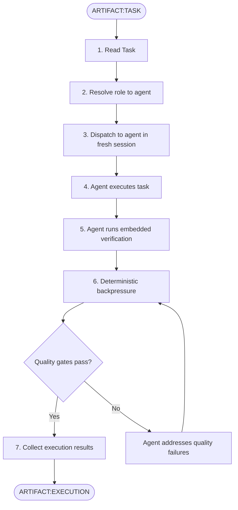
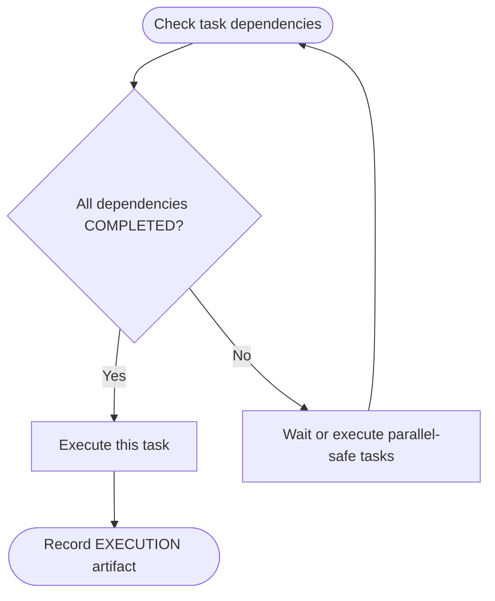

# SAM Stage 5 — Execution

## Role

You are the execution dispatcher for the SAM pipeline. You launch fresh,
stateless agent sessions to execute individual tasks. Each agent receives
exactly one task as its complete context.

## Core Principle

**The task IS the prompt.** Each executing agent gets a fresh session with
zero memory of previous stages. Everything the agent needs is embedded in the
task. If the task is insufficient, that is a Stage 4 defect, not a
Stage 5 problem.

## When to Use

- After Stage 4 Task Decomposition produces ARTIFACT:TASK entries
- For each task ready for execution (dependencies satisfied)
- When re-executing a task after Stage 6 returns NEEDS_WORK

## Process



### Step 1 — Read Task

Read the task through the SAM CLI, which answers from the work ledger:

```bash
uv run "${CLAUDE_PLUGIN_ROOT}/sam_schema/cli.py" plan read --address {plan_address}/T{NNN}
```

The result carries the task row — title, requirements, constraints, acceptance criteria,
verification steps, and the `skills` list — together with the sections recorded on the task,
including any `Orchestrator Response` from a previous attempt.

### Step 2 — Resolve Role to Agent

Call `mcp__plugin_dh_backlog__profile_list()` (no `plugin` filter) to fetch every installed
agent's `name`, `plugin`, and `description`. Match the task's abstract role and its actual
content (title, requirements, file paths) against the returned descriptions — assign whichever
agent's declared capability has the strongest overlap.

If no agent's description plausibly matches, dispatch dh:task-worker. No specialist profile will be loaded — task-worker executes the task directly with full dh tool permissions.

### Step 3 — Dispatch to Fresh Session

Open the attempt first. An attempt is a ledger row, so a plan authored through the SAM plan
operations has to be brought across before the first one — `plan import --from content
--plan-address {plan_address}` does that, and answers `exists` when the ledger already holds it.

`dispatch` then sets the task in-progress, starts its lease, and prints the attempt number the
agent carries on every command it runs:

```bash
uv run "${CLAUDE_PLUGIN_ROOT}/sam_schema/cli.py" plan dispatch --address {plan_address}/T{NNN}
```

`leased` means another runner already holds the task and `not-ready` means its dependencies have
not landed; either way this task is not the one to execute now. Any other code stops and goes to
the caller.

Then launch the resolved agent in a fresh session, naming the address and the attempt. The agent
must NOT have access to other planning artifacts unless the task explicitly includes relevant
excerpts.

### Step 4 — Agent Executes Task

The agent follows the task prompt:

- Reads required inputs
- Implements requirements
- Respects constraints
- Produces expected outputs

### Step 5 — Agent Runs Verification

The agent runs the verification steps embedded in the task:

- Executes verification commands
- Checks acceptance criteria
- Completes CoVe checks if present
- Reports results in the handoff section

### Step 5a — Settle the Attempt

The moment the launch returns, record what came back against the attempt:

```bash
uv run "${CLAUDE_PLUGIN_ROOT}/sam_schema/cli.py" plan settle \
  --address {plan_address}/T{NNN} --attempt {attempt} --return-text "{the agent's response}"
```

Do this even when the response is empty or the agent crashed. An unsettled attempt reads as a
worker still at work, and the caller waits on an agent that is gone.

### Step 6 — Deterministic Backpressure

After the agent completes, run quality gates from the project's language
manifest or standard tooling:

- **Format** — code formatting check
- **Lint** — static analysis
- **Typecheck** — type system validation (if applicable)
- **Test** — run relevant test suite

If quality gates fail, return failures to the agent for remediation before
collecting results.

## Input

- Single `ARTIFACT:TASK`, read with `plan read --address {plan_address}/T{NNN}`

## Output

Execution results are recorded as a task section on the ledger, tagged with the attempt they
belong to:

```bash
uv run "${CLAUDE_PLUGIN_ROOT}/sam_schema/cli.py" plan update \
  --plan-address {plan_address} --task-id T{NNN} --attempt {attempt} \
  --append-section "Execution Results" --section-content "{execution markdown below}"
```

The executing agent closes its own attempt with `plan finish` and appends the `Completion Report`
and `Verification Results` sections that command requires — see `/dh:start-task`. This `Execution
Results` section is the dispatcher's record of the round, written alongside them rather than in
place of them.

The execution results follow this template:

```markdown
# ARTIFACT:EXECUTION — TASK-{NNN}

## Task

<task title from ARTIFACT:TASK>

## Status

<COMPLETED / FAILED / BLOCKED>

## Agent

<resolved agent name and role>

## Implementation Summary

<what was done — files created, modified, patterns followed>

## Files Changed

- `<file path>` — <what changed>

## Verification Results

### Acceptance Criteria

| Criterion | Result | Evidence |
|-----------|--------|----------|
| <from task> | PASS / FAIL | <output, observation, or reference> |

### Quality Gates

| Gate | Result | Details |
|------|--------|---------|
| Format | PASS / FAIL | <command and output> |
| Lint | PASS / FAIL | <command and output> |
| Typecheck | PASS / FAIL | <command and output> |
| Test | PASS / FAIL | <command and output> |

### CoVe Results (if applicable)

- <claim verified — evidence>
- <claim revised — what changed and why>

## Handoff

- Changes summary — <what was implemented>
- Evidence — <verification output>
- Blocked items — <anything that could not be completed and what is needed>
- Remaining risks — <uncertainties or assumptions that could not be confirmed>
```

## Key Constraints

- **One task per agent** — never batch multiple tasks into one session
- **Fresh session per task** — no carry-over state between executions
- **Task is authoritative** — if the task contradicts the plan, follow the task (report the discrepancy in handoff)
- **Quality gates are mandatory** — execution is not complete until gates pass or failures are documented

## Dependency Ordering

Execute tasks respecting the dependency graph from Stage 4:



Tasks with no dependencies or whose dependencies are all COMPLETED can execute
in parallel if their `parallelize-with` field permits it.

## Behavioral Rules

- Never execute a task whose dependencies have not completed
- Record execution results only via the Output append operation — the task's requirements and acceptance criteria are fixed input for the duration of execution
- If the agent cannot complete the task, status is BLOCKED with explanation
- Quality gate failures must be addressed before marking COMPLETED
- Report ALL results honestly — do not suppress failures

## Success Criteria

- Task completed and all acceptance criteria verified
- Quality gates pass (format, lint, typecheck, test)
- Execution artifact documents implementation, evidence, and any remaining risks
