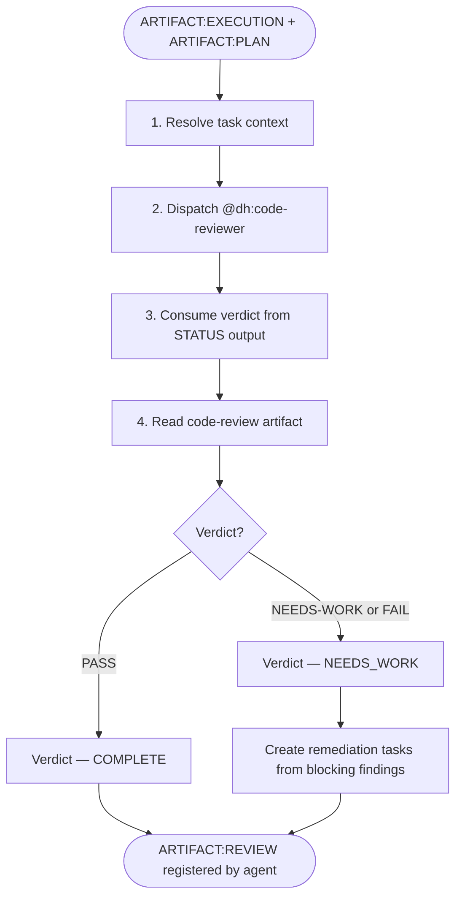
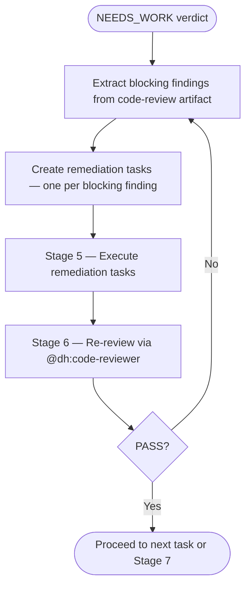

# SAM Stage 6 — Forensic Review

## Role

SAM Stage 6 delegates the concrete review work to `@dh:code-reviewer`. This skill is the
orchestration wrapper: it resolves the task context, dispatches the agent, and maps its
structured output back to the SAM pipeline verdict.

Producer and reviewer must always be different agents — never invoke this skill from the
same agent that executed the task.

## Core Principle

**AI cannot reliably self-evaluate.** The agent that wrote the code cannot
objectively assess its own work. Forensic review uses a separate agent with
fresh context to verify claims against observable evidence.

## When to Use

- After Stage 5 Execution produces ARTIFACT:EXECUTION
- For each completed task before marking it as done
- When re-reviewing after a NEEDS_WORK remediation cycle

## Process



### Step 1 — Resolve Task Context

Read the task via MCP:

```text
sam_task(plan="{plan_id}", task="{task_id}", config={"action": "read"})
```

Extract:

- `plan_id` and `task_id` — the plan/task address pair, opaque logical identifiers such as
  `Pdec8934d`/`T3`; resolved by MCP tools, not filesystem paths. Never parse `plan_id` for a
  plan number or slug — read those from `sam_plan(config={"action": "read"})`
- `item_id` — required for artifact registration; if absent, BLOCK immediately
- `expected_outputs` — the implementation files produced by Stage 5 (listed in the task's
  "Files Changed" or "Expected Outputs" section)
- `acceptance_criteria` — the explicit success conditions to verify

### Step 2 — Dispatch @dh:code-reviewer

Delegate the concrete S6 review work with subagent_type="dh:code-reviewer".

Context to include in the prompt:

- `plan_id` and `task_id` — the SAM task address
- `implementation_files` — the files from the task's Expected Outputs
- `item_id` — required for `artifact_register` inside the agent

```text
Task is S6 forensic review with subagent_type="dh:code-reviewer"
Context: plan_id={plan_id}, task_id={task_id}, item_id={item_id},
  implementation_files={expected_outputs}
Output: STATUS block containing Verdict (PASS / FAIL / NEEDS-WORK) and ARTIFACTS
  section naming the code-review artifact_id registered on issue #{item_id}
```

The agent independently reads the task, detects the stack, verifies acceptance criteria,
applies universal and stack-specific quality dimensions, and registers the review report
as a `code-review` artifact via `artifact_register`.

### Step 3 — Consume Verdict

Parse the agent's STATUS output:

- `Verdict: PASS` → map to SAM verdict COMPLETE
- `Verdict: NEEDS-WORK` or `Verdict: FAIL` → map to SAM verdict NEEDS_WORK

If the agent returns STATUS: BLOCKED, propagate the block upstream with the agent's
NEEDED section as the reason.

### Step 4 — Read code-review Artifact

Take `{artifact_id}` from the ARTIFACTS section of the agent's STATUS output in Step 3 and retrieve
that entry:

```text
artifact_read(item_id={item_id}, artifact_type="code-review", artifact_id="{artifact_id}")
```

Address the entry by its `artifact_id`. One `code-review` entry exists per reviewed task, so when
two tasks of this work item have been reviewed, omitting `artifact_id` returns whichever review
registered last — which may be another task's.

If the STATUS output named no `artifact_id`, derive it. `code-reviewer` builds
`code-review-{task_id}-{plan_slug}` from the plan it was dispatched under. Read that plan's slug
from SAM — `{plan_id}` is an opaque logical identifier such as `Pdec8934d` and has no slug to parse
out of it:

```text
sam_plan(plan="{plan_id}", config={"action": "read"})
```

Take the response's `feature` field as `{plan_slug}`, making the expected identifier
`code-review-{task_id}-{plan_slug}`. Confirm it exists:

```text
artifact_list(item_id={item_id}, artifact_type="code-review")
```

Match `artifact_id` exactly. Never select by substring and never fall back to the latest
`created_at`: this work item also holds the quality gate's `code-review-T1-qg-{plan_slug}` verdict
and the verdicts of every other task reviewed against it, and several of those contain this task's
`{task_id}` as a substring. A loose match returns another task's review, which Step 5 would then
append to this task's Review Results and mine for remediation findings that belong elsewhere.

If no entry matches exactly, stop and report BLOCKED naming the identifier that was expected and the
identifiers `artifact_list` returned. Step 2 dispatched the reviewer moments earlier, so a missing
verdict is a failure to report, not a condition to work around.

Use this to populate the SAM task's Review Results section and to extract blocking findings
for remediation task creation.

Append review results to the task:

```text
sam_task(
  plan="{plan_id}",
  task="{task_id}",
  config={"action": "update", "append_section": "Review Results", "section_content": "{artifact_content}"}
)
```

## Input

- `ARTIFACT:EXECUTION` + `ARTIFACT:TASK` via `sam_task(plan="{plan_id}", task="{task_id}", config={"action": "read"})`
- `item_id` — must be present; used by `@dh:code-reviewer` for `artifact_register` and
  by this skill for `artifact_read`
- `artifact_id` — returned by `@dh:code-reviewer` in its STATUS ARTIFACTS section; addresses the
  verdict for this task specifically

## NEEDS_WORK Remediation Loop

When the verdict is NEEDS_WORK or FAIL, extract blocking findings from the
`code-review` artifact's "Required changes (blocking)" or "Blocking" section.



Remediation tasks follow the same CLEAR format as original tasks. They:

- Reference the specific blocking finding (file:line from the code-review artifact)
- Define acceptance criteria that directly resolve the blocking finding

## Behavioral Rules

- Verdict is sourced from `@dh:code-reviewer` STATUS output — do not invent it
- Blocking findings for remediation come from the `code-review` artifact — do not
  invent them from the agent's STATUS summary
- Do not add new requirements — review against the ORIGINAL acceptance criteria only
- Verification Gap findings are always BLOCKING (see `@dh:code-reviewer` agent for the
  full classification rule)

## Success Criteria

- `@dh:code-reviewer` returns STATUS: DONE with a PASS, FAIL, or NEEDS-WORK verdict
- `code-review` artifact is registered on issue #{item_id} and its `artifact_id` is named in the agent's STATUS output
- Review Results appended to the SAM task via `sam_task(action='update')`
- Blocking findings (if any) have concrete remediation tasks created
