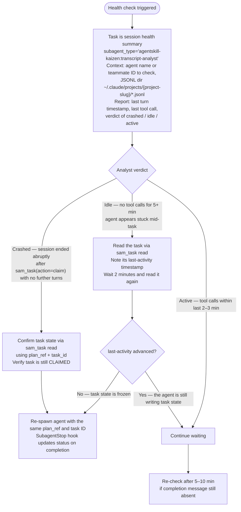

# Agent Health Check Procedure

Full procedure for `implement-feature`'s Agent Health Check step. Reached only when one of the
trigger conditions in the main skill fires — most dispatches never reach this file.

**Never read JSONL session files directly in the orchestrator context.** Session files can exceed
40K tokens. Always delegate to `agentskill-kaizen:transcript-analyst` with an empty context window.

Session JSONL files are at `~/.claude/projects/{project-slug}/*.jsonl`, filterable by `agentId`
field. The `{project-slug}` is the absolute project path with `/` replaced by `-` (e.g.
`/home/user/repos/myproject` → `-home-user-repos-myproject`).

